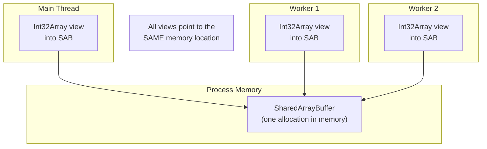

# Lesson 02 — SharedArrayBuffer & Atomics

## Concept

`SharedArrayBuffer` allocates a fixed block of memory shared between threads — no copying. But shared memory means race conditions. `Atomics` provides atomic operations (compare-and-swap, wait/notify) to safely coordinate access.

---

## Shared Memory Architecture



---

## Basic Shared Memory

```typescript
// shared-memory.ts
import { Worker, isMainThread, parentPort, workerData } from "node:worker_threads";

if (isMainThread) {
  // Allocate shared memory
  const sharedBuffer = new SharedArrayBuffer(4 * 1024); // 4KB
  const view = new Int32Array(sharedBuffer); // 1024 int32 slots
  
  // Initialize
  view[0] = 0; // Counter
  view[1] = 0; // Status flag
  
  // Share with workers (no copy — same memory!)
  const worker1 = new Worker(new URL(import.meta.url), {
    workerData: { buffer: sharedBuffer, id: 1 },
  });
  const worker2 = new Worker(new URL(import.meta.url), {
    workerData: { buffer: sharedBuffer, id: 2 },
  });
  
  // Wait for both workers
  let done = 0;
  const onExit = () => {
    done++;
    if (done === 2) {
      console.log(`Final counter value: ${view[0]}`);
      console.log(`Expected: 2000000 (if no race condition)`);
      // Without Atomics, this will be LESS than 2000000!
    }
  };
  
  worker1.on("exit", onExit);
  worker2.on("exit", onExit);
  
} else {
  const { buffer, id } = workerData as { buffer: SharedArrayBuffer; id: number };
  const view = new Int32Array(buffer);
  
  // Race condition! Both workers increment the same counter
  for (let i = 0; i < 1_000_000; i++) {
    // ❌ NOT atomic — read-modify-write can interleave
    // view[0] = view[0] + 1;
    
    // ✅ Atomic increment
    Atomics.add(view, 0, 1);
  }
  
  console.log(`Worker ${id} done`);
}
```

---

## Atomics Operations

```typescript
// atomics-ops.ts
import { Worker, isMainThread, parentPort, workerData } from "node:worker_threads";

if (isMainThread) {
  const sab = new SharedArrayBuffer(256);
  const view = new Int32Array(sab);
  
  // Atomic operations available:
  console.log("Atomics operations:");
  
  // Store and Load (thread-safe read/write)
  Atomics.store(view, 0, 42);
  console.log(`  store/load: ${Atomics.load(view, 0)}`); // 42
  
  // Add and Sub (atomic increment/decrement)
  Atomics.add(view, 0, 10);
  console.log(`  add(10): ${Atomics.load(view, 0)}`); // 52
  
  Atomics.sub(view, 0, 2);
  console.log(`  sub(2): ${Atomics.load(view, 0)}`); // 50
  
  // Exchange (atomic swap, returns old value)
  const old = Atomics.exchange(view, 0, 100);
  console.log(`  exchange(100): old=${old}, new=${Atomics.load(view, 0)}`); // old=50, new=100
  
  // CompareExchange (CAS — foundation of lock-free algorithms)
  // Only sets if current value matches expected
  const result = Atomics.compareExchange(view, 0, 100, 200);
  console.log(`  CAS(100→200): old=${result}, new=${Atomics.load(view, 0)}`); // old=100, new=200
  
  const result2 = Atomics.compareExchange(view, 0, 999, 300);
  console.log(`  CAS(999→300): old=${result2}, new=${Atomics.load(view, 0)}`); // Didn't match, unchanged
  
  // Bitwise operations
  Atomics.store(view, 1, 0b1100);
  Atomics.and(view, 1, 0b1010);
  console.log(`  AND: ${Atomics.load(view, 1).toString(2)}`); // 1000
  
  Atomics.or(view, 1, 0b0011);
  console.log(`  OR: ${Atomics.load(view, 1).toString(2)}`); // 1011
  
  Atomics.xor(view, 1, 0b1111);
  console.log(`  XOR: ${Atomics.load(view, 1).toString(2)}`); // 0100
}
```

---

## Wait / Notify (Thread Synchronization)

```typescript
// wait-notify.ts
import { Worker, isMainThread, parentPort, workerData } from "node:worker_threads";

if (isMainThread) {
  const sab = new SharedArrayBuffer(4);
  const flag = new Int32Array(sab);
  flag[0] = 0; // 0 = not ready
  
  const worker = new Worker(new URL(import.meta.url), {
    workerData: { buffer: sab },
  });
  
  // Simulate preparing data
  console.log("Main: preparing data...");
  setTimeout(() => {
    console.log("Main: data ready! Notifying worker...");
    Atomics.store(flag, 0, 1); // Set flag
    Atomics.notify(flag, 0, 1); // Wake one waiter
  }, 1000);
  
  worker.on("message", (msg: string) => {
    console.log(`Main received: ${msg}`);
    worker.terminate();
  });
  
} else {
  const { buffer } = workerData as { buffer: SharedArrayBuffer };
  const flag = new Int32Array(buffer);
  
  console.log("Worker: waiting for data...");
  
  // Block until flag changes from 0
  // Atomics.wait() BLOCKS the worker thread (not the main thread!)
  const result = Atomics.wait(flag, 0, 0); // Wait while value is 0
  // Returns: "ok" (was woken), "not-equal" (value already changed), "timed-out"
  
  console.log(`Worker: wait result = ${result}`);
  console.log(`Worker: flag value = ${Atomics.load(flag, 0)}`);
  
  parentPort!.postMessage("Work complete!");
}
```

---

## Mutex (Lock) with Atomics

```typescript
// mutex.ts
import { Worker, isMainThread, parentPort, workerData } from "node:worker_threads";

class Mutex {
  private lock: Int32Array;
  private index: number;

  constructor(sab: SharedArrayBuffer, index: number) {
    this.lock = new Int32Array(sab);
    this.index = index;
    // 0 = unlocked, 1 = locked
  }

  acquire(): void {
    while (true) {
      // Try to set lock from 0 to 1 (CAS)
      if (Atomics.compareExchange(this.lock, this.index, 0, 1) === 0) {
        return; // We got the lock!
      }
      // Lock is held by another thread — wait
      Atomics.wait(this.lock, this.index, 1);
    }
  }

  release(): void {
    Atomics.store(this.lock, this.index, 0); // Set to unlocked
    Atomics.notify(this.lock, this.index, 1); // Wake one waiter
  }
}

if (isMainThread) {
  // Layout: [mutex (1 int), counter (1 int), ... data ...]
  const sab = new SharedArrayBuffer(1024);
  const view = new Int32Array(sab);
  view[0] = 0; // mutex
  view[1] = 0; // counter
  
  const workers = Array.from({ length: 4 }, (_, i) =>
    new Worker(new URL(import.meta.url), {
      workerData: { buffer: sab, id: i },
    })
  );
  
  let done = 0;
  for (const w of workers) {
    w.on("exit", () => {
      done++;
      if (done === workers.length) {
        console.log(`Final counter: ${view[1]}`);
        console.log(`Expected: ${workers.length * 100_000}`);
      }
    });
  }
} else {
  const { buffer, id } = workerData as { buffer: SharedArrayBuffer; id: number };
  const view = new Int32Array(buffer);
  const mutex = new Mutex(buffer, 0);
  
  for (let i = 0; i < 100_000; i++) {
    mutex.acquire();
    view[1]++; // Protected by mutex
    mutex.release();
  }
  
  console.log(`Worker ${id} done`);
}
```

---

## Interview Questions

### Q1: "What is SharedArrayBuffer and when would you use it?"

**Answer**: `SharedArrayBuffer` allocates a fixed-size block of raw memory that's shared between threads — all threads see the same bytes with no copying. Use it when you need to share large amounts of data between workers without the overhead of structured cloning. Common uses: shared counters, ring buffers for inter-thread communication, and sharing large datasets (matrices, images) for parallel processing. MUST use `Atomics` for synchronization to avoid race conditions.

### Q2: "What's the difference between Atomics.wait() and a busy loop?"

**Answer**: Both wait for a condition, but `Atomics.wait()` is a kernel-level futex that blocks the thread with zero CPU usage — the OS doesn't schedule the thread until `Atomics.notify()` wakes it. A busy loop (`while(flag === 0) {}`) burns 100% CPU constantly checking the condition. Always use `Atomics.wait/notify` for thread synchronization. Note: `Atomics.wait()` cannot be used on the main thread (would block the event loop), only in workers.
