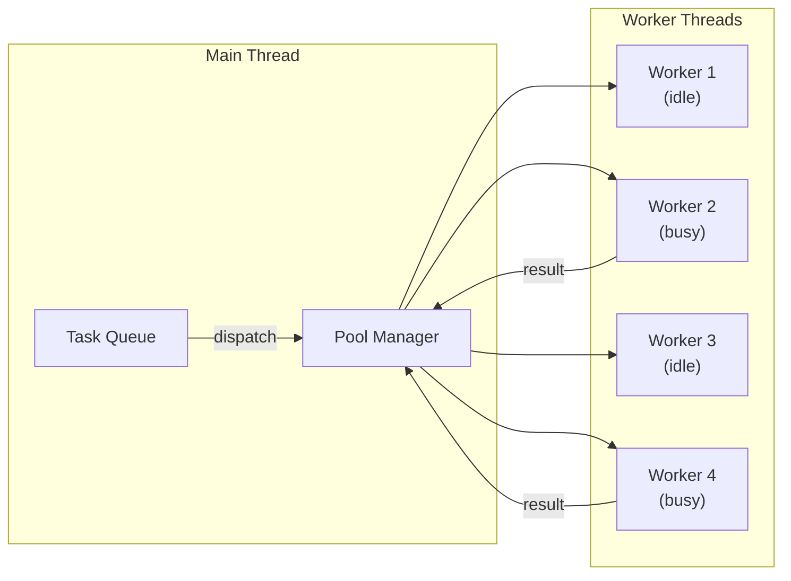

# Lesson 03 — Worker Pool Pattern

## Concept

Creating a Worker thread costs ~30ms and ~5-10MB of memory. For repeated CPU tasks, a worker pool avoids this overhead by reusing a fixed set of workers. Tasks are queued and dispatched to available workers.

---

## Worker Pool Architecture



---

## Implementation

```typescript
// worker-pool.ts
import { Worker, isMainThread, parentPort } from "node:worker_threads";
import { EventEmitter } from "node:events";
import { cpus } from "node:os";

interface Task<T = any> {
  id: number;
  type: string;
  data: T;
}

interface TaskResult<T = any> {
  id: number;
  result?: T;
  error?: string;
  duration: number;
}

interface QueuedTask {
  task: Task;
  resolve: (result: any) => void;
  reject: (error: Error) => void;
}

class WorkerPool extends EventEmitter {
  private workers: Worker[] = [];
  private idle: Worker[] = [];
  private queue: QueuedTask[] = [];
  private taskMap = new Map<number, QueuedTask>();
  private nextTaskId = 0;
  private workerScript: string | URL;

  constructor(workerScript: string | URL, size = cpus().length) {
    super();
    this.workerScript = workerScript;
    
    for (let i = 0; i < size; i++) {
      this.addWorker();
    }
    
    console.log(`Worker pool created: ${size} workers`);
  }

  private addWorker() {
    const worker = new Worker(this.workerScript);
    
    worker.on("message", (result: TaskResult) => {
      const queued = this.taskMap.get(result.id);
      if (queued) {
        this.taskMap.delete(result.id);
        if (result.error) {
          queued.reject(new Error(result.error));
        } else {
          queued.resolve(result.result);
        }
      }
      
      // Worker is now idle — check for pending tasks
      if (this.queue.length > 0) {
        const next = this.queue.shift()!;
        this.dispatch(worker, next);
      } else {
        this.idle.push(worker);
      }
    });
    
    worker.on("error", (err) => {
      console.error("Worker error:", err.message);
      // Replace dead worker
      const idx = this.workers.indexOf(worker);
      if (idx !== -1) this.workers.splice(idx, 1);
      this.addWorker();
    });
    
    this.workers.push(worker);
    this.idle.push(worker);
  }

  private dispatch(worker: Worker, queued: QueuedTask) {
    this.taskMap.set(queued.task.id, queued);
    worker.postMessage(queued.task);
    
    // Remove from idle
    const idx = this.idle.indexOf(worker);
    if (idx !== -1) this.idle.splice(idx, 1);
  }

  async execute<R = any>(type: string, data: any): Promise<R> {
    const task: Task = {
      id: this.nextTaskId++,
      type,
      data,
    };

    return new Promise<R>((resolve, reject) => {
      const queued: QueuedTask = { task, resolve, reject };
      
      if (this.idle.length > 0) {
        const worker = this.idle.pop()!;
        this.dispatch(worker, queued);
      } else {
        this.queue.push(queued);
      }
    });
  }

  get stats() {
    return {
      total: this.workers.length,
      idle: this.idle.length,
      busy: this.workers.length - this.idle.length,
      queued: this.queue.length,
    };
  }

  async destroy(): Promise<void> {
    const terminations = this.workers.map((w) => w.terminate());
    await Promise.all(terminations);
    this.workers = [];
    this.idle = [];
  }
}

// --- Worker Script (handles tasks) ---
if (!isMainThread) {
  parentPort!.on("message", (task: Task) => {
    const start = performance.now();
    
    try {
      let result: any;
      
      switch (task.type) {
        case "fibonacci": {
          result = fibonacci(task.data.n);
          break;
        }
        case "hash": {
          const { createHash } = require("node:crypto");
          result = createHash("sha256").update(task.data.input).digest("hex");
          break;
        }
        case "sort": {
          result = [...task.data.array].sort((a: number, b: number) => a - b);
          break;
        }
        default:
          throw new Error(`Unknown task type: ${task.type}`);
      }
      
      const response: TaskResult = {
        id: task.id,
        result,
        duration: performance.now() - start,
      };
      parentPort!.postMessage(response);
      
    } catch (err: any) {
      const response: TaskResult = {
        id: task.id,
        error: err.message,
        duration: performance.now() - start,
      };
      parentPort!.postMessage(response);
    }
  });
  
  function fibonacci(n: number): number {
    if (n <= 1) return n;
    return fibonacci(n - 1) + fibonacci(n - 2);
  }
}

// --- Main Thread Usage ---
if (isMainThread) {
  const pool = new WorkerPool(new URL(import.meta.url), 4);
  
  // Execute tasks in parallel
  const start = performance.now();
  
  const results = await Promise.all([
    pool.execute("fibonacci", { n: 40 }),
    pool.execute("fibonacci", { n: 38 }),
    pool.execute("fibonacci", { n: 35 }),
    pool.execute("fibonacci", { n: 42 }),
    pool.execute("sort", { array: Array.from({ length: 100_000 }, () => Math.random()) }),
  ]);
  
  const elapsed = performance.now() - start;
  
  console.log(`Results: ${results.map(r => typeof r === "number" ? r : `array[${r.length}]`)}`);
  console.log(`Total time: ${elapsed.toFixed(0)}ms (4 workers in parallel)`);
  console.log(`Pool stats:`, pool.stats);
  
  await pool.destroy();
}
```

---

## Interview Questions

### Q1: "Why use a worker pool instead of creating workers on demand?"

**Answer**: Worker creation cost is ~30ms + ~5-10MB memory per worker. For a server handling 1000 requests/sec, creating a worker per request would:
1. Spend 30ms just creating the worker (unacceptable latency)
2. Create 1000 concurrent threads (exhausts OS resources)
3. Allocate 5-10GB of memory for worker heaps

A pool amortizes creation cost, limits concurrency to CPU count, and reuses workers for millions of tasks. The pattern matches libuv's own thread pool for I/O.

### Q2: "How many workers should a pool have?"

**Answer**: For CPU-bound tasks: `os.cpus().length` (or `cpus().length - 1` to leave one core for the event loop and I/O). For mixed CPU/I/O tasks: 1.5x to 2x CPU count. More workers than cores means context switching overhead with no throughput gain. In containers, use `cgroup`-reported CPU count, not physical cores.
