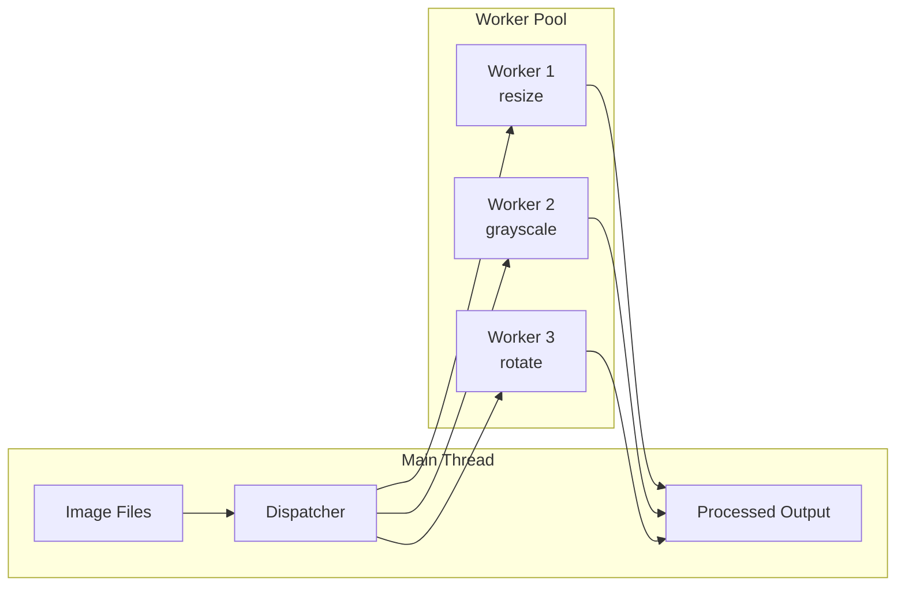

# Lesson 04 — Parallel Processing Labs

## Lab 1: Parallel Image Processor

Process multiple images concurrently using a worker pool. Each worker handles one image transformation (resize, grayscale, rotate) without blocking the main thread.



```typescript
// image-processor.ts
import { Worker, isMainThread, parentPort, workerData } from "node:worker_threads";

// Simple pixel manipulation without external dependencies
interface ImageData {
  width: number;
  height: number;
  pixels: Uint8ClampedArray; // RGBA
}

function createTestImage(width: number, height: number): ImageData {
  const pixels = new Uint8ClampedArray(width * height * 4);
  for (let i = 0; i < pixels.length; i += 4) {
    pixels[i] = Math.random() * 255;     // R
    pixels[i + 1] = Math.random() * 255; // G
    pixels[i + 2] = Math.random() * 255; // B
    pixels[i + 3] = 255;                 // A
  }
  return { width, height, pixels };
}

function toGrayscale(img: ImageData): ImageData {
  const result = new Uint8ClampedArray(img.pixels.length);
  for (let i = 0; i < img.pixels.length; i += 4) {
    const gray = 0.299 * img.pixels[i] + 0.587 * img.pixels[i + 1] + 0.114 * img.pixels[i + 2];
    result[i] = result[i + 1] = result[i + 2] = gray;
    result[i + 3] = img.pixels[i + 3];
  }
  return { width: img.width, height: img.height, pixels: result };
}

function adjustBrightness(img: ImageData, factor: number): ImageData {
  const result = new Uint8ClampedArray(img.pixels.length);
  for (let i = 0; i < img.pixels.length; i += 4) {
    result[i] = Math.min(255, img.pixels[i] * factor);
    result[i + 1] = Math.min(255, img.pixels[i + 1] * factor);
    result[i + 2] = Math.min(255, img.pixels[i + 2] * factor);
    result[i + 3] = img.pixels[i + 3];
  }
  return { width: img.width, height: img.height, pixels: result };
}

function invertColors(img: ImageData): ImageData {
  const result = new Uint8ClampedArray(img.pixels.length);
  for (let i = 0; i < img.pixels.length; i += 4) {
    result[i] = 255 - img.pixels[i];
    result[i + 1] = 255 - img.pixels[i + 1];
    result[i + 2] = 255 - img.pixels[i + 2];
    result[i + 3] = img.pixels[i + 3];
  }
  return { width: img.width, height: img.height, pixels: result };
}

if (!isMainThread) {
  parentPort!.on("message", (msg: { id: number; operation: string; pixels: ArrayBuffer; width: number; height: number }) => {
    const img: ImageData = {
      width: msg.width,
      height: msg.height,
      pixels: new Uint8ClampedArray(msg.pixels),
    };
    
    const start = performance.now();
    let result: ImageData;
    
    switch (msg.operation) {
      case "grayscale": result = toGrayscale(img); break;
      case "brighten": result = adjustBrightness(img, 1.5); break;
      case "invert": result = invertColors(img); break;
      default: throw new Error(`Unknown operation: ${msg.operation}`);
    }
    
    const duration = performance.now() - start;
    
    // Transfer the buffer back (zero-copy)
    const buffer = result.pixels.buffer as ArrayBuffer;
    parentPort!.postMessage(
      { id: msg.id, width: result.width, height: result.height, pixels: buffer, duration },
      [buffer]
    );
  });
}

if (isMainThread) {
  const WORKER_COUNT = 4;
  const IMAGE_COUNT = 20;
  const IMAGE_SIZE = 2048; // 2048×2048 — ~16MB per image
  
  const workers: Worker[] = [];
  for (let i = 0; i < WORKER_COUNT; i++) {
    workers.push(new Worker(new URL(import.meta.url)));
  }
  
  const operations = ["grayscale", "brighten", "invert"];
  
  // Create test images
  const tasks: { id: number; img: ImageData; operation: string }[] = [];
  for (let i = 0; i < IMAGE_COUNT; i++) {
    tasks.push({
      id: i,
      img: createTestImage(IMAGE_SIZE, IMAGE_SIZE),
      operation: operations[i % operations.length],
    });
  }
  
  console.log(`Processing ${IMAGE_COUNT} images (${IMAGE_SIZE}×${IMAGE_SIZE}) with ${WORKER_COUNT} workers...`);
  const totalStart = performance.now();
  
  let completed = 0;
  let workerIdx = 0;
  
  await new Promise<void>((resolve) => {
    function dispatchNext() {
      while (tasks.length > 0) {
        const task = tasks.shift()!;
        const worker = workers[workerIdx % WORKER_COUNT];
        workerIdx++;
        
        const buffer = task.img.pixels.buffer as ArrayBuffer;
        worker.postMessage(
          { id: task.id, operation: task.operation, pixels: buffer, width: task.img.width, height: task.img.height },
          [buffer] // Transfer ownership
        );
      }
    }
    
    for (const worker of workers) {
      worker.on("message", (result: any) => {
        completed++;
        console.log(`  [${completed}/${IMAGE_COUNT}] ${operations[result.id % operations.length]} done in ${result.duration.toFixed(1)}ms`);
        
        if (completed === IMAGE_COUNT) {
          resolve();
        }
      });
    }
    
    dispatchNext();
  });
  
  const totalElapsed = performance.now() - totalStart;
  console.log(`\nTotal: ${totalElapsed.toFixed(0)}ms for ${IMAGE_COUNT} images`);
  console.log(`Throughput: ${(IMAGE_COUNT / (totalElapsed / 1000)).toFixed(1)} images/sec`);
  
  await Promise.all(workers.map((w) => w.terminate()));
}
```

**Key Takeaway**: Use `transfer` (second argument to `postMessage`) to pass large ArrayBuffers without copying. This is critical for image data — a 2048×2048 RGBA image is 16MB per copy.

---

## Lab 2: Parallel JSON Parser

Parse large JSON files in parallel by splitting into chunks, parsing each chunk in a worker, and merging results.

```typescript
// parallel-json-parser.ts
import { Worker, isMainThread, parentPort } from "node:worker_threads";
import { createReadStream } from "node:fs";
import { createInterface } from "node:readline";

// Parse NDJSON (newline-delimited JSON) in parallel
// Each line is an independent JSON object

if (!isMainThread) {
  parentPort!.on("message", (msg: { id: number; lines: string[] }) => {
    const start = performance.now();
    const results: any[] = [];
    const errors: number[] = [];
    
    for (let i = 0; i < msg.lines.length; i++) {
      try {
        results.push(JSON.parse(msg.lines[i]));
      } catch {
        errors.push(i);
      }
    }
    
    parentPort!.postMessage({
      id: msg.id,
      results,
      errorCount: errors.length,
      duration: performance.now() - start,
    });
  });
}

if (isMainThread) {
  // Generate test NDJSON data
  const { writeFileSync, unlinkSync } = await import("node:fs");
  const testFile = "/tmp/test-data.ndjson";
  const RECORD_COUNT = 500_000;
  
  console.log(`Generating ${RECORD_COUNT} test records...`);
  const lines: string[] = [];
  for (let i = 0; i < RECORD_COUNT; i++) {
    lines.push(JSON.stringify({ id: i, name: `user_${i}`, score: Math.random() * 100 }));
  }
  writeFileSync(testFile, lines.join("\n"));
  
  // Sequential parse for comparison
  const seqStart = performance.now();
  const seqResults = lines.map((l) => JSON.parse(l));
  const seqTime = performance.now() - seqStart;
  console.log(`Sequential: ${seqTime.toFixed(0)}ms for ${seqResults.length} records`);
  
  // Parallel parse
  const WORKER_COUNT = 4;
  const CHUNK_SIZE = Math.ceil(lines.length / WORKER_COUNT);
  const workers: Worker[] = [];
  
  for (let i = 0; i < WORKER_COUNT; i++) {
    workers.push(new Worker(new URL(import.meta.url)));
  }
  
  const parStart = performance.now();
  
  const promises = workers.map((worker, idx) => {
    const chunk = lines.slice(idx * CHUNK_SIZE, (idx + 1) * CHUNK_SIZE);
    
    return new Promise<any[]>((resolve) => {
      worker.on("message", (msg: any) => {
        resolve(msg.results);
      });
      worker.postMessage({ id: idx, lines: chunk });
    });
  });
  
  const chunks = await Promise.all(promises);
  const allResults = chunks.flat();
  const parTime = performance.now() - parStart;
  
  console.log(`Parallel:   ${parTime.toFixed(0)}ms for ${allResults.length} records`);
  console.log(`Speedup:    ${(seqTime / parTime).toFixed(2)}x`);
  
  await Promise.all(workers.map((w) => w.terminate()));
  unlinkSync(testFile);
}
```

---

## Lab 3: Parallel Crypto Operations

Hash passwords and verify signatures using worker threads to avoid blocking the event loop.

```typescript
// parallel-crypto.ts
import { Worker, isMainThread, parentPort } from "node:worker_threads";
import { randomBytes, scrypt, createHash, timingSafeEqual } from "node:crypto";

if (!isMainThread) {
  parentPort!.on("message", async (msg: { id: number; type: string; data: any }) => {
    const start = performance.now();
    
    try {
      let result: any;
      
      switch (msg.type) {
        case "hash-password": {
          const salt = randomBytes(32);
          const key = await new Promise<Buffer>((resolve, reject) => {
            scrypt(msg.data.password, salt, 64, (err, derived) => {
              if (err) reject(err);
              else resolve(derived);
            });
          });
          result = {
            hash: key.toString("hex"),
            salt: salt.toString("hex"),
          };
          break;
        }
        
        case "verify-password": {
          const { password, hash, salt } = msg.data;
          const saltBuf = Buffer.from(salt, "hex");
          const key = await new Promise<Buffer>((resolve, reject) => {
            scrypt(password, saltBuf, 64, (err, derived) => {
              if (err) reject(err);
              else resolve(derived);
            });
          });
          result = timingSafeEqual(key, Buffer.from(hash, "hex"));
          break;
        }
        
        case "sha256-batch": {
          result = msg.data.inputs.map((input: string) =>
            createHash("sha256").update(input).digest("hex")
          );
          break;
        }
        
        default:
          throw new Error(`Unknown crypto op: ${msg.type}`);
      }
      
      parentPort!.postMessage({
        id: msg.id,
        result,
        duration: performance.now() - start,
      });
    } catch (err: any) {
      parentPort!.postMessage({
        id: msg.id,
        error: err.message,
        duration: performance.now() - start,
      });
    }
  });
}

if (isMainThread) {
  const WORKER_COUNT = 4;
  const PASSWORDS = 100;
  
  const workers: Worker[] = [];
  for (let i = 0; i < WORKER_COUNT; i++) {
    workers.push(new Worker(new URL(import.meta.url)));
  }
  
  // Track pending tasks per worker
  let taskId = 0;
  const pending = new Map<number, { resolve: Function; reject: Function }>();
  
  for (const worker of workers) {
    worker.on("message", (msg: any) => {
      const p = pending.get(msg.id);
      if (p) {
        pending.delete(msg.id);
        if (msg.error) p.reject(new Error(msg.error));
        else p.resolve(msg.result);
      }
    });
  }
  
  function dispatch(type: string, data: any): Promise<any> {
    const id = taskId++;
    const worker = workers[id % WORKER_COUNT];
    return new Promise((resolve, reject) => {
      pending.set(id, { resolve, reject });
      worker.postMessage({ id, type, data });
    });
  }
  
  // Hash passwords in parallel
  console.log(`Hashing ${PASSWORDS} passwords with ${WORKER_COUNT} workers...`);
  const hashStart = performance.now();
  
  const hashed = await Promise.all(
    Array.from({ length: PASSWORDS }, (_, i) =>
      dispatch("hash-password", { password: `password_${i}_${randomBytes(8).toString("hex")}` })
    )
  );
  
  const hashTime = performance.now() - hashStart;
  console.log(`Hashed ${PASSWORDS} passwords in ${hashTime.toFixed(0)}ms`);
  console.log(`Throughput: ${(PASSWORDS / (hashTime / 1000)).toFixed(0)} hashes/sec`);
  
  // Verify a subset
  const verifyStart = performance.now();
  const verified = await dispatch("verify-password", {
    password: "test_password",
    ...hashed[0],  // won't match — just testing the path
  });
  const verifyTime = performance.now() - verifyStart;
  console.log(`\nVerify result: ${verified} (${verifyTime.toFixed(0)}ms)`);
  
  // Batch SHA-256
  const inputs = Array.from({ length: 10_000 }, (_, i) => `data_${i}`);
  const shaStart = performance.now();
  
  // Split across workers
  const chunkSize = Math.ceil(inputs.length / WORKER_COUNT);
  const shaResults = await Promise.all(
    Array.from({ length: WORKER_COUNT }, (_, i) =>
      dispatch("sha256-batch", {
        inputs: inputs.slice(i * chunkSize, (i + 1) * chunkSize),
      })
    )
  );
  
  const shaTime = performance.now() - shaStart;
  const totalHashes = shaResults.flat().length;
  console.log(`\nSHA-256: ${totalHashes} hashes in ${shaTime.toFixed(0)}ms`);
  console.log(`Throughput: ${(totalHashes / (shaTime / 1000)).toFixed(0)} hashes/sec`);
  
  await Promise.all(workers.map((w) => w.terminate()));
}
```

---

## Lab 4: Shared Counter with Atomic Coordination

Multiple workers atomically increment a shared counter — demonstrates lock-free concurrent data structures.

```typescript
// shared-counter.ts
import { Worker, isMainThread, parentPort, workerData } from "node:worker_threads";

if (!isMainThread) {
  const { buffer, increments, workerIndex } = workerData as {
    buffer: SharedArrayBuffer;
    increments: number;
    workerIndex: number;
  };
  
  const counter = new Int32Array(buffer);
  const COUNTER_IDX = 0;
  const CONTENTION_IDX = 1; // Track CAS failures
  
  for (let i = 0; i < increments; i++) {
    // Atomic increment using CAS loop
    let retries = 0;
    while (true) {
      const current = Atomics.load(counter, COUNTER_IDX);
      const swapped = Atomics.compareExchange(counter, COUNTER_IDX, current, current + 1);
      if (swapped === current) break;
      retries++;
    }
    if (retries > 0) {
      Atomics.add(counter, CONTENTION_IDX, retries);
    }
  }
  
  parentPort!.postMessage({ workerIndex, increments });
}

if (isMainThread) {
  const WORKER_COUNT = 8;
  const INCREMENTS_PER_WORKER = 100_000;
  const EXPECTED = WORKER_COUNT * INCREMENTS_PER_WORKER;
  
  const buffer = new SharedArrayBuffer(Int32Array.BYTES_PER_ELEMENT * 2);
  const counter = new Int32Array(buffer);
  
  console.log(`Launching ${WORKER_COUNT} workers, each incrementing ${INCREMENTS_PER_WORKER} times`);
  console.log(`Expected final value: ${EXPECTED}`);
  
  const start = performance.now();
  
  const workers: Promise<void>[] = [];
  for (let i = 0; i < WORKER_COUNT; i++) {
    workers.push(
      new Promise<void>((resolve) => {
        const worker = new Worker(new URL(import.meta.url), {
          workerData: { buffer, increments: INCREMENTS_PER_WORKER, workerIndex: i },
        });
        worker.on("message", () => resolve());
        worker.on("exit", () => resolve());
      })
    );
  }
  
  await Promise.all(workers);
  const elapsed = performance.now() - start;
  
  const finalValue = Atomics.load(counter, 0);
  const contentionRetries = Atomics.load(counter, 1);
  
  console.log(`\nFinal counter value: ${finalValue}`);
  console.log(`Expected:            ${EXPECTED}`);
  console.log(`Correct:             ${finalValue === EXPECTED ? "✓ YES" : "✗ NO — DATA RACE!"}`);
  console.log(`CAS retries:         ${contentionRetries} (contention indicator)`);
  console.log(`Time:                ${elapsed.toFixed(0)}ms`);
  console.log(`Ops/sec:             ${(EXPECTED / (elapsed / 1000)).toFixed(0)}`);
}
```

---

## Interview Questions

### Q1: "What is the difference between transferring and copying data to a worker?"

**Answer**: 
- **Copy** (default `postMessage`): Data is serialized via structured clone algorithm, creating a full copy. Both threads have their own copy. For a 16MB ArrayBuffer, this costs ~16MB allocation plus copy time.
- **Transfer** (`postMessage(data, [arrayBuffer])`): Ownership of the ArrayBuffer moves to the receiving thread. The sender's buffer becomes zero-length (detached). Cost is O(1) — no data is copied. Only works with transferable objects: `ArrayBuffer`, `MessagePort`, `ReadableStream`, `WritableStream`.

**When to use each**: Transfer when the sender no longer needs the data (image processing pipeline). Copy when both threads need access (though consider SharedArrayBuffer instead).

### Q2: "When should you use SharedArrayBuffer vs postMessage?"

**Answer**:
- **SharedArrayBuffer**: True shared memory. Both threads see the same bytes. Requires Atomics for safe access. Best for: counters, flags, ring buffers, lock-free data structures. Must understand memory ordering.
- **postMessage + transfer**: Message-passing model. Simpler, no race conditions possible. Best for: task dispatch (send work, receive result), large payloads where you can transfer ownership.
- **Rule of thumb**: Start with postMessage (simpler). Move to SharedArrayBuffer when message overhead is the bottleneck or when you need fine-grained coordination between threads.

### Q3: "How would you detect if workers are improving throughput?"

**Answer**: Compare sequential vs parallel execution and compute the actual speedup:

```typescript
const seqTime = measureSequential(tasks);
const parTime = measureParallel(tasks, workerCount);
const speedup = seqTime / parTime;
const efficiency = speedup / workerCount;

// speedup < 1.0 → workers are SLOWER (overhead exceeds benefit)
// speedup ≈ workerCount → linear scaling (ideal)
// efficiency < 0.5 → poor utilization, reduce worker count or increase task granularity
```

Workers add overhead (~1-5ms per message). If each task takes < 10ms, the overhead dominates and workers hurt performance. Tasks need to be > 50ms to see meaningful speedup.
