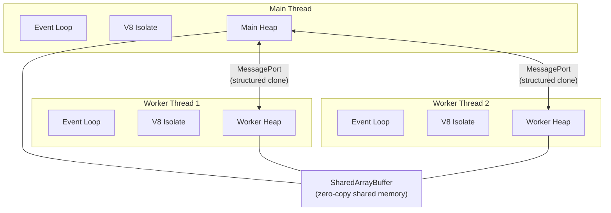

# Module 08 — Worker Threads & Parallelism

## Overview

Node.js is single-threaded for JavaScript execution, but `worker_threads` lets you run JavaScript in parallel on separate V8 isolates. Workers share memory via `SharedArrayBuffer` and communicate via `MessagePort`. They're essential for CPU-intensive work: image processing, cryptography, parsing, compression.

---

## Architecture

---

## Lessons

| # | Lesson | What You'll Learn |
|---|--------|-------------------|
| 01 | [Worker Fundamentals](01-worker-fundamentals.md) | Creating workers, message passing, lifecycle |
| 02 | [SharedArrayBuffer & Atomics](02-shared-memory.md) | Shared memory, race conditions, atomic operations |
| 03 | [Worker Pool Pattern](03-worker-pool.md) | Build a reusable worker pool for CPU tasks |
| 04 | [Real-World Parallelism](04-parallel-labs.md) | Image processing, parallel parsing, crypto |

---

## Key Takeaways

- Workers have their own V8 isolate, event loop, and heap — they're NOT lightweight threads
- `postMessage()` uses structured clone (deep copy) — expensive for large data
- `SharedArrayBuffer` enables zero-copy data sharing but requires `Atomics` for synchronization
- Transferable objects (`ArrayBuffer`, `MessagePort`) move ownership without copying
- Worker pool pattern amortizes thread creation cost for repeated tasks
- Use workers for CPU-bound work only — async I/O is already non-blocking
