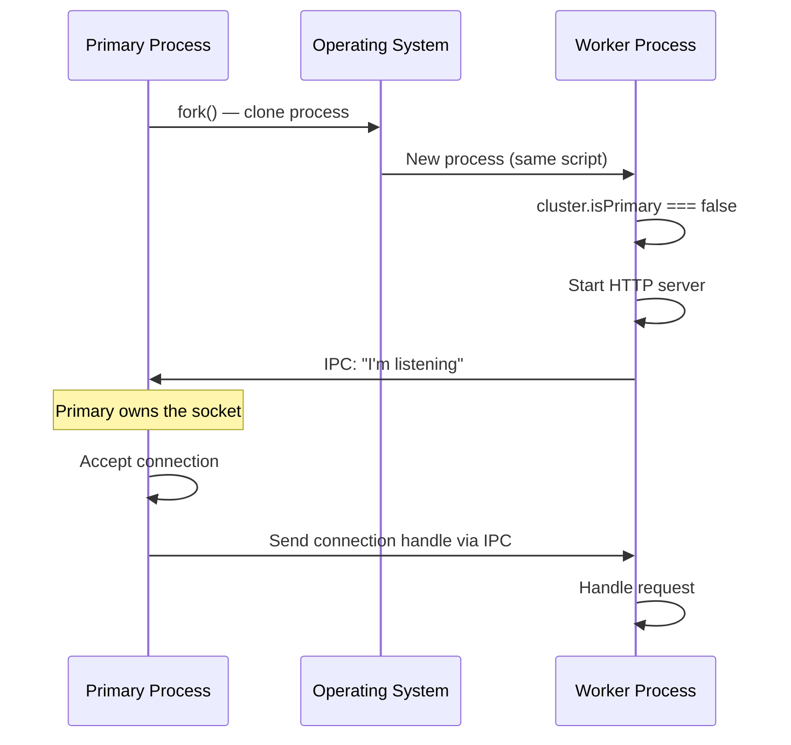
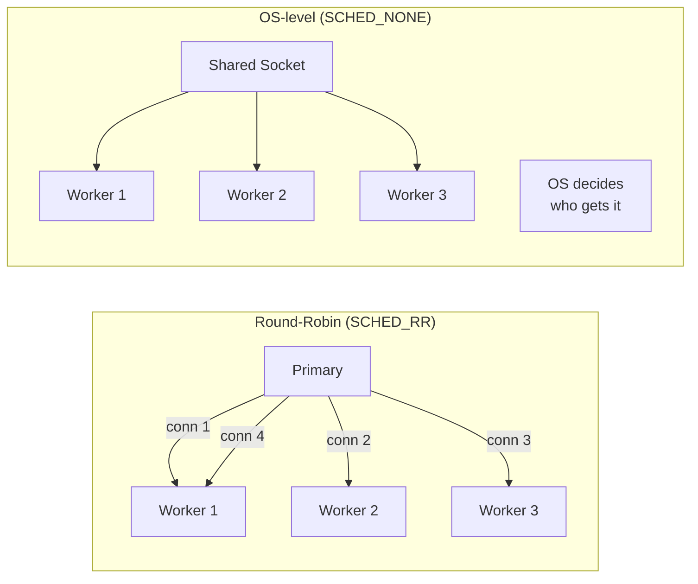

# Lesson 01 — Cluster Module Internals

## How cluster.fork() Works

When you call `cluster.fork()`, Node.js:

1. Calls `child_process.fork()` to spawn a new Node process
2. The child process runs **the same script** (entry point)
3. `cluster.isPrimary` is `false` in the child — code branches accordingly
4. The primary opens the server socket and **distributes connections** to workers



> **Key insight**: On Linux (default), the primary accepts TCP connections and distributes them round-robin. On Windows, the socket handle is shared and the OS decides which worker gets the connection.

---

## Basic Cluster Server

```typescript
// cluster-server.ts
import cluster from "node:cluster";
import http from "node:http";
import { cpus } from "node:os";

const WORKER_COUNT = cpus().length;

if (cluster.isPrimary) {
  console.log(`Primary ${process.pid} starting ${WORKER_COUNT} workers`);
  
  // Fork workers
  for (let i = 0; i < WORKER_COUNT; i++) {
    cluster.fork();
  }
  
  // Worker lifecycle events
  cluster.on("online", (worker) => {
    console.log(`Worker ${worker.process.pid} online`);
  });
  
  cluster.on("exit", (worker, code, signal) => {
    console.log(`Worker ${worker.process.pid} died (code=${code}, signal=${signal})`);
    // Auto-restart crashed workers
    if (code !== 0 && !worker.exitedAfterDisconnect) {
      console.log("Spawning replacement worker...");
      cluster.fork();
    }
  });
  
  // Track worker count
  cluster.on("fork", () => {
    const workerCount = Object.keys(cluster.workers!).length;
    console.log(`Active workers: ${workerCount}`);
  });
  
} else {
  // Worker process — each runs its own HTTP server
  const server = http.createServer((req, res) => {
    // Simulate CPU work
    let sum = 0;
    for (let i = 0; i < 1e6; i++) sum += i;
    
    res.writeHead(200, { "Content-Type": "application/json" });
    res.end(JSON.stringify({
      pid: process.pid,
      uptime: process.uptime(),
      memory: process.memoryUsage().rss,
      sum,
    }));
  });
  
  server.listen(3000, () => {
    console.log(`Worker ${process.pid} listening on :3000`);
  });
}
```

---

## Scheduling Strategies

```typescript
import cluster from "node:cluster";

// Strategy 1: Round-Robin (default on Linux/macOS)
// Primary accepts connections, distributes sequentially
cluster.schedulingPolicy = cluster.SCHED_RR;

// Strategy 2: OS-level (default on Windows)
// All workers compete for connections via SO_REUSEPORT or similar
cluster.schedulingPolicy = cluster.SCHED_NONE;
```



**Round-Robin tradeoff**: Evenly distributes connections but doesn't account for worker load. A worker handling a slow request still gets the next connection assignment.

---

## Cluster Environment Variables

```typescript
// Workers inherit environment from primary, plus cluster-specific vars
if (!cluster.isPrimary) {
  console.log(process.env.NODE_UNIQUE_ID); // Worker index (0, 1, 2...)
  
  // Pass custom env to workers
}

if (cluster.isPrimary) {
  cluster.fork({ WORKER_ROLE: "api" });
  cluster.fork({ WORKER_ROLE: "websocket" });
  cluster.fork({ WORKER_ROLE: "background" });
}
```

---

## Measuring Distribution

```typescript
// distribution-test.ts
import cluster from "node:cluster";
import http from "node:http";

if (cluster.isPrimary) {
  const WORKERS = 4;
  const hitCounts = new Map<number, number>();
  
  for (let i = 0; i < WORKERS; i++) {
    const worker = cluster.fork();
    hitCounts.set(worker.id, 0);
    
    worker.on("message", (msg: { type: string }) => {
      if (msg.type === "request-handled") {
        hitCounts.set(worker.id, (hitCounts.get(worker.id) || 0) + 1);
      }
    });
  }
  
  // Print distribution every 5 seconds
  setInterval(() => {
    const total = [...hitCounts.values()].reduce((a, b) => a + b, 0);
    console.log("\n--- Request Distribution ---");
    for (const [id, count] of hitCounts) {
      const pct = total > 0 ? ((count / total) * 100).toFixed(1) : "0";
      console.log(`  Worker ${id}: ${count} requests (${pct}%)`);
    }
    console.log(`  Total: ${total}`);
  }, 5000);
  
} else {
  http.createServer((req, res) => {
    process.send!({ type: "request-handled" });
    res.writeHead(200);
    res.end(`Worker ${process.pid}\n`);
  }).listen(3000);
}
```

---

## Interview Questions

### Q1: "How does cluster share a port between multiple processes?"

**Answer**: The primary process creates the TCP server socket and binds to the port. When worker processes call `server.listen()`, they don't actually bind — instead, via IPC, the primary's socket handle is sent to the worker. On Linux with the default round-robin scheduling (`SCHED_RR`), the primary accepts incoming connections and distributes the **connection file descriptor** to workers via `sendHandle()` over the IPC channel. The worker then owns that connection's lifecycle. This is why `netstat` shows only one process bound to port 3000 — the primary.

### Q2: "What happens when a cluster worker crashes?"

**Answer**: The worker process exits. The OS reclaims its memory and file descriptors. Any in-flight requests on that worker are lost — clients see a connection reset. The primary receives the `'exit'` event on the worker object with the exit code and signal. The primary should fork a replacement worker. There is a brief window where the cluster has reduced capacity. In-flight requests on *other* workers are unaffected — process isolation is the key advantage over worker threads.

### Q3: "When would you use cluster over a reverse proxy like Nginx?"

**Answer**: You'd rarely use cluster *instead of* a reverse proxy in production — you'd use both:
- **Nginx** handles TLS termination, static files, rate limiting, and distributes across multiple Node servers or containers
- **Cluster** provides multi-core utilization within a single server/container

In containerized environments (Kubernetes), you typically run **1 process per container** (no cluster) and let the orchestrator handle scaling. Cluster is most useful for bare-metal or VM deployments where you want to utilize all cores without multiple containers.
