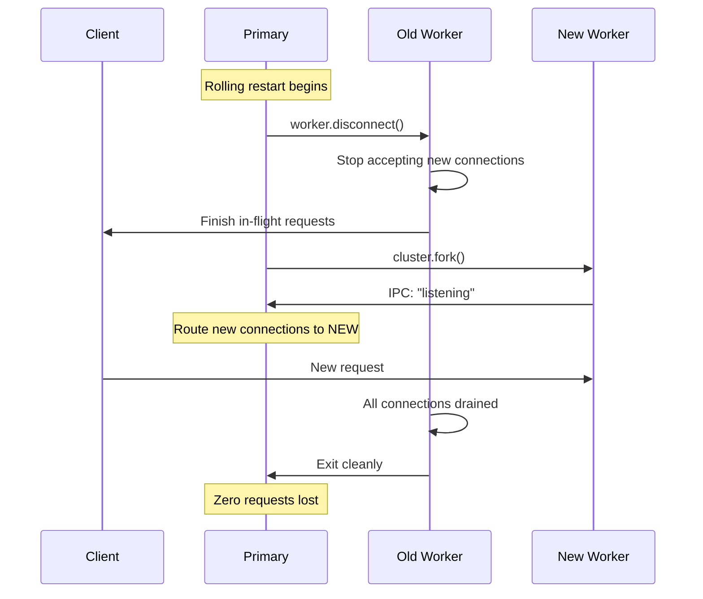

# Lesson 02 — Graceful Restart & Zero-Downtime Deploys

## The Problem

Restarting a Node.js process means all in-flight requests are dropped. For production servers handling thousands of requests per second, even a 100ms gap causes errors. Zero-downtime deployment means: **no request is ever lost during a restart**.



---

## Graceful Shutdown per Worker

```typescript
// graceful-worker.ts
import http from "node:http";
import cluster from "node:cluster";

if (!cluster.isPrimary) {
  const connections = new Set<http.ServerResponse>();
  
  const server = http.createServer((req, res) => {
    connections.add(res);
    res.on("close", () => connections.delete(res));
    
    // Simulate work
    setTimeout(() => {
      res.writeHead(200, { "Content-Type": "application/json" });
      res.end(JSON.stringify({ pid: process.pid, timestamp: Date.now() }));
    }, Math.random() * 2000);
  });
  
  server.listen(3000);
  
  // Handle graceful shutdown
  process.on("SIGTERM", () => {
    console.log(`Worker ${process.pid}: SIGTERM received, draining...`);
    
    // Stop accepting new connections
    server.close(() => {
      console.log(`Worker ${process.pid}: All connections drained, exiting`);
      process.exit(0);
    });
    
    // Force exit after timeout if connections don't drain
    const DRAIN_TIMEOUT = 30_000;
    setTimeout(() => {
      console.error(`Worker ${process.pid}: Drain timeout, forcing exit`);
      process.exit(1);
    }, DRAIN_TIMEOUT).unref(); // unref so timer doesn't keep process alive alone
  });
}
```

---

## Rolling Restart Implementation

```typescript
// rolling-restart.ts
import cluster from "node:cluster";
import http from "node:http";
import { cpus } from "node:os";

const WORKER_COUNT = cpus().length;

if (cluster.isPrimary) {
  // Fork initial workers
  for (let i = 0; i < WORKER_COUNT; i++) {
    cluster.fork();
  }
  
  // Rolling restart: replace workers one at a time
  async function rollingRestart() {
    const workers = Object.values(cluster.workers!).filter(Boolean);
    console.log(`\nStarting rolling restart of ${workers.length} workers...`);
    
    for (const worker of workers) {
      if (!worker) continue;
      
      console.log(`Replacing worker ${worker.process.pid}...`);
      
      // 1. Fork new worker first
      const replacement = cluster.fork();
      
      // 2. Wait for new worker to be ready
      await new Promise<void>((resolve) => {
        replacement.on("listening", () => {
          console.log(`  New worker ${replacement.process.pid} ready`);
          resolve();
        });
      });
      
      // 3. Disconnect old worker (stops receiving new connections)
      worker.disconnect();
      
      // 4. Wait for old worker to exit
      await new Promise<void>((resolve) => {
        worker.on("exit", () => {
          console.log(`  Old worker ${worker.process.pid} exited`);
          resolve();
        });
        
        // Force kill after timeout
        setTimeout(() => {
          worker.kill("SIGKILL");
        }, 30_000);
      });
      
      // 5. Brief delay before next worker
      await new Promise((r) => setTimeout(r, 1000));
    }
    
    console.log("Rolling restart complete\n");
  }
  
  // Trigger restart on SIGUSR2
  process.on("SIGUSR2", () => {
    rollingRestart().catch(console.error);
  });
  
  // Auto-restart crashed workers
  cluster.on("exit", (worker, code) => {
    if (!worker.exitedAfterDisconnect && code !== 0) {
      console.log(`Worker ${worker.process.pid} crashed, restarting...`);
      cluster.fork();
    }
  });
  
  console.log(`Primary ${process.pid} ready. Send SIGUSR2 to trigger rolling restart.`);
  console.log(`  kill -SIGUSR2 ${process.pid}`);
  
} else {
  const connections = new Set<import("node:net").Socket>();
  
  const server = http.createServer((req, res) => {
    const socket = req.socket;
    connections.add(socket);
    socket.on("close", () => connections.delete(socket));
    
    // Simulate varying response times
    const delay = 100 + Math.random() * 500;
    setTimeout(() => {
      res.writeHead(200);
      res.end(JSON.stringify({ pid: process.pid, delay: Math.round(delay) }));
    }, delay);
  });
  
  server.listen(3000);
  
  // Graceful shutdown when disconnected
  process.on("disconnect", () => {
    console.log(`Worker ${process.pid}: disconnected, draining ${connections.size} connections`);
    
    server.close(() => {
      process.exit(0);
    });
    
    setTimeout(() => {
      console.log(`Worker ${process.pid}: force closing ${connections.size} connections`);
      for (const socket of connections) {
        socket.destroy();
      }
      process.exit(0);
    }, 10_000).unref();
  });
}
```

Run and test:
```bash
# Start server
node --experimental-strip-types rolling-restart.ts &

# Load test (keep running during restart)
for i in $(seq 1 100); do curl -s http://localhost:3000 & done

# Trigger rolling restart
kill -SIGUSR2 <primary-pid>
```

---

## Health Check Integration

```typescript
// health-aware-cluster.ts
import cluster from "node:cluster";
import http from "node:http";

interface WorkerHealth {
  pid: number;
  requestCount: number;
  avgResponseTime: number;
  memoryMB: number;
  lastHeartbeat: number;
}

if (cluster.isPrimary) {
  const health = new Map<number, WorkerHealth>();
  const WORKER_COUNT = 4;
  
  for (let i = 0; i < WORKER_COUNT; i++) cluster.fork();
  
  // Collect health reports from workers
  for (const id in cluster.workers) {
    const worker = cluster.workers[id]!;
    worker.on("message", (msg: { type: string; data: WorkerHealth }) => {
      if (msg.type === "health") {
        health.set(worker.id, msg.data);
      }
    });
  }
  
  // Monitor and restart unhealthy workers
  setInterval(() => {
    const now = Date.now();
    for (const [id, workerHealth] of health) {
      const worker = cluster.workers![id];
      if (!worker) continue;
      
      // Restart if: memory > 512MB, heartbeat stale > 30s, or too slow
      const memoryExceeded = workerHealth.memoryMB > 512;
      const heartbeatStale = now - workerHealth.lastHeartbeat > 30_000;
      const tooSlow = workerHealth.avgResponseTime > 5000;
      
      if (memoryExceeded || heartbeatStale || tooSlow) {
        console.log(`Recycling worker ${id} (pid=${workerHealth.pid}):`, {
          memoryExceeded, heartbeatStale, tooSlow,
        });
        
        const replacement = cluster.fork();
        replacement.on("listening", () => {
          worker.disconnect();
          setTimeout(() => worker.kill("SIGKILL"), 10_000);
        });
      }
    }
  }, 10_000);
  
} else {
  let requestCount = 0;
  let totalResponseTime = 0;
  
  http.createServer((req, res) => {
    const start = performance.now();
    requestCount++;
    
    // ... handle request ...
    
    res.writeHead(200);
    res.end("ok");
    totalResponseTime += performance.now() - start;
  }).listen(3000);
  
  // Report health to primary every 5 seconds
  setInterval(() => {
    const msg = {
      type: "health",
      data: {
        pid: process.pid,
        requestCount,
        avgResponseTime: requestCount > 0 ? totalResponseTime / requestCount : 0,
        memoryMB: process.memoryUsage().rss / 1024 / 1024,
        lastHeartbeat: Date.now(),
      } satisfies WorkerHealth,
    };
    process.send!(msg);
  }, 5000);
}
```

---

## Interview Questions

### Q1: "How do you achieve zero-downtime deployment with Node.js cluster?"

**Answer**: Rolling restart strategy:
1. Fork a **new** worker first
2. Wait for it to emit `'listening'` (it's ready to serve)
3. Call `worker.disconnect()` on the old worker (stops new connection assignment)
4. Old worker finishes in-flight requests via `server.close()` callback
5. Old worker exits cleanly
6. Repeat for each worker, one at a time

At no point is the total worker count below the minimum — there's always overlap during the swap.

### Q2: "What's the difference between worker.disconnect() and worker.kill()?"

**Answer**:
- `worker.disconnect()`: Closes the IPC channel. The worker stops receiving new connections from the primary but finishes existing ones. The worker can exit gracefully. Sets `worker.exitedAfterDisconnect = true`.
- `worker.kill(signal)`: Sends an OS signal (default SIGTERM) to the worker process. The worker must handle the signal to shut down gracefully — otherwise it terminates immediately.

**Best practice**: Always `disconnect()` first, give a timeout for draining, then `kill('SIGKILL')` as a last resort.

### Q3: "How do you handle memory leaks in a long-running cluster?"

**Answer**: Worker recycling pattern:
1. Each worker reports its memory usage to the primary via IPC
2. Primary monitors `process.memoryUsage().heapUsed` from each worker
3. When memory exceeds a threshold (e.g., 512MB), trigger a graceful replacement
4. Fork a new worker → wait for `'listening'` → disconnect old one → old drains and exits

This doesn't fix the leak but ensures no single worker runs long enough to exhaust memory. Combine with heap snapshot analysis (Module 07) to find and fix the root cause.
