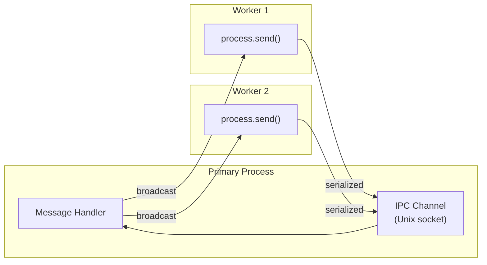
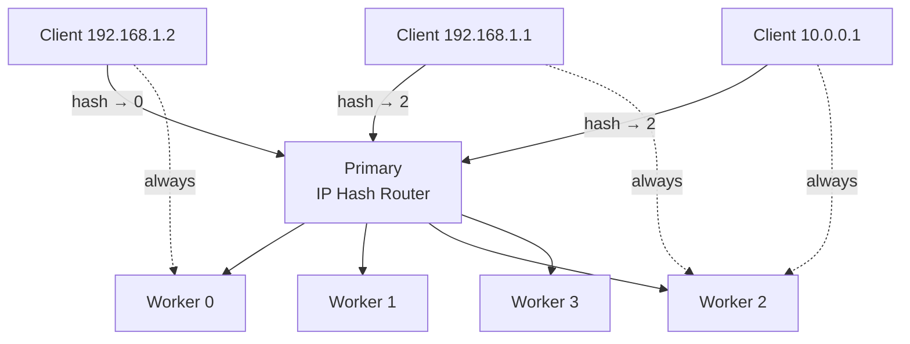

# Lesson 03 — Inter-Process Communication & Coordination

## IPC Internals

Cluster workers communicate with the primary via an IPC channel — a Unix domain socket (Linux/macOS) or named pipe (Windows). Messages are serialized with the V8 serializer (structured clone).



> **Performance note**: IPC serialization costs ~0.1ms for a 1KB message. For high-frequency communication (>10k msg/sec), consider SharedArrayBuffer via worker_threads instead.

---

## Message Patterns

### Pub/Sub Broadcast

```typescript
// ipc-pubsub.ts
import cluster from "node:cluster";
import http from "node:http";

if (cluster.isPrimary) {
  const WORKERS = 4;
  for (let i = 0; i < WORKERS; i++) cluster.fork();
  
  // Broadcast to all workers
  function broadcast(type: string, data: any) {
    for (const id in cluster.workers) {
      cluster.workers[id]?.send({ type, data });
    }
  }
  
  // Forward messages between workers
  for (const id in cluster.workers) {
    cluster.workers[id]!.on("message", (msg: { type: string; data: any }) => {
      switch (msg.type) {
        case "broadcast":
          // One worker wants to tell all workers something
          broadcast(msg.data.event, msg.data.payload);
          break;
          
        case "cache-invalidation":
          // Forward cache invalidation to all workers
          broadcast("invalidate-cache", msg.data);
          break;
      }
    });
  }
  
  // Example: push config updates to all workers
  process.on("SIGHUP", () => {
    console.log("Reloading config and pushing to workers...");
    const newConfig = { maxConnections: 1000, timeout: 30_000 };
    broadcast("config-update", newConfig);
  });
  
} else {
  let config = { maxConnections: 500, timeout: 15_000 };
  
  process.on("message", (msg: { type: string; data: any }) => {
    switch (msg.type) {
      case "config-update":
        config = { ...config, ...msg.data };
        console.log(`Worker ${process.pid}: config updated`, config);
        break;
        
      case "invalidate-cache":
        console.log(`Worker ${process.pid}: invalidating cache key "${msg.data.key}"`);
        // cache.delete(msg.data.key);
        break;
    }
  });
  
  http.createServer((req, res) => {
    if (req.url === "/invalidate" && req.method === "POST") {
      // Tell all workers to invalidate via primary
      process.send!({
        type: "cache-invalidation",
        data: { key: "user-sessions" },
      });
      res.writeHead(200);
      res.end("Cache invalidation broadcast sent\n");
      return;
    }
    
    res.writeHead(200, { "Content-Type": "application/json" });
    res.end(JSON.stringify({ pid: process.pid, config }));
  }).listen(3000);
}
```

---

### Sticky Sessions

When using WebSockets or session-based auth, all requests from the same client must go to the same worker. Round-robin breaks this.

```typescript
// sticky-sessions.ts
import cluster from "node:cluster";
import net from "node:net";
import http from "node:http";
import { createHash } from "node:crypto";

const WORKER_COUNT = 4;

if (cluster.isPrimary) {
  const workers: cluster.Worker[] = [];
  
  for (let i = 0; i < WORKER_COUNT; i++) {
    workers.push(cluster.fork());
  }
  
  // Create a raw TCP server (bypass cluster's built-in distribution)
  const server = net.createServer({ pauseOnConnect: true }, (connection) => {
    // Hash the remote IP to pick a consistent worker
    const remoteAddress = connection.remoteAddress || "127.0.0.1";
    const hash = createHash("md5").update(remoteAddress).digest();
    const workerIndex = hash.readUInt32BE(0) % WORKER_COUNT;
    
    const worker = workers[workerIndex];
    
    // Send the connection handle to the selected worker
    worker.send({ type: "sticky-connection" }, connection);
  });
  
  server.listen(3000, () => {
    console.log(`Sticky session proxy on :3000 → ${WORKER_COUNT} workers`);
  });
  
} else {
  const sessions = new Map<string, { count: number; started: number }>();
  
  const server = http.createServer((req, res) => {
    const ip = req.socket.remoteAddress || "unknown";
    
    // This worker always gets this IP's requests
    if (!sessions.has(ip)) {
      sessions.set(ip, { count: 0, started: Date.now() });
    }
    const session = sessions.get(ip)!;
    session.count++;
    
    res.writeHead(200, { "Content-Type": "application/json" });
    res.end(JSON.stringify({
      workerPid: process.pid,
      clientIp: ip,
      requestCount: session.count,
      sessionAge: Date.now() - session.started,
    }));
  });
  
  // Receive connections forwarded by primary
  process.on("message", (msg: any, connection: net.Socket) => {
    if (msg.type === "sticky-connection") {
      server.emit("connection", connection);
      connection.resume(); // We paused on connect
    }
  });
  
  // Also listen directly for cluster-distributed connections (fallback)
  server.listen(0); // random port, not used directly
  console.log(`Worker ${process.pid} ready for sticky sessions`);
}
```



---

### Shared State via Primary

Workers cannot share memory. For shared state (rate limiting, counters), the primary acts as a coordinator.

```typescript
// shared-state-coordinator.ts
import cluster from "node:cluster";
import http from "node:http";

if (cluster.isPrimary) {
  // Centralized rate limit state
  const rateLimits = new Map<string, { count: number; resetAt: number }>();
  const RATE_LIMIT = 100;       // requests per window
  const WINDOW_MS = 60_000;     // 1 minute
  
  for (let i = 0; i < 4; i++) cluster.fork();
  
  for (const id in cluster.workers) {
    cluster.workers[id]!.on("message", (msg: {
      type: string;
      requestId: string;
      ip: string;
    }) => {
      if (msg.type !== "rate-limit-check") return;
      
      const now = Date.now();
      let entry = rateLimits.get(msg.ip);
      
      if (!entry || now > entry.resetAt) {
        entry = { count: 0, resetAt: now + WINDOW_MS };
        rateLimits.set(msg.ip, entry);
      }
      
      entry.count++;
      const allowed = entry.count <= RATE_LIMIT;
      
      cluster.workers[id]!.send({
        type: "rate-limit-result",
        requestId: msg.requestId,
        allowed,
        remaining: Math.max(0, RATE_LIMIT - entry.count),
        resetAt: entry.resetAt,
      });
    });
  }
  
  // Cleanup expired entries every minute
  setInterval(() => {
    const now = Date.now();
    for (const [ip, entry] of rateLimits) {
      if (now > entry.resetAt) rateLimits.delete(ip);
    }
  }, 60_000);
  
} else {
  const pendingChecks = new Map<string, {
    resolve: (result: { allowed: boolean; remaining: number }) => void;
  }>();
  
  let checkId = 0;
  
  process.on("message", (msg: any) => {
    if (msg.type === "rate-limit-result") {
      const pending = pendingChecks.get(msg.requestId);
      if (pending) {
        pendingChecks.delete(msg.requestId);
        pending.resolve({ allowed: msg.allowed, remaining: msg.remaining });
      }
    }
  });
  
  function checkRateLimit(ip: string): Promise<{ allowed: boolean; remaining: number }> {
    const requestId = `${process.pid}-${checkId++}`;
    return new Promise((resolve) => {
      pendingChecks.set(requestId, { resolve });
      process.send!({ type: "rate-limit-check", requestId, ip });
    });
  }
  
  http.createServer(async (req, res) => {
    const ip = req.socket.remoteAddress || "unknown";
    const { allowed, remaining } = await checkRateLimit(ip);
    
    res.setHeader("X-RateLimit-Remaining", remaining);
    
    if (!allowed) {
      res.writeHead(429);
      res.end("Rate limit exceeded\n");
      return;
    }
    
    res.writeHead(200);
    res.end(`OK (${remaining} remaining)\n`);
  }).listen(3000);
}
```

---

## Interview Questions

### Q1: "How would you implement sticky sessions with Node.js cluster?"

**Answer**: Override cluster's default round-robin distribution:
1. Create a `net.createServer` with `pauseOnConnect: true` in the primary
2. When a connection arrives, hash the client's IP address (or a cookie value) to deterministically select a worker index
3. Send the raw TCP connection handle to that worker via `worker.send(msg, connection)`
4. The worker calls `connection.resume()` and emits it on its HTTP server

This ensures the same client always reaches the same worker, enabling in-memory sessions and WebSocket connections to persist.

### Q2: "What are the limitations of IPC between cluster workers?"

**Answer**:
1. **Serialization overhead**: Messages are structured-cloned (like `postMessage`). Large objects cost serialization time.
2. **No direct worker-to-worker**: All communication goes through the primary — star topology, not mesh.
3. **No shared memory**: Unlike worker_threads, cluster processes cannot share `SharedArrayBuffer`.
4. **Latency**: IPC round-trip adds ~0.1-1ms. Unacceptable for hot-path data (use Redis instead).
5. **Primary bottleneck**: All coordination flows through one process. If the primary is overloaded, all workers are affected.

### Q3: "In production, would you use cluster IPC or Redis for shared state?"

**Answer**: Redis for almost all cases:
- Redis survives process restarts (cluster IPC state is lost if primary restarts)
- Redis works across multiple servers (IPC is single-machine only)  
- Redis has built-in data structures (sorted sets, pub/sub, streams)
- Redis handles TTL/expiry natively

Use IPC only for: health reporting to primary, graceful shutdown coordination, and config pushes — things that are ephemeral and single-machine scoped.
