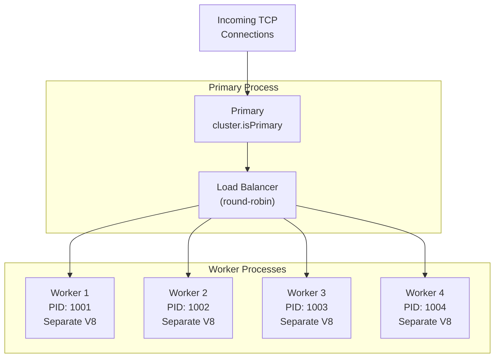

# Module 09 — Cluster & Multi-Process

## Overview

Worker threads share the same process. The cluster module spawns separate **processes** — each with its own V8 isolate, event loop, and memory. This is how Node scales across CPU cores for I/O-bound servers.

## Lessons

| # | File | Topic | Key Concepts |
|---|------|-------|-------------|
| 1 | [01-cluster-fundamentals.md](01-cluster-fundamentals.md) | Cluster Module Internals | fork(), IPC, scheduling strategies |
| 2 | [02-graceful-operations.md](02-graceful-operations.md) | Graceful Restart & Zero-Downtime | Rolling restart, draining connections, SIGTERM handling |
| 3 | [03-ipc-coordination.md](03-ipc-coordination.md) | Inter-Process Communication | Message passing, shared state, sticky sessions |

## Worker Threads vs Cluster

| Aspect | Worker Threads | Cluster |
|--------|---------------|---------|
| Isolation | Same process, separate V8 isolate | Separate OS process |
| Memory | SharedArrayBuffer possible | No shared memory |
| Use case | CPU-bound computation | I/O-bound server scaling |
| Crash impact | Worker crash may affect process | Worker crash is isolated |
| IPC | postMessage (fast) | Serialized IPC over pipe (slower) |
| Server sharing | Cannot share server sockets | Built-in server socket sharing |
