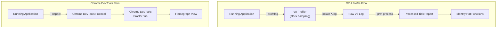
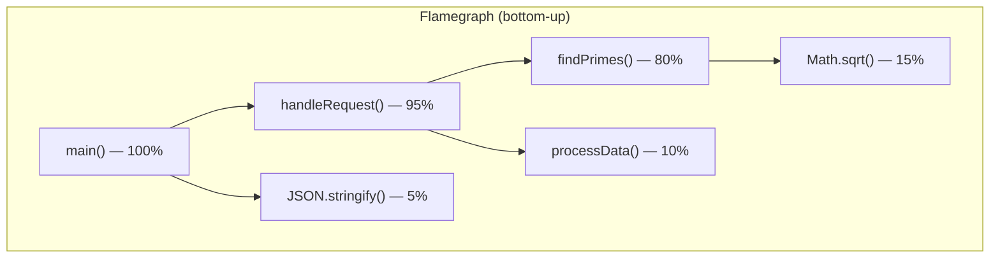

# Lesson 02 — CPU Profiling & Flamegraphs

## V8's Built-in CPU Profiler

Node.js has a built-in CPU profiler via V8. It samples the call stack at regular intervals (default: every 1ms) and records which function is executing.



---

## Method 1: V8 --prof

```bash
# Generate V8 profiler log
node --prof --experimental-strip-types server.ts

# Process the log into readable output
node --prof-process isolate-0x*.log > profile.txt
```

```typescript
// cpu-heavy-server.ts — a server with clear CPU hotspot
import http from "node:http";

function findPrimes(max: number): number[] {
  const primes: number[] = [];
  for (let n = 2; n <= max; n++) {
    let isPrime = true;
    for (let d = 2; d <= Math.sqrt(n); d++) {
      if (n % d === 0) {
        isPrime = false;
        break;
      }
    }
    if (isPrime) primes.push(n);
  }
  return primes;
}

function processData(data: any[]): any[] {
  // This function is fast — not the bottleneck
  return data.map((item) => ({ ...item, processed: true }));
}

const server = http.createServer((req, res) => {
  // CPU-bound: this will dominate the profile
  const primes = findPrimes(100_000);
  
  // Fast
  const processed = processData(primes.map((p) => ({ value: p })));
  
  res.writeHead(200, { "Content-Type": "application/json" });
  res.end(JSON.stringify({ count: processed.length }));
});

server.listen(3000);
```

**Profile output** (simplified):
```
[Summary]:
   ticks  total  nonlib   name
    892   62.3%   71.4%  JavaScript
    356   24.9%   28.5%  C++
    183   12.8%     -    Shared libraries

[JavaScript]:
   ticks  total  nonlib   name
    784   54.8%   62.7%  findPrimes (cpu-heavy-server.ts:4:37)
     52    3.6%    4.2%  JSON.stringify
     31    2.2%    2.5%  processData (cpu-heavy-server.ts:17:27)
```

> The profile immediately reveals `findPrimes` is 62.7% of JavaScript execution.

---

## Method 2: Chrome DevTools Profiler

```bash
# Start with inspector
node --inspect --experimental-strip-types cpu-heavy-server.ts

# Open Chrome → chrome://inspect → click "inspect"
# Go to "Profiler" tab → Start → Send requests → Stop
```

---

## Method 3: Programmatic CPU Profiling

```typescript
// programmatic-profiling.ts
import { Session } from "node:inspector/promises";
import { writeFileSync } from "node:fs";

const session = new Session();
session.connect();

async function profileFunction<T>(name: string, fn: () => T | Promise<T>): Promise<T> {
  await session.post("Profiler.enable");
  await session.post("Profiler.start");
  
  const result = await fn();
  
  const { profile } = await session.post("Profiler.stop") as any;
  
  // Save as .cpuprofile — open in Chrome DevTools
  const filename = `${name}-${Date.now()}.cpuprofile`;
  writeFileSync(filename, JSON.stringify(profile));
  console.log(`Profile saved: ${filename}`);
  
  await session.post("Profiler.disable");
  return result;
}

// Profile a specific code path
const result = await profileFunction("prime-computation", () => {
  const primes: number[] = [];
  for (let n = 2; n <= 50_000; n++) {
    let isPrime = true;
    for (let d = 2; d <= Math.sqrt(n); d++) {
      if (n % d === 0) { isPrime = false; break; }
    }
    if (isPrime) primes.push(n);
  }
  return primes;
});

console.log(`Found ${result.length} primes`);
session.disconnect();
```

---

## Reading Flamegraphs



**How to read**:
- **Width** = time spent (wider = more CPU time)
- **Y-axis** = call stack depth (bottom is entry point)
- **Plateaus** = hot functions (wide flat areas at the top are where CPU is actually spent)
- **Narrow towers** = deep call stacks but not bottlenecks

**What to look for**:
1. Wide bars at the top → functions doing the actual work (optimize these)
2. Surprising functions → unexpected hotspots (framework overhead, serialization)
3. GC functions → too much allocation pressure
4. Anonymous functions → harder to optimize (V8 can't trace well); always name functions

---

## Identifying Deoptimization

```typescript
// deopt-detection.ts
// Run with: node --trace-deopt --experimental-strip-types deopt-detection.ts

function add(a: number, b: number): number {
  return a + b;
}

// V8 optimizes for (number, number)
for (let i = 0; i < 100_000; i++) {
  add(i, i + 1); // Monomorphic — V8 optimizes
}

// Suddenly pass different types — triggers deoptimization!
// @ts-expect-error — intentional type mismatch for demonstration
add("hello", "world"); // DEOPT: not-a-number

// V8 trace output will show:
// [deoptimize context: ... reason: not a Smi]
```

```bash
# Trace optimizations and deoptimizations
node --trace-opt --trace-deopt --experimental-strip-types deopt-detection.ts 2>&1 | head -50
```

---

## Production-Safe Profiling

```typescript
// on-demand-profiler.ts
import http from "node:http";
import { Session } from "node:inspector/promises";
import { writeFileSync } from "node:fs";

let profiling = false;
let session: Session | null = null;

const server = http.createServer(async (req, res) => {
  // Admin endpoint to trigger profiling
  if (req.url === "/_profile/start" && req.method === "POST") {
    if (profiling) {
      res.writeHead(409);
      res.end("Already profiling\n");
      return;
    }
    
    profiling = true;
    session = new Session();
    session.connect();
    await session.post("Profiler.enable");
    await session.post("Profiler.start");
    
    res.writeHead(200);
    res.end("Profiling started. POST /_profile/stop to collect.\n");
    return;
  }
  
  if (req.url === "/_profile/stop" && req.method === "POST") {
    if (!profiling || !session) {
      res.writeHead(409);
      res.end("Not profiling\n");
      return;
    }
    
    const { profile } = await session.post("Profiler.stop") as any;
    await session.post("Profiler.disable");
    session.disconnect();
    session = null;
    profiling = false;
    
    const filename = `/tmp/cpu-profile-${Date.now()}.cpuprofile`;
    writeFileSync(filename, JSON.stringify(profile));
    
    res.writeHead(200);
    res.end(`Profile saved: ${filename}\n`);
    return;
  }
  
  // Normal request handling
  let sum = 0;
  for (let i = 0; i < 1e6; i++) sum += Math.sqrt(i);
  
  res.writeHead(200);
  res.end(JSON.stringify({ sum }));
});

server.listen(3000, () => {
  console.log("Server on :3000 — POST /_profile/start and /_profile/stop");
});
```

---

## Interview Questions

### Q1: "How would you find a CPU bottleneck in a production Node.js server?"

**Answer**: 
1. Enable the inspector remotely: `kill -SIGUSR1 <pid>` (opens inspect port on an already-running process)
2. Connect Chrome DevTools (`chrome://inspect`) → go to Profiler tab
3. Start recording → send representative traffic → stop recording
4. Look at the flamegraph for the widest bars at the top of the call stack
5. Alternatively, use `--prof` with a canary instance for a V8 tick report

For production-safe profiling: add a protected HTTP endpoint that starts/stops the `node:inspector/promises` session programmatically. Profile for 30 seconds under load, save the `.cpuprofile`, analyze offline.

### Q2: "What causes V8 to deoptimize a function?"

**Answer**: V8 deoptimizes when its assumptions are violated:
1. **Type changes**: Function optimized for numbers, then receives a string
2. **Hidden class transitions**: Object shape changes after optimization
3. **Megamorphic call sites**: More than 4 different object shapes at the same call site
4. **Arguments object**: Using `arguments` in ways that prevent optimization
5. **Try-catch**: Functions with try-catch were historically not optimizable (largely fixed in modern V8)
6. **Debugger**: Breakpoints force deoptimization of affected functions

Detect with `--trace-deopt` flag. Fix by keeping types stable (TypeScript helps but V8 doesn't use TS types — it infers from runtime behavior).

### Q3: "When would you NOT optimize?"

**Answer**: When the profiler says the code is fast enough. Specifically:
- If a function takes < 1% of total CPU time, optimizing it is wasted effort
- If the bottleneck is I/O (network, disk), CPU optimization doesn't help
- If latency is within SLA requirements, further optimization reduces maintainability without user benefit
- Premature optimization creates complex code that's harder to debug, test, and modify
