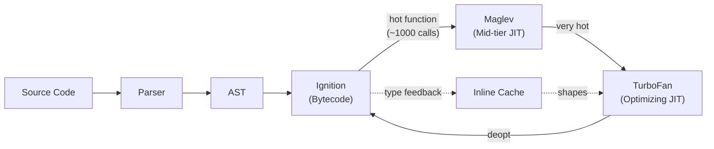
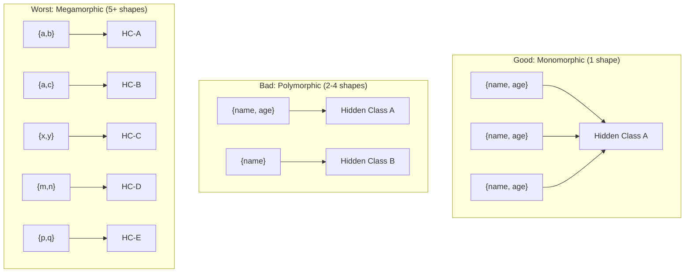

# Lesson 03 — V8 Optimization Patterns

## How V8 Optimizes JavaScript



V8 uses **speculative optimization**: it observes runtime types and specializes machine code for the most common case. When the speculation is wrong, it **deoptimizes** back to bytecode.

---

## Hidden Classes (Maps)

Every JavaScript object has a hidden class (V8 calls them "Maps") that describes its shape — which properties exist and at what offsets.

```typescript
// hidden-classes.ts

// GOOD: All objects have the same hidden class
function createUserGood(name: string, age: number) {
  return { name, age }; // Always same shape, same property order
}

const u1 = createUserGood("Alice", 30);  // Hidden Class: HC1 {name: @0, age: @8}
const u2 = createUserGood("Bob", 25);    // Same HC1 — V8 optimizes!

// BAD: Objects get different hidden classes
function createUserBad(name: string, age?: number) {
  const user: any = { name };
  if (age !== undefined) {
    user.age = age; // Hidden class transition: HC1 → HC2
  }
  return user;
}

const u3 = createUserBad("Alice", 30);  // HC2 {name: @0, age: @8}
const u4 = createUserBad("Bob");        // HC1 {name: @0} — DIFFERENT!
// V8 sees two shapes → megamorphic → can't optimize property access
```



---

## Inline Caches (ICs)

V8 caches property access locations based on hidden classes. First access is slow (lookup), subsequent accesses with the same shape are fast (direct offset).

```typescript
// inline-cache-demo.ts

function getNameMonomorphic(user: { name: string }) {
  return user.name; // Always same shape → IC caches offset → FAST
}

function getNameMegamorphic(obj: any) {
  return obj.name; // Different shapes each time → IC misses → SLOW
}

// Benchmark comparison
const users = Array.from({ length: 100_000 }, (_, i) => ({
  name: `user_${i}`,
  age: i,
})); // All same shape

const mixed = [
  { name: "alice", age: 30 },
  { name: "bob", email: "b@b.com" },
  { name: "charlie", role: "admin" },
  { name: "diana", score: 100, level: 5 },
  { name: "eve", x: 1, y: 2, z: 3 },
]; // Five different shapes!

console.time("monomorphic");
for (let i = 0; i < 1_000_000; i++) {
  getNameMonomorphic(users[i % users.length]);
}
console.timeEnd("monomorphic");

console.time("megamorphic");
for (let i = 0; i < 1_000_000; i++) {
  getNameMegamorphic(mixed[i % mixed.length]);
}
console.timeEnd("megamorphic");

// Monomorphic is typically 5-10x faster
```

---

## Array Optimization

V8 classifies arrays internally based on their element types:

| Element Kind | Description | Speed |
|-------------|-------------|-------|
| `PACKED_SMI_ELEMENTS` | All small integers | Fastest |
| `PACKED_DOUBLE_ELEMENTS` | All numbers (including floats) | Fast |
| `PACKED_ELEMENTS` | Mixed types or objects | Slower |
| `HOLEY_*` variants | Sparse array (has gaps) | Slowest |

```typescript
// array-optimization.ts

// GOOD: Keep arrays homogeneous
const ints = [1, 2, 3, 4, 5];                    // PACKED_SMI_ELEMENTS
const doubles = [1.1, 2.2, 3.3];                  // PACKED_DOUBLE_ELEMENTS

// BAD: Mixed types force V8 to use generic representation
const mixed = [1, "hello", { x: 1 }, null];       // PACKED_ELEMENTS

// BAD: Holes in arrays
const holey = [1, 2, , 4, 5];                     // HOLEY_SMI_ELEMENTS
// or:
const arr = new Array(100);                        // HOLEY_ELEMENTS
arr[0] = 1;

// GOOD: Pre-fill instead of creating holes
const filled = Array.from({ length: 100 }, () => 0); // PACKED_SMI_ELEMENTS

// Element kind transitions are ONE-WAY (can't go back):
// SMI → DOUBLE → ELEMENTS (never reverses)
const nums = [1, 2, 3];        // PACKED_SMI
nums.push(1.5);                 // → PACKED_DOUBLE (permanent!)
nums.push("oops");              // → PACKED_ELEMENTS (permanent!)
```

---

## Object Allocation Patterns

```typescript
// allocation-patterns.ts

// GOOD: Class-based objects — predictable shape, V8 optimizes
class Point {
  constructor(public x: number, public y: number) {}
}
// All Points share one hidden class, one IC path

// GOOD: Factory with consistent shape
function createPoint(x: number, y: number) {
  return { x, y }; // Always same property order → same hidden class
}

// BAD: Object.assign breaks shape predictability
function mergeConfig(defaults: any, overrides: any) {
  return Object.assign({}, defaults, overrides); // Shape depends on inputs
}

// GOOD: Explicit shape
function mergeConfigGood(
  defaults: { timeout: number; retries: number },
  overrides: Partial<typeof defaults>
) {
  return {
    timeout: overrides.timeout ?? defaults.timeout,
    retries: overrides.retries ?? defaults.retries,
  }; // Always same shape
}

// BAD: delete operator causes hidden class transition
function removeField(obj: any) {
  delete obj.unused; // Forces new hidden class! Very slow!
}

// GOOD: Set to undefined instead
function clearField(obj: any) {
  obj.unused = undefined; // Same hidden class, no transition
}
```

---

## String Optimization

```typescript
// string-optimization.ts

// V8 has multiple internal string representations:
// - SeqString: Simple contiguous string
// - ConsString: Concatenation tree (lazy flattening)
// - SlicedString: Substring reference to parent

// BAD: Building strings in a loop creates deep ConsString trees
function buildBad(n: number): string {
  let s = "";
  for (let i = 0; i < n; i++) {
    s += `item_${i},`; // Each += creates a ConsString node
  }
  return s;
  // Results in a tree of N nodes — flattening costs O(N)
}

// GOOD: Collect in array, join once
function buildGood(n: number): string {
  const parts: string[] = [];
  for (let i = 0; i < n; i++) {
    parts.push(`item_${i}`);
  }
  return parts.join(","); // One allocation for final string
}

// Benchmark
console.time("bad");
buildBad(100_000);
console.timeEnd("bad");

console.time("good");
buildGood(100_000);
console.timeEnd("good");
```

---

## Interview Questions

### Q1: "What is a hidden class and why does it matter for performance?"

**Answer**: V8 assigns every JavaScript object a "hidden class" (internally called a "Map") that describes its structure — which properties exist, their types, and their memory offsets. When V8 optimizes a function with TurboFan, it specializes code based on the hidden class it observed. Property access becomes a direct memory offset read (like a C struct) instead of a dictionary lookup.

**Why it matters**: If objects at a call site have the same hidden class (monomorphic), property access is ~10x faster than megamorphic access (5+ different shapes). TypeScript's type system helps write monomorphic code, but V8 doesn't use TypeScript types — it relies on runtime observation. Inconsistent object shapes (conditional properties, `delete`, different construction orders) force V8 into slow megamorphic paths.

### Q2: "How do array element kinds affect performance?"

**Answer**: V8 classifies arrays by their content type: `PACKED_SMI` (integers only, fastest — stored unboxed), `PACKED_DOUBLE` (numbers with floats), `PACKED_ELEMENTS` (any type — boxed, slowest). Adding a non-integer to an SMI array permanently downgrades it to DOUBLE or ELEMENTS — transitions are **one-way**. Arrays with holes (`HOLEY_*`) are even slower because every access must check for the hole.

**Practical rule**: Keep arrays homogeneous. Use `Array.from({ length: n }, () => 0)` instead of `new Array(n)`. Never mix types in performance-critical arrays.

### Q3: "What's the difference between monomorphic and megamorphic call sites?"

**Answer**: 
- **Monomorphic**: One object shape at a property access site. V8 caches the hidden class and property offset in an inline cache. Subsequent accesses are a single comparison + direct memory read. Extremely fast.
- **Polymorphic** (2-4 shapes): V8 uses a multi-entry cache. Still reasonably fast — checks 2-4 entries.
- **Megamorphic** (5+ shapes): Cache overflows. V8 falls back to a hash table lookup for every access. 5-10x slower than monomorphic.

Detect with `--trace-ic` flag. Fix by ensuring functions receive objects with consistent shapes.
