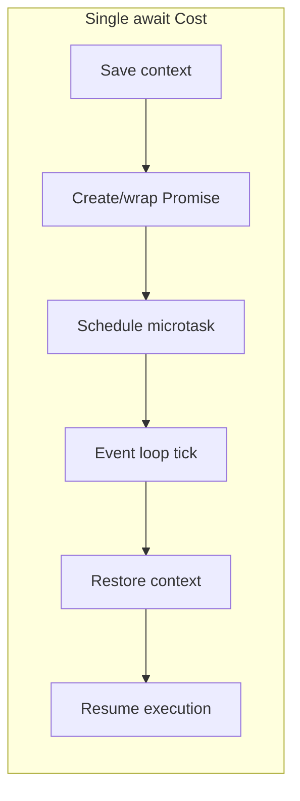

# Lesson 04 — Async Performance Traps

## The Cost of Async

Async/await is not free. Every `await` involves:
1. Saving the current execution context (closure capture)
2. Creating a Promise (if not already one)
3. Scheduling a microtask
4. Restoring context when the microtask runs



---

## Trap 1: Unnecessary Awaits

```typescript
// unnecessary-await.ts

// BAD: Awaiting something that could just be returned
async function getUserBad(id: string): Promise<User> {
  const user = await db.findUser(id);  // Await here...
  return user;                          // ...just to return it
  // Creates an EXTRA microtask for no reason
}

// GOOD: Return the promise directly
function getUserGood(id: string): Promise<User> {
  return db.findUser(id); // No async overhead — just pass the promise through
}

// BAD: Wrapping synchronous code in async
async function addBad(a: number, b: number): Promise<number> {
  return a + b; // Creates a promise for a synchronous operation!
}

// GOOD: Only use async when there's actual async work
function addGood(a: number, b: number): number {
  return a + b;
}
```

---

## Trap 2: Sequential Awaits (Waterfall)

```typescript
// sequential-vs-parallel.ts

interface User { id: string; name: string }
interface Order { id: string; total: number }
interface Profile { id: string; avatar: string }

// Simulated API calls
const fetchUser = (id: string): Promise<User> =>
  new Promise((r) => setTimeout(() => r({ id, name: "Alice" }), 100));
const fetchOrders = (userId: string): Promise<Order[]> =>
  new Promise((r) => setTimeout(() => r([{ id: "o1", total: 99 }]), 100));
const fetchProfile = (userId: string): Promise<Profile> =>
  new Promise((r) => setTimeout(() => r({ id: userId, avatar: "url" }), 100));

// BAD: Sequential — 300ms total (100 + 100 + 100)
async function getPageDataBad(userId: string) {
  const user = await fetchUser(userId);       // 100ms
  const orders = await fetchOrders(userId);   // +100ms
  const profile = await fetchProfile(userId); // +100ms
  return { user, orders, profile };           // Total: ~300ms
}

// GOOD: Parallel — 100ms total (all concurrent)
async function getPageDataGood(userId: string) {
  const [user, orders, profile] = await Promise.all([
    fetchUser(userId),
    fetchOrders(userId),
    fetchProfile(userId),
  ]);
  return { user, orders, profile }; // Total: ~100ms
}

// GOOD: Parallel with error isolation
async function getPageDataSafe(userId: string) {
  const results = await Promise.allSettled([
    fetchUser(userId),
    fetchOrders(userId),
    fetchProfile(userId),
  ]);
  
  return {
    user: results[0].status === "fulfilled" ? results[0].value : null,
    orders: results[1].status === "fulfilled" ? results[1].value : [],
    profile: results[2].status === "fulfilled" ? results[2].value : null,
  };
}

// Benchmark
console.time("sequential");
await getPageDataBad("user1");
console.timeEnd("sequential"); // ~300ms

console.time("parallel");
await getPageDataGood("user1");
console.timeEnd("parallel"); // ~100ms
```

---

## Trap 3: Promise.all with Too Many Concurrent Operations

```typescript
// unbounded-concurrency.ts

// BAD: 10,000 concurrent HTTP requests — exhausts sockets, memory, file descriptors
async function fetchAllBad(urls: string[]) {
  return Promise.all(urls.map((url) => fetch(url))); // All at once!
}

// GOOD: Bounded concurrency
async function fetchAllBounded(urls: string[], concurrency = 10) {
  const results: Response[] = [];
  let index = 0;
  
  async function worker() {
    while (index < urls.length) {
      const i = index++;
      results[i] = await fetch(urls[i]);
    }
  }
  
  // Launch N workers
  const workers = Array.from({ length: Math.min(concurrency, urls.length) }, worker);
  await Promise.all(workers);
  
  return results;
}

// Alternative: Generic concurrency limiter
class ConcurrencyLimiter {
  private running = 0;
  private queue: (() => void)[] = [];
  
  constructor(private maxConcurrency: number) {}
  
  async run<T>(fn: () => Promise<T>): Promise<T> {
    while (this.running >= this.maxConcurrency) {
      await new Promise<void>((resolve) => this.queue.push(resolve));
    }
    
    this.running++;
    try {
      return await fn();
    } finally {
      this.running--;
      const next = this.queue.shift();
      if (next) next();
    }
  }
}

// Usage
const limiter = new ConcurrencyLimiter(5);
const urls = Array.from({ length: 1000 }, (_, i) => `http://api.example.com/item/${i}`);

const results = await Promise.all(
  urls.map((url) => limiter.run(() => fetch(url)))
);
```

---

## Trap 4: Creating Promises in Hot Loops

```typescript
// hot-loop-promises.ts

// BAD: Creating a promise per item in a tight loop
async function processItemsBad(items: number[]): Promise<number[]> {
  const results: number[] = [];
  for (const item of items) {
    const result = await new Promise<number>((resolve) => {
      resolve(item * 2); // Synchronous work wrapped in a promise!
    });
    results.push(result);
  }
  return results;
}

// GOOD: Do synchronous work synchronously
function processItemsGood(items: number[]): number[] {
  return items.map((item) => item * 2);
}

// Benchmark
const items = Array.from({ length: 100_000 }, (_, i) => i);

console.time("promise-per-item");
await processItemsBad(items);
console.timeEnd("promise-per-item"); // ~500ms (microtask overhead per item)

console.time("synchronous");
processItemsGood(items);
console.timeEnd("synchronous"); // ~2ms
```

---

## Trap 5: Async Iteration Overhead

```typescript
// async-iteration.ts

// for-await-of has overhead per iteration
async function* generateNumbers(n: number): AsyncGenerator<number> {
  for (let i = 0; i < n; i++) {
    yield i; // Each yield creates a promise
  }
}

// BAD: Async iteration for synchronous data
async function sumAsyncBad(n: number): Promise<number> {
  let sum = 0;
  for await (const num of generateNumbers(n)) {
    sum += num;
  }
  return sum;
}

// GOOD: Use sync iteration when possible
function* generateNumbersSync(n: number): Generator<number> {
  for (let i = 0; i < n; i++) {
    yield i;
  }
}

function sumSync(n: number): number {
  let sum = 0;
  for (const num of generateNumbersSync(n)) {
    sum += num;
  }
  return sum;
}

console.time("async generator");
await sumAsyncBad(100_000);
console.timeEnd("async generator"); // ~200ms

console.time("sync generator");
sumSync(100_000);
console.timeEnd("sync generator"); // ~5ms

// Rule: Only use async generators for genuinely async data sources
// (streams, paginated API results, database cursors)
```

---

## Trap 6: Microtask Starvation

```typescript
// microtask-starvation.ts

// BAD: Recursive microtask scheduling blocks the event loop
async function recursiveMicrotask(depth: number): Promise<void> {
  if (depth <= 0) return;
  await Promise.resolve(); // Schedule a microtask
  return recursiveMicrotask(depth - 1);
}

// This blocks I/O — microtasks drain completely before the event loop
// can move to the next phase (timers, I/O callbacks, etc.)

// GOOD: Use setImmediate to yield to the event loop
function yieldToEventLoop(): Promise<void> {
  return new Promise((resolve) => setImmediate(resolve));
}

async function processBatch(items: number[], batchSize = 1000) {
  for (let i = 0; i < items.length; i += batchSize) {
    const batch = items.slice(i, i + batchSize);
    
    // Process batch synchronously (CPU work)
    for (const item of batch) {
      Math.sqrt(item); // Simulate work
    }
    
    // Yield to event loop between batches
    if (i + batchSize < items.length) {
      await yieldToEventLoop();
    }
  }
}
```

---

## Interview Questions

### Q1: "Why is `async function f() { return value; }` slower than `function f() { return value; }`?"

**Answer**: An `async` function always wraps its return value in a Promise, even if the value is synchronous. This involves:
1. Promise object allocation
2. Scheduling a microtask for resolution
3. The caller receives the promise and must `await` it (another microtask)

For a function called 1 million times per second, the overhead of 2 million extra microtasks is measurable. Only use `async` when the function body actually `await`s something.

### Q2: "What's the difference between `Promise.all` and `Promise.allSettled` for performance?"

**Answer**: Performance is similar — both run promises concurrently. The difference is error behavior:
- `Promise.all`: **Fails fast** — rejects immediately when any promise rejects. Other promises continue running but their results are discarded. Use when all results are required.
- `Promise.allSettled`: Waits for ALL promises regardless of success/failure. Returns `{status, value/reason}` for each. Use when partial results are acceptable.

**Performance implication**: `Promise.all` can return faster on failure (short-circuit), but `Promise.allSettled` is more resilient and avoids retrying the entire batch for one failure.

### Q3: "How do you prevent unbounded concurrency with async operations?"

**Answer**: Use a concurrency limiter pattern:
1. Maintain a counter of running operations
2. When a new operation starts, check if counter < limit
3. If at limit, queue the operation (wait for a slot via promise)
4. When an operation finishes, decrement counter and unblock the next queued operation

This prevents exhausting resources (file descriptors, sockets, memory) while maintaining throughput. Set concurrency to match the bottleneck: ~10 for HTTP requests, ~100 for DB queries, cpus().length for CPU operations.
