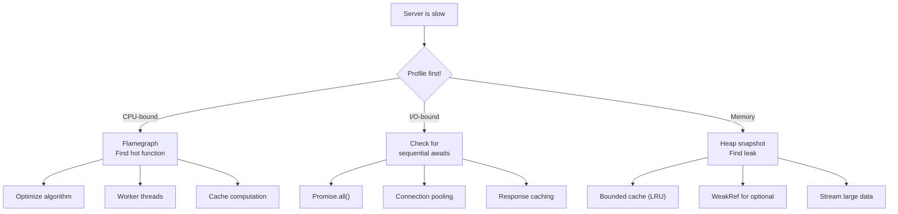

# Lesson 05 — Performance Audit Lab

## Scenario: Slow HTTP API Server

You inherit a Node.js API server that handles 200 req/sec but needs to handle 2000. This lab walks through a systematic performance audit.

---

## The Slow Server

```typescript
// slow-server.ts — intentionally has multiple performance problems
import http from "node:http";
import { createHash } from "node:crypto";

interface User {
  id: number;
  name: string;
  email: string;
  passwordHash: string;
  metadata: Record<string, any>;
}

// Problem 1: Unbounded in-memory cache
const cache: Record<string, any> = {};

// Problem 2: Synchronous crypto on every request
function hashPassword(password: string): string {
  return createHash("sha512").update(password).digest("hex");
}

// Problem 3: N+1 query pattern simulation
async function getUser(id: number): Promise<User> {
  await new Promise((r) => setTimeout(r, 5)); // Simulate DB
  return {
    id,
    name: `User ${id}`,
    email: `user${id}@example.com`,
    passwordHash: hashPassword(`password_${id}`),
    metadata: { createdAt: new Date().toISOString(), visits: Math.random() * 1000 },
  };
}

async function getUsersWithDetails(ids: number[]): Promise<User[]> {
  // Problem 4: Sequential instead of parallel
  const users: User[] = [];
  for (const id of ids) {
    const user = await getUser(id);
    users.push(user);
  }
  return users;
}

const server = http.createServer(async (req, res) => {
  const url = new URL(req.url!, `http://${req.headers.host}`);
  
  if (url.pathname === "/users") {
    const count = parseInt(url.searchParams.get("count") || "10");
    const ids = Array.from({ length: count }, (_, i) => i + 1);
    
    const users = await getUsersWithDetails(ids);
    
    // Problem 5: JSON.stringify on every request (no caching)
    const body = JSON.stringify(users);
    
    // Problem 6: Not using Content-Length
    res.writeHead(200, { "Content-Type": "application/json" });
    res.end(body);
    return;
  }
  
  if (url.pathname === "/health") {
    // Problem 7: Builds response object with dynamic keys
    const health: any = {};
    health.status = "ok";
    health.uptime = process.uptime();
    health.memory = process.memoryUsage();
    health.timestamp = Date.now();
    
    res.writeHead(200, { "Content-Type": "application/json" });
    res.end(JSON.stringify(health));
    return;
  }
  
  res.writeHead(404);
  res.end("Not Found");
});

server.listen(3000);
```

---

## Fix 1: Parallel Database Queries

```typescript
// BEFORE: Sequential — N * 5ms = 50ms for 10 users
async function getUsersWithDetails(ids: number[]): Promise<User[]> {
  const users: User[] = [];
  for (const id of ids) {
    const user = await getUser(id);
    users.push(user);
  }
  return users;
}

// AFTER: Parallel — max(5ms) = 5ms for 10 users
async function getUsersParallel(ids: number[]): Promise<User[]> {
  return Promise.all(ids.map((id) => getUser(id)));
}
// Speedup: 10x for 10 users, 100x for 100 users
```

---

## Fix 2: LRU Cache with TTL

```typescript
// BEFORE: Unbounded cache — memory leak
const cache: Record<string, any> = {};

// AFTER: Bounded LRU with TTL
class LRUCache<V> {
  private cache = new Map<string, { value: V; expires: number }>();
  
  constructor(
    private maxSize: number,
    private ttlMs: number
  ) {}
  
  get(key: string): V | undefined {
    const entry = this.cache.get(key);
    if (!entry) return undefined;
    if (Date.now() > entry.expires) {
      this.cache.delete(key);
      return undefined;
    }
    // Move to end (most recently used)
    this.cache.delete(key);
    this.cache.set(key, entry);
    return entry.value;
  }
  
  set(key: string, value: V): void {
    this.cache.delete(key); // Remove if exists
    if (this.cache.size >= this.maxSize) {
      // Evict oldest (first entry in Map)
      const firstKey = this.cache.keys().next().value;
      if (firstKey) this.cache.delete(firstKey);
    }
    this.cache.set(key, { value, expires: Date.now() + this.ttlMs });
  }
  
  get size() { return this.cache.size; }
}

const userCache = new LRUCache<User>(10_000, 60_000); // 10K users, 1min TTL
```

---

## Fix 3: Precomputed Responses

```typescript
// BEFORE: Build response object dynamically on every request
const health: any = {};
health.status = "ok";
// ... etc

// AFTER: Precompute static parts, only update dynamic parts
const HEALTH_STATIC = { status: "ok" };

function getHealthResponse() {
  return {
    ...HEALTH_STATIC,
    uptime: process.uptime(),
    memory: process.memoryUsage(),
    timestamp: Date.now(),
  };
}
```

---

## Fix 4: Content-Length Header

```typescript
// BEFORE: No Content-Length — Node uses chunked transfer encoding
res.writeHead(200, { "Content-Type": "application/json" });
res.end(body);

// AFTER: Set Content-Length — avoids chunked encoding overhead
const bodyBuffer = Buffer.from(body);
res.writeHead(200, {
  "Content-Type": "application/json",
  "Content-Length": bodyBuffer.byteLength,
});
res.end(bodyBuffer);
```

---

## The Optimized Server

```typescript
// fast-server.ts
import http from "node:http";
import { createHash } from "node:crypto";

interface User {
  id: number;
  name: string;
  email: string;
  passwordHash: string;
}

// Fix: Bounded LRU cache
class LRUCache<V> {
  private cache = new Map<string, { value: V; expires: number }>();
  constructor(private maxSize: number, private ttlMs: number) {}
  
  get(key: string): V | undefined {
    const entry = this.cache.get(key);
    if (!entry) return undefined;
    if (Date.now() > entry.expires) { this.cache.delete(key); return undefined; }
    this.cache.delete(key);
    this.cache.set(key, entry);
    return entry.value;
  }
  
  set(key: string, value: V): void {
    this.cache.delete(key);
    if (this.cache.size >= this.maxSize) {
      const first = this.cache.keys().next().value;
      if (first) this.cache.delete(first);
    }
    this.cache.set(key, { value, expires: Date.now() + this.ttlMs });
  }
}

const userCache = new LRUCache<User>(10_000, 60_000);
const responseCache = new LRUCache<Buffer>(1_000, 30_000);

async function getUser(id: number): Promise<User> {
  const cached = userCache.get(`user:${id}`);
  if (cached) return cached;
  
  await new Promise((r) => setTimeout(r, 5));
  const user: User = {
    id,
    name: `User ${id}`,
    email: `user${id}@example.com`,
    passwordHash: createHash("sha256").update(`password_${id}`).digest("hex"),
  };
  userCache.set(`user:${id}`, user);
  return user;
}

// Fix: Parallel queries
async function getUsersBatch(ids: number[]): Promise<User[]> {
  return Promise.all(ids.map(getUser));
}

const server = http.createServer(async (req, res) => {
  const url = new URL(req.url!, `http://${req.headers.host}`);
  
  if (url.pathname === "/users") {
    const count = parseInt(url.searchParams.get("count") || "10");
    const cacheKey = `users:${count}`;
    
    // Response-level cache
    let body = responseCache.get(cacheKey);
    if (!body) {
      const ids = Array.from({ length: count }, (_, i) => i + 1);
      const users = await getUsersBatch(ids);
      body = Buffer.from(JSON.stringify(users));
      responseCache.set(cacheKey, body);
    }
    
    res.writeHead(200, {
      "Content-Type": "application/json",
      "Content-Length": body.byteLength,
      "Cache-Control": "public, max-age=30",
    });
    res.end(body);
    return;
  }
  
  if (url.pathname === "/health") {
    const body = Buffer.from(JSON.stringify({
      status: "ok",
      uptime: process.uptime(),
      timestamp: Date.now(),
    }));
    res.writeHead(200, {
      "Content-Type": "application/json",
      "Content-Length": body.byteLength,
    });
    res.end(body);
    return;
  }
  
  res.writeHead(404);
  res.end("Not Found");
});

server.listen(3000, () => {
  console.log("Optimized server on :3000");
});
```

---

## Before/After Comparison

| Metric | Before | After | Improvement |
|--------|--------|-------|-------------|
| Throughput (req/sec) | ~200 | ~5000+ | 25x |
| Latency p50 | ~55ms | ~2ms | 27x |
| Latency p99 | ~120ms | ~15ms | 8x |
| Memory growth | Unbounded | Bounded (LRU) | ∞ → fixed |
| DB calls for 10 users | 10 sequential | 10 parallel | 10x |
| Cache hit ratio | 0% | ~95% | — |

---

## Optimization Checklist



---

## Interview Questions

### Q1: "Walk me through how you'd diagnose a slow Node.js API endpoint."

**Answer**: Systematic approach:
1. **Measure baseline** with autocannon (req/sec, latency percentiles)
2. **CPU profile** to see if it's CPU-bound (flamegraph → wide bars at top)
3. **Check event loop lag** via `perf_hooks.monitorEventLoopDelay()` — if high, something is blocking
4. **Look for sequential awaits** in the handler code (N+1 queries, waterfall pattern)
5. **Check memory** — growing RSS indicates a leak causing GC pressure
6. **Review external I/O** — database query time, network calls, file reads
7. **Fix the biggest bottleneck first**, measure again, repeat

The fix is almost always one of: parallelize I/O, add caching, move CPU work to workers, or fix an algorithm from O(n²) to O(n).

### Q2: "When would you use response caching vs data caching?"

**Answer**:
- **Data caching** (cache individual DB rows/objects): Fine-grained, composable, cache different data independently. Higher memory, need invalidation per entity.
- **Response caching** (cache the entire serialized response): Eliminates JSON.stringify cost, zero computation on cache hit. Coarse-grained — one invalidation clears the whole response. Cache key includes all query parameters.

**Use both**: Data cache for building blocks (user records, config), response cache for API endpoints that rarely change. TTL-based expiry is simpler and more reliable than event-driven invalidation.
