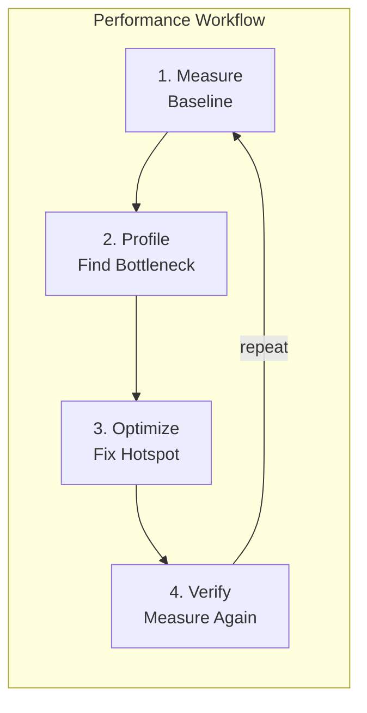

# Module 10 — Performance Engineering

## Overview

Performance isn't about guessing — it's about **measuring**. This module teaches you to profile, benchmark, and optimize Node.js applications using built-in tools and proven methodology.

## Lessons

| # | File | Topic | Key Concepts |
|---|------|-------|-------------|
| 1 | [01-benchmarking.md](01-benchmarking.md) | Microbenchmarks & Load Testing | Proper timing, autocannon, statistical validity |
| 2 | [02-cpu-profiling.md](02-cpu-profiling.md) | CPU Profiling & Flamegraphs | V8 profiler, --prof, Chrome DevTools, 0x |
| 3 | [03-optimization-patterns.md](03-optimization-patterns.md) | V8 Optimization Patterns | Monomorphism, deoptimization, hidden class stability |
| 4 | [04-async-performance.md](04-async-performance.md) | Async Performance Traps | Promise overhead, async_hooks cost, batch patterns |
| 5 | [05-performance-labs.md](05-performance-labs.md) | Performance Audit Lab | Full audit of a slow HTTP server |

## Key Principle

> Never optimize without a profile. Never profile without a baseline. Never claim improvement without a before/after comparison.
