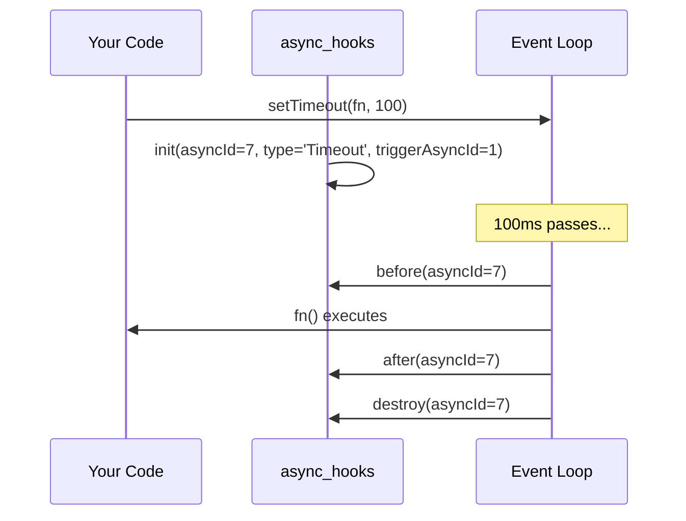
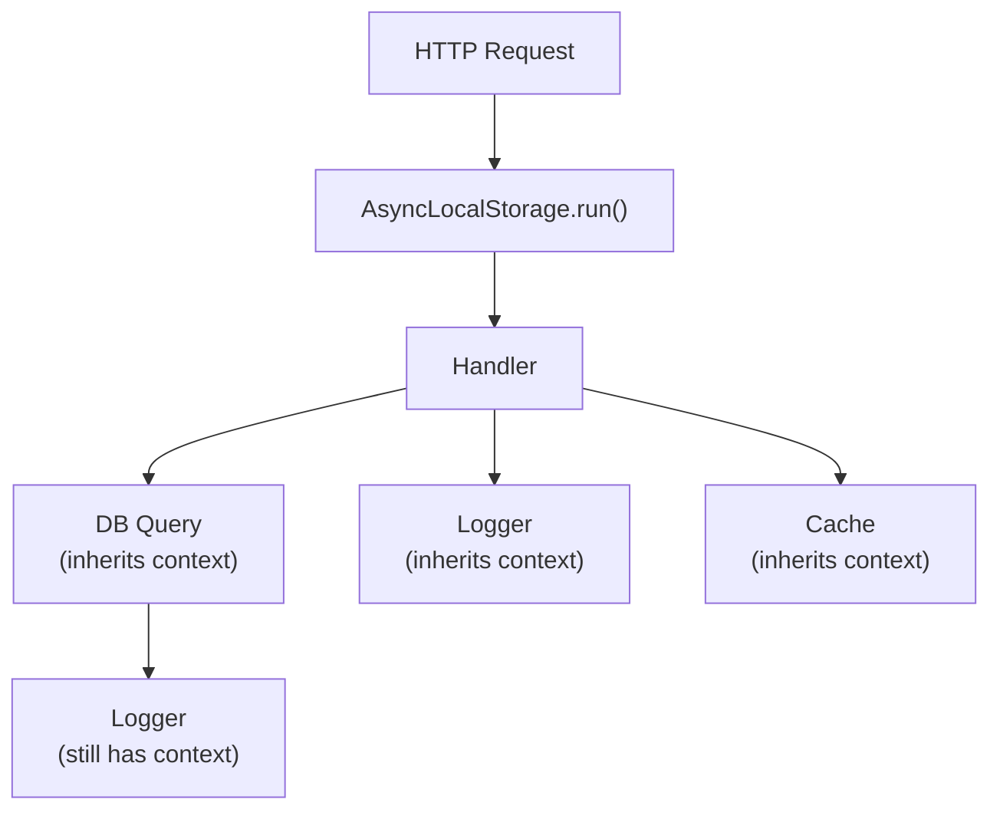

# Lesson 01 — async_hooks & AsyncLocalStorage

## What async_hooks Does

`async_hooks` tracks the lifecycle of every asynchronous operation in Node.js. Every `setTimeout`, `Promise`, `fs.readFile`, TCP connection, etc. gets a unique `asyncId` and triggers lifecycle callbacks.



---

## Low-Level async_hooks API

```typescript
// async-hooks-trace.ts
import { createHook, executionAsyncId, triggerAsyncId } from "node:async_hooks";
import { writeSync } from "node:fs";

// IMPORTANT: Cannot use console.log inside async_hooks callbacks
// (it triggers async operations → infinite recursion)
// Use fs.writeSync(1, ...) for stdout instead

const asyncResources = new Map<number, { type: string; trigger: number; created: number }>();

const hook = createHook({
  init(asyncId, type, triggerAsyncId) {
    asyncResources.set(asyncId, {
      type,
      trigger: triggerAsyncId,
      created: Date.now(),
    });
    writeSync(1, `INIT  asyncId=${asyncId} type=${type} trigger=${triggerAsyncId}\n`);
  },
  
  before(asyncId) {
    writeSync(1, `BEFORE asyncId=${asyncId}\n`);
  },
  
  after(asyncId) {
    writeSync(1, `AFTER  asyncId=${asyncId}\n`);
  },
  
  destroy(asyncId) {
    asyncResources.delete(asyncId);
    writeSync(1, `DESTROY asyncId=${asyncId}\n`);
  },
});

hook.enable();

// Trigger some async operations to observe
setTimeout(() => {
  writeSync(1, `\n--- Inside setTimeout ---\n`);
  writeSync(1, `Current asyncId: ${executionAsyncId()}\n`);
  writeSync(1, `Trigger asyncId: ${triggerAsyncId()}\n`);
}, 100);

Promise.resolve().then(() => {
  writeSync(1, `\n--- Inside Promise.then ---\n`);
  writeSync(1, `Current asyncId: ${executionAsyncId()}\n`);
});

setTimeout(() => {
  hook.disable();
  writeSync(1, `\nTracked ${asyncResources.size} still-active resources\n`);
}, 500);
```

> **Warning**: Low-level `async_hooks` has significant performance overhead (5-30%). Do not enable in production for all operations. Use `AsyncLocalStorage` instead.

---

## AsyncLocalStorage (Production-Ready)

`AsyncLocalStorage` is the high-level API built on top of `async_hooks`. It provides thread-local-like storage that automatically propagates through async operations.



```typescript
// async-local-storage.ts
import { AsyncLocalStorage } from "node:async_hooks";
import http from "node:http";
import { randomUUID } from "node:crypto";

// Define the request context type
interface RequestContext {
  requestId: string;
  userId?: string;
  startTime: number;
  path: string;
}

// Create a single global store
const requestContext = new AsyncLocalStorage<RequestContext>();

// Logger that automatically includes request context
function log(level: string, message: string, data?: any) {
  const ctx = requestContext.getStore();
  const entry = {
    timestamp: new Date().toISOString(),
    level,
    requestId: ctx?.requestId ?? "no-context",
    userId: ctx?.userId,
    path: ctx?.path,
    message,
    ...(data && { data }),
  };
  console.log(JSON.stringify(entry));
}

// Simulated database query — context propagates automatically
async function queryDatabase(sql: string): Promise<any[]> {
  const ctx = requestContext.getStore();
  log("debug", `Executing query: ${sql}`);
  
  // Simulate query delay
  await new Promise((r) => setTimeout(r, 10));
  
  const elapsed = Date.now() - (ctx?.startTime ?? Date.now());
  log("debug", `Query completed`, { sql, elapsed });
  
  return [{ id: 1, name: "Alice" }];
}

// Service function — no need to pass requestId, it's in AsyncLocalStorage
async function getUsers(): Promise<any[]> {
  log("info", "Fetching users from database");
  const users = await queryDatabase("SELECT * FROM users");
  log("info", `Found ${users.length} users`);
  return users;
}

const server = http.createServer((req, res) => {
  // Create context for this request
  const context: RequestContext = {
    requestId: randomUUID(),
    userId: req.headers["x-user-id"] as string,
    startTime: Date.now(),
    path: req.url!,
  };
  
  // All async operations within this callback inherit the context
  requestContext.run(context, async () => {
    try {
      log("info", "Request started");
      
      const users = await getUsers();
      
      const elapsed = Date.now() - context.startTime;
      log("info", "Request completed", { elapsed });
      
      res.writeHead(200, { 
        "Content-Type": "application/json",
        "X-Request-Id": context.requestId,
      });
      res.end(JSON.stringify({ users, requestId: context.requestId }));
      
    } catch (err: any) {
      log("error", "Request failed", { error: err.message });
      res.writeHead(500);
      res.end("Internal Server Error");
    }
  });
});

server.listen(3000);
```

---

## AsyncLocalStorage Patterns

### Transaction Context

```typescript
// transaction-context.ts
import { AsyncLocalStorage } from "node:async_hooks";

interface Transaction {
  id: string;
  queries: string[];
  startTime: number;
}

const txStore = new AsyncLocalStorage<Transaction>();

async function withTransaction<T>(fn: () => Promise<T>): Promise<T> {
  const tx: Transaction = {
    id: randomUUID(),
    queries: [],
    startTime: Date.now(),
  };
  
  return txStore.run(tx, async () => {
    try {
      await query("BEGIN");
      const result = await fn();
      await query("COMMIT");
      
      console.log(`Transaction ${tx.id}: ${tx.queries.length} queries in ${Date.now() - tx.startTime}ms`);
      return result;
    } catch (err) {
      await query("ROLLBACK");
      throw err;
    }
  });
}

async function query(sql: string): Promise<any> {
  const tx = txStore.getStore();
  if (tx) tx.queries.push(sql);
  // ... execute with transaction connection
}

// Usage — all queries inside share the same transaction
import { randomUUID } from "node:crypto";

await withTransaction(async () => {
  await query("INSERT INTO orders ...");
  await query("UPDATE inventory ...");
  await query("INSERT INTO audit_log ..."); // All in same tx
});
```

---

## Performance Impact

```typescript
// als-benchmark.ts
import { AsyncLocalStorage } from "node:async_hooks";

const store = new AsyncLocalStorage<{ id: number }>();

// Measure ALS overhead
const ITERATIONS = 1_000_000;

// Without ALS
console.time("without ALS");
for (let i = 0; i < ITERATIONS; i++) {
  Math.sqrt(i);
}
console.timeEnd("without ALS");

// With ALS
console.time("with ALS");
store.run({ id: 1 }, () => {
  for (let i = 0; i < ITERATIONS; i++) {
    store.getStore(); // Access context
    Math.sqrt(i);
  }
});
console.timeEnd("with ALS");

// ALS overhead is ~5-15% for getStore() calls
// Much lower than raw async_hooks (~5-30%)
```

---

## Interview Questions

### Q1: "What is AsyncLocalStorage and when would you use it?"

**Answer**: `AsyncLocalStorage` provides per-request context that automatically propagates through `await`, callbacks, and event emitters without passing it as a function argument. It's Node.js's equivalent to Java's ThreadLocal or Go's `context.Context`.

**Use cases**:
1. Request ID propagation for logging (every log line includes the request ID without passing it)
2. Transaction context (all DB queries in a request share one connection/transaction)
3. User identity propagation for authorization checks deep in the call stack
4. Distributed tracing (propagating trace/span IDs)

**How it works**: Built on `async_hooks`. When you call `store.run(value, fn)`, every async operation initiated within `fn` inherits the context. `store.getStore()` retrieves it from anywhere in the async chain.

### Q2: "Why can't you use console.log inside async_hooks callbacks?"

**Answer**: `console.log` itself triggers async operations (it writes to stdout, which may involve `fs.write` or `socket.write`). Inside an `async_hooks` callback, this would trigger the `init` callback again, causing infinite recursion. Use `fs.writeSync(1, msg)` for synchronous stdout writes inside hooks.

### Q3: "What's the performance overhead of AsyncLocalStorage?"

**Answer**: `AsyncLocalStorage.getStore()` costs ~10-50 nanoseconds per call — negligible for typical request processing (which takes milliseconds). The overhead comes from:
1. Context propagation when creating new async resources (~100ns per async operation)
2. `store.run()` setup/teardown

Total overhead: 5-15% on microbenchmarks, < 1% in real request handlers where I/O dominates. The tradeoff is excellent — eliminates "context drilling" (passing requestId through 10 function parameters) with minimal cost.
