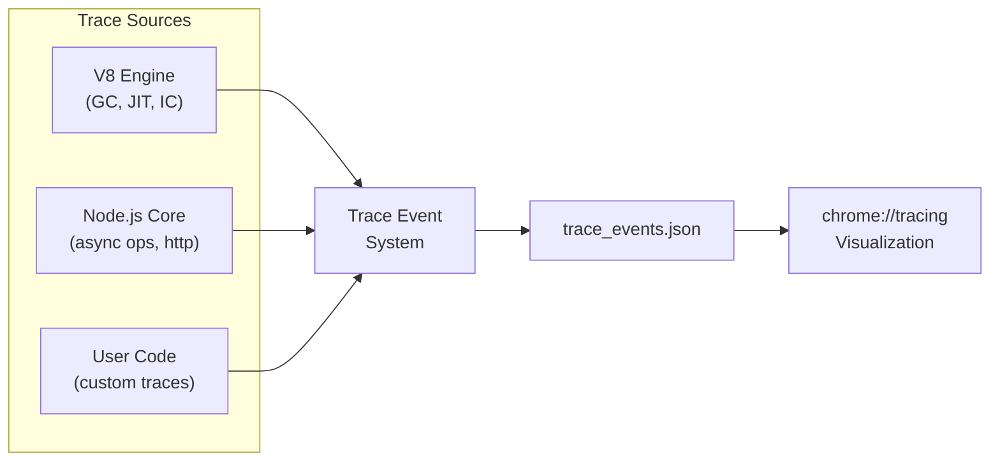

# Lesson 02 — Trace Events

## What Are Trace Events?

Trace events provide a low-overhead way to record timing information from V8, Node.js internals, and your own code. The output is compatible with Chrome's `chrome://tracing` viewer.



---

## Built-in Trace Categories

```bash
# Record V8 and Node.js internals
node --trace-event-categories v8,node,node.async_hooks \
  --experimental-strip-types server.ts

# Categories available:
# v8                 — V8 engine events (GC, compilation)
# v8.execute         — Script execution
# v8.wasm            — WebAssembly compilation
# node               — Node.js core events
# node.async_hooks   — Async operation lifecycle
# node.fs.sync       — Synchronous filesystem calls
# node.perf          — Performance timing
# node.perf.usertiming — performance.mark/measure
# node.perf.timerify — timerify'd functions
```

---

## Programmatic Trace Events

```typescript
// custom-traces.ts
import { createTracing } from "node:trace_events";
import { performance, PerformanceObserver } from "node:perf_hooks";

// Create a custom trace category
const tracing = createTracing({ categories: ["node.perf.usertiming", "my-app"] });
tracing.enable();

// User timing marks become trace events
performance.mark("startup-begin");

// Simulate application work
async function processRequest(id: number) {
  performance.mark(`request-${id}-start`);
  
  // Database query
  performance.mark(`db-query-${id}-start`);
  await new Promise((r) => setTimeout(r, 10));
  performance.mark(`db-query-${id}-end`);
  performance.measure(`DB Query ${id}`, `db-query-${id}-start`, `db-query-${id}-end`);
  
  // Business logic
  performance.mark(`logic-${id}-start`);
  let sum = 0;
  for (let i = 0; i < 1e6; i++) sum += i;
  performance.mark(`logic-${id}-end`);
  performance.measure(`Business Logic ${id}`, `logic-${id}-start`, `logic-${id}-end`);
  
  // Serialization
  performance.mark(`serialize-${id}-start`);
  JSON.stringify({ id, sum });
  performance.mark(`serialize-${id}-end`);
  performance.measure(`Serialization ${id}`, `serialize-${id}-start`, `serialize-${id}-end`);
  
  performance.mark(`request-${id}-end`);
  performance.measure(`Request ${id}`, `request-${id}-start`, `request-${id}-end`);
}

// Process several requests
for (let i = 0; i < 5; i++) {
  await processRequest(i);
}

performance.mark("startup-end");
performance.measure("Total Startup", "startup-begin", "startup-end");

// Collect measurements
const observer = new PerformanceObserver((list) => {
  for (const entry of list.getEntries()) {
    console.log(`${entry.name}: ${entry.duration.toFixed(2)}ms`);
  }
});
observer.observe({ entryTypes: ["measure"], buffered: true });

// Disable tracing and save
setTimeout(() => {
  tracing.disable();
  console.log("\nTrace saved — open in chrome://tracing");
}, 100);
```

Open `chrome://tracing` → Load → select the generated trace file.

---

## Detecting Sync FS Calls in Production

```bash
# Record ONLY synchronous fs calls — find blocking operations
node --trace-event-categories node.fs.sync \
  --experimental-strip-types server.ts
```

```typescript
// detect-sync-fs.ts
// This file has a hidden sync FS call that blocks the event loop

import http from "node:http";
import { readFileSync, readFile } from "node:fs";

const server = http.createServer((req, res) => {
  if (req.url === "/config") {
    // BUG: synchronous FS read on every request!
    // Trace events will highlight this
    const config = readFileSync("/etc/hostname", "utf8");
    res.end(config);
    return;
  }
  
  // GOOD: async FS read
  if (req.url === "/data") {
    readFile("/etc/hostname", "utf8", (err, data) => {
      if (err) { res.writeHead(500); res.end(); return; }
      res.end(data);
    });
    return;
  }
  
  res.writeHead(404);
  res.end();
});

server.listen(3000);
```

---

## GC Trace Analysis

```typescript
// gc-trace.ts
import { PerformanceObserver } from "node:perf_hooks";

// Observe GC events
const gcObserver = new PerformanceObserver((list) => {
  for (const entry of list.getEntries()) {
    const gcEntry = entry as any;
    
    // GC types: 
    // 1 = Scavenger (minor GC, young generation)
    // 2 = Mark-Sweep-Compact (major GC, old generation)  
    // 4 = Incremental marking
    // 8 = Weak phantom processing
    // 15 = All types
    
    const gcType = gcEntry.detail?.kind ?? "unknown";
    const gcNames: Record<number, string> = {
      1: "Scavenger",
      2: "Mark-Sweep-Compact",
      4: "Incremental",
      8: "Weak Processing",
      15: "All",
    };
    
    console.log(
      `GC: ${gcNames[gcType] ?? gcType} — ${entry.duration.toFixed(2)}ms` +
      (entry.duration > 10 ? " ⚠️ LONG PAUSE" : "")
    );
  }
});

gcObserver.observe({ entryTypes: ["gc"] });

// Generate GC pressure to observe
const arrays: any[] = [];
for (let i = 0; i < 100; i++) {
  arrays.push(new Array(100_000).fill({ data: `item_${i}` }));
  
  // Periodically release to trigger collections
  if (i % 20 === 0) {
    arrays.length = 0;
  }
}

setTimeout(() => {
  gcObserver.disconnect();
  console.log("GC observation complete");
}, 5000);
```

---

## Interview Questions

### Q1: "How would you find synchronous blocking calls in a production Node.js app?"

**Answer**: Use `--trace-event-categories node.fs.sync` to record all synchronous filesystem operations. The trace file shows exactly which function called `readFileSync`, `writeFileSync`, etc., with timestamps and duration. Open in `chrome://tracing` to see them on a timeline. For non-FS blocking (CPU-bound loops), use `monitorEventLoopDelay()` to detect event loop stalls, then correlate with CPU profiles to find the blocking code.

### Q2: "How do trace events differ from console.log debugging?"

**Answer**:
- **Overhead**: Trace events use a high-performance binary buffer. `console.log` serializes to JSON/string and writes to stdout — 100-1000x more overhead.
- **Structure**: Trace events have categories, timestamps, durations, and phases (B/E for begin/end). Console logs are unstructured text.
- **Analysis**: Trace events can be visualized as a timeline in `chrome://tracing`, showing concurrent operations, GC pauses, and I/O. Console logs are sequential text.
- **Categories**: You can selectively enable trace categories without code changes. Console logs require code modification.

### Q3: "When would you use performance.mark/measure vs console.time?"

**Answer**: 
- `performance.mark/measure`: Integrates with trace events (visible in `chrome://tracing`), works with `PerformanceObserver` for programmatic collection, supports custom properties, and entries persist in the performance timeline buffer.
- `console.time/timeEnd`: Quick debugging only. Output goes to stdout as text. Cannot be observed programmatically. Cannot be correlated with other trace events.

Use `performance.mark/measure` for production instrumentation and `console.time` for throwaway debugging.
