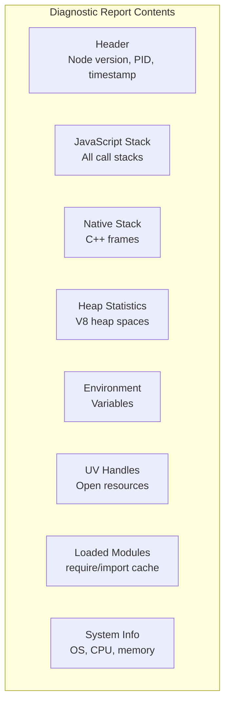

# Lesson 03 — Diagnostic Reports

## What Are Diagnostic Reports?

A diagnostic report is a JSON snapshot of a Node.js process: stack traces, heap stats, environment variables, loaded modules, system info, UV handles, and more. Think of it as a core dump but human-readable and runtime-safe.



---

## Generating Reports

```bash
# Method 1: CLI flag — generate on uncaught exception
node --report-uncaught-exception --experimental-strip-types server.ts

# Method 2: CLI flag — generate on fatal error (OOM)
node --report-on-fatalerror --experimental-strip-types server.ts

# Method 3: CLI flag — generate on signal
node --report-on-signal --report-signal=SIGUSR2 --experimental-strip-types server.ts
# Then: kill -SIGUSR2 <pid>

# Method 4: Combine all triggers
node --report-uncaught-exception \
     --report-on-fatalerror \
     --report-on-signal \
     --report-directory=/var/log/node-reports \
     --experimental-strip-types server.ts
```

```typescript
// programmatic-report.ts
import { report } from "node:process";
import { writeFileSync } from "node:fs";

// configure Report settings
report.reportOnFatalError = true;
report.reportOnUncaughtException = true;
report.reportOnSignal = true;
report.signal = "SIGUSR2";
report.directory = "/tmp/node-reports";

// Generate a report manually
const reportFile = report.writeReport();
console.log(`Report written to: ${reportFile}`);

// Get report as JSON string (doesn't write to file)
const reportJson = report.getReport() as any;
console.log("Node.js version:", reportJson.header.nodejsVersion);
console.log("Active handles:", reportJson.libuv?.length ?? 0);
console.log("Heap used:", Math.round(reportJson.javascriptHeap.usedHeap / 1024 / 1024), "MB");
```

---

## Reading a Diagnostic Report

```typescript
// analyze-report.ts
import { readFileSync } from "node:fs";

function analyzeReport(reportPath: string) {
  const report = JSON.parse(readFileSync(reportPath, "utf8"));
  
  console.log("=== Report Analysis ===\n");
  
  // 1. Header — what happened?
  const h = report.header;
  console.log(`Event: ${h.event}`);
  console.log(`Trigger: ${h.trigger}`);
  console.log(`PID: ${h.processId}`);
  console.log(`Uptime: ${h.dumpEventTimeStamp}`);
  console.log(`Node: ${h.nodejsVersion}`);
  
  // 2. JavaScript stack — where did it crash?
  console.log("\n--- JavaScript Stack ---");
  if (report.javascriptStack?.stack) {
    for (const frame of report.javascriptStack.stack.split("\n").slice(0, 10)) {
      console.log(`  ${frame}`);
    }
  }
  
  // 3. Heap statistics — was it OOM?
  const heap = report.javascriptHeap;
  console.log("\n--- Heap ---");
  console.log(`  Total: ${Math.round(heap.totalHeap / 1024 / 1024)} MB`);
  console.log(`  Used:  ${Math.round(heap.usedHeap / 1024 / 1024)} MB`);
  console.log(`  Limit: ${Math.round(heap.heapSizeLimit / 1024 / 1024)} MB`);
  const usagePct = ((heap.usedHeap / heap.heapSizeLimit) * 100).toFixed(1);
  console.log(`  Usage: ${usagePct}%`);
  if (parseFloat(usagePct) > 90) console.log("  ⚠️  NEAR OOM!");
  
  // 4. UV Handles — what resources are open?
  console.log("\n--- Open Handles ---");
  const handleTypes = new Map<string, number>();
  for (const handle of report.libuv || []) {
    const count = handleTypes.get(handle.type) || 0;
    handleTypes.set(handle.type, count + 1);
  }
  for (const [type, count] of handleTypes) {
    console.log(`  ${type}: ${count}`);
  }
  
  // 5. Resource usage
  if (report.resourceUsage) {
    console.log("\n--- Resource Usage ---");
    console.log(`  Max RSS: ${Math.round(report.resourceUsage.maxRss / 1024)} MB`);
    console.log(`  User CPU: ${report.resourceUsage.userCpuSeconds}s`);
    console.log(`  System CPU: ${report.resourceUsage.kernelCpuSeconds}s`);
  }
}

// Usage: node analyze-report.ts report.20240101.120000.12345.json
const reportFile = process.argv[2];
if (reportFile) {
  analyzeReport(reportFile);
} else {
  console.log("Usage: node analyze-report.ts <report-file.json>");
}
```

---

## Automated Report Triggers

```typescript
// auto-diagnostic.ts
import http from "node:http";
import { report } from "node:process";

// Enable all automatic triggers
report.reportOnFatalError = true;
report.reportOnUncaughtException = true;
report.directory = "/tmp/node-reports";

// Monitor for conditions that warrant a report
const HEAP_THRESHOLD = 0.85; // 85% of limit

setInterval(() => {
  const heap = process.memoryUsage();
  const v8Heap = require("node:v8").getHeapStatistics();
  const usageRatio = v8Heap.used_heap_size / v8Heap.heap_size_limit;
  
  if (usageRatio > HEAP_THRESHOLD) {
    console.error(`⚠️ Heap usage ${(usageRatio * 100).toFixed(1)}% — generating report`);
    const file = report.writeReport();
    console.error(`Report: ${file}`);
    
    // Optionally: trigger graceful shutdown before OOM
    if (usageRatio > 0.95) {
      console.error("CRITICAL: Near OOM, shutting down");
      process.exit(1);
    }
  }
}, 10_000);

// HTTP endpoint for on-demand reports
const server = http.createServer((req, res) => {
  if (req.url === "/_debug/report" && req.method === "POST") {
    const file = report.writeReport();
    res.writeHead(200);
    res.end(JSON.stringify({ report: file }));
    return;
  }
  
  if (req.url === "/_debug/report" && req.method === "GET") {
    const data = report.getReport() as any;
    res.writeHead(200, { "Content-Type": "application/json" });
    res.end(JSON.stringify({
      uptime: data.header.dumpEventTimeStamp,
      heap: {
        used: Math.round(data.javascriptHeap.usedHeap / 1024 / 1024),
        total: Math.round(data.javascriptHeap.totalHeap / 1024 / 1024),
        limit: Math.round(data.javascriptHeap.heapSizeLimit / 1024 / 1024),
      },
      handles: (data.libuv || []).length,
      activeRequests: data.header.activeRequests,
      activeHandles: data.header.activeHandles,
    }));
    return;
  }
  
  // Simulate memory leak for testing
  if (req.url === "/_debug/leak") {
    const leak: any[] = [];
    for (let i = 0; i < 100_000; i++) leak.push({ data: "x".repeat(1000) });
    res.writeHead(200);
    res.end(`Leaked ${leak.length} objects\n`);
    // leak is retained in closure scope if referenced
    return;
  }
  
  res.writeHead(200);
  res.end("ok");
});

server.listen(3000);
```

---

## Interview Questions

### Q1: "Your Node.js process crashed in production with no logs. How do you investigate?"

**Answer**: Enable `--report-on-fatalerror` and `--report-uncaught-exception` flags. After the crash, the diagnostic report JSON file contains:
1. **JavaScript stack trace** — exactly where the crash happened
2. **Native stack** — C++ frames for native crashes (V8 bugs, native addons)
3. **Heap statistics** — was it OOM? (compare `usedHeap` to `heapSizeLimit`)
4. **Open handles** — was there a resource leak? (thousands of TCP sockets?)
5. **Environment variables** — was a config wrong?

For future crashes: always run with `--report-on-fatalerror --report-directory=/var/log/node-reports` in production. The overhead is zero until a crash occurs.

### Q2: "What information does a Node.js diagnostic report contain?"

**Answer**: A structured JSON document with:
- **Header**: Event type (exception, signal, OOM), PID, Node.js version, command line, uptime
- **JavaScript stack**: Full call stack including file, line, column
- **Native stack**: C++ frames from V8 and Node.js internals
- **Heap statistics**: Used/total/limit for each V8 heap space
- **libuv handles**: Every open handle (TCP, Timer, FS watcher, etc.) with state
- **Environment variables**: Full env (be careful with secrets)
- **Loaded modules**: All `require()`/`import()` cached modules
- **System info**: OS, CPU, network interfaces, memory
- **Resource usage**: User/kernel CPU time, max RSS, page faults

### Q3: "How do you detect a resource leak from a diagnostic report?"

**Answer**: Look at the `libuv` section. Count handles by type:
- Hundreds of `TCP` handles → connection leak (not closing sockets)
- Many `Timer` handles → interval/timeout leak (not clearing timers)
- Growing `FSEvent` handles → file watcher leak

Compare reports taken at different times. If handle count grows linearly with time, that type is leaking. Cross-reference with the JavaScript stack to find the code creating handles without cleanup.
