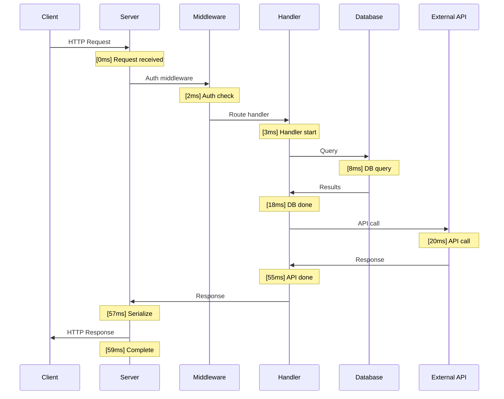

# Lesson 04 — Request Lifecycle Tracing

## Building an End-to-End Request Tracer

In production, you need to answer: "Why was this request slow?" A request tracer records timing for every phase of request processing.



---

## Implementation

```typescript
// request-tracer.ts
import { AsyncLocalStorage } from "node:async_hooks";
import http from "node:http";
import { randomUUID } from "node:crypto";

interface Span {
  name: string;
  startTime: number;
  endTime?: number;
  duration?: number;
  metadata?: Record<string, any>;
  children: Span[];
}

interface TraceContext {
  traceId: string;
  rootSpan: Span;
  currentSpan: Span;
  startTime: number;
}

const traceStore = new AsyncLocalStorage<TraceContext>();

// Start a new trace (called once per request)
function startTrace(name: string): TraceContext {
  const span: Span = {
    name,
    startTime: performance.now(),
    children: [],
  };
  
  return {
    traceId: randomUUID(),
    rootSpan: span,
    currentSpan: span,
    startTime: performance.now(),
  };
}

// Create a child span within the current trace
function startSpan(name: string, metadata?: Record<string, any>): () => void {
  const ctx = traceStore.getStore();
  if (!ctx) return () => {}; // No trace active
  
  const span: Span = {
    name,
    startTime: performance.now(),
    metadata,
    children: [],
  };
  
  ctx.currentSpan.children.push(span);
  const parentSpan = ctx.currentSpan;
  ctx.currentSpan = span;
  
  // Return end function
  return () => {
    span.endTime = performance.now();
    span.duration = span.endTime - span.startTime;
    ctx.currentSpan = parentSpan;
  };
}

// Wrap an async function with automatic span tracking
function traced<T>(name: string, fn: () => Promise<T>, metadata?: Record<string, any>): Promise<T> {
  const endSpan = startSpan(name, metadata);
  return fn().then(
    (result) => { endSpan(); return result; },
    (error) => { endSpan(); throw error; }
  );
}

// Format trace as a tree
function formatTrace(span: Span, depth = 0): string {
  const indent = "  ".repeat(depth);
  const duration = span.duration?.toFixed(2) ?? "running";
  const meta = span.metadata ? ` ${JSON.stringify(span.metadata)}` : "";
  let output = `${indent}${span.name}: ${duration}ms${meta}\n`;
  
  for (const child of span.children) {
    output += formatTrace(child, depth + 1);
  }
  return output;
}

// --- Simulated Application Layers ---

async function authenticateUser(token: string): Promise<{ userId: string }> {
  return traced("auth.verify", async () => {
    await new Promise((r) => setTimeout(r, 5));
    return { userId: "user_123" };
  }, { tokenLength: token.length });
}

async function queryDatabase(sql: string): Promise<any[]> {
  return traced("db.query", async () => {
    await new Promise((r) => setTimeout(r, 15));
    return [{ id: 1, name: "Alice" }, { id: 2, name: "Bob" }];
  }, { sql });
}

async function callExternalApi(url: string): Promise<any> {
  return traced("http.external", async () => {
    await new Promise((r) => setTimeout(r, 50));
    return { status: "ok" };
  }, { url });
}

async function serializeResponse(data: any): Promise<string> {
  return traced("serialize.json", async () => {
    return JSON.stringify(data);
  });
}

// --- HTTP Server with Tracing ---

const server = http.createServer((req, res) => {
  const trace = startTrace(`${req.method} ${req.url}`);
  
  traceStore.run(trace, async () => {
    try {
      // Auth
      const { userId } = await authenticateUser(
        req.headers.authorization || "none"
      );
      
      // Business logic
      const data = await traced("handler.getUsers", async () => {
        const users = await queryDatabase("SELECT * FROM users");
        const enrichment = await callExternalApi("https://api.example.com/enrich");
        return { users, enrichment };
      });
      
      // Serialize
      const body = await serializeResponse(data);
      
      // Complete the root span
      trace.rootSpan.endTime = performance.now();
      trace.rootSpan.duration = trace.rootSpan.endTime - trace.rootSpan.startTime;
      
      // Log the trace
      console.log(`\n=== Trace ${trace.traceId} ===`);
      console.log(formatTrace(trace.rootSpan));
      
      // Include trace ID in response
      res.writeHead(200, {
        "Content-Type": "application/json",
        "X-Trace-Id": trace.traceId,
        "Server-Timing": buildServerTiming(trace.rootSpan),
      });
      res.end(body);
      
    } catch (err: any) {
      trace.rootSpan.endTime = performance.now();
      trace.rootSpan.duration = trace.rootSpan.endTime - trace.rootSpan.startTime;
      
      console.error(`Trace ${trace.traceId} failed:`, err.message);
      console.log(formatTrace(trace.rootSpan));
      
      res.writeHead(500);
      res.end(JSON.stringify({ error: err.message, traceId: trace.traceId }));
    }
  });
});

// Server-Timing header — visible in browser DevTools Network tab
function buildServerTiming(span: Span): string {
  const timings: string[] = [];
  
  function collect(s: Span, prefix = "") {
    const name = prefix ? `${prefix}.${s.name}` : s.name;
    if (s.duration !== undefined) {
      timings.push(`${name.replace(/[^a-zA-Z0-9._-]/g, "_")};dur=${s.duration.toFixed(1)}`);
    }
    for (const child of s.children) {
      collect(child, name);
    }
  }
  
  collect(span);
  return timings.join(", ");
}

server.listen(3000, () => {
  console.log("Traced server on :3000");
});
```

**Output**:
```
=== Trace a1b2c3d4-... ===
GET /users: 72.35ms
  auth.verify: 5.12ms {"tokenLength":4}
  handler.getUsers: 65.83ms
    db.query: 15.21ms {"sql":"SELECT * FROM users"}
    http.external: 50.44ms {"url":"https://api.example.com/enrich"}
  serialize.json: 0.18ms
```

---

## Slow Request Detection

```typescript
// slow-request-detector.ts
import { AsyncLocalStorage } from "node:async_hooks";

interface RequestTiming {
  requestId: string;
  startTime: number;
  phases: { name: string; duration: number }[];
}

const timingStore = new AsyncLocalStorage<RequestTiming>();

const SLOW_THRESHOLD_MS = 100;

function detectSlowPhases(timing: RequestTiming) {
  const totalDuration = Date.now() - timing.startTime;
  
  if (totalDuration > SLOW_THRESHOLD_MS) {
    console.warn(`⚠️ Slow request ${timing.requestId} (${totalDuration}ms):`);
    
    // Sort phases by duration (slowest first)
    const sorted = [...timing.phases].sort((a, b) => b.duration - a.duration);
    
    for (const phase of sorted) {
      const pct = ((phase.duration / totalDuration) * 100).toFixed(0);
      const bar = "█".repeat(Math.round(phase.duration / totalDuration * 20));
      console.warn(`  ${bar} ${phase.name}: ${phase.duration.toFixed(1)}ms (${pct}%)`);
    }
  }
}

async function trackPhase<T>(name: string, fn: () => Promise<T>): Promise<T> {
  const timing = timingStore.getStore();
  const start = performance.now();
  
  try {
    return await fn();
  } finally {
    const duration = performance.now() - start;
    timing?.phases.push({ name, duration });
  }
}

// Usage in request handler
import http from "node:http";
import { randomUUID } from "node:crypto";

http.createServer((req, res) => {
  const timing: RequestTiming = {
    requestId: randomUUID(),
    startTime: Date.now(),
    phases: [],
  };
  
  timingStore.run(timing, async () => {
    await trackPhase("auth", async () => {
      await new Promise((r) => setTimeout(r, 3));
    });
    
    await trackPhase("db-query", async () => {
      await new Promise((r) => setTimeout(r, 80)); // Slow!
    });
    
    await trackPhase("serialize", async () => {
      JSON.stringify({ data: "response" });
    });
    
    detectSlowPhases(timing);
    
    res.writeHead(200);
    res.end("ok");
  });
}).listen(3000);
```

---

## Interview Questions

### Q1: "How would you implement distributed tracing in Node.js?"

**Answer**: 
1. Use `AsyncLocalStorage` to propagate trace context (traceId, spanId, parentSpanId) through all async operations within a request
2. On incoming requests, extract trace headers (`traceparent` from W3C Trace Context, or `x-trace-id` custom header)
3. On outgoing HTTP calls, inject the trace headers so downstream services continue the trace
4. Each service emits spans to a collector (Jaeger, Zipkin, or OpenTelemetry)
5. The `Server-Timing` HTTP header exposes timing to the browser

The key insight is that `AsyncLocalStorage` eliminates the need to pass traceId through every function parameter — it's available anywhere via `getStore()`.

### Q2: "What is the Server-Timing header and why is it useful?"

**Answer**: `Server-Timing` is a standard HTTP response header that exposes backend timing metrics to the browser. Format: `name;dur=duration;desc="description"`. Example:

```
Server-Timing: db;dur=15.2, auth;dur=5.1, render;dur=0.8
```

Browsers show this in DevTools → Network → Timing tab. Useful for:
- Frontend developers can see which backend phase is slow without backend access
- Monitoring tools can parse it for dashboards
- No sensitive data leakage (you control what to expose)

### Q3: "How do you find the slowest part of a request without profiling?"

**Answer**: Instrument each phase of request processing with `performance.now()` timing:
1. Wrap each phase (auth, DB query, external API call, serialization) in a timing decorator
2. Store timings in `AsyncLocalStorage` so they accumulate automatically
3. On response completion, check total duration against a threshold
4. If slow, log each phase sorted by duration with percentage of total time

This has near-zero overhead (a few `performance.now()` calls) and runs on every request in production. Unlike CPU profiling, it doesn't slow down the application. It tells you **what** is slow; use profiling to understand **why** it's slow.
