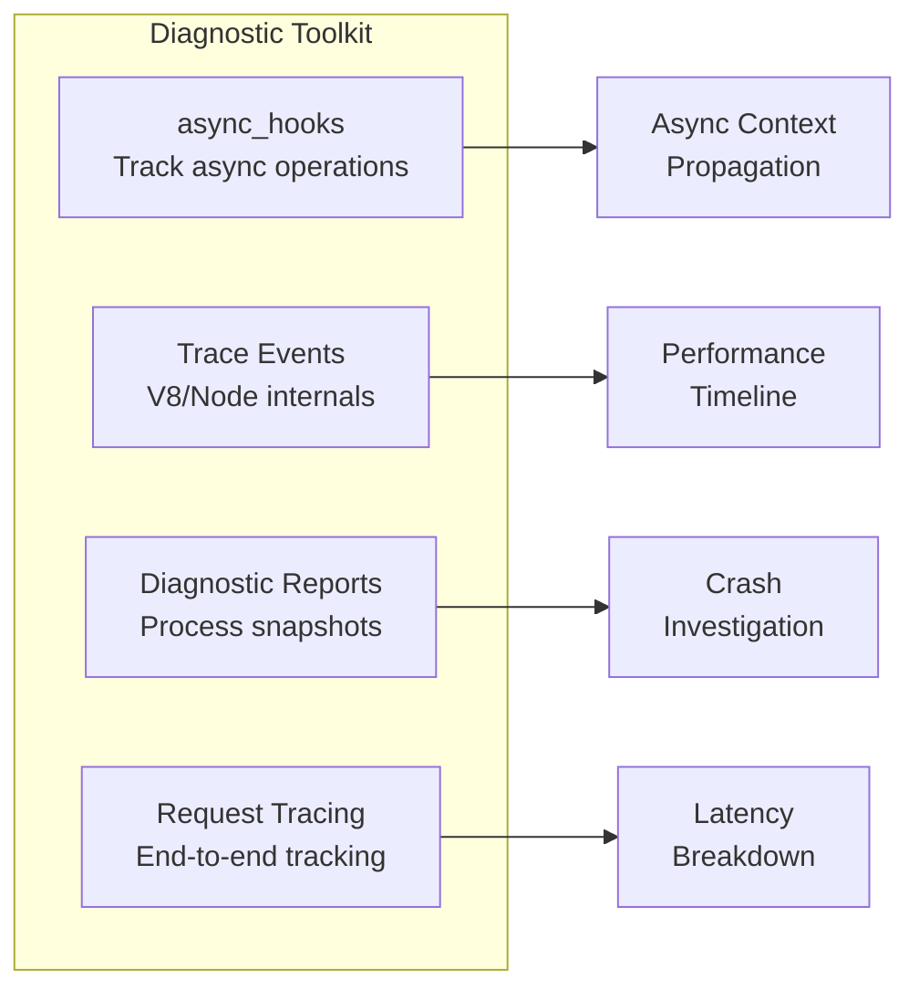

# Module 11 — Advanced Diagnostics

## Overview

When things go wrong in production, you need to diagnose issues without restarting the process. This module covers Node.js's built-in diagnostic tools — async_hooks, trace events, diagnostic reports, and request tracing.

## Lessons

| # | File | Topic | Key Concepts |
|---|------|-------|-------------|
| 1 | [01-async-hooks.md](01-async-hooks.md) | async_hooks & AsyncLocalStorage | Tracking async operations, context propagation |
| 2 | [02-trace-events.md](02-trace-events.md) | Trace Events | V8 traces, custom categories, chrome://tracing |
| 3 | [03-diagnostic-reports.md](03-diagnostic-reports.md) | Diagnostic Reports | Process snapshots, crash dumps, automated triggers |
| 4 | [04-request-tracing.md](04-request-tracing.md) | Request Lifecycle Tracing | Building an end-to-end request tracer |
