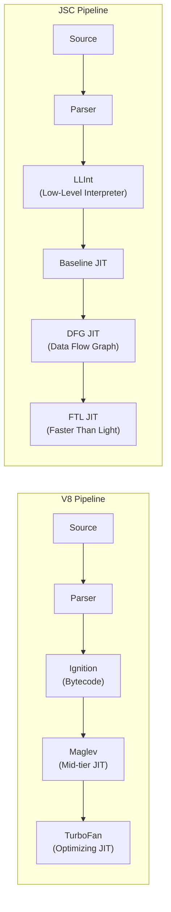

# Lesson 01 — Bun Architecture

## Architectural Overview

| Component | Node.js | Bun |
|-----------|---------|-----|
| JS Engine | V8 (Google) | JavaScriptCore (Apple/WebKit) |
| Language | C++ | Zig + C++ |
| Event Loop | libuv | Custom (io_uring on Linux) |
| Package Manager | npm | bun install (built-in) |
| Bundler | None (external) | Built-in (Bun.build) |
| Test Runner | node --test | bun test (built-in, Jest-compatible) |
| TypeScript | Strip types (Node 22+) | Native execution (since day 1) |
| HTTP Server | http module | Bun.serve() |
| File I/O | fs module | Bun.file() |
| SQLite | None (third-party) | bun:sqlite (built-in) |

---

## JavaScriptCore vs V8



### Key Differences

| Aspect | V8 | JavaScriptCore |
|--------|-----|----------------|
| JIT Tiers | 3 (Ignition → Maglev → TurboFan) | 4 (LLInt → Baseline → DFG → FTL) |
| Startup | Slower (heavier compilation) | Faster (lighter interpreter) |
| Peak Performance | Slightly faster long-running | Competitive, sometimes faster |
| GC Strategy | Generational (Scavenger + Mark-Sweep-Compact) | Generational (Eden/Nursery + Full GC) |
| Memory | Higher baseline (~30MB) | Lower baseline (~15MB) |
| WebAssembly | Liftoff + TurboFan | BBQ + OMG (concurrent compilation) |

---

## Bun's Built-in APIs

```typescript
// bun-native-apis.ts
// These APIs are Bun-specific — not available in Node.js

// 1. Bun.serve — high-performance HTTP server
const server = Bun.serve({
  port: 3000,
  
  fetch(req: Request): Response | Promise<Response> {
    const url = new URL(req.url);
    
    if (url.pathname === "/") {
      return new Response("Hello from Bun!", {
        headers: { "Content-Type": "text/plain" },
      });
    }
    
    if (url.pathname === "/json") {
      return Response.json({ message: "fast", runtime: "bun" });
    }
    
    return new Response("Not Found", { status: 404 });
  },
  
  // WebSocket support built-in
  websocket: {
    message(ws, message) {
      ws.send(`Echo: ${message}`);
    },
  },
});

console.log(`Listening on ${server.url}`);

// 2. Bun.file — zero-copy file reading
const file = Bun.file("./data.json");
console.log(`Size: ${file.size}, Type: ${file.type}`);
const text = await file.text();     // As string
const bytes = await file.bytes();   // As Uint8Array
const json = await file.json();     // Parsed JSON

// 3. Bun.write — optimized file writing
await Bun.write("output.txt", "Hello, Bun!");
await Bun.write("copy.json", Bun.file("data.json")); // File-to-file copy

// 4. bun:sqlite — built-in SQLite
import { Database } from "bun:sqlite";

const db = new Database("mydb.sqlite");
db.run("CREATE TABLE IF NOT EXISTS users (id INTEGER PRIMARY KEY, name TEXT)");
db.run("INSERT INTO users (name) VALUES (?)", ["Alice"]);

const users = db.query("SELECT * FROM users").all();
console.log(users);

// 5. Bun.password — built-in password hashing
const hashed = await Bun.password.hash("my-password", {
  algorithm: "bcrypt",
  cost: 10,
});
const valid = await Bun.password.verify("my-password", hashed);
```

---

## Why Bun Uses Zig

Bun is written in **Zig** (with some C++ for JSC bindings). Zig provides:

1. **No hidden allocations** — every allocation is explicit, reducing GC pressure in the runtime
2. **SIMD intrinsics** — Bun uses SIMD for JSON parsing, URL parsing, and HTTP header parsing
3. **No undefined behavior** — safer than C/C++ for systems programming
4. **Comptime** — compile-time code execution eliminates runtime overhead
5. **C ABI compatibility** — easy FFI with existing C libraries

---

## Startup Performance Comparison

```typescript
// startup-comparison.ts
// Compare startup time: node vs bun

// Measure TypeScript execution startup
const startTime = performance.now();

// Import common modules
import { createHash } from "node:crypto";
import { readFileSync } from "node:fs";
import http from "node:http";

const elapsed = performance.now() - startTime;
console.log(`Module import time: ${elapsed.toFixed(2)}ms`);
console.log(`Total startup: ~${Math.round(elapsed + 10)}ms`); // Add ~10ms for runtime init

// Typical results:
// Node.js: ~40-80ms total startup
// Bun:     ~10-25ms total startup
// Reason: JSC's LLInt interpreter starts faster, Bun bundles common modules
```

---

## Interview Questions

### Q1: "What are the fundamental architectural differences between Node.js and Bun?"

**Answer**: Three core differences:
1. **JS Engine**: Node uses V8 (3-tier JIT: Ignition → Maglev → TurboFan). Bun uses JavaScriptCore (4-tier: LLInt → Baseline → DFG → FTL). JSC has faster startup due to its lighter interpreter. V8 has slightly better peak throughput for long-running computations.
2. **Event Loop**: Node uses libuv (cross-platform, battle-tested, uses epoll/kqueue/IOCP). Bun has a custom event loop that uses io_uring on Linux (fewer syscalls, true async I/O) with kqueue fallback on macOS.
3. **Language**: Node's core is C++. Bun is Zig with some C++. Zig enables SIMD optimizations for hot paths (JSON parsing, HTTP parsing) with no hidden allocations.

### Q2: "When would you choose Bun over Node.js for production?"

**Answer**: Currently (2025), Node.js is the safer production choice due to:
- 15+ years of battle-testing in production
- Larger ecosystem compatibility
- More predictable behavior under edge cases
- Better debugging tools and documentation

Choose Bun when:
- Startup time is critical (serverless/edge functions — Bun starts 3-5x faster)
- You want built-in tools (bundler, test runner, SQLite) without extra dependencies
- You're building a new project and can test Bun's compatibility with your stack
- Performance benchmarks show significant improvement for your specific workload

### Q3: "Can you run Node.js code in Bun without changes?"

**Answer**: Mostly. Bun implements most of Node.js's core APIs (`fs`, `path`, `crypto`, `http`, `net`, `child_process`, etc.) as a compatibility layer. However:
- **Native addons** (.node files compiled with node-gyp): Won't work — different ABI
- **V8-specific APIs** (v8 module, `--v8-flags`): Not available in JSC
- **async_hooks**: Partially implemented, some edge cases differ
- **Worker threads**: Implemented but uses JSC workers internally
- **npm packages with native code**: Need Bun-specific bindings

Run `bun test` on your test suite to check compatibility before migrating.
