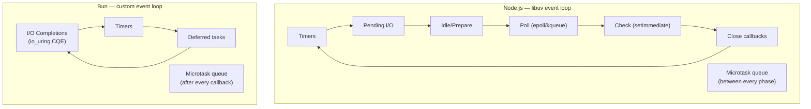
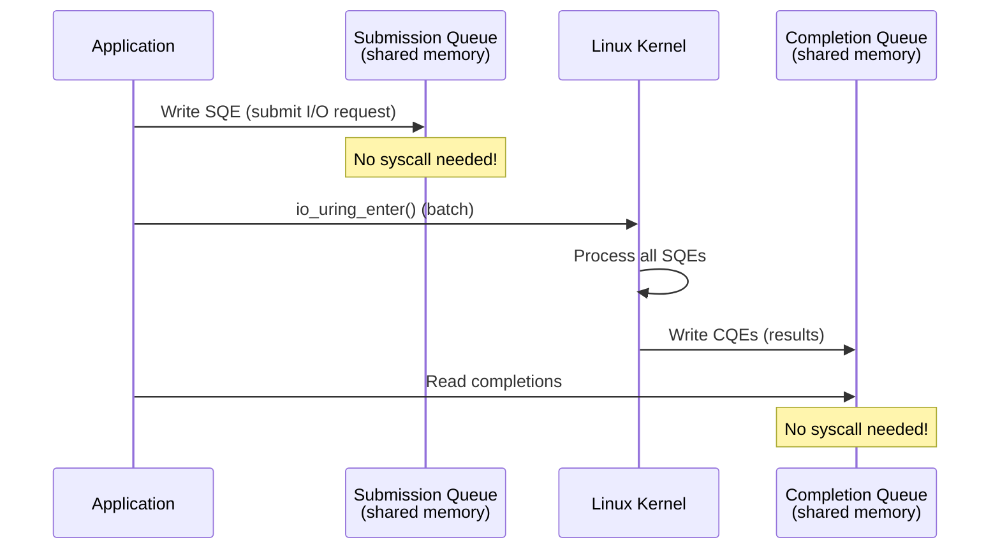

# Lesson 02 — Event Loop Differences

## Node.js Event Loop (libuv) vs Bun Event Loop



---

## io_uring — Bun's Linux Advantage

`io_uring` (Linux 5.1+) is a kernel interface for asynchronous I/O that avoids syscall overhead:



### Why io_uring is Faster

| Operation | libuv (epoll) | Bun (io_uring) |
|-----------|---------------|----------------|
| File read | Thread pool → read() syscall | Direct async submission |
| File write | Thread pool → write() syscall | Direct async submission |
| Network I/O | epoll_wait + read/write | Single submission ring |
| Batching | One syscall per I/O | Multiple I/O per syscall |
| Context switches | 2 per I/O (user→kernel→user) | 0-1 (shared memory ring) |
| DNS lookup | Thread pool → getaddrinfo | Async submission |

```typescript
// io-comparison.ts
// Same operation shows different internal paths

import { readFile } from "node:fs/promises";

// In Node.js:
// readFile() → libuv → thread pool → read() syscall → callback
// Thread pool is limited (default 4 threads)

// In Bun:
// readFile() → io_uring SQE → kernel processes async → CQE → callback
// No thread pool needed for file I/O

const start = performance.now();

// Read 100 files concurrently
const files = Array.from({ length: 100 }, (_, i) => `/tmp/test-file-${i}.txt`);

// Create test files first
import { writeFileSync } from "node:fs";
for (const f of files) {
  writeFileSync(f, "x".repeat(4096)); // 4KB each
}

const results = await Promise.all(files.map((f) => readFile(f)));

const elapsed = performance.now() - start;
console.log(`Read ${files.length} files in ${elapsed.toFixed(1)}ms`);

// Node.js: ~20-50ms (limited by 4 thread pool workers processing 100 requests)
// Bun:     ~5-15ms  (all 100 submitted to io_uring in one batch)

// Cleanup
import { unlinkSync } from "node:fs";
for (const f of files) unlinkSync(f);
```

---

## Timer Behavior Differences

```typescript
// timer-differences.ts

// Node.js: setImmediate runs in "check" phase of event loop
// Bun: setImmediate runs as a deferred task (similar but not identical)

// Test 1: Timer ordering
setTimeout(() => console.log("timeout 1"), 0);
setTimeout(() => console.log("timeout 2"), 0);
setImmediate(() => console.log("immediate 1"));
setImmediate(() => console.log("immediate 2"));
process.nextTick(() => console.log("nextTick 1"));
process.nextTick(() => console.log("nextTick 2"));
Promise.resolve().then(() => console.log("promise 1"));

// Both runtimes: nextTick → promise → then timer/immediate
// But timer vs immediate ordering can differ in edge cases

// Test 2: setImmediate vs setTimeout(0) in I/O context
import { readFile } from "node:fs";

readFile(__filename, () => {
  setTimeout(() => console.log("timeout in I/O"), 0);
  setImmediate(() => console.log("immediate in I/O"));
  // Node.js: immediate ALWAYS fires first (I/O callback → check phase)
  // Bun: same behavior (compatibility guarantee)
});
```

---

## Concurrency Model

```typescript
// concurrency-model.ts

// Node.js UV_THREADPOOL_SIZE affects file I/O concurrency:
// Default: 4 threads
// process.env.UV_THREADPOOL_SIZE = "64"; // Must set before first I/O

// Bun: No thread pool for I/O — io_uring handles everything asynchronously
// This means Bun can handle thousands of concurrent file operations
// without the thread pool bottleneck

async function benchmarkConcurrentReads(count: number) {
  const { writeFileSync, unlinkSync } = await import("node:fs");
  const { readFile } = await import("node:fs/promises");
  
  // Setup
  const files: string[] = [];
  for (let i = 0; i < count; i++) {
    const path = `/tmp/bench-${i}.dat`;
    writeFileSync(path, Buffer.alloc(1024 * 10)); // 10KB each
    files.push(path);
  }
  
  const start = performance.now();
  await Promise.all(files.map((f) => readFile(f)));
  const elapsed = performance.now() - start;
  
  console.log(`${count} concurrent reads: ${elapsed.toFixed(1)}ms`);
  console.log(`Per file: ${(elapsed / count).toFixed(2)}ms`);
  
  // Cleanup
  for (const f of files) unlinkSync(f);
}

await benchmarkConcurrentReads(10);
await benchmarkConcurrentReads(100);
await benchmarkConcurrentReads(1000);

// Expected results:
// Node (4 threads):     10→2ms, 100→25ms, 1000→250ms (linear degradation)
// Bun (io_uring):       10→1ms, 100→5ms,  1000→20ms  (scales much better)
// Node (64 threads):    10→1ms, 100→5ms,  1000→50ms  (better but more memory)
```

---

## Interview Questions

### Q1: "Why is Bun's file I/O faster than Node.js?"

**Answer**: Node.js offloads file I/O to libuv's thread pool (default 4 threads). When you `readFile()`, the request is queued to a worker thread which calls the blocking `read()` syscall. With 100 concurrent reads and 4 threads, you get batches of 4 at a time.

Bun uses `io_uring` on Linux — a shared-memory ring buffer between userspace and kernel. File I/O submissions are written to a ring buffer (no syscall), the kernel processes them truly asynchronously, and completions appear in another ring buffer. All 100 reads can be submitted in one batch with a single `io_uring_enter()` syscall.

Result: Bun scales linearly with I/O count while Node.js is bottlenecked by its thread pool size.

### Q2: "Does Bun's event loop have the same phases as Node.js?"

**Answer**: No. Node.js's libuv event loop has 6 distinct phases (timers → pending → idle → poll → check → close). Bun's event loop is simpler: process I/O completions from io_uring → run expired timers → execute deferred tasks → repeat.

For application code, the observable behavior is mostly the same due to Bun's compatibility efforts (nextTick first, then microtasks, then macrotasks). But internal ordering can differ in edge cases, especially around `setImmediate` vs `setTimeout(0)` outside of I/O callbacks.

### Q3: "What is a limitation of io_uring?"

**Answer**: 
1. **Linux only** — macOS and Windows don't have it, so Bun falls back to kqueue/IOCP with less benefit
2. **Security history** — io_uring has had kernel vulnerabilities; many container runtimes (Docker, gVisor) disable it by default via seccomp
3. **Kernel version** — requires Linux 5.1+ for basics, 5.6+ for full features. Old distros lack support
4. **Not always faster** — for network I/O (TCP/HTTP), epoll is already efficient. io_uring's advantage is primarily in file I/O and batched operations
