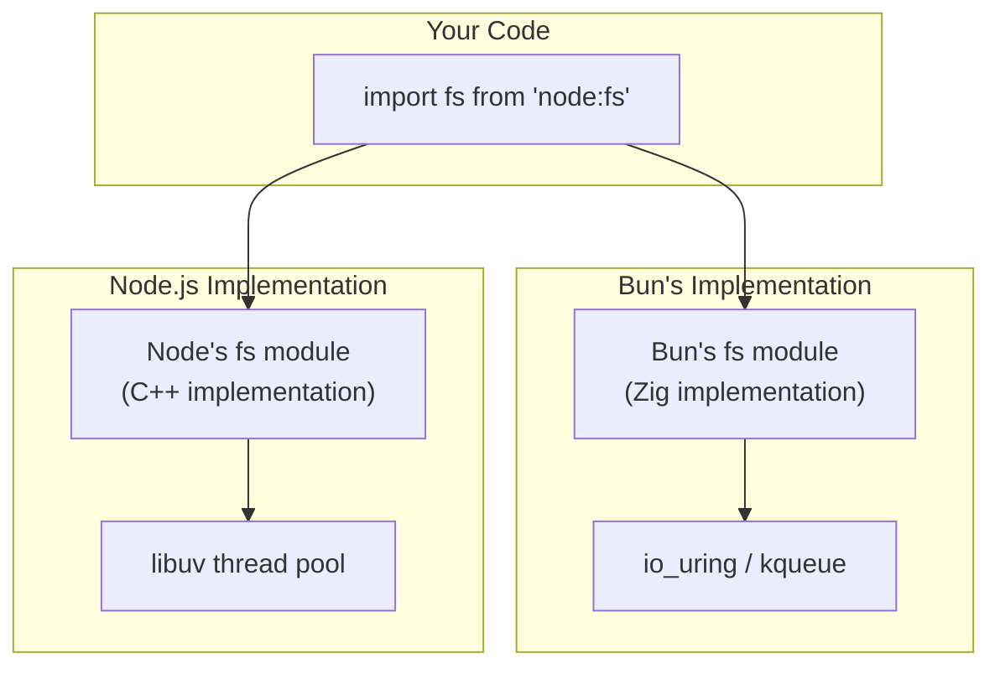

# Lesson 03 — API Compatibility & Extensions

## Node.js Compatibility Layer

Bun implements most Node.js core modules as a compatibility layer. This is not a thin wrapper — it's a re-implementation in Zig/C++ using JSC's API.



---

## Compatibility Matrix

| Module | Node.js | Bun | Notes |
|--------|---------|-----|-------|
| `fs` | ✅ Full | ✅ Full | Bun uses io_uring internally |
| `path` | ✅ Full | ✅ Full | Identical behavior |
| `crypto` | ✅ Full | ✅ Most | Some edge cases differ |
| `http` | ✅ Full | ✅ Full | Bun rewrites to Bun.serve internally |
| `net` | ✅ Full | ✅ Full | TCP/Unix sockets |
| `child_process` | ✅ Full | ✅ Full | spawn/exec/fork |
| `worker_threads` | ✅ Full | ✅ Partial | SharedArrayBuffer works, some edge cases |
| `async_hooks` | ✅ Full | ⚠️ Partial | AsyncLocalStorage works, low-level hooks limited |
| `v8` | ✅ Full | ❌ None | JSC has no V8 API |
| `inspector` | ✅ Full | ⚠️ Limited | Different debugger protocol |
| `cluster` | ✅ Full | ⚠️ Basic | Works but less tested |
| `stream` | ✅ Full | ✅ Most | Web Streams preferred in Bun |

---

## Bun-Specific APIs vs Node Equivalents

### HTTP Server

```typescript
// --- Node.js ---
import http from "node:http";

const nodeServer = http.createServer((req, res) => {
  res.writeHead(200, { "Content-Type": "application/json" });
  res.end(JSON.stringify({ hello: "world" }));
});
nodeServer.listen(3000);

// --- Bun ---
// Uses Web Standard Request/Response (like Cloudflare Workers, Deno)
const bunServer = Bun.serve({
  port: 3000,
  fetch(req: Request): Response {
    return Response.json({ hello: "world" });
  },
});

// Bun.serve is ~3-5x faster than http.createServer for JSON responses
// because it skips the Node.js stream abstraction layer
```

### File Operations

```typescript
// --- Node.js ---
import { readFile, writeFile } from "node:fs/promises";

const data = await readFile("input.txt", "utf8");
await writeFile("output.txt", data);

// --- Bun ---
// Bun.file() returns a lazy reference — doesn't read until consumed
const file = Bun.file("input.txt");
const text = await file.text();        // Read as string
const bytes = await file.arrayBuffer(); // Read as ArrayBuffer
const stream = file.stream();           // Read as ReadableStream

await Bun.write("output.txt", text);
await Bun.write("output.txt", file);   // Copy: zero-copy when possible

// Bun.file() is faster because:
// 1. Lazy — doesn't allocate until data is needed
// 2. Type-aware — .json() parses during read, no intermediate string
// 3. Uses sendfile() for file-to-file copies (zero-copy)
```

### Hashing

```typescript
// --- Node.js ---
import { createHash } from "node:crypto";

const hash = createHash("sha256").update("hello").digest("hex");

// --- Bun ---
const bunHash = new Bun.CryptoHasher("sha256").update("hello").digest("hex");

// Bun's hasher is ~2-3x faster due to Zig's optimized implementation
// For passwords, use Bun.password:
const passwordHash = await Bun.password.hash("secret", { algorithm: "bcrypt", cost: 12 });
const valid = await Bun.password.verify("secret", passwordHash);
```

### SQLite

```typescript
// --- Node.js (requires npm package) ---
// npm install better-sqlite3
import Database from "better-sqlite3";
const nodeDb = new Database("data.db");

// --- Bun (built-in) ---
import { Database } from "bun:sqlite";

const db = new Database("data.db");

// Create table
db.run(`
  CREATE TABLE IF NOT EXISTS users (
    id INTEGER PRIMARY KEY AUTOINCREMENT,
    name TEXT NOT NULL,
    email TEXT UNIQUE
  )
`);

// Prepared statement (reusable, parameterized)
const insert = db.prepare("INSERT INTO users (name, email) VALUES (?, ?)");
insert.run("Alice", "alice@example.com");

// Query with typed results
const users = db.query("SELECT * FROM users WHERE name = ?").all("Alice");
console.log(users);

// Transaction
const insertMany = db.transaction((users: { name: string; email: string }[]) => {
  for (const user of users) {
    insert.run(user.name, user.email);
  }
  return users.length;
});

const count = insertMany([
  { name: "Bob", email: "bob@example.com" },
  { name: "Charlie", email: "charlie@example.com" },
]);
console.log(`Inserted ${count} users`);
```

---

## Writing Cross-Runtime Code

```typescript
// cross-runtime.ts
// Code that works in both Node.js and Bun

// Detect runtime
const isBun = typeof Bun !== "undefined";
const isNode = typeof process !== "undefined" && !isBun;

console.log(`Runtime: ${isBun ? "Bun" : isNode ? "Node.js" : "Unknown"}`);

// Use standard APIs that both runtimes support
async function hashData(data: string): Promise<string> {
  // Web Crypto API — works in Node.js 18+, Bun, Deno, browsers
  const encoder = new TextEncoder();
  const hashBuffer = await crypto.subtle.digest("SHA-256", encoder.encode(data));
  const hashArray = Array.from(new Uint8Array(hashBuffer));
  return hashArray.map((b) => b.toString(16).padStart(2, "0")).join("");
}

// Use Web Standard Request/Response for HTTP handlers
// Works with Bun.serve, Deno.serve, Cloudflare Workers
function handleRequest(req: Request): Response {
  const url = new URL(req.url);
  
  if (url.pathname === "/") {
    return Response.json({ status: "ok" });
  }
  
  return new Response("Not Found", { status: 404 });
}

// Runtime-specific server startup
if (isBun) {
  // @ts-ignore — Bun global
  Bun.serve({ port: 3000, fetch: handleRequest });
} else {
  // Node.js — adapt Web handler to http module
  const http = await import("node:http");
  http.createServer(async (req, res) => {
    const url = `http://localhost:3000${req.url}`;
    const webReq = new Request(url, { method: req.method });
    const webRes = handleRequest(webReq);
    
    res.writeHead(webRes.status, Object.fromEntries(webRes.headers));
    res.end(await webRes.text());
  }).listen(3000);
}
```

---

## Interview Questions

### Q1: "How would you write TypeScript that runs in both Node.js and Bun?"

**Answer**: Use Web Standard APIs wherever possible:
- `fetch()` instead of `http.request()`
- `crypto.subtle` instead of `node:crypto` for hashing
- `Request`/`Response` for HTTP handlers
- `ReadableStream`/`WritableStream` instead of Node streams
- `TextEncoder`/`TextDecoder` instead of `Buffer.from()`

For runtime-specific features, use runtime detection (`typeof Bun !== 'undefined'`) and dynamic imports. Keep the business logic runtime-agnostic, and have thin adapter layers for each runtime.

### Q2: "What Node.js APIs are NOT available in Bun?"

**Answer**: 
- `v8` module — JSC has no V8 API (no `v8.getHeapStatistics()`, no `v8.writeHeapSnapshot()`)
- `node:inspector` — different debugger protocol (WebKit Inspector vs V8 Inspector)
- Low-level `async_hooks` — `AsyncLocalStorage` works, but raw `createHook()` is limited
- Native addons (`.node` files) — different ABI; need Bun-specific NAPI bindings
- `vm` module — partially implemented, sandboxing behavior differs

### Q3: "Should new projects target Bun or Node.js?"

**Answer**: Target Node.js with cross-runtime compatibility in mind:
1. Use Web Standard APIs (fetch, crypto.subtle, Request/Response)
2. Avoid v8-specific APIs unless needed
3. Test with both `node --test` and `bun test`
4. Keep native addon dependencies minimal

This lets you deploy to Node.js (production-proven) today and switch to Bun later if needed, with minimal code changes. Bun is production-ready for many workloads but has a smaller battle-testing surface.
