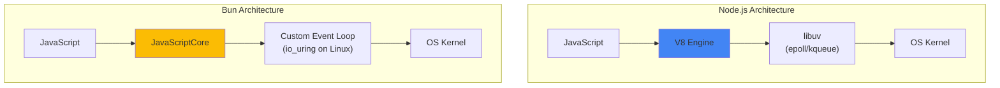

# Module 12 — Bun Runtime Internals

## Overview

Bun is an alternative JavaScript/TypeScript runtime built on **JavaScriptCore** (Safari's engine) instead of V8, with a custom event loop using **io_uring** (Linux) instead of libuv. Understanding the architectural differences helps you make informed runtime choices.

## Lessons

| # | File | Topic | Key Concepts |
|---|------|-------|-------------|
| 1 | [01-architecture.md](01-architecture.md) | Bun Architecture | JSC vs V8, Zig runtime, built-in bundler |
| 2 | [02-event-loop.md](02-event-loop.md) | Event Loop Differences | io_uring, no libuv, I/O model |
| 3 | [03-api-differences.md](03-api-differences.md) | API Compatibility & Extensions | Bun-specific APIs, Node.js compat layer |
| 4 | [04-comparison-labs.md](04-comparison-labs.md) | Performance Comparison Labs | Benchmarking Node vs Bun head-to-head |
