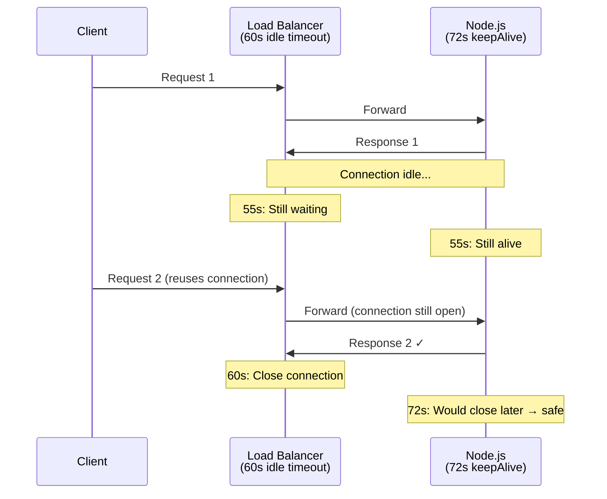
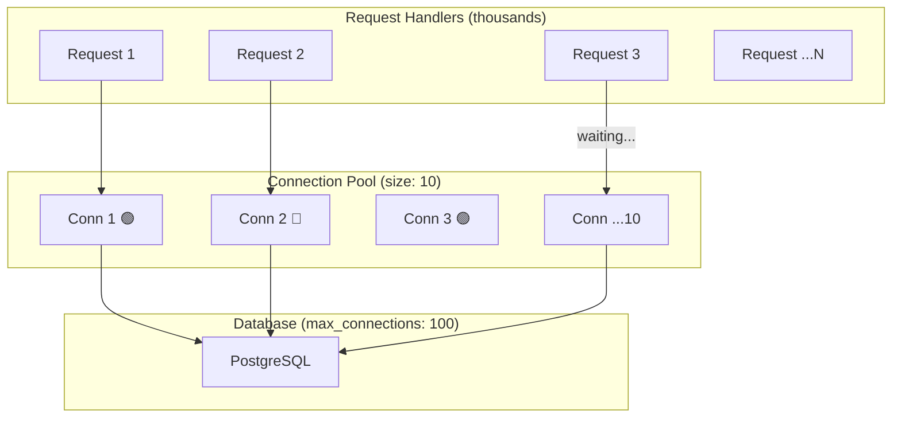
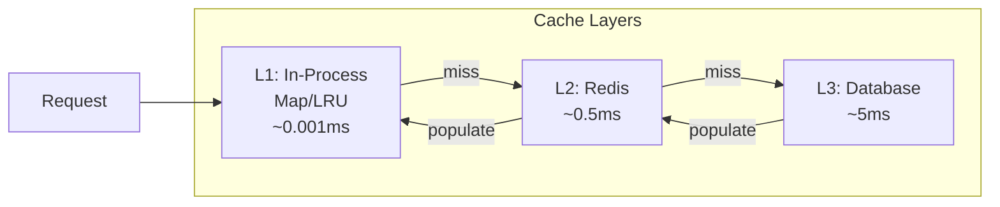
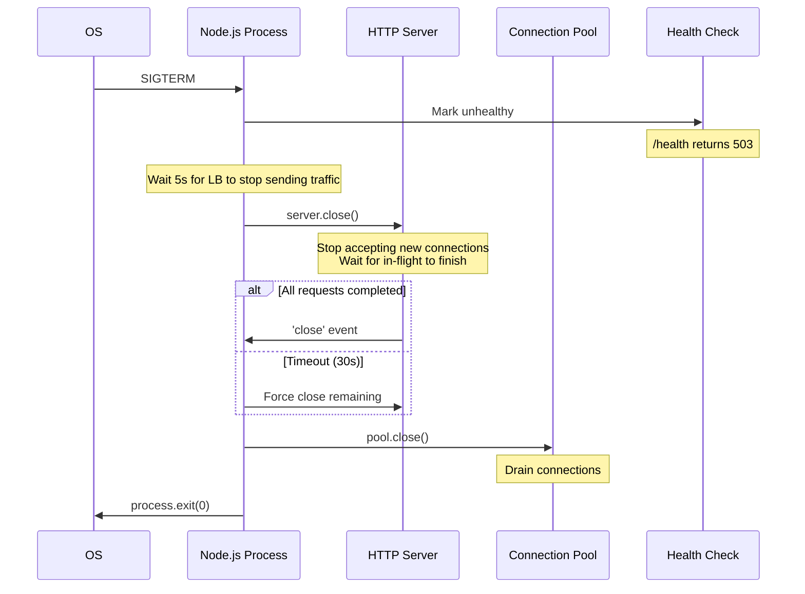

# Lesson 1 — High-Throughput API Server

## The Problem with "Hello World" Servers

Every benchmark shows Node.js handling 100K+ req/sec. Production servers handle 500. Why?

```
Hello-World Server:              Production Server:
┌─────────────┐                 ┌─────────────┐
│ Parse req   │                 │ Parse req   │
│ Send "hi"   │                 │ Auth check  │ ← DB query
│ Done        │                 │ Validate    │ ← CPU work
└─────────────┘                 │ Query DB    │ ← Network I/O
                                │ Transform   │ ← CPU work
                                │ Serialize   │ ← CPU work  
                                │ Compress    │ ← CPU work
                                │ Log         │ ← I/O
                                │ Respond     │
                                └─────────────┘
```

Every step introduces latency. This lesson builds a server that minimizes each one.

---

## 1. Server Foundation

### The Minimal Production Server

```typescript
import { createServer, IncomingMessage, ServerResponse } from "node:http";
import { AsyncLocalStorage } from "node:async_hooks";

// --- Request context ---
interface RequestContext {
  requestId: string;
  startTime: number;
  method: string;
  url: string;
}

const requestStore = new AsyncLocalStorage<RequestContext>();

// --- Configuration ---
const CONFIG = {
  port: Number(process.env.PORT) || 3000,
  keepAliveTimeout: 72_000,      // 72s — longer than ALB 60s default
  headersTimeout: 75_000,        // Must be > keepAliveTimeout
  maxHeaderSize: 16_384,         // 16KB headers max
  requestTimeout: 30_000,        // 30s per request
  maxConnections: 10_000,
} as const;

// --- Server creation ---
const server = createServer(
  {
    keepAlive: true,
    keepAliveTimeout: CONFIG.keepAliveTimeout,
    headersTimeout: CONFIG.headersTimeout,
    requestTimeout: CONFIG.requestTimeout,
    maxHeaderSize: CONFIG.maxHeaderSize,
  },
  (req, res) => {
    const ctx: RequestContext = {
      requestId: crypto.randomUUID(),
      startTime: performance.now(),
      method: req.method ?? "GET",
      url: req.url ?? "/",
    };

    res.setHeader("X-Request-Id", ctx.requestId);

    requestStore.run(ctx, () => handleRequest(req, res));
  }
);

server.maxConnections = CONFIG.maxConnections;

// Why keepAliveTimeout matters:
// ALB default idle timeout = 60s
// If server closes first → 502 errors
// Server timeout must be LONGER than load balancer timeout
```

### Why These Timeouts Matter



If the server's `keepAliveTimeout` is shorter than the load balancer's, the load balancer sends requests on a connection the server already closed → 502 errors.

---

## 2. Connection Pooling

### Database Connection Pool

```typescript
// Generic connection pool — works for any resource
class ConnectionPool<T> {
  private available: T[] = [];
  private inUse = new Set<T>();
  private waitQueue: Array<{
    resolve: (conn: T) => void;
    reject: (err: Error) => void;
    timer: ReturnType<typeof setTimeout>;
  }> = [];
  private closed = false;

  constructor(
    private factory: {
      create: () => Promise<T>;
      destroy: (conn: T) => Promise<void>;
      validate: (conn: T) => Promise<boolean>;
    },
    private options: {
      min: number;
      max: number;
      acquireTimeout: number;
      idleTimeout: number;
      validateOnBorrow: boolean;
    }
  ) {}

  async initialize(): Promise<void> {
    const promises: Promise<void>[] = [];
    for (let i = 0; i < this.options.min; i++) {
      promises.push(this.addConnection());
    }
    await Promise.all(promises);
  }

  private async addConnection(): Promise<void> {
    const conn = await this.factory.create();
    this.available.push(conn);
  }

  async acquire(): Promise<T> {
    if (this.closed) throw new Error("Pool is closed");

    // Try to get an available connection
    while (this.available.length > 0) {
      const conn = this.available.pop()!;

      if (this.options.validateOnBorrow) {
        const valid = await this.factory.validate(conn);
        if (!valid) {
          await this.factory.destroy(conn);
          continue;
        }
      }

      this.inUse.add(conn);
      return conn;
    }

    // Can we create a new one?
    const totalCount = this.inUse.size + this.available.length;
    if (totalCount < this.options.max) {
      const conn = await this.factory.create();
      this.inUse.add(conn);
      return conn;
    }

    // Must wait
    return new Promise<T>((resolve, reject) => {
      const timer = setTimeout(() => {
        const idx = this.waitQueue.findIndex((w) => w.resolve === resolve);
        if (idx !== -1) this.waitQueue.splice(idx, 1);
        reject(new Error("Connection acquire timeout"));
      }, this.options.acquireTimeout);

      this.waitQueue.push({ resolve, reject, timer });
    });
  }

  release(conn: T): void {
    this.inUse.delete(conn);

    // Give to waiting request first
    if (this.waitQueue.length > 0) {
      const waiter = this.waitQueue.shift()!;
      clearTimeout(waiter.timer);
      this.inUse.add(conn);
      waiter.resolve(conn);
      return;
    }

    this.available.push(conn);
  }

  async close(): Promise<void> {
    this.closed = true;

    // Reject all waiters
    for (const waiter of this.waitQueue) {
      clearTimeout(waiter.timer);
      waiter.reject(new Error("Pool closing"));
    }
    this.waitQueue.length = 0;

    // Destroy all connections
    const allConns = [...this.available, ...this.inUse];
    this.available.length = 0;
    this.inUse.clear();

    await Promise.allSettled(
      allConns.map((c) => this.factory.destroy(c))
    );
  }

  get stats() {
    return {
      total: this.available.length + this.inUse.size,
      available: this.available.length,
      inUse: this.inUse.size,
      waiting: this.waitQueue.length,
    };
  }
}
```

### Pool Sizing Formula

```
Optimal pool size = Number of CPU cores × 2 + Number of disks

Example for 4-core machine with SSD:
  4 × 2 + 1 = 9 connections

Why not more?
- Each connection holds a TCP socket + memory
- Too many connections = context-switch overhead on the DB
- PostgreSQL recommends: connections ≤ 4 × CPU cores
```



---

## 3. Multi-Layer Caching

### Cache Architecture



```typescript
// LRU Cache with TTL — no dependencies
class LRUCache<V> {
  private cache = new Map<string, { value: V; expires: number }>();

  constructor(
    private maxSize: number,
    private defaultTtlMs: number
  ) {}

  get(key: string): V | undefined {
    const entry = this.cache.get(key);
    if (!entry) return undefined;

    if (Date.now() > entry.expires) {
      this.cache.delete(key);
      return undefined;
    }

    // Move to end (most recently used)
    this.cache.delete(key);
    this.cache.set(key, entry);
    return entry.value;
  }

  set(key: string, value: V, ttlMs?: number): void {
    // Delete first to update insertion order
    this.cache.delete(key);

    // Evict oldest if at capacity
    if (this.cache.size >= this.maxSize) {
      const oldest = this.cache.keys().next().value;
      if (oldest !== undefined) this.cache.delete(oldest);
    }

    this.cache.set(key, {
      value,
      expires: Date.now() + (ttlMs ?? this.defaultTtlMs),
    });
  }

  delete(key: string): boolean {
    return this.cache.delete(key);
  }

  get size(): number {
    return this.cache.size;
  }

  // Prune expired entries periodically
  prune(): number {
    const now = Date.now();
    let pruned = 0;
    for (const [key, entry] of this.cache) {
      if (now > entry.expires) {
        this.cache.delete(key);
        pruned++;
      }
    }
    return pruned;
  }
}

// --- Multi-layer cache ---
class TieredCache<V> {
  private l1: LRUCache<V>;

  constructor(
    private l1Size: number,
    private l1TtlMs: number,
    private l2Get: (key: string) => Promise<V | undefined>,
    private l2Set: (key: string, value: V, ttlMs: number) => Promise<void>,
    private l2TtlMs: number
  ) {
    this.l1 = new LRUCache(l1Size, l1TtlMs);
  }

  async get(
    key: string,
    loader: () => Promise<V>
  ): Promise<V> {
    // L1: in-process
    let value = this.l1.get(key);
    if (value !== undefined) return value;

    // L2: Redis
    value = await this.l2Get(key);
    if (value !== undefined) {
      this.l1.set(key, value);
      return value;
    }

    // L3: origin (database, API, etc.)
    value = await loader();
    this.l1.set(key, value);
    await this.l2Set(key, value, this.l2TtlMs);
    return value;
  }

  invalidate(key: string): void {
    this.l1.delete(key);
    // L2 invalidation should also happen (omitted: depends on Redis client)
  }
}
```

### Cache Stampede Prevention

When a cached item expires, hundreds of concurrent requests all miss and hit the database simultaneously:

```typescript
// Coalescing: only ONE request fetches, others wait for same result
class CoalescingCache<V> {
  private inflight = new Map<string, Promise<V>>();
  private cache: LRUCache<V>;

  constructor(maxSize: number, ttlMs: number) {
    this.cache = new LRUCache(maxSize, ttlMs);
  }

  async get(key: string, loader: () => Promise<V>): Promise<V> {
    // Check cache first
    const cached = this.cache.get(key);
    if (cached !== undefined) return cached;

    // Is someone already fetching this key?
    const existing = this.inflight.get(key);
    if (existing) return existing;

    // We are the first — fetch and share the result
    const promise = loader().then((value) => {
      this.cache.set(key, value);
      this.inflight.delete(key);
      return value;
    }).catch((err) => {
      this.inflight.delete(key);
      throw err;
    });

    this.inflight.set(key, promise);
    return promise;
  }
}
```

```
Without coalescing:                   With coalescing:
Cache expires at T=0                  Cache expires at T=0

T=0  Req1 → DB query                 T=0  Req1 → DB query
T=0  Req2 → DB query                 T=0  Req2 → waits for Req1
T=0  Req3 → DB query                 T=0  Req3 → waits for Req1
T=0  Req4 → DB query                 T=0  Req4 → waits for Req1

Result: 4 DB queries                  Result: 1 DB query
DB load: 4x normal                    DB load: 1x normal
```

---

## 4. Request Routing Architecture

### Efficient URL Routing

```typescript
// Radix trie router — O(path_length) lookup, not O(routes)
type Handler = (
  req: IncomingMessage,
  res: ServerResponse,
  params: Record<string, string>
) => Promise<void>;

interface RouteNode {
  handler?: Handler;
  children: Map<string, RouteNode>;
  paramChild?: { name: string; node: RouteNode };
  wildcardHandler?: Handler;
}

class Router {
  private root: RouteNode = { children: new Map() };

  add(method: string, path: string, handler: Handler): void {
    const key = `${method}:`;
    const segments = path.split("/").filter(Boolean);
    let node = this.getOrCreate(this.root, key);

    for (const segment of segments) {
      if (segment.startsWith(":")) {
        // Parameter segment
        if (!node.paramChild) {
          node.paramChild = { name: segment.slice(1), node: { children: new Map() } };
        }
        node = node.paramChild.node;
      } else if (segment === "*") {
        node.wildcardHandler = handler;
        return;
      } else {
        node = this.getOrCreate(node, segment);
      }
    }

    node.handler = handler;
  }

  find(
    method: string,
    path: string
  ): { handler: Handler; params: Record<string, string> } | null {
    const key = `${method}:`;
    let node = this.root.children.get(key);
    if (!node) return null;

    const params: Record<string, string> = {};
    const segments = path.split("/").filter(Boolean);

    for (const segment of segments) {
      // Try exact match first (faster)
      const child = node.children.get(segment);
      if (child) {
        node = child;
        continue;
      }

      // Try parameter match
      if (node.paramChild) {
        params[node.paramChild.name] = segment;
        node = node.paramChild.node;
        continue;
      }

      // Try wildcard
      if (node.wildcardHandler) {
        return { handler: node.wildcardHandler, params };
      }

      return null;
    }

    if (node.handler) return { handler: node.handler, params };
    return null;
  }

  private getOrCreate(node: RouteNode, key: string): RouteNode {
    let child = node.children.get(key);
    if (!child) {
      child = { children: new Map() };
      node.children.set(key, child);
    }
    return child;
  }
}

// Usage
const router = new Router();
router.add("GET", "/users/:id", async (req, res, params) => {
  const userId = params.id;
  // ... handle
});
router.add("GET", "/users/:id/posts/:postId", async (req, res, params) => {
  const { id, postId } = params;
  // ... handle
});
```

---

## 5. Graceful Shutdown

### Production Shutdown Sequence



```typescript
function setupGracefulShutdown(
  server: ReturnType<typeof createServer>,
  resources: { close: () => Promise<void> }[]
): void {
  let shuttingDown = false;

  async function shutdown(signal: string): Promise<void> {
    if (shuttingDown) return;
    shuttingDown = true;

    console.log(`\n[${signal}] Graceful shutdown initiated`);

    // 1. Mark unhealthy immediately
    isHealthy = false;

    // 2. Wait for load balancer to detect unhealthy status
    const lbDrainDelay = Number(process.env.LB_DRAIN_DELAY) || 5_000;
    console.log(`Waiting ${lbDrainDelay}ms for LB drain...`);
    await new Promise((r) => setTimeout(r, lbDrainDelay));

    // 3. Stop accepting new connections, wait for in-flight
    const serverClosePromise = new Promise<void>((resolve) => {
      server.close(() => {
        console.log("All connections closed");
        resolve();
      });
    });

    // 4. Force close after timeout
    const forceTimeout = setTimeout(() => {
      console.error("Forced shutdown — connections did not drain");
      process.exit(1);
    }, 30_000);
    forceTimeout.unref();

    await serverClosePromise;
    clearTimeout(forceTimeout);

    // 5. Close resources (DB pools, Redis, etc.)
    console.log("Closing resources...");
    await Promise.allSettled(
      resources.map((r) => r.close())
    );

    console.log("Shutdown complete");
    process.exit(0);
  }

  process.on("SIGTERM", () => shutdown("SIGTERM"));
  process.on("SIGINT", () => shutdown("SIGINT"));
}

// Health check endpoint
let isHealthy = true;

async function handleRequest(
  req: IncomingMessage,
  res: ServerResponse
): Promise<void> {
  // Health check — must respond fast
  if (req.url === "/health") {
    res.writeHead(isHealthy ? 200 : 503, { "Content-Type": "application/json" });
    res.end(JSON.stringify({
      status: isHealthy ? "healthy" : "shutting_down",
      uptime: process.uptime(),
      memory: process.memoryUsage().heapUsed,
    }));
    return;
  }

  // Route request
  const route = router.find(req.method ?? "GET", req.url ?? "/");
  if (!route) {
    res.writeHead(404);
    res.end("Not Found");
    return;
  }

  try {
    await route.handler(req, res, route.params);
  } catch (err) {
    const ctx = requestStore.getStore();
    console.error(`[${ctx?.requestId}] Error:`, err);
    if (!res.headersSent) {
      res.writeHead(500, { "Content-Type": "application/json" });
      res.end(JSON.stringify({ error: "Internal Server Error" }));
    }
  } finally {
    const ctx = requestStore.getStore();
    if (ctx) {
      const duration = performance.now() - ctx.startTime;
      console.log(`${ctx.method} ${ctx.url} ${res.statusCode} ${duration.toFixed(1)}ms`);
    }
  }
}
```

---

## 6. Complete Production Server

Putting it all together:

```typescript
import { createServer } from "node:http";
import { AsyncLocalStorage } from "node:async_hooks";

// --- All the pieces from above ---

async function main() {
  // Initialize connection pool
  // const dbPool = new ConnectionPool({...});
  // await dbPool.initialize();

  // Initialize cache
  const cache = new CoalescingCache<unknown>(1000, 60_000);

  // Register routes
  router.add("GET", "/health", async (_req, res) => {
    res.writeHead(isHealthy ? 200 : 503);
    res.end(JSON.stringify({ status: isHealthy ? "ok" : "draining" }));
  });

  router.add("GET", "/api/users/:id", async (_req, res, params) => {
    const user = await cache.get(`user:${params.id}`, async () => {
      // Simulate DB fetch
      return { id: params.id, name: "User " + params.id };
    });

    const body = JSON.stringify(user);
    res.writeHead(200, {
      "Content-Type": "application/json",
      "Content-Length": Buffer.byteLength(body),
      "Cache-Control": "private, max-age=60",
    });
    res.end(body);
  });

  // Start server
  server.listen(CONFIG.port, () => {
    console.log(`Server listening on :${CONFIG.port}`);
    console.log(`PID: ${process.pid}`);
    console.log(`Node.js ${process.version}`);
  });

  // Setup shutdown
  setupGracefulShutdown(server, [/* dbPool */]);
}

main().catch((err) => {
  console.error("Startup failed:", err);
  process.exit(1);
});
```

### Production Checklist

```
✅ Server Configuration
  □ keepAliveTimeout > load balancer timeout
  □ headersTimeout > keepAliveTimeout
  □ requestTimeout set
  □ maxConnections set
  
✅ Connection Management
  □ Database connection pool with min/max
  □ Validate connections on borrow
  □ Acquire timeout configured
  □ Pool stats exposed via /metrics
  
✅ Caching
  □ In-process LRU with TTL
  □ Cache stampede prevention
  □ Content-Length header set
  □ Cache-Control headers set
  
✅ Resilience
  □ Graceful shutdown on SIGTERM/SIGINT
  □ Health check endpoint
  □ LB drain delay before closing
  □ Force shutdown timeout
  □ Request context via AsyncLocalStorage
  
✅ Observability
  □ Request ID in every log
  □ Duration logging
  □ Error context logging
  □ Memory/uptime in health check
```

---

## Interview Questions

### Q1: "A Node.js API returns 502 errors intermittently in production behind an ALB. How do you diagnose and fix it?"

**Answer:**

The most common cause is a **keepAliveTimeout race condition**:

1. **The race**: AWS ALB default idle timeout = 60s. If Node's `keepAliveTimeout` is shorter (default was 5s in old Node), the server closes the TCP connection. The ALB doesn't know yet and sends a request on the now-closed connection → 502.

2. **The fix**: Set `keepAliveTimeout` to 72-75 seconds (longer than ALB's 60s). Set `headersTimeout` a few seconds higher than that.

3. **Diagnosis steps**:
   - Check ALB access logs for 502s — look at `target_status_code` vs `elb_status_code`
   - If target returns `-` (no response), the server closed the connection
   - Check `ConnectionCount` CloudWatch metric — if spiky, timeout is too short
   - Verify with `ss -tnp | grep :3000 | wc -l` on the server to check connection states

```typescript
// Fix
const server = createServer({
  keepAlive: true,
  keepAliveTimeout: 72_000,   // Must be > 60s ALB default
  headersTimeout: 75_000,     // Must be > keepAliveTimeout
});
```

---

### Q2: "Your cache hit ratio is 95%, but response times are still high. What's wrong?"

**Answer:**

Cache hit ratio alone is misleading. Several possibilities:

1. **Cache stampede**: Many requests arrive simultaneously when a popular key expires. All miss, all hit DB. Fix: cache coalescing (one request fetches, others wait for the same promise).

2. **Slow serialization**: The cached value is huge (e.g., 10MB JSON object). Even though it's cached in memory, `JSON.stringify()` takes time. Fix: cache the serialized string, not the object.

3. **Wrong cache layer**: Using Redis (L2) when in-process cache (L1) would work. Network round-trip to Redis is ~0.5ms vs ~0.001ms for in-process. If 95% of hits go to Redis, that's still 0.5ms per request.

4. **Cache key cardinality**: 95% overall doesn't mean the 5% misses are evenly distributed. If the misses are for the most expensive queries, the tail latency is terrible.

5. **Missing Content-Length**: Without it, Node uses chunked transfer encoding, which adds overhead. Pre-compute the body length and set the header.

---

### Q3: "Design a graceful shutdown procedure for a Node.js service behind a load balancer."

**Answer:**

The order matters — shutting down incorrectly causes dropped requests:

1. **Receive SIGTERM** from orchestrator (Kubernetes, ECS)
2. **Mark unhealthy** immediately — health endpoint returns 503
3. **Wait 5-10 seconds** — load balancer polls health check, detects 503, stops sending new traffic
4. **Call server.close()** — stops accepting new TCP connections, lets in-flight requests finish
5. **Set force timeout** (30s) — if connections don't drain, force exit to respect Kubernetes terminationGracePeriodSeconds
6. **Close resources** — drain database pools, flush pending writes, close Redis connections
7. **Exit 0** — clean exit

Common mistakes:
- Calling `process.exit()` immediately — drops in-flight requests
- Not waiting for LB drain — LB sends traffic to closing server
- `keepAliveTimeout` too long — connections don't close in time for the force timeout
- Not calling `.unref()` on the force timeout timer — prevents process from exiting naturally
