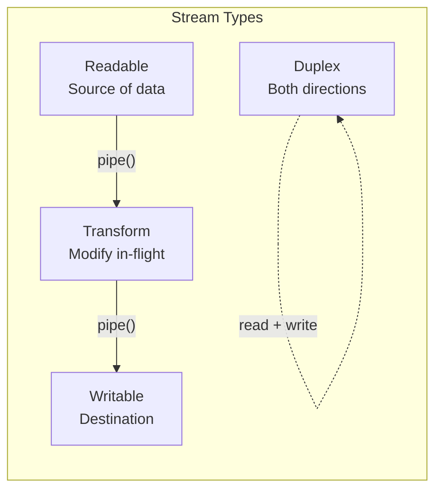
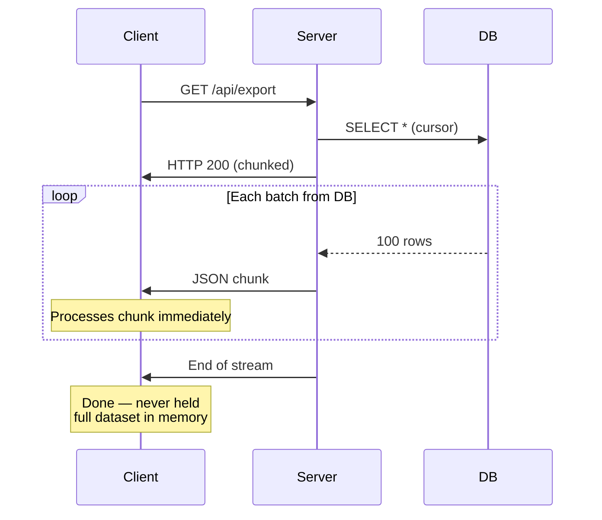
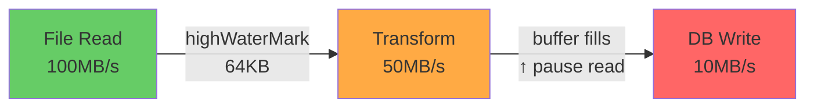

# Lesson 2 — Streaming Data Pipeline

## Why Streaming?

Loading data into memory, processing, then writing is simple — but it doesn't scale:

```
Batch Processing:                     Stream Processing:
┌─────────────────────┐              ┌─────────────────────┐
│ Read 2GB file       │ 2GB RAM      │ Read chunk (64KB)   │ 64KB RAM
│ Parse all records   │ +2GB RAM     │ Parse chunk          │ +tiny
│ Transform all       │ +2GB RAM     │ Transform chunk      │ +tiny  
│ Write all           │ Total: ~6GB  │ Write chunk           │ Total: ~128KB
└─────────────────────┘              │ Repeat...             │
                                     └─────────────────────┘
```

Streaming processes data as it flows, using constant memory regardless of input size.

---

## 1. Stream Fundamentals Review

### The Four Stream Types



### Building a Pipeline with `pipeline()`

Always use `pipeline()` — never `.pipe()`. Here's why:

```typescript
import { pipeline } from "node:stream/promises";
import { createReadStream, createWriteStream } from "node:fs";
import { Transform, Readable, Writable } from "node:stream";

// ❌ BAD: .pipe() doesn't forward errors
createReadStream("input.csv")
  .pipe(transformStream)     // If THIS throws, readStream keeps reading
  .pipe(createWriteStream("output.csv")); // Memory grows unbounded

// ✅ GOOD: pipeline() handles errors + backpressure + cleanup
await pipeline(
  createReadStream("input.csv"),
  transformStream,
  createWriteStream("output.csv")
);
// If ANY stream errors, ALL are destroyed and cleaned up
```

---

## 2. Building a CSV Processing Pipeline

### Step 1: Line Splitter Transform

CSV data arrives in arbitrary chunks — `"hello,wor"` then `"ld\nfoo,bar\nbaz"`. We need to split on line boundaries:

```typescript
import { Transform, TransformCallback } from "node:stream";

class LineSplitter extends Transform {
  private buffer = "";

  constructor() {
    super({ readableObjectMode: true }); // Output objects (strings), input bytes
  }

  _transform(
    chunk: Buffer,
    _encoding: string,
    callback: TransformCallback
  ): void {
    this.buffer += chunk.toString();

    const lines = this.buffer.split("\n");
    // Keep the last piece — it might be incomplete
    this.buffer = lines.pop()!;

    for (const line of lines) {
      if (line.trim()) {
        this.push(line);
      }
    }

    callback();
  }

  _flush(callback: TransformCallback): void {
    // Process remaining data
    if (this.buffer.trim()) {
      this.push(this.buffer);
    }
    callback();
  }
}
```

### Step 2: CSV Parser Transform

```typescript
class CSVParser extends Transform {
  private headers: string[] | null = null;

  constructor() {
    super({
      objectMode: true, // Both input and output are objects
    });
  }

  _transform(
    line: string,
    _encoding: string,
    callback: TransformCallback
  ): void {
    const fields = this.parseCSVLine(line);

    if (!this.headers) {
      this.headers = fields;
      callback();
      return;
    }

    const record: Record<string, string> = {};
    for (let i = 0; i < this.headers.length; i++) {
      record[this.headers[i]] = fields[i] ?? "";
    }

    this.push(record);
    callback();
  }

  private parseCSVLine(line: string): string[] {
    const fields: string[] = [];
    let current = "";
    let inQuotes = false;

    for (let i = 0; i < line.length; i++) {
      const char = line[i];

      if (inQuotes) {
        if (char === '"' && line[i + 1] === '"') {
          current += '"';
          i++; // Skip escaped quote
        } else if (char === '"') {
          inQuotes = false;
        } else {
          current += char;
        }
      } else {
        if (char === '"') {
          inQuotes = true;
        } else if (char === ",") {
          fields.push(current);
          current = "";
        } else {
          current += char;
        }
      }
    }

    fields.push(current);
    return fields;
  }
}
```

### Step 3: Data Transformer

```typescript
interface UserRecord {
  name: string;
  email: string;
  age: number;
  active: boolean;
}

class RecordTransformer extends Transform {
  private processed = 0;
  private errors = 0;

  constructor(
    private transformFn: (
      record: Record<string, string>
    ) => UserRecord | null
  ) {
    super({ objectMode: true });
  }

  _transform(
    record: Record<string, string>,
    _encoding: string,
    callback: TransformCallback
  ): void {
    this.processed++;
    try {
      const transformed = this.transformFn(record);
      if (transformed !== null) {
        this.push(transformed);
      }
    } catch {
      this.errors++;
      // Skip bad records, don't crash the pipeline
    }
    callback();
  }

  _flush(callback: TransformCallback): void {
    console.log(
      `Processed: ${this.processed}, Errors: ${this.errors}, ` +
      `Error rate: ${((this.errors / this.processed) * 100).toFixed(2)}%`
    );
    callback();
  }
}
```

### Step 4: Batching Writer

Writing one record at a time is slow. Batch them:

```typescript
class BatchWriter extends Writable {
  private batch: unknown[] = [];
  private totalWritten = 0;

  constructor(
    private batchSize: number,
    private writeBatch: (records: unknown[]) => Promise<void>
  ) {
    super({ objectMode: true });
  }

  async _write(
    record: unknown,
    _encoding: string,
    callback: (error?: Error | null) => void
  ): Promise<void> {
    this.batch.push(record);

    if (this.batch.length >= this.batchSize) {
      try {
        await this.flush();
        callback();
      } catch (err) {
        callback(err as Error);
      }
    } else {
      callback();
    }
  }

  async _final(callback: (error?: Error | null) => void): Promise<void> {
    try {
      if (this.batch.length > 0) {
        await this.flush();
      }
      console.log(`Total records written: ${this.totalWritten}`);
      callback();
    } catch (err) {
      callback(err as Error);
    }
  }

  private async flush(): Promise<void> {
    const toWrite = this.batch.splice(0);
    this.totalWritten += toWrite.length;
    await this.writeBatch(toWrite);
  }
}
```

### Complete Pipeline

```typescript
async function processCSV(
  inputPath: string,
  outputPath: string
): Promise<void> {
  const startTime = performance.now();

  const outputFile = createWriteStream(outputPath);

  await pipeline(
    createReadStream(inputPath, { highWaterMark: 64 * 1024 }),
    new LineSplitter(),
    new CSVParser(),
    new RecordTransformer((raw) => {
      const age = Number(raw.age);
      if (isNaN(age) || age < 0 || age > 150) return null;

      return {
        name: raw.name?.trim() ?? "",
        email: raw.email?.toLowerCase().trim() ?? "",
        age,
        active: raw.active === "true" || raw.active === "1",
      };
    }),
    new BatchWriter(1000, async (batch) => {
      // Write as NDJSON
      const lines = batch.map((r) => JSON.stringify(r)).join("\n") + "\n";
      const canContinue = outputFile.write(lines);
      if (!canContinue) {
        await new Promise<void>((resolve) =>
          outputFile.once("drain", resolve)
        );
      }
    })
  );

  outputFile.end();
  await new Promise<void>((resolve) => outputFile.on("finish", resolve));

  const elapsed = performance.now() - startTime;
  console.log(`Pipeline completed in ${elapsed.toFixed(0)}ms`);
}
```

---

## 3. HTTP Streaming Pipeline

### Stream API Responses

Sending large datasets as a single JSON response blocks both server and client. Stream instead:



```typescript
import { createServer, IncomingMessage, ServerResponse } from "node:http";
import { Readable, Transform } from "node:stream";
import { pipeline } from "node:stream/promises";

// Simulate a database cursor that yields rows in batches
async function* fetchUsersCursor(
  batchSize: number
): AsyncGenerator<Record<string, unknown>[]> {
  const totalRecords = 100_000;

  for (let offset = 0; offset < totalRecords; offset += batchSize) {
    // Simulate DB query delay
    await new Promise((r) => setTimeout(r, 10));

    const batch: Record<string, unknown>[] = [];
    for (let i = 0; i < batchSize && offset + i < totalRecords; i++) {
      batch.push({
        id: offset + i,
        name: `User ${offset + i}`,
        email: `user${offset + i}@example.com`,
        createdAt: new Date().toISOString(),
      });
    }
    yield batch;
  }
}

// Transform DB rows into NDJSON stream
class NDJSONSerializer extends Transform {
  constructor() {
    super({ objectMode: true, readableObjectMode: false });
  }

  _transform(
    batch: Record<string, unknown>[],
    _encoding: string,
    callback: (err?: Error | null) => void
  ): void {
    for (const record of batch) {
      this.push(JSON.stringify(record) + "\n");
    }
    callback();
  }
}

// Convert async generator to readable stream
function cursorToStream(
  cursor: AsyncGenerator<Record<string, unknown>[]>
): Readable {
  return Readable.from(cursor, { objectMode: true });
}

// Handler
async function handleExport(
  _req: IncomingMessage,
  res: ServerResponse
): Promise<void> {
  res.writeHead(200, {
    "Content-Type": "application/x-ndjson",
    "Transfer-Encoding": "chunked",
    "Cache-Control": "no-cache",
  });

  const cursor = fetchUsersCursor(1000);

  await pipeline(
    cursorToStream(cursor),
    new NDJSONSerializer(),
    res
  );
}
```

### JSON Array Streaming

Sometimes clients need a valid JSON array, not NDJSON:

```typescript
class JSONArrayStream extends Transform {
  private first = true;

  constructor() {
    super({ objectMode: true, readableObjectMode: false });
  }

  _transform(
    batch: Record<string, unknown>[],
    _encoding: string,
    callback: (err?: Error | null) => void
  ): void {
    for (const record of batch) {
      if (this.first) {
        this.push("[" + JSON.stringify(record));
        this.first = false;
      } else {
        this.push(",\n" + JSON.stringify(record));
      }
    }
    callback();
  }

  _flush(callback: (err?: Error | null) => void): void {
    if (this.first) {
      this.push("[]"); // Empty array
    } else {
      this.push("]");
    }
    callback();
  }
}

// Output:
// [{"id":0,"name":"User 0"},
// {"id":1,"name":"User 1"},
// {"id":2,"name":"User 2"}]
```

---

## 4. File Upload Pipeline

### Streaming File Upload with Progress

```typescript
import { createWriteStream } from "node:fs";
import { mkdir } from "node:fs/promises";
import { randomUUID } from "node:crypto";
import { createHash } from "node:crypto";

interface UploadResult {
  id: string;
  size: number;
  hash: string;
  path: string;
}

class UploadTracker extends Transform {
  public bytesReceived = 0;
  private hash = createHash("sha256");

  constructor(private maxSize: number) {
    super();
  }

  _transform(
    chunk: Buffer,
    _encoding: string,
    callback: (err?: Error | null) => void
  ): void {
    this.bytesReceived += chunk.length;

    if (this.bytesReceived > this.maxSize) {
      callback(new Error(`Upload exceeds maximum size of ${this.maxSize} bytes`));
      return;
    }

    this.hash.update(chunk);
    this.push(chunk);
    callback();
  }

  getHash(): string {
    return this.hash.digest("hex");
  }
}

async function handleUpload(
  req: IncomingMessage,
  res: ServerResponse
): Promise<void> {
  const uploadId = randomUUID();
  const uploadDir = "/tmp/uploads";
  await mkdir(uploadDir, { recursive: true });
  const filePath = `${uploadDir}/${uploadId}`;

  const maxSize = 100 * 1024 * 1024; // 100MB
  const tracker = new UploadTracker(maxSize);

  try {
    await pipeline(
      req,
      tracker,
      createWriteStream(filePath)
    );

    const result: UploadResult = {
      id: uploadId,
      size: tracker.bytesReceived,
      hash: tracker.getHash(),
      path: filePath,
    };

    const body = JSON.stringify(result);
    res.writeHead(201, {
      "Content-Type": "application/json",
      "Content-Length": Buffer.byteLength(body),
    });
    res.end(body);
  } catch (err) {
    // Clean up partial upload
    const { unlink } = await import("node:fs/promises");
    await unlink(filePath).catch(() => {});

    const message = err instanceof Error ? err.message : "Upload failed";
    res.writeHead(413, { "Content-Type": "application/json" });
    res.end(JSON.stringify({ error: message }));
  }
}
```

---

## 5. Error Recovery in Pipelines

### Retry with Dead Letter Queue

```typescript
class ResilientTransform extends Transform {
  private retryCount = 0;
  private deadLetterQueue: unknown[] = [];

  constructor(
    private processFn: (record: unknown) => Promise<unknown>,
    private options: {
      maxRetries: number;
      retryDelayMs: number;
      onDeadLetter?: (record: unknown, error: Error) => void;
    }
  ) {
    super({ objectMode: true });
  }

  async _transform(
    record: unknown,
    _encoding: string,
    callback: TransformCallback
  ): Promise<void> {
    let lastError: Error | null = null;

    for (let attempt = 0; attempt <= this.options.maxRetries; attempt++) {
      try {
        const result = await this.processFn(record);
        this.push(result);
        callback();
        return;
      } catch (err) {
        lastError = err instanceof Error ? err : new Error(String(err));
        this.retryCount++;

        if (attempt < this.options.maxRetries) {
          // Exponential backoff
          const delay = this.options.retryDelayMs * Math.pow(2, attempt);
          await new Promise((r) => setTimeout(r, delay));
        }
      }
    }

    // All retries failed — send to dead letter queue
    this.deadLetterQueue.push(record);
    this.options.onDeadLetter?.(record, lastError!);

    // Don't crash the pipeline — skip this record
    callback();
  }

  _flush(callback: TransformCallback): void {
    console.log(`Retries: ${this.retryCount}, Dead letters: ${this.deadLetterQueue.length}`);
    callback();
  }

  getDeadLetters(): unknown[] {
    return [...this.deadLetterQueue];
  }
}

// Usage
const resilient = new ResilientTransform(
  async (record) => {
    // Simulate flaky external API
    if (Math.random() < 0.1) throw new Error("Temporary failure");
    return record;
  },
  {
    maxRetries: 3,
    retryDelayMs: 100,
    onDeadLetter: (record, error) => {
      console.error("Dead letter:", record, error.message);
    },
  }
);
```

### Pipeline Completion with Stats

```typescript
interface PipelineStats {
  inputRecords: number;
  outputRecords: number;
  errors: number;
  deadLetters: number;
  durationMs: number;
  throughputPerSec: number;
}

class StatsCollector extends Transform {
  private count = 0;
  private startTime = performance.now();

  constructor(private label: string) {
    super({ objectMode: true });
  }

  _transform(
    record: unknown,
    _encoding: string,
    callback: TransformCallback
  ): void {
    this.count++;

    // Log progress every 10K records
    if (this.count % 10_000 === 0) {
      const elapsed = performance.now() - this.startTime;
      const rps = (this.count / elapsed) * 1000;
      console.log(`[${this.label}] ${this.count} records (${rps.toFixed(0)}/sec)`);
    }

    this.push(record);
    callback();
  }

  getCount(): number {
    return this.count;
  }

  getElapsed(): number {
    return performance.now() - this.startTime;
  }
}
```

---

## 6. Backpressure Monitoring

### Visualizing Backpressure



```typescript
// Monitor buffer levels across a pipeline
function monitorPipeline(
  stages: { name: string; stream: Transform | Readable }[]
): void {
  const interval = setInterval(() => {
    const report: string[] = [];

    for (const { name, stream } of stages) {
      const readableLength = stream.readableLength ?? 0;
      const readableHighWaterMark = stream.readableHighWaterMark ?? 0;
      const fillPct = readableHighWaterMark > 0
        ? ((readableLength / readableHighWaterMark) * 100).toFixed(0)
        : "N/A";

      const bar = readableHighWaterMark > 0
        ? "█".repeat(Math.ceil((readableLength / readableHighWaterMark) * 20)).padEnd(20, "░")
        : "N/A";

      report.push(`  ${name}: [${bar}] ${fillPct}% (${readableLength}/${readableHighWaterMark})`);
    }

    console.log("Pipeline Buffer Status:");
    console.log(report.join("\n"));
  }, 1000);

  // Clean up when pipeline ends
  const lastStream = stages[stages.length - 1]?.stream;
  lastStream?.on("end", () => clearInterval(interval));
  lastStream?.on("error", () => clearInterval(interval));
}
```

---

## Interview Questions

### Q1: "Why should you use `pipeline()` instead of `.pipe()`?"

**Answer:**

`.pipe()` has three critical problems:

1. **No error forwarding**: If a middle stream errors, the source keeps pumping data. This leaks memory because the destination never consumes it. You must manually listen for `'error'` on every stream and destroy the others.

2. **No cleanup**: When a stream errors, `.pipe()` doesn't destroy the other streams. File descriptors, sockets, and memory leak.

3. **No completion signal**: `.pipe()` returns the destination stream, not a Promise. There's no easy way to know when the pipeline is truly done, including flushes.

`pipeline()` fixes all three:
- Propagates errors through all streams
- Destroys all streams on error
- Returns a Promise (from `stream/promises`) that resolves on completion
- Handles backpressure correctly

```typescript
// .pipe() requires this mess:
source.pipe(transform).pipe(dest);
source.on("error", cleanup);
transform.on("error", cleanup);
dest.on("error", cleanup);
dest.on("finish", done);

// pipeline() does it all:
await pipeline(source, transform, dest);
```

---

### Q2: "How do you process a 50GB file in Node.js without running out of memory?"

**Answer:**

Use streaming with constant-memory transforms:

1. **Read in chunks**: `createReadStream()` with `highWaterMark: 64 * 1024` reads 64KB at a time, not the whole file.

2. **Object mode transforms**: Each transform processes one record at a time. The transform's internal buffer holds at most `highWaterMark` objects (default 16).

3. **Backpressure**: When the writable side is slow (e.g., writing to DB), Node automatically pauses the readable side. Memory stays bounded.

4. **Batch writes**: Instead of writing one record at a time (slow), collect 1000 records and write in one batch. But flush the batch array after each write — don't accumulate.

5. **Memory budget**: With 64KB `highWaterMark` and objectMode buffers of 16 items, a pipeline of 5 transforms uses roughly: `64KB + (16 × objectSize × 5)`. For 1KB objects, that's ~144KB total.

The key insight: memory usage depends on `highWaterMark` and transform count, **not** on file size. A 50GB file uses the same RAM as a 50MB file.

---

### Q3: "What is backpressure and why does it matter?"

**Answer:**

Backpressure is the mechanism that prevents a fast producer from overwhelming a slow consumer.

In Node.js streams:
- Every stream has an internal buffer with a `highWaterMark` (size limit)
- `writable.write()` returns `false` when the buffer is full
- The readable side should pause and wait for the `'drain'` event
- `pipeline()` handles this automatically

Without backpressure:
- Fast read (100MB/s) → slow write (10MB/s)
- 90MB/s accumulates in memory
- After 60 seconds: ~5.4GB in buffers
- Process crashes with OOM

With backpressure:
- Buffer fills to `highWaterMark` (64KB default)
- Read pauses automatically
- Write drains the buffer
- Read resumes
- Memory stays at ~128KB regardless of data volume

Real-world example: Streaming 100K database rows to an HTTP response. If the client has a slow connection, backpressure pauses the DB cursor. Without it, all 100K rows load into memory waiting to be sent.
