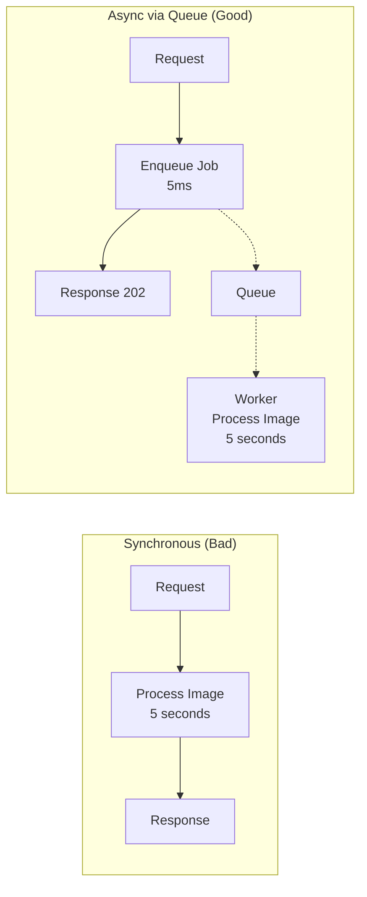
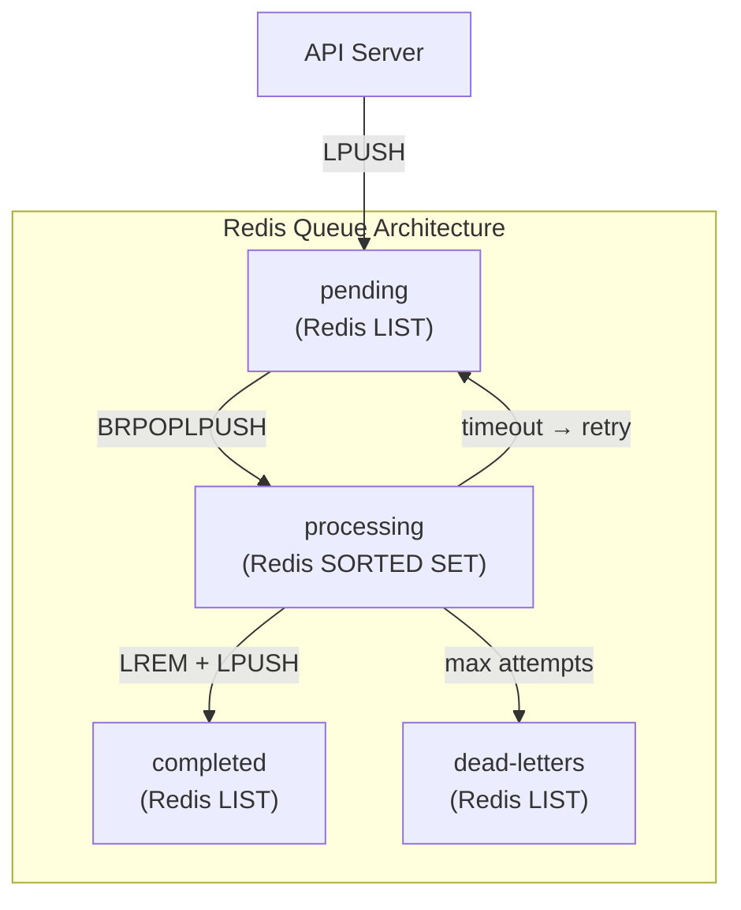

# Lesson 3 — Queue Worker System

## Why Queue Workers?

HTTP request handlers must respond fast. Heavy work should happen asynchronously:



Benefits:
- **Response time**: API responds in milliseconds regardless of work duration
- **Resilience**: If worker crashes, job stays in queue — retry automatically
- **Scaling**: Add more workers without changing the API
- **Rate control**: Process N jobs at a time, protect downstream services

---

## 1. In-Process Job Queue

Before adding Redis or RabbitMQ, understand the core pattern:

```typescript
type JobStatus = "pending" | "active" | "completed" | "failed" | "dead";

interface Job<T = unknown> {
  id: string;
  type: string;
  data: T;
  status: JobStatus;
  attempts: number;
  maxAttempts: number;
  createdAt: number;
  startedAt?: number;
  completedAt?: number;
  error?: string;
  result?: unknown;
}

type JobHandler<T> = (job: Job<T>) => Promise<unknown>;

class JobQueue {
  private queue: Job[] = [];
  private handlers = new Map<string, JobHandler<unknown>>();
  private activeCount = 0;
  private processing = false;
  private deadLetterQueue: Job[] = [];

  constructor(
    private concurrency: number = 5,
    private pollIntervalMs: number = 100
  ) {}

  // Register a handler for a job type
  register<T>(type: string, handler: JobHandler<T>): void {
    this.handlers.set(type, handler as JobHandler<unknown>);
  }

  // Add a job to the queue
  enqueue<T>(type: string, data: T, maxAttempts = 3): Job<T> {
    const job: Job<T> = {
      id: crypto.randomUUID(),
      type,
      data,
      status: "pending",
      attempts: 0,
      maxAttempts,
      createdAt: Date.now(),
    };

    this.queue.push(job as Job);
    this.drain(); // Try to process immediately
    return job;
  }

  // Start processing
  start(): void {
    this.processing = true;
    this.poll();
  }

  stop(): void {
    this.processing = false;
  }

  private poll(): void {
    if (!this.processing) return;

    this.drain();

    setTimeout(() => this.poll(), this.pollIntervalMs);
  }

  private drain(): void {
    while (this.activeCount < this.concurrency) {
      const job = this.queue.find((j) => j.status === "pending");
      if (!job) break;

      this.activeCount++;
      job.status = "active";
      job.startedAt = Date.now();
      job.attempts++;

      this.processJob(job);
    }
  }

  private async processJob(job: Job): Promise<void> {
    const handler = this.handlers.get(job.type);
    if (!handler) {
      job.status = "failed";
      job.error = `No handler for job type: ${job.type}`;
      this.activeCount--;
      return;
    }

    try {
      job.result = await handler(job);
      job.status = "completed";
      job.completedAt = Date.now();
    } catch (err) {
      const message = err instanceof Error ? err.message : String(err);

      if (job.attempts < job.maxAttempts) {
        // Retry with exponential backoff
        job.status = "pending";
        job.error = message;

        const delay = Math.min(
          1000 * Math.pow(2, job.attempts - 1),
          30_000
        );

        setTimeout(() => {
          this.drain();
        }, delay);
      } else {
        // Move to dead letter queue
        job.status = "dead";
        job.error = message;
        this.deadLetterQueue.push(job);
      }
    } finally {
      this.activeCount--;
      this.drain();
    }
  }

  get stats() {
    const byStatus = { pending: 0, active: 0, completed: 0, failed: 0, dead: 0 };
    for (const job of this.queue) {
      byStatus[job.status]++;
    }
    return {
      ...byStatus,
      deadLetters: this.deadLetterQueue.length,
      total: this.queue.length,
    };
  }
}
```

### Usage

```typescript
const queue = new JobQueue(3); // 3 concurrent workers

// Register handlers
queue.register("email", async (job) => {
  const { to, subject, body } = job.data as {
    to: string;
    subject: string;
    body: string;
  };
  console.log(`Sending email to ${to}: ${subject}`);
  await new Promise((r) => setTimeout(r, 500)); // Simulate send
  return { sent: true, messageId: crypto.randomUUID() };
});

queue.register("image-resize", async (job) => {
  const { path, width, height } = job.data as {
    path: string;
    width: number;
    height: number;
  };
  console.log(`Resizing ${path} to ${width}x${height}`);
  await new Promise((r) => setTimeout(r, 2000)); // Simulate processing
  return { outputPath: path.replace(".", `_${width}x${height}.`) };
});

// Start processing
queue.start();

// Enqueue from API handler
queue.enqueue("email", {
  to: "user@example.com",
  subject: "Welcome!",
  body: "Thanks for signing up.",
});

queue.enqueue("image-resize", {
  path: "avatar.png",
  width: 200,
  height: 200,
});
```

---

## 2. Redis-Backed Reliable Queue

In-process queues lose all jobs on crash. Production needs persistence:



### Reliable Queue Protocol

```typescript
// This shows the PROTOCOL — not a Redis client implementation.
// In production, use Bull, BullMQ, or similar.

// The key insight is BRPOPLPUSH (now BLMOVE):
// Atomically pops from 'pending' and pushes to 'processing'.
// If worker crashes after pop but before completion,
// the job is still in 'processing' — a sweeper can detect and re-enqueue.

interface RedisQueueProtocol {
  // 1. Producer enqueues
  enqueue(job: Job): void;
  // Redis command: LPUSH queue:pending <job-json>

  // 2. Worker dequeues atomically
  dequeue(): Job | null;
  // Redis command: BRPOPLPUSH queue:pending queue:processing 5
  // → Blocks up to 5s waiting for a job
  // → Atomically moves job from pending to processing
  // → If worker crashes, job stays in processing (not lost)

  // 3. Worker completes
  complete(jobId: string, result: unknown): void;
  // Redis command: LREM queue:processing 1 <job-json>
  // Redis command: LPUSH queue:completed <job-json>

  // 4. Worker fails
  fail(jobId: string, error: string): void;
  // If attempts < maxAttempts:
  //   Redis command: LREM queue:processing 1 <job-json>
  //   Redis command: LPUSH queue:pending <job-json>  (with delay via ZADD)
  // If attempts >= maxAttempts:
  //   Redis command: LREM queue:processing 1 <job-json>
  //   Redis command: LPUSH queue:dead-letters <job-json>

  // 5. Sweeper recovers stuck jobs
  sweep(): void;
  // Redis command: Check processing list for jobs older than timeout
  // Move back to pending for retry
}
```

### Why BRPOPLPUSH Is Critical

```
Without atomic move:                  With BRPOPLPUSH:

1. RPOP job from pending              1. BRPOPLPUSH pending → processing
2. (worker crashes here)              2. (worker crashes here)
3. Job is LOST forever                3. Job is in 'processing' list
                                      4. Sweeper finds it, re-enqueues
                                      5. Another worker picks it up
```

---

## 3. Concurrency Control

### Rate-Limited Worker

```typescript
class RateLimitedWorker {
  private tokens: number;
  private lastRefill: number;
  private waiters: Array<() => void> = [];

  constructor(
    private maxTokens: number,
    private refillRate: number, // tokens per second
    private refillIntervalMs: number = 100
  ) {
    this.tokens = maxTokens;
    this.lastRefill = Date.now();

    // Refill tokens periodically
    setInterval(() => this.refill(), refillIntervalMs);
  }

  private refill(): void {
    const now = Date.now();
    const elapsed = (now - this.lastRefill) / 1000;
    const newTokens = elapsed * this.refillRate;

    this.tokens = Math.min(this.maxTokens, this.tokens + newTokens);
    this.lastRefill = now;

    // Wake up waiters
    while (this.waiters.length > 0 && this.tokens >= 1) {
      this.tokens--;
      const waiter = this.waiters.shift()!;
      waiter();
    }
  }

  async acquire(): Promise<void> {
    if (this.tokens >= 1) {
      this.tokens--;
      return;
    }

    // Wait for a token
    return new Promise<void>((resolve) => {
      this.waiters.push(resolve);
    });
  }
}

// Usage: protect an external API with rate limiting
const rateLimiter = new RateLimitedWorker(10, 5); // 10 burst, 5/sec refill

async function callExternalAPI(data: unknown): Promise<unknown> {
  await rateLimiter.acquire(); // Wait for rate limit token
  // Now safe to call the API
  const response = await fetch("https://api.example.com/process", {
    method: "POST",
    body: JSON.stringify(data),
    headers: { "Content-Type": "application/json" },
  });
  return response.json();
}
```

### Priority Queue

```typescript
type Priority = "critical" | "high" | "normal" | "low";

const PRIORITY_VALUES: Record<Priority, number> = {
  critical: 0,
  high: 1,
  normal: 2,
  low: 3,
};

class PriorityJobQueue {
  // Separate lists per priority — avoids re-sorting
  private queues = new Map<Priority, Job[]>([
    ["critical", []],
    ["high", []],
    ["normal", []],
    ["low", []],
  ]);

  private activeCount = 0;
  private handlers = new Map<string, JobHandler<unknown>>();

  constructor(private concurrency: number) {}

  register<T>(type: string, handler: JobHandler<T>): void {
    this.handlers.set(type, handler as JobHandler<unknown>);
  }

  enqueue<T>(
    type: string,
    data: T,
    priority: Priority = "normal"
  ): Job<T> {
    const job: Job<T> = {
      id: crypto.randomUUID(),
      type,
      data,
      status: "pending",
      attempts: 0,
      maxAttempts: 3,
      createdAt: Date.now(),
    };

    this.queues.get(priority)!.push(job as Job);
    this.drain();
    return job;
  }

  private getNextJob(): Job | undefined {
    // Always process highest priority first
    for (const priority of ["critical", "high", "normal", "low"] as Priority[]) {
      const queue = this.queues.get(priority)!;
      const idx = queue.findIndex((j) => j.status === "pending");
      if (idx !== -1) return queue[idx];
    }
    return undefined;
  }

  private drain(): void {
    while (this.activeCount < this.concurrency) {
      const job = this.getNextJob();
      if (!job) break;

      this.activeCount++;
      job.status = "active";
      this.processJob(job).finally(() => {
        this.activeCount--;
        this.drain();
      });
    }
  }

  private async processJob(job: Job): Promise<void> {
    const handler = this.handlers.get(job.type);
    if (!handler) return;

    try {
      job.result = await handler(job);
      job.status = "completed";
    } catch (err) {
      job.status = job.attempts < job.maxAttempts ? "pending" : "dead";
      job.error = err instanceof Error ? err.message : String(err);
      job.attempts++;
    }
  }
}
```

---

## 4. Worker Health Monitoring

```typescript
interface WorkerHealth {
  jobsProcessed: number;
  jobsFailed: number;
  avgProcessingTimeMs: number;
  currentActiveJobs: number;
  lastJobCompletedAt: number | null;
  uptime: number;
  memoryMB: number;
}

class MonitoredWorker {
  private jobsProcessed = 0;
  private jobsFailed = 0;
  private totalProcessingTime = 0;
  private activeJobs = 0;
  private lastJobCompletedAt: number | null = null;
  private startTime = Date.now();

  async executeJob(
    handler: () => Promise<unknown>
  ): Promise<unknown> {
    this.activeJobs++;
    const start = performance.now();

    try {
      const result = await handler();
      this.jobsProcessed++;
      return result;
    } catch (err) {
      this.jobsFailed++;
      throw err;
    } finally {
      this.activeJobs--;
      this.totalProcessingTime += performance.now() - start;
      this.lastJobCompletedAt = Date.now();
    }
  }

  getHealth(): WorkerHealth {
    return {
      jobsProcessed: this.jobsProcessed,
      jobsFailed: this.jobsFailed,
      avgProcessingTimeMs:
        this.jobsProcessed > 0
          ? this.totalProcessingTime / this.jobsProcessed
          : 0,
      currentActiveJobs: this.activeJobs,
      lastJobCompletedAt: this.lastJobCompletedAt,
      uptime: Date.now() - this.startTime,
      memoryMB: Math.round(process.memoryUsage().heapUsed / 1024 / 1024),
    };
  }

  isStuck(thresholdMs: number): boolean {
    if (this.activeJobs === 0) return false;
    if (!this.lastJobCompletedAt) {
      // Never completed a job — check against start time
      return Date.now() - this.startTime > thresholdMs;
    }
    return Date.now() - this.lastJobCompletedAt > thresholdMs;
  }
}
```

### Health check server for queue workers

```typescript
import { createServer } from "node:http";

function startHealthServer(
  worker: MonitoredWorker,
  port: number
): void {
  const health = createServer((req, res) => {
    if (req.url === "/health") {
      const report = worker.getHealth();
      const stuck = worker.isStuck(60_000);

      const statusCode = stuck ? 503 : 200;
      const body = JSON.stringify({
        ...report,
        status: stuck ? "stuck" : "healthy",
      });

      res.writeHead(statusCode, {
        "Content-Type": "application/json",
        "Content-Length": Buffer.byteLength(body),
      });
      res.end(body);
      return;
    }

    if (req.url === "/metrics") {
      const report = worker.getHealth();
      // Prometheus format
      const metrics = [
        `worker_jobs_processed_total ${report.jobsProcessed}`,
        `worker_jobs_failed_total ${report.jobsFailed}`,
        `worker_active_jobs ${report.currentActiveJobs}`,
        `worker_avg_processing_ms ${report.avgProcessingTimeMs.toFixed(2)}`,
        `worker_memory_bytes ${report.memoryMB * 1024 * 1024}`,
        `worker_uptime_seconds ${(report.uptime / 1000).toFixed(0)}`,
      ].join("\n");

      res.writeHead(200, { "Content-Type": "text/plain" });
      res.end(metrics);
      return;
    }

    res.writeHead(404);
    res.end("Not Found");
  });

  health.listen(port, () => {
    console.log(`Health server on :${port}`);
  });
}
```

---

## 5. Idempotency

### Why Idempotency Matters

Jobs can be delivered more than once:
- Worker crashes after processing but before acknowledging
- Network timeout between worker and queue
- Queue retries a job that actually succeeded

```
Timeline:
T=0  Worker picks up job "send-email-123"
T=1  Worker sends email successfully
T=2  Worker tries to ACK → network timeout
T=3  Queue thinks job failed → re-enqueues
T=4  Another worker picks up "send-email-123"
T=5  Email sent AGAIN → user gets duplicate

With idempotency:
T=4  Worker checks: "send-email-123" already processed? YES
T=5  Skip processing → ACK → done
```

```typescript
class IdempotentProcessor {
  // In production: use Redis SET with TTL, or a database table
  private processedJobs = new Map<string, {
    result: unknown;
    processedAt: number;
  }>();

  private cleanupInterval: ReturnType<typeof setInterval>;

  constructor(private ttlMs: number = 86_400_000) { // 24h default
    // Periodically clean old entries
    this.cleanupInterval = setInterval(() => this.cleanup(), 3_600_000);
  }

  async process<T>(
    jobId: string,
    handler: () => Promise<T>
  ): Promise<{ result: T; duplicate: boolean }> {
    // Check if already processed
    const existing = this.processedJobs.get(jobId);
    if (existing) {
      console.log(`Job ${jobId} already processed, returning cached result`);
      return { result: existing.result as T, duplicate: true };
    }

    // Process the job
    const result = await handler();

    // Record completion
    this.processedJobs.set(jobId, {
      result,
      processedAt: Date.now(),
    });

    return { result, duplicate: false };
  }

  private cleanup(): void {
    const now = Date.now();
    let cleaned = 0;
    for (const [key, value] of this.processedJobs) {
      if (now - value.processedAt > this.ttlMs) {
        this.processedJobs.delete(key);
        cleaned++;
      }
    }
    if (cleaned > 0) {
      console.log(`Cleaned ${cleaned} old idempotency records`);
    }
  }

  destroy(): void {
    clearInterval(this.cleanupInterval);
  }
}

// Usage
const idempotent = new IdempotentProcessor();

queue.register("payment", async (job) => {
  const { result, duplicate } = await idempotent.process(
    job.id,
    async () => {
      // This runs AT MOST ONCE per job ID
      const payment = job.data as { userId: string; amount: number };
      console.log(`Charging $${payment.amount} to ${payment.userId}`);
      return { transactionId: crypto.randomUUID() };
    }
  );

  if (duplicate) {
    console.log(`Payment ${job.id} was a duplicate — no charge`);
  }

  return result;
});
```

---

## Interview Questions

### Q1: "How do you ensure a job is processed exactly once?"

**Answer:**

You can't guarantee exactly-once processing in a distributed system. You aim for **at-least-once delivery** combined with **idempotent processing**:

1. **At-least-once delivery**: The queue retries failed jobs. If a worker crashes after processing but before acknowledging, the job re-enters the queue. This means the handler may be called multiple times.

2. **Idempotent handler**: The handler checks if the job was already processed (using the job ID as a deduplication key stored in Redis/DB with a TTL). If yes, it returns the cached result without re-executing.

3. **BRPOPLPUSH pattern**: Atomically moves the job from pending to processing list. If the worker crashes, a sweeper recovers stuck jobs from the processing list.

The combination gives you **effectively-once processing**: the job might be delivered multiple times, but the side effect (charge money, send email) happens only once.

Common mistake: using an in-memory Set for deduplication — it's lost on restart, so duplicates happen after deploys.

---

### Q2: "How do you handle a queue worker that's slower than the producer?"

**Answer:**

This is a **backpressure** problem at the system level:

1. **Concurrency limit**: Workers process N jobs at a time. Increasing N helps until CPU/memory saturates.

2. **Horizontal scaling**: Add more worker processes/containers. Kubernetes HPA can auto-scale based on queue depth.

3. **Priority queues**: Critical jobs jump ahead of bulk operations. Separate priority lanes ensure important work isn't delayed.

4. **Rate limiting on the producer**: If the queue grows too large, the API returns 429 or 503 to slow down clients.

5. **Batch processing**: Instead of one job per record, batch 1000 records into one job. Reduces queue overhead.

6. **Dead letter queue**: After N retries, move failed jobs to a DLQ rather than blocking the main queue with poison pills.

Monitoring is key: track queue depth, processing time, and throughput. Alert when queue depth grows monotonically.

---

### Q3: "What's the difference between in-process queues and Redis-backed queues?"

**Answer:**

| Aspect | In-Process | Redis-Backed |
|--------|-----------|-------------|
| **Persistence** | Lost on crash/restart | Survives restarts |
| **Scaling** | Single process only | Multiple workers, multiple servers |
| **Latency** | ~0.001ms enqueue | ~0.5ms network round trip |
| **Reliability** | No retry after crash | At-least-once with BRPOPLPUSH |
| **Complexity** | Zero dependencies | Redis dependency, connection management |
| **Memory** | Limited by process heap | Limited by Redis server memory |
| **Visibility** | Must instrument manually | Redis commands for inspection |

**When to use in-process**: Non-critical tasks, low volume, development, single-server apps. Examples: debouncing, rate limiting within a request.

**When to use Redis**: Anything where losing the job matters. Payment processing, email sending, webhook delivery, image processing. Also required when you have multiple server instances that need to share a work queue.

Note: Even with Redis, the queue is "just" a list. For guaranteed ordering, exactly-once semantics with transactions, or complex routing, consider a proper message broker like RabbitMQ or Kafka.
