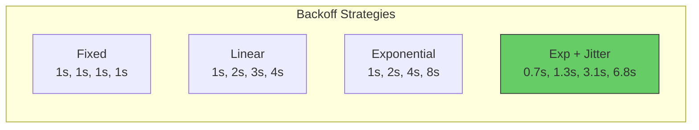
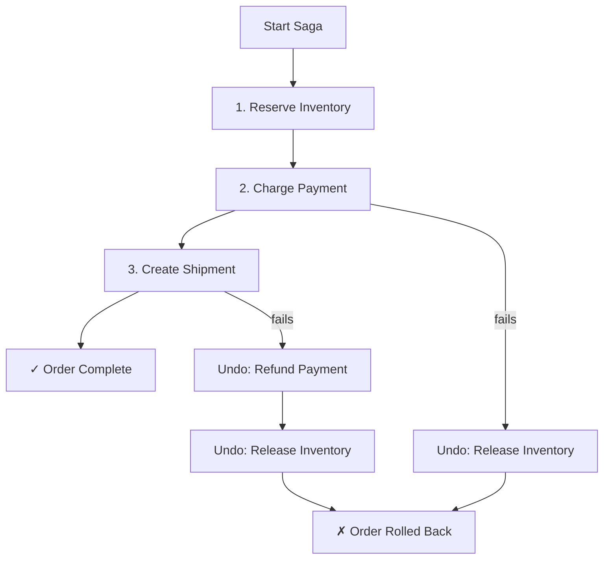
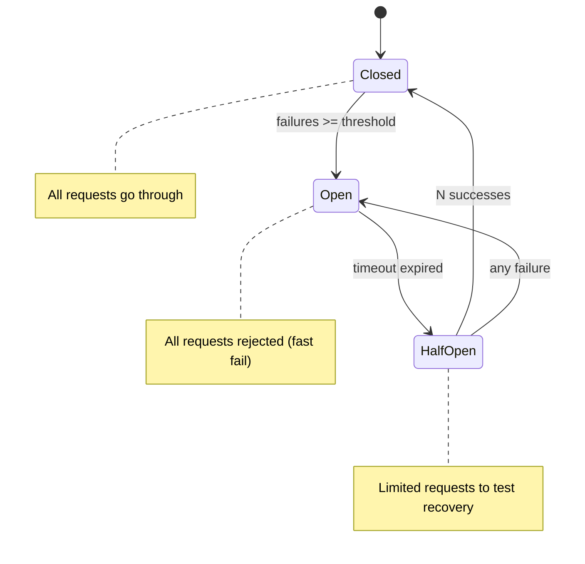
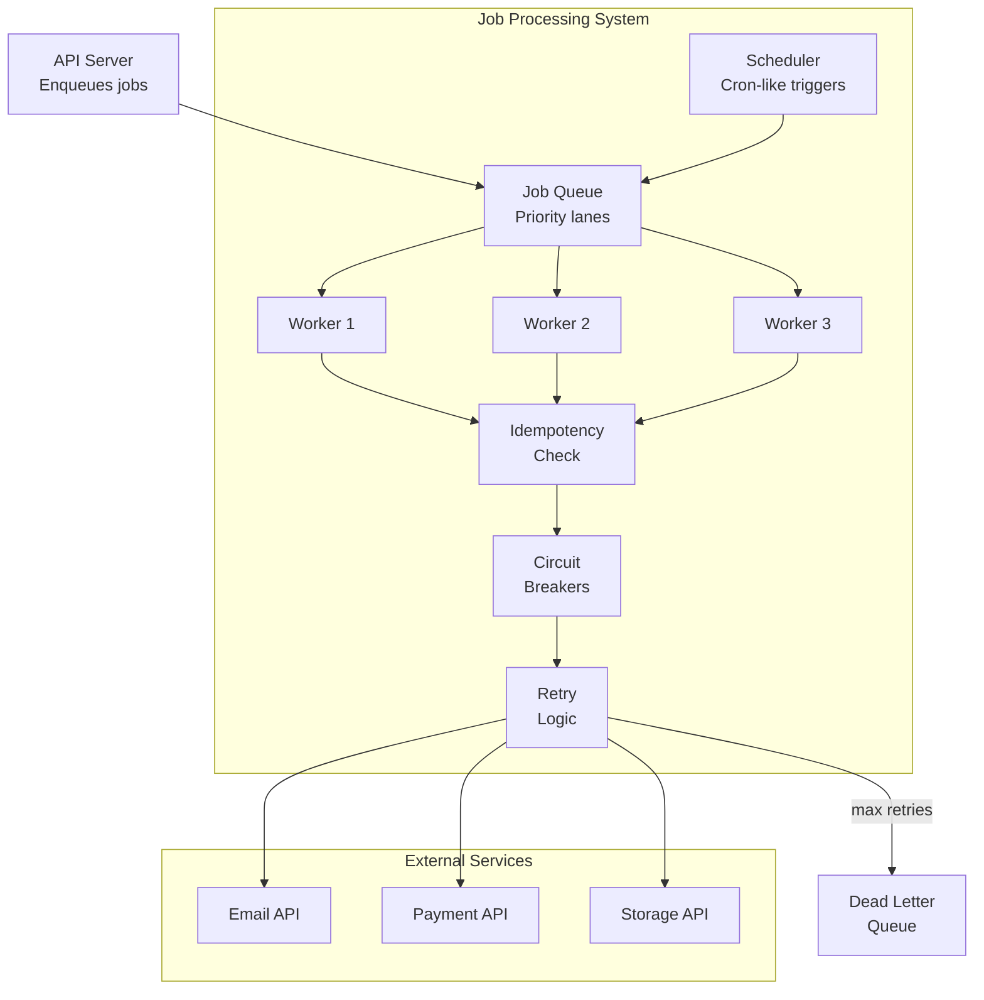

# Lesson 4 — Background Job Processing

## Beyond Simple Queues

Lesson 3 covered queue workers. This lesson covers the **orchestration layer** — scheduling, retrying with strategies, job dependencies, and operational patterns.

---

## 1. Job Scheduler

### Cron-like Scheduling Without Dependencies

```typescript
interface ScheduledJob {
  id: string;
  name: string;
  schedule: string; // Simplified cron: "every 5m", "every 1h", "daily 03:00"
  handler: () => Promise<void>;
  lastRun: number | null;
  nextRun: number;
  running: boolean;
  enabled: boolean;
}

class JobScheduler {
  private jobs = new Map<string, ScheduledJob>();
  private timer: ReturnType<typeof setInterval> | null = null;

  register(
    name: string,
    schedule: string,
    handler: () => Promise<void>
  ): string {
    const id = crypto.randomUUID();
    const nextRun = this.calculateNextRun(schedule);

    this.jobs.set(id, {
      id,
      name,
      schedule,
      handler,
      lastRun: null,
      nextRun,
      running: false,
      enabled: true,
    });

    return id;
  }

  start(): void {
    // Check every second for due jobs
    this.timer = setInterval(() => this.tick(), 1000);
    console.log(`Scheduler started with ${this.jobs.size} jobs`);
  }

  stop(): void {
    if (this.timer) {
      clearInterval(this.timer);
      this.timer = null;
    }
  }

  private async tick(): Promise<void> {
    const now = Date.now();

    for (const job of this.jobs.values()) {
      if (!job.enabled || job.running || now < job.nextRun) continue;

      job.running = true;
      const startTime = performance.now();

      try {
        console.log(`[Scheduler] Running: ${job.name}`);
        await job.handler();
        const elapsed = performance.now() - startTime;
        console.log(`[Scheduler] Completed: ${job.name} (${elapsed.toFixed(0)}ms)`);
      } catch (err) {
        const message = err instanceof Error ? err.message : String(err);
        console.error(`[Scheduler] Failed: ${job.name} — ${message}`);
      } finally {
        job.running = false;
        job.lastRun = now;
        job.nextRun = this.calculateNextRun(job.schedule);
      }
    }
  }

  private calculateNextRun(schedule: string): number {
    const now = Date.now();

    // Parse "every Nm" or "every Nh" or "every Ns"
    const intervalMatch = schedule.match(/^every\s+(\d+)([smh])$/);
    if (intervalMatch) {
      const value = Number(intervalMatch[1]);
      const unit = intervalMatch[2];
      const multipliers: Record<string, number> = {
        s: 1_000,
        m: 60_000,
        h: 3_600_000,
      };
      return now + value * multipliers[unit];
    }

    // Parse "daily HH:MM"
    const dailyMatch = schedule.match(/^daily\s+(\d{2}):(\d{2})$/);
    if (dailyMatch) {
      const hour = Number(dailyMatch[1]);
      const minute = Number(dailyMatch[2]);
      const next = new Date();
      next.setHours(hour, minute, 0, 0);
      if (next.getTime() <= now) {
        next.setDate(next.getDate() + 1);
      }
      return next.getTime();
    }

    throw new Error(`Invalid schedule: ${schedule}`);
  }

  getStatus(): Array<{
    name: string;
    running: boolean;
    enabled: boolean;
    lastRun: string;
    nextRun: string;
  }> {
    return [...this.jobs.values()].map((job) => ({
      name: job.name,
      running: job.running,
      enabled: job.enabled,
      lastRun: job.lastRun ? new Date(job.lastRun).toISOString() : "never",
      nextRun: new Date(job.nextRun).toISOString(),
    }));
  }
}
```

### Usage

```typescript
const scheduler = new JobScheduler();

// Clean up expired sessions every 5 minutes
scheduler.register("session-cleanup", "every 5m", async () => {
  // const deleted = await db.query("DELETE FROM sessions WHERE expires_at < NOW()");
  console.log("Cleaned expired sessions");
});

// Generate daily reports at 3:00 AM
scheduler.register("daily-report", "daily 03:00", async () => {
  // const stats = await generateDailyStats();
  // await sendReportEmail(stats);
  console.log("Daily report generated and sent");
});

// Health check external services every 30 seconds
scheduler.register("healthcheck", "every 30s", async () => {
  const services = ["https://api.example.com/health", "https://auth.example.com/health"];
  const results = await Promise.allSettled(
    services.map((url) =>
      fetch(url, { signal: AbortSignal.timeout(5000) })
    )
  );

  for (let i = 0; i < services.length; i++) {
    const status = results[i].status === "fulfilled" ? "UP" : "DOWN";
    console.log(`  ${services[i]}: ${status}`);
  }
});

scheduler.start();
```

---

## 2. Advanced Retry Strategies

### Retry with Backoff Strategies

```typescript
type BackoffStrategy = "fixed" | "exponential" | "exponential-jitter" | "linear";

interface RetryOptions {
  maxAttempts: number;
  strategy: BackoffStrategy;
  baseDelayMs: number;
  maxDelayMs: number;
}

function calculateDelay(
  attempt: number,
  options: RetryOptions
): number {
  let delay: number;

  switch (options.strategy) {
    case "fixed":
      delay = options.baseDelayMs;
      break;

    case "linear":
      delay = options.baseDelayMs * attempt;
      break;

    case "exponential":
      delay = options.baseDelayMs * Math.pow(2, attempt - 1);
      break;

    case "exponential-jitter":
      // Full jitter — prevents thundering herd
      const expDelay = options.baseDelayMs * Math.pow(2, attempt - 1);
      delay = Math.random() * expDelay;
      break;
  }

  return Math.min(delay, options.maxDelayMs);
}

async function withRetry<T>(
  fn: () => Promise<T>,
  options: RetryOptions,
  shouldRetry?: (err: Error) => boolean
): Promise<T> {
  let lastError: Error | null = null;

  for (let attempt = 1; attempt <= options.maxAttempts; attempt++) {
    try {
      return await fn();
    } catch (err) {
      lastError = err instanceof Error ? err : new Error(String(err));

      // Check if this error is retryable
      if (shouldRetry && !shouldRetry(lastError)) {
        throw lastError; // Non-retryable error
      }

      if (attempt === options.maxAttempts) {
        throw lastError; // Last attempt
      }

      const delay = calculateDelay(attempt, options);
      console.log(
        `Attempt ${attempt}/${options.maxAttempts} failed: ${lastError.message}. ` +
        `Retrying in ${delay.toFixed(0)}ms...`
      );
      await new Promise((r) => setTimeout(r, delay));
    }
  }

  throw lastError!;
}
```

### Why Jitter Matters

```
Without jitter (all workers retry together):
T=0   100 workers fail
T=1s  100 workers retry → service overwhelmed → all fail again
T=2s  100 workers retry → same
T=4s  100 workers retry → same
(thundering herd continues)

With exponential + jitter:
T=0     100 workers fail
T=0.3s  Worker 7 retries → succeeds
T=0.7s  Worker 23 retries → succeeds 
T=1.1s  Worker 45 retries → succeeds
T=1.5s  Worker 12 retries → succeeds
(load spreads evenly, service recovers)
```



### Classifying Errors

```typescript
// Not all errors should be retried
function isRetryable(err: Error): boolean {
  const message = err.message.toLowerCase();

  // Network errors — always retry
  if (message.includes("econnrefused")) return true;
  if (message.includes("econnreset")) return true;
  if (message.includes("etimedout")) return true;
  if (message.includes("socket hang up")) return true;

  // HTTP status-based (if available)
  if ("statusCode" in err) {
    const code = (err as { statusCode: number }).statusCode;
    // 429: Too Many Requests — retry after backoff
    if (code === 429) return true;
    // 500-503: Server errors — may be temporary
    if (code >= 500 && code <= 503) return true;
    // 400, 401, 403, 404: Client errors — won't fix on retry
    if (code >= 400 && code < 500) return false;
  }

  // Default: don't retry unknown errors
  return false;
}
```

---

## 3. Job Dependencies and Workflows

### Sequential Job Chain

```typescript
interface WorkflowStep {
  name: string;
  handler: (input: unknown) => Promise<unknown>;
}

class Workflow {
  private steps: WorkflowStep[] = [];

  addStep(name: string, handler: (input: unknown) => Promise<unknown>): this {
    this.steps.push({ name, handler });
    return this;
  }

  async execute(initialInput: unknown): Promise<{
    success: boolean;
    results: Array<{ step: string; result?: unknown; error?: string }>;
    completedSteps: number;
    totalSteps: number;
  }> {
    const results: Array<{ step: string; result?: unknown; error?: string }> = [];
    let input = initialInput;

    for (let i = 0; i < this.steps.length; i++) {
      const step = this.steps[i];
      const startTime = performance.now();

      try {
        console.log(`[Workflow] Step ${i + 1}/${this.steps.length}: ${step.name}`);
        input = await step.handler(input);
        const elapsed = performance.now() - startTime;

        results.push({ step: step.name, result: input });
        console.log(`[Workflow] ✓ ${step.name} (${elapsed.toFixed(0)}ms)`);
      } catch (err) {
        const message = err instanceof Error ? err.message : String(err);
        results.push({ step: step.name, error: message });
        console.error(`[Workflow] ✗ ${step.name}: ${message}`);

        return {
          success: false,
          results,
          completedSteps: i,
          totalSteps: this.steps.length,
        };
      }
    }

    return {
      success: true,
      results,
      completedSteps: this.steps.length,
      totalSteps: this.steps.length,
    };
  }
}

// Usage: User signup workflow
const signupWorkflow = new Workflow()
  .addStep("validate", async (input) => {
    const { email, name } = input as { email: string; name: string };
    if (!email.includes("@")) throw new Error("Invalid email");
    return { email: email.toLowerCase(), name: name.trim() };
  })
  .addStep("create-user", async (input) => {
    const { email, name } = input as { email: string; name: string };
    const userId = crypto.randomUUID();
    // await db.insert("users", { id: userId, email, name });
    return { userId, email, name };
  })
  .addStep("send-welcome-email", async (input) => {
    const { userId, email } = input as { userId: string; email: string };
    // await emailService.send(email, "Welcome!", "...");
    return { ...input as object, emailSent: true };
  })
  .addStep("provision-resources", async (input) => {
    const { userId } = input as { userId: string };
    // await storageService.createBucket(userId);
    // await quotaService.initialize(userId);
    return { ...input as object, provisioned: true };
  });

// Execute
const result = await signupWorkflow.execute({
  email: "user@example.com",
  name: "Jane Doe",
});
console.log(JSON.stringify(result, null, 2));
```

---

## 4. Saga Pattern for Distributed Transactions

When steps span multiple services, failures need **compensating actions**:



```typescript
interface SagaStep<T> {
  name: string;
  execute: (context: T) => Promise<T>;
  compensate: (context: T) => Promise<void>;
}

class Saga<T> {
  private steps: SagaStep<T>[] = [];

  addStep(step: SagaStep<T>): this {
    this.steps.push(step);
    return this;
  }

  async execute(initialContext: T): Promise<{
    success: boolean;
    context: T;
    failedStep?: string;
    compensationErrors: string[];
  }> {
    let context = initialContext;
    const completedSteps: SagaStep<T>[] = [];

    for (const step of this.steps) {
      try {
        console.log(`[Saga] Executing: ${step.name}`);
        context = await step.execute(context);
        completedSteps.push(step);
      } catch (err) {
        const message = err instanceof Error ? err.message : String(err);
        console.error(`[Saga] Failed: ${step.name} — ${message}`);

        // Compensate in reverse order
        const compensationErrors: string[] = [];
        for (let i = completedSteps.length - 1; i >= 0; i--) {
          const compensateStep = completedSteps[i];
          try {
            console.log(`[Saga] Compensating: ${compensateStep.name}`);
            await compensateStep.compensate(context);
          } catch (compErr) {
            const compMessage = compErr instanceof Error
              ? compErr.message
              : String(compErr);
            compensationErrors.push(
              `${compensateStep.name}: ${compMessage}`
            );
            console.error(
              `[Saga] Compensation failed: ${compensateStep.name} — ${compMessage}`
            );
            // Continue compensating other steps even if one fails
          }
        }

        return {
          success: false,
          context,
          failedStep: step.name,
          compensationErrors,
        };
      }
    }

    return {
      success: true,
      context,
      compensationErrors: [],
    };
  }
}

// Usage: Order processing saga
interface OrderContext {
  orderId: string;
  userId: string;
  items: Array<{ productId: string; quantity: number }>;
  totalAmount: number;
  reservationId?: string;
  paymentId?: string;
  shipmentId?: string;
}

const orderSaga = new Saga<OrderContext>()
  .addStep({
    name: "reserve-inventory",
    execute: async (ctx) => {
      // const reservation = await inventoryService.reserve(ctx.items);
      const reservationId = crypto.randomUUID();
      console.log(`  Reserved inventory: ${reservationId}`);
      return { ...ctx, reservationId };
    },
    compensate: async (ctx) => {
      if (ctx.reservationId) {
        // await inventoryService.release(ctx.reservationId);
        console.log(`  Released inventory: ${ctx.reservationId}`);
      }
    },
  })
  .addStep({
    name: "charge-payment",
    execute: async (ctx) => {
      // const payment = await paymentService.charge(ctx.userId, ctx.totalAmount);
      const paymentId = crypto.randomUUID();
      console.log(`  Charged $${ctx.totalAmount}: ${paymentId}`);
      return { ...ctx, paymentId };
    },
    compensate: async (ctx) => {
      if (ctx.paymentId) {
        // await paymentService.refund(ctx.paymentId);
        console.log(`  Refunded: ${ctx.paymentId}`);
      }
    },
  })
  .addStep({
    name: "create-shipment",
    execute: async (ctx) => {
      // const shipment = await shippingService.create(ctx.orderId, ctx.items);
      const shipmentId = crypto.randomUUID();
      console.log(`  Shipment created: ${shipmentId}`);
      return { ...ctx, shipmentId };
    },
    compensate: async (ctx) => {
      if (ctx.shipmentId) {
        // await shippingService.cancel(ctx.shipmentId);
        console.log(`  Shipment cancelled: ${ctx.shipmentId}`);
      }
    },
  });

const orderResult = await orderSaga.execute({
  orderId: "order-001",
  userId: "user-123",
  items: [{ productId: "prod-1", quantity: 2 }],
  totalAmount: 49.99,
});
```

---

## 5. Operational Patterns

### Circuit Breaker

Prevent cascading failures when a downstream service is down:

```typescript
type CircuitState = "closed" | "open" | "half-open";

class CircuitBreaker {
  private state: CircuitState = "closed";
  private failures = 0;
  private lastFailureTime = 0;
  private successCount = 0;

  constructor(
    private options: {
      failureThreshold: number;  // Open after N failures
      resetTimeout: number;      // Try again after N ms
      halfOpenMaxAttempts: number; // Successes needed to close
    }
  ) {}

  async execute<T>(fn: () => Promise<T>): Promise<T> {
    if (this.state === "open") {
      // Check if enough time passed to try again
      if (Date.now() - this.lastFailureTime > this.options.resetTimeout) {
        this.state = "half-open";
        this.successCount = 0;
        console.log("[Circuit] State: half-open (trying again)");
      } else {
        throw new Error("Circuit breaker is OPEN — request rejected");
      }
    }

    try {
      const result = await fn();

      if (this.state === "half-open") {
        this.successCount++;
        if (this.successCount >= this.options.halfOpenMaxAttempts) {
          this.state = "closed";
          this.failures = 0;
          console.log("[Circuit] State: closed (recovered)");
        }
      } else {
        this.failures = 0; // Reset on success
      }

      return result;
    } catch (err) {
      this.failures++;
      this.lastFailureTime = Date.now();

      if (this.state === "half-open") {
        this.state = "open";
        console.log("[Circuit] State: open (half-open attempt failed)");
      } else if (this.failures >= this.options.failureThreshold) {
        this.state = "open";
        console.log(
          `[Circuit] State: open (${this.failures} failures, ` +
          `will retry in ${this.options.resetTimeout}ms)`
        );
      }

      throw err;
    }
  }

  getState(): { state: CircuitState; failures: number } {
    return { state: this.state, failures: this.failures };
  }
}
```



### Usage with HTTP Client

```typescript
const paymentCircuit = new CircuitBreaker({
  failureThreshold: 5,
  resetTimeout: 30_000, // 30s
  halfOpenMaxAttempts: 3,
});

async function chargePayment(
  userId: string,
  amount: number
): Promise<{ transactionId: string }> {
  return paymentCircuit.execute(async () => {
    const response = await fetch("https://payments.internal/charge", {
      method: "POST",
      body: JSON.stringify({ userId, amount }),
      headers: { "Content-Type": "application/json" },
      signal: AbortSignal.timeout(5000),
    });

    if (!response.ok) {
      throw new Error(`Payment failed: ${response.status}`);
    }

    return response.json();
  });
}
```

---

## 6. Complete Background Job System

```typescript
// Putting it all together:
// Scheduler → Queue → Worker → Circuit Breaker → Retry → Idempotency

async function buildJobSystem(): Promise<void> {
  const queue = new JobQueue(5);
  const scheduler = new JobScheduler();
  const idempotent = new IdempotentProcessor();
  const worker = new MonitoredWorker();

  // Services with circuit breakers
  const emailCircuit = new CircuitBreaker({
    failureThreshold: 3,
    resetTimeout: 60_000,
    halfOpenMaxAttempts: 2,
  });

  // Register handlers
  queue.register("send-email", async (job) => {
    return worker.executeJob(async () => {
      return idempotent.process(job.id, async () => {
        return emailCircuit.execute(async () => {
          return withRetry(
            async () => {
              const { to, subject } = job.data as { to: string; subject: string };
              const response = await fetch("https://email.internal/send", {
                method: "POST",
                body: JSON.stringify({ to, subject }),
                headers: { "Content-Type": "application/json" },
                signal: AbortSignal.timeout(10_000),
              });
              if (!response.ok) throw new Error(`Email API: ${response.status}`);
              return response.json();
            },
            {
              maxAttempts: 3,
              strategy: "exponential-jitter",
              baseDelayMs: 1000,
              maxDelayMs: 30_000,
            },
            isRetryable
          );
        });
      });
    });
  });

  // Schedule periodic jobs
  scheduler.register("cleanup-dead-letters", "every 1h", async () => {
    // Process dead letter queue
    console.log("Processing dead letters...");
  });

  // Start everything
  queue.start();
  scheduler.start();
  startHealthServer(worker, 9090);

  // Graceful shutdown
  process.on("SIGTERM", () => {
    scheduler.stop();
    queue.stop();
    idempotent.destroy();
    process.exit(0);
  });

  console.log("Background job system started");
}
```

### Architecture Summary



---

## Interview Questions

### Q1: "Explain the Saga pattern. When would you use it instead of a distributed transaction?"

**Answer:**

The Saga pattern is an alternative to distributed transactions (2PC) for maintaining consistency across multiple services:

**How it works**: A saga is a sequence of local transactions. Each step has a compensating action (undo). If step N fails, execute compensating actions for steps N-1 through 1 in reverse order.

**When to use Saga over 2PC**:
- **Microservices**: Each service owns its own database. 2PC requires a global transaction coordinator with locks — impractical across services.
- **Long-running transactions**: 2PC holds locks for the entire duration. A saga locks each resource briefly and releases immediately.
- **Performance**: 2PC's prepare phase doubles the number of network round trips and blocks resources. Sagas are non-blocking.
- **Availability**: If one participant in 2PC crashes, all others are blocked. In a saga, other operations continue — only the failed saga runs compensation.

**Trade-offs**:
- Sagas provide **eventual consistency**, not immediate
- Compensation logic can be complex (what if the refund API also fails?)
- No isolation — intermediate states are visible (order shows "processing" briefly before rollback)
- Harder to reason about than a single transaction

---

### Q2: "When would you use a circuit breaker vs. just retrying?"

**Answer:**

They solve different problems and work best together:

**Retry** handles **transient failures** — a request that failed once but will likely succeed on the next attempt (network blip, temporary timeout, 503).

**Circuit breaker** handles **systemic failures** — the downstream service is consistently failing and retrying wastes resources. It provides **fast failure** instead of waiting for timeouts.

Without circuit breaker: 1000 requests/sec → each retries 3 times with 5s timeout → 3000 pending requests × 5s = 15,000 seconds of blocked event loop time accumulating.

With circuit breaker: After 5 failures, circuit opens → next 995 requests fail immediately (< 1ms) → no timeout waiting → server stays responsive → after 30s, one test request checks if service recovered.

**Use together**: Retry wraps the actual call (handles transient errors). Circuit breaker wraps the retry (prevents retry storms when service is down).

```typescript
// Correct layering:
circuitBreaker.execute(() => 
  withRetry(() => 
    callService()
  )
)
```

---

### Q3: "How do you handle a compensation that fails in a saga?"

**Answer:**

This is the hardest problem in sagas. Options:

1. **Retry the compensation**: Compensating actions should be idempotent. Retry them with exponential backoff. Most compensation failures are transient (network issues).

2. **Log and alert**: If compensation still fails after retries, log the saga state (which steps completed, which compensations failed) and alert an engineer. Some scenarios require manual intervention.

3. **Compensation queue**: Instead of executing compensation inline, enqueue a compensation job. The job processor retries independently. If it fails permanently, it goes to the dead letter queue for manual processing.

4. **Design compensations to be simple**: A refund is simpler than a reversal. A "release hold" is simpler than "undo a transfer." Design your steps so compensations are trivially reliable.

5. **Accept eventual consistency**: If the payment was refunded but inventory release failed, schedule a periodic reconciliation job that detects and fixes inconsistencies.

The key principle: **compensations should be idempotent and retriable**. If calling `refund(paymentId)` twice results in two refunds, that's a bug. It should detect "already refunded" and succeed silently.
