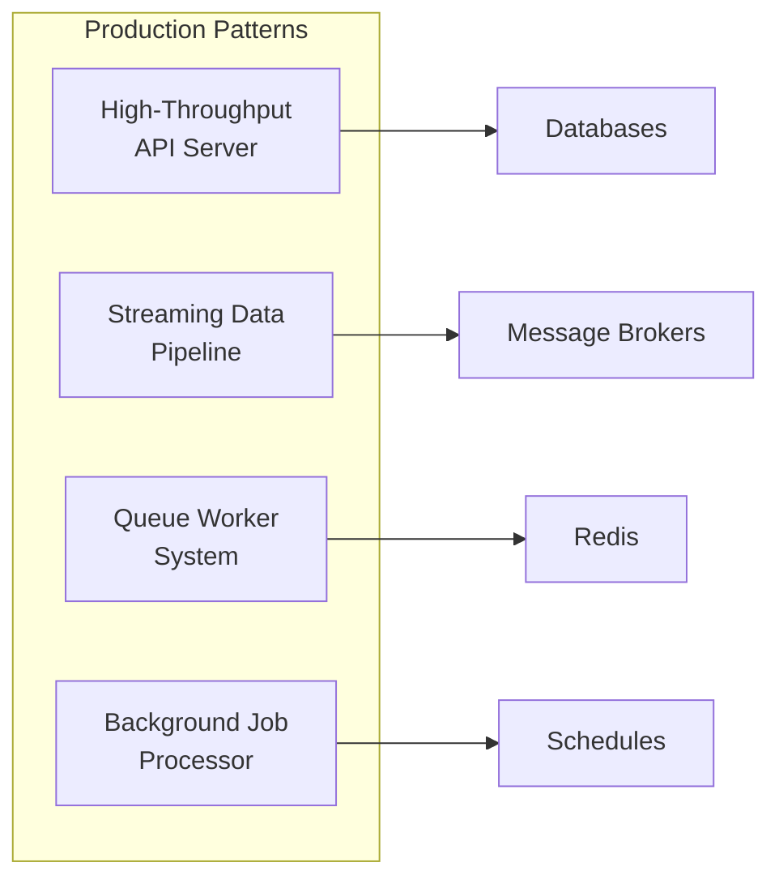

# Module 13 — Production Architecture Patterns

## Overview

This module applies everything from Modules 01-12 to build production-grade systems. Each lesson implements a complete, deployable pattern.

## Lessons

| # | File | Topic | Key Concepts |
|---|------|-------|-------------|
| 1 | [01-high-throughput-api.md](01-high-throughput-api.md) | High-Throughput API Server | Connection pooling, caching layers, graceful shutdown |
| 2 | [02-streaming-pipeline.md](02-streaming-pipeline.md) | Streaming Data Pipeline | Transform streams, backpressure, error recovery |
| 3 | [03-queue-worker.md](03-queue-worker.md) | Queue Worker System | Job processing, concurrency control, dead letter queues |
| 4 | [04-background-jobs.md](04-background-jobs.md) | Background Job Processing | Scheduled tasks, retries, idempotency |
