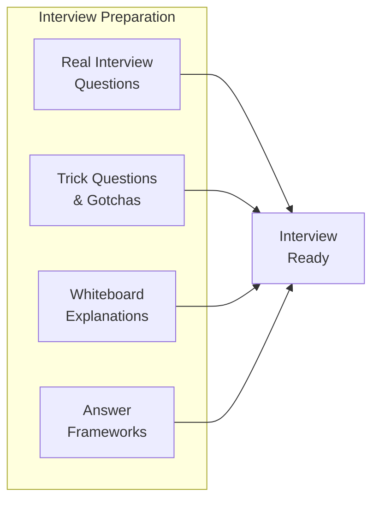

# Module 14 — Interview Mastery

## Overview

This module compiles everything from Modules 01-13 into interview-ready format. Each lesson targets a specific interview skill.

## Lessons

| # | File | Topic | What You'll Practice |
|---|------|-------|---------------------|
| 1 | [01-real-questions.md](01-real-questions.md) | Real Interview Questions | 20 questions from actual interviews, with deep answers |
| 2 | [02-trick-questions.md](02-trick-questions.md) | Trick Questions & Gotchas | Questions designed to expose shallow knowledge |
| 3 | [03-whiteboard-explanations.md](03-whiteboard-explanations.md) | Whiteboard Explanations | How to draw and explain runtime concepts |
| 4 | [04-answer-frameworks.md](04-answer-frameworks.md) | Structured Answer Frameworks | STAR, depth-first, and comparison frameworks |
