# Advanced Node.js & Bun Runtime Internals

> A deep-dive curriculum for experienced developers who want to understand **how Node.js actually works** — from V8 and libuv internals to production performance engineering.

---

## Who This Is For

| Attribute | Description |
|---|---|
| **Experience** | 3+ years Node.js backend development |
| **Comfort Zone** | JavaScript, TypeScript, async/await, HTTP servers, databases |
| **Frameworks** | Express, Fastify, Hono, NestJS |
| **Track Record** | Has built production services |
| **Pain Point** | Fails technical interviews on **runtime internals** |
| **Goal** | Runtime engineer-level understanding of Node.js and Bun |

## Runtime Target

- **Node.js 25+** — TypeScript runs natively without compilation
- **Bun** — for comparison and alternative runtime understanding
- All code examples are written in **TypeScript**

---

## Curriculum Overview

```mermaid
graph LR
    subgraph Foundations
        M01[01 Runtime Architecture]
        M02[02 Event Loop]
        M03[03 libuv Internals]
    end
    subgraph Core Systems
        M04[04 Filesystem]
        M05[05 Networking]
        M06[06 Streams]
        M07[07 Memory]
    end
    subgraph Parallelism
        M08[08 Worker Threads]
        M09[09 Cluster]
    end
    subgraph Engineering
        M10[10 Performance]
        M11[11 Diagnostics]
        M12[12 Bun Runtime]
        M13[13 Production Systems]
    end
    subgraph Mastery
        M14[14 Interview Mastery]
    end

    M01 --> M02 --> M03
    M03 --> M04 --> M05 --> M06
    M06 --> M07
    M07 --> M08 --> M09
    M09 --> M10 --> M11
    M11 --> M12 --> M13 --> M14
```

---

## Modules

| # | Module | Lessons | Focus |
|---|--------|---------|-------|
| 01 | [Runtime Architecture](01-runtime-architecture/README.md) | 4 | V8, libuv, bindings, startup lifecycle |
| 02 | [Event Loop Deep Dive](02-event-loop/README.md) | 5 | Phases, microtasks, nextTick, execution ordering |
| 03 | [libuv Internals](03-libuv-internals/README.md) | 4 | Thread pool, async I/O, kernel integration |
| 04 | [Filesystem Internals](04-filesystem-internals/README.md) | 4 | File descriptors, streams, buffers, zero-copy |
| 05 | [Networking Internals](05-networking-internals/README.md) | 5 | TCP, sockets, HTTP parsing, raw servers |
| 06 | [Streams & Backpressure](06-streams-backpressure/README.md) | 4 | Readable, Writable, Transform, pipeline |
| 07 | [Memory Management](07-memory-management/README.md) | 4 | V8 heap, GC algorithms, leak detection |
| 08 | [Worker Threads & Parallelism](08-worker-threads/README.md) | 4 | SharedArrayBuffer, Atomics, message passing |
| 09 | [Cluster & Multi-Process](09-cluster-multiprocess/README.md) | 3 | Cluster module, load balancing, IPC |
| 10 | [Performance Engineering](10-performance-engineering/README.md) | 5 | Profiling, flamegraphs, benchmarking |
| 11 | [Advanced Diagnostics](11-advanced-diagnostics/README.md) | 4 | async_hooks, trace events, diagnostic reports |
| 12 | [Bun Runtime Internals](12-bun-runtime/README.md) | 4 | JSC vs V8, event loop, I/O differences |
| 13 | [Production Architecture](13-production-systems/README.md) | 4 | High-throughput APIs, streaming, queues |
| 14 | [Interview Mastery](14-interview-mastery/README.md) | 4 | Questions, traps, whiteboard explanations |

---

## How to Use This Curriculum

1. **Read** [START_HERE.md](START_HERE.md) for setup and prerequisites
2. **Follow** modules in order — each builds on the previous
3. **Run** every code example — understanding comes from experimentation
4. **Answer** interview questions at the end of each lesson before moving on
5. **Build** the labs — production-grade understanding requires hands-on work

## Prerequisites

- Node.js 25+ installed (TypeScript runs natively)
- Bun installed (for Module 12)
- Linux or macOS (for syscall exploration)
- A terminal profiler (perf, dtrace, or similar)
- VS Code with Node.js debugging configured

---

## Philosophy

This curriculum teaches Node.js the way a **runtime engineer** understands it:

- Every abstraction is peeled back to its system call
- Every API is connected to its C++ binding and libuv operation
- Performance is measured, not guessed
- Interview answers are grounded in implementation knowledge, not documentation summaries

> "The map is not the territory." — We study the territory.
