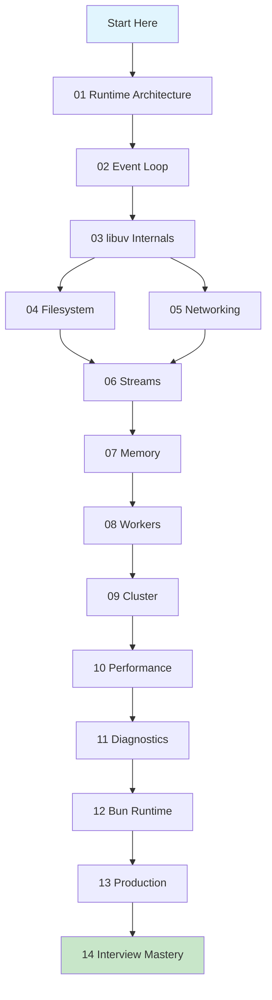

# Start Here — Setup & Prerequisites

## Environment Setup

### Node.js 25+

Node 25+ runs TypeScript natively. No `ts-node`, no `tsx`, no transpilation step.

```bash
# Install Node 25+ via nvm
nvm install 25
nvm use 25

# Verify TypeScript runs natively
echo 'const x: number = 42; console.log(x);' > test.ts
node test.ts
# Output: 42
```

### Bun (for Module 12)

```bash
curl -fsSL https://bun.sh/install | bash
bun --version
```

### System Tools

```bash
# Linux — install perf and strace
sudo apt install linux-tools-common linux-tools-$(uname -r) strace

# macOS — dtrace is built-in, install additional tools
brew install autocannon
```

### Node.js Diagnostic Tools

```bash
npm install -g clinic autocannon 0x
```

---

## How Each Lesson Is Structured

Every lesson follows this format:

1. **Concept** — What the thing is and why it matters
2. **Runtime Internals** — How it actually works inside Node/V8/libuv
3. **Diagrams** — Mermaid visualizations of architecture and flow
4. **Code Lab** — TypeScript examples you run and modify
5. **Production Context** — Where this matters in real systems
6. **Interview Questions** — Questions you'll face and how to answer them
7. **Deep Dive Notes** — Further reading and source code references

---

## Learning Path



---

## Recommended Study Schedule

| Week | Modules | Hours |
|------|---------|-------|
| 1 | 01–02 | 10–12 |
| 2 | 03–04 | 8–10 |
| 3 | 05–06 | 10–12 |
| 4 | 07–08 | 8–10 |
| 5 | 09–10 | 8–10 |
| 6 | 11–12 | 8–10 |
| 7 | 13–14 | 10–12 |

Total: ~70–80 hours of deep study and practice.
