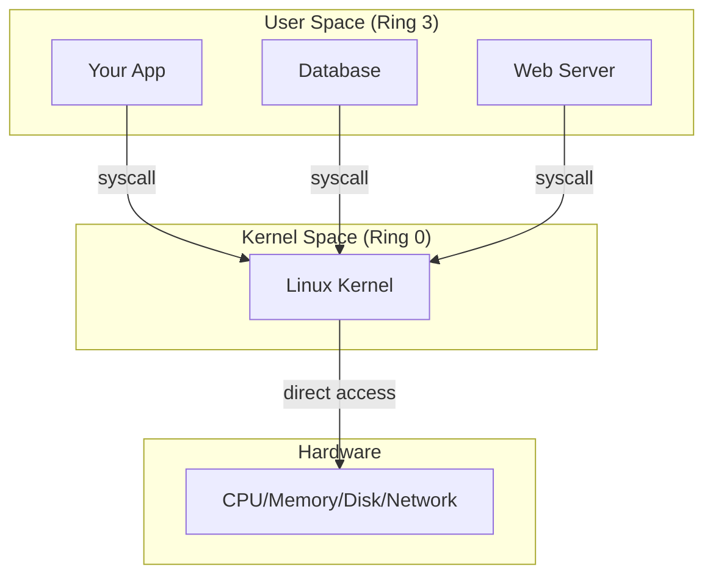
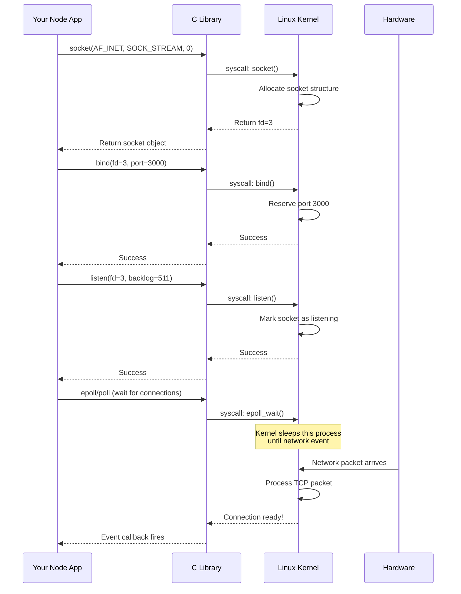

# Module 00: How Linux Actually Works

**The Mental Model: Understanding the OS as a Machine**

🟢 **Fundamentals**

---

## Why This Module Matters

Before you can reason about processes, memory, networking, or containers, you need to understand **what an operating system fundamentally is** and **how applications interact with it**.

This isn't abstract computer science — this is the foundation for understanding:
- Why your Node.js app sometimes freezes
- Why Docker containers behave differently than your local environment
- Why some operations are "expensive" and others are "cheap"
- What actually happens when you run `npm start` or `go run main.go`

---

## What an Operating System Actually Does

An operating system is **resource management and abstraction hardware**.

### The Core Problems Linux Solves

1. **Hardware is hard to use directly**
   - CPUs have complex instruction sets
   - Memory addressing is physical
   - Disk I/O requires precise timing
   - Network cards speak hardware protocols

2. **Multiple programs need to share resources**
   - 100 processes, 8 CPU cores
   - Each process thinks it has "all the memory"
   - Many apps reading/writing the same disk
   - Thousands of network connections

3. **Programs shouldn't trust each other**
   - Process A can't read Process B's memory
   - Normal programs can't crash the system
   - Users can't see each other's files (by default)

**The OS solves these by being the middleman between your code and the hardware.**

```
┌─────────────────────────────────────┐
│   Your Application (TypeScript/Go)  │
│                                     │
│   Libraries (libc, runtime, etc.)   │
└──────────────┬──────────────────────┘
               │
               │ System Calls (syscalls)
               │
┌──────────────▼──────────────────────┐
│         Linux Kernel                │
│  • Process scheduler                │
│  • Memory manager                   │
│  • Filesystem                       │
│  • Network stack                    │
│  • Device drivers                   │
└──────────────┬──────────────────────┘
               │
               │ Hardware instructions
               │
┌──────────────▼──────────────────────┐
│         Hardware                    │
│  CPU │ Memory │ Disk │ Network      │
└─────────────────────────────────────┘
```

---

## Kernel Space vs User Space

**This is the most important boundary in Linux.**

### User Space
- Where your code runs
- Where most programs live (Node, Go, PostgreSQL, Chrome)
- **Restricted** — can't directly access hardware
- **Isolated** — processes can't see each other's memory
- If your process crashes, the system keeps running

### Kernel Space
- Where Linux kernel code runs
- **Privileged** — direct hardware access
- **Shared** — all processes use the same kernel
- If kernel code crashes, the whole system crashes (kernel panic)



### Why This Boundary Exists

**Protection and Stability:**
- Your buggy code can't corrupt kernel memory
- One process crash doesn't kill the system
- User code can't execute privileged CPU instructions

**Abstraction:**
- Kernel hides hardware complexity
- Every program sees a consistent interface
- Kernel can virtualize resources (e.g., "infinite" memory)

---

## System Calls: The Bridge Between Worlds

**System calls (syscalls) are THE way user programs ask the kernel to do things.**

When you write code like:

```typescript
// TypeScript example
const fd = fs.openSync('/tmp/file.txt', 'w');
fs.writeSync(fd, 'Hello world');
fs.closeSync(fd);
```

What actually happens:

```
Your TypeScript Code
    ↓ (Node.js runtime calls libc)
C Library (libc)
    ↓ (libc makes syscall)
────────────────────────────────── (user → kernel boundary)
Kernel: open() syscall
    → Filesystem code
    → Find inode
    → Create file descriptor
    → Return fd number to user space
────────────────────────────────── (kernel → user boundary)
Your code receives fd = 3
```

### Common System Calls You Use Every Day

| What You Do | Syscall(s) Involved |
|------------|-------------------|
| `console.log("hello")` | `write(1, "hello\n", 6)` |
| `const data = fs.readFileSync(path)` | `open()`, `read()`, `close()` |
| `const server = net.createServer()` | `socket()`, `bind()`, `listen()` |
| `const child = spawn('ls')` | `fork()`, `execve()` |
| `fetch('https://api.example.com')` | `socket()`, `connect()`, `send()`, `recv()` |

**Every interaction with the outside world goes through syscalls.**

### Why Syscalls are "Expensive"

Making a syscall has overhead:
1. **Context switch** from user mode to kernel mode
2. Kernel does security checks
3. Kernel executes the operation
4. Context switch back to user mode

This isn't slow in absolute terms (microseconds), but compared to pure computation:
- Adding two numbers: ~0.3 nanoseconds
- Making a syscall: ~50-100 nanoseconds (100-300x slower)

**This is why:**
- Systems programmers minimize syscalls
- Buffering exists (write 1MB once, not 1 byte 1M times)
- Async I/O frameworks batch operations

---

## Linux is a Monolithic Kernel (And Why That Matters)

There are different OS architecture philosophies:

### Microkernel (e.g., Minix, some embedded systems)
- Tiny kernel (only scheduling, IPC)
- Everything else runs as user processes (filesystem, drivers)
- More stable (driver crash doesn't kill kernel)
- **Slower** (lots of context switches)

### Monolithic Kernel (Linux, BSD)
- Large kernel (scheduling, memory, filesystems, drivers, network stack)
- Everything runs in kernel space
- Less stable theoretically (driver bug can kill system)
- **Much faster** (no context switches for internal operations)

**Linux chose performance over theoretical purity.**

```
Monolithic Kernel (Linux):
┌────────────────────────────────┐
│   Kernel Space                 │
│  ┌──────┐ ┌──────┐ ┌────────┐ │
│  │ FS   │ │Sched │ │Network │ │
│  └──────┘ └──────┘ └────────┘ │
│  ┌──────┐ ┌──────┐            │
│  │Memory│ │Drivers│            │
│  └──────┘ └──────┘            │
└────────────────────────────────┘
     ↕ syscalls
┌────────────────────────────────┐
│   User Space                   │
│  [Apps] [Apps] [Apps]          │
└────────────────────────────────┘
```

This is why:
- Linux is fast for I/O-heavy workloads
- A bad kernel driver can crash the system
- Kernel modules load directly into kernel space
- Network stack is incredibly efficient

---

## How Applications Touch the Kernel

Let's trace a real example: **Starting a web server in Node.js**

```typescript
// server.ts
import * as http from 'http';

const server = http.createServer((req, res) => {
  res.end('Hello World');
});

server.listen(3000);
console.log('Server running on port 3000');
```

What happens under the hood:



**Key insights:**
1. Your high-level code (`server.listen()`) triggers multiple syscalls
2. The kernel manages the actual network interface
3. Your process sleeps (not using CPU) while waiting for connections
4. Kernel wakes your process when work arrives

---

## Why Linux is Not "Just Unix"

Linux started as a Unix-like system, but has diverged significantly:

### What Linux Took from Unix
- Process model
- File descriptor abstraction
- "Everything is a file" philosophy
- Pipes and streams
- Signal handling

### What Makes Linux Different
- **Monolithic kernel** (Unix varied)
- **No microkernel design**
- **Different filesystem layer** (VFS)
- **Completely different scheduler** (CFS)
- **Advanced networking** (netfilter, eBPF)
- **cgroups and namespaces** (containers)
- **No traditional "Unix" lineage** (clean-room implementation)

**Linux is POSIX-compatible, but not POSIX-limited.**

This means:
- Linux can run most Unix software
- But Linux has many innovations Unix doesn't
- Some behaviors differ from BSDs or macOS
- Modern containers are Linux-specific

---

## The Process Mental Model

Before we dive deep into processes (Module 01), understand this core model:

**A process is an instance of a running program, managed by the kernel.**

```
Process (from kernel's perspective):
┌────────────────────────────────┐
│  Process ID (PID)              │
│  Address space (memory)        │
│  Open file descriptors         │
│  Execution state (running/sleeping) │
│  Priority and scheduling info  │
│  User/Group IDs (security)     │
│  Signal handlers               │
│  Working directory             │
│  Environment variables         │
└────────────────────────────────┘
```

When you run:
```bash
node server.js
```

The kernel:
1. Loads the `node` executable into memory
2. Creates a new process structure
3. Assigns a PID (process ID)
4. Sets up a virtual address space
5. Opens file descriptors (stdin, stdout, stderr)
6. Begins executing the code

Your program thinks it's alone in the world. The kernel knows better.

---

## The File Abstraction

In Linux, **"everything is a file"** means:

```
File descriptor = integer handle to a kernel resource
```

What can be a "file"?
- Actual file on disk (`/home/user/data.txt`)
- Network socket (`0.0.0.0:3000`)
- Pipe between processes
- Device (`/dev/sda`, `/dev/null`)
- Anonymous memory mapping
- Terminal (`/dev/tty`)

This is powerful because **the same syscalls work for all of them:**

```typescript
// Same interface, different resources
fd1 = open("/tmp/file.txt", O_RDONLY);    // disk file
fd2 = socket(AF_INET, SOCK_STREAM, 0);    // network socket
fd3 = open("/dev/urandom", O_RDONLY);     // device

// All use the same read() syscall:
read(fd1, buffer, size);
read(fd2, buffer, size);
read(fd3, buffer, size);
```

We'll explore this in depth in Module 04.

---

## The Kernel's Core Responsibilities

Let's be concrete about what the kernel actually does:

### 1. Process Management
- Creating and destroying processes
- Scheduling (which process runs when)
- Context switching (saving/loading CPU state)
- Inter-process communication (pipes, signals, shared memory)

**Why you care:** Application performance, concurrency, how Node/Go scale

### 2. Memory Management
- Virtual memory (each process thinks it has all the RAM)
- Mapping virtual addresses to physical RAM
- Page tables
- Swapping to disk when RAM is full
- Page cache (caching disk contents in RAM)

**Why you care:** OOM kills, memory leaks, why "free" memory is low

### 3. Filesystem
- Translating paths (`/home/user/file`) to inodes (actual data locations)
- Caching reads/writes
- Managing different filesystem types (ext4, xfs, tmpfs, etc.)
- Ensuring data consistency

**Why you care:** Database performance, container layers, why some paths are fast/slow

### 4. Device Drivers
- Communicating with hardware (keyboard, disk, network card, GPU)
- Abstracting hardware details
- Managing device access permissions

**Why you care:** I/O performance, hardware compatibility

### 5. Networking
- TCP/IP stack
- Socket management
- Routing packets
- Firewalling (netfilter/iptables)
- Network namespaces (container networking)

**Why you care:** API latency, container networking, production debugging

### 6. Security
- User permissions (UID/GID)
- File permissions
- Capabilities
- System call filtering (seccomp)
- Namespace isolation

**Why you care:** Container security, privilege escalation, why processes can't do certain things

---

## Mental Model: A Request Through the Stack

Let's trace a simple HTTP request from your browser to a Node.js server:

```
1. Browser (Process A, User Space)
   ↓ JavaScript calls fetch()
   
2. Browser's Network Stack (User Space)
   ↓ Calls socket syscalls
   
3. Kernel (Kernel Space)
   ↓ TCP/IP stack
   
4. Network Interface Card (Hardware)
   ↓ Physical signal on wire
   
5. Server's NIC (Hardware)
   ↓ Interrupt triggers kernel
   
6. Server Kernel (Kernel Space)
   ↓ TCP/IP stack processes packet
   ↓ Identifies socket (port 3000)
   ↓ Queues data for process
   
7. Node.js (Process B, User Space)
   ↓ epoll_wait() returns
   ↓ Reads socket via read()
   ↓ HTTP parser runs
   ↓ Your callback executes
   ↓ response.end() called
   ↓ write() syscall
   
8. Kernel sends response back
   (reverse of above)
```

**Every step crosses boundaries. Understanding these boundaries is how you debug production.**

---

## What "Performance" Really Means

When we say "X is faster than Y," we mean:

### CPU-Bound Operations
- Pure computation
- No syscalls
- Limited by CPU speed
- Example: Calculating prime numbers, parsing JSON in memory

### I/O-Bound Operations
- Waiting for external resources
- Many syscalls
- Limited by disk/network speed
- Example: Database queries, HTTP requests

**Most web applications are I/O-bound.**

This is why:
- Node.js async model works well (I/O doesn't block the event loop)
- Databases use connection pooling (I/O latency, not CPU)
- Caching is incredibly effective (avoid I/O entirely)

---

## Common Misconceptions Debunked

### ❌ "The kernel is a program you run"
✅ The kernel is loaded at boot and runs continuously until shutdown. It's not started or stopped.

### ❌ "Processes run in parallel on one CPU core"
✅ Only one process runs per core at a time. The kernel rapidly switches between them (context switching) to create the illusion of parallelism.

### ❌ "Each process has its own kernel"
✅ All processes share one kernel. The kernel manages them all.

### ❌ "/proc is a folder on disk"
✅ `/proc` is a virtual filesystem. The "files" are generated on-the-fly by the kernel. Nothing is stored on disk.

### ❌ "System calls are function calls"
✅ Syscalls are special CPU instructions that switch from user mode to kernel mode. They're much more expensive than regular function calls.

### ❌ "Linux and Unix are the same"
✅ Linux is Unix-like but isn't derived from Unix source code. It's a clean-room reimplementation with significant differences.

---

## Key Takeaways

1. **The kernel is the middleman** between your code and hardware
2. **System calls are the interface** — everything external requires them
3. **User space is restricted, kernel space is privileged** — this boundary matters
4. **Linux is monolithic** — speed over theoretical purity
5. **"Everything is a file"** — file descriptors abstract many resource types
6. **The kernel manages illusions** — virtual memory, process isolation, concurrent execution

---

## What's Next

Now that you understand what an OS fundamentally is, we can build on this foundation:

**Module 01: Processes & Threads** — What happens when you run a program
**Module 02: Memory** — How virtual memory creates the illusion of infinite RAM
**Module 03: Filesystems** — What `/home/user/file.txt` really means to the kernel
**Module 04: File Descriptors** — The integer that rules I/O

---

## Verify Your Understanding

Before moving on, you should be able to answer:

1. What happens when your code calls `fetch('https://api.com')`? (Trace from JavaScript to hardware)
2. Why can't your Node.js app directly read from the network card?
3. What's the difference between kernel space and user space?
4. Why are system calls more expensive than function calls?
5. What does "everything is a file" actually mean?

If any of these are unclear, re-read the relevant sections. These are the mental models that make everything else make sense.

---

**Next:** [Module 01: Processes, Threads & Execution](../01-processes-and-execution/01-process-fundamentals.md)
