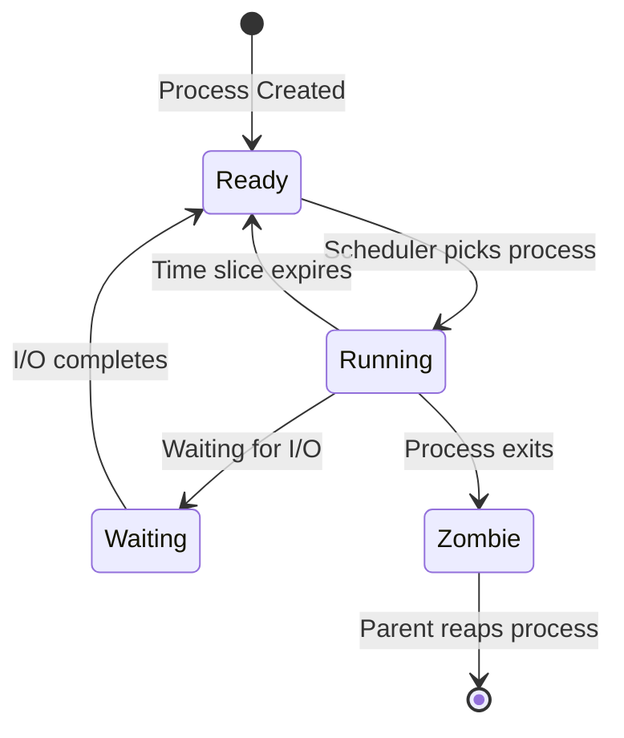

# Process Fundamentals

**What a Process Really Is**

🟢 **Fundamentals**

---

## The Most Important Concept in Operating Systems

**A process is the kernel's abstraction of a running program.**

Not "a program." A **running** program. The distinction matters:

- **Program**: Static file on disk (`/usr/bin/node`, `/usr/bin/go`)
- **Process**: Active, executing instance managed by the kernel

You can run the same program multiple times → multiple processes:

```bash
$ node server.js &   # Process 1 (PID 1234)
$ node server.js &   # Process 2 (PID 1235)
$ node server.js &   # Process 3 (PID 1236)
```

Three processes, one program. Each has its own memory, file descriptors, and execution state.

---

## What a Process Contains (Kernel's View)

When you run a program, the kernel creates a data structure representing that process. This structure contains:

```
Process Control Block (PCB):
┌─────────────────────────────────────┐
│ Process ID (PID): 1234              │
│ Parent PID (PPID): 1000             │
│ User ID (UID): 1000                 │
│ Group ID (GID): 1000                │
│                                     │
│ State: Running / Sleeping / Zombie  │
│ Priority & Scheduling info          │
│                                     │
│ Memory Information:                 │
│   - Program code (text segment)     │
│   - Data segment (global variables) │
│   - Heap (dynamic allocations)      │
│   - Stack (function calls, locals)  │
│                                     │
│ Open File Descriptors:              │
│   fd 0: stdin                       │
│   fd 1: stdout                      │
│   fd 2: stderr                      │
│   fd 3: /tmp/file.txt               │
│   fd 4: socket (TCP connection)     │
│                                     │
│ CPU Context (registers):            │
│   - Program counter (PC)            │
│   - Stack pointer (SP)              │
│   - General-purpose registers       │
│                                     │
│ Signal Handlers                     │
│ Working Directory: /home/user/app   │
│ Environment Variables               │
│ Resource Limits (ulimit)            │
└─────────────────────────────────────┘
```

**This is what the kernel manages. This is what "a process" means.**

---

## Process ID (PID)

Every process has a unique **Process ID (PID)** assigned by the kernel.

```bash
$ ps aux | head
USER       PID %CPU %MEM    VSZ   RSS TTY      STAT START   TIME COMMAND
root         1  0.0  0.1  16780  3456 ?        Ss   09:00   0:01 /usr/lib/systemd/systemd
root         2  0.0  0.0      0     0 ?        S    09:00   0:00 [kthreadd]
user      1234  1.2  2.1 612340 87236 ?        Sl   10:30   5:23 node server.js
```

**PID 1 is special:**
- First process started by kernel after boot
- Usually `systemd` (modern Linux) or `init` (older systems)
- Parent of all orphaned processes
- If PID 1 dies, kernel panics (system halts)

**PIDs are reused:**
- Not infinite
- When a process dies, its PID becomes available again
- Possible (but rare) to have race conditions relying on PIDs

---

## The Process Tree

Every process (except PID 1) has a parent process.

```bash
$ pstree -p
systemd(1)─┬─sshd(847)───sshd(2341)───bash(2342)───node(2500)
           ├─dockerd(1234)─┬─containerd(1250)
           │               └─docker-proxy(3421)
           ├─postgres(2100)─┬─postgres(2101)
           │                ├─postgres(2102)
           │                └─postgres(2103)
           └─...
```

**Parent Process ID (PPID)** tells you who started this process:

```bash
$ ps -o pid,ppid,cmd
  PID  PPID CMD
 2342  2341 bash
 2500  2342 node server.js
```

Here, `bash` (PID 2342) started `node` (PID 2500).

### Why This Matters

**Process relationships affect:**
- Signal propagation
- Resource cleanup
- Container lifecycle
- When parent dies, children may become orphans
- Daemonization (becoming independent of terminal)

---

## Process States

A process is always in one of several states:



### State Details

| State | Symbol | Meaning | Example |
|-------|---------|---------|---------|
| **Running** | `R` | Currently executing on CPU | Active computation |
| **Sleeping (Interruptible)** | `S` | Waiting for event, can be woken by signal | Waiting for network I/O |
| **Sleeping (Uninterruptible)** | `D` | Waiting for event, cannot be interrupted | Waiting for disk I/O |
| **Stopped** | `T` | Execution suspended | Paused by debugger or Ctrl+Z |
| **Zombie** | `Z` | Exited but not cleaned up | Waiting for parent to read exit status |

**Check state with `ps`:**

```bash
$ ps aux
USER       PID %CPU %MEM    VSZ   RSS TTY      STAT START   TIME COMMAND
user      1234  0.0  0.1 612340 87236 ?        Sl   10:30   0:00 node server.js
#                                              ^^
#                                              State: S (sleeping), l (multi-threaded)
```

### Sleeping States: Interruptible vs Uninterruptible

**Interruptible sleep (S):**
- Process can be woken by signals
- Most I/O operations
- Can be killed

```bash
$ sleep 1000 &
[1] 5678
$ ps aux | grep sleep
user      5678  0.0  0.0   6780   656 pts/0    S    12:34   0:00 sleep 1000
#                                              ^
#                                              Interruptible
$ kill 5678  # Works immediately
[1]+  Terminated              sleep 1000
```

**Uninterruptible sleep (D):**
- Process CANNOT be interrupted by signals
- Usually disk I/O at the hardware level
- **Cannot be killed** (not even `kill -9`)
- If you see many `D` state processes, you have a hardware or driver issue

```bash
$ ps aux | grep D
user      9999  0.0  0.0      0     0 ?        D    12:40   0:00 [flush-8:0]
#                                              ^
#                                              Uninterruptible (stuck in kernel)
```

**Why uninterruptible sleep exists:**
- Some kernel operations MUST complete atomically
- Interrupting them would corrupt filesystems or data structures
- If a process is stuck in `D` state for long periods, the kernel or hardware has a problem

---

## How Processes are Created

Unlike other languages where you might spawn threads or coroutines, Linux has a specific way to create new processes: **`fork()`**

### The fork() System Call

```c
// C example (conceptual)
pid_t pid = fork();

if (pid == 0) {
    // Child process
    printf("I am the child, PID: %d\n", getpid());
} else if (pid > 0) {
    // Parent process
    printf("I am the parent, my child is: %d\n", pid);
} else {
    // Error
    perror("fork failed");
}
```

**What `fork()` does:**
1. Kernel creates a copy of the calling process
2. Child process gets a copy of:
   - Memory (code, data, heap, stack)
   - Open file descriptors
   - Working directory
   - Environment variables
3. Child gets a new PID
4. Both parent and child continue executing after `fork()` returns

**Visual:**

```
Before fork():
┌─────────────────┐
│  Parent Process │
│  PID: 1000      │
│  Memory: [...]  │
└─────────────────┘

After fork():
┌─────────────────┐          ┌─────────────────┐
│  Parent Process │          │  Child Process  │
│  PID: 1000      │          │  PID: 1001      │
│  Memory: [...]  │          │  Memory: [...'] │ (copy)
│  fork() = 1001  │          │  fork() = 0     │
└─────────────────┘          └─────────────────┘
```

**Why fork() is weird:**
- One call, two returns
- Parent gets child's PID
- Child gets 0
- Both processes continue from the same point in code

### Copy-on-Write (COW)

"But copying all memory is expensive!"

Linux doesn't actually copy memory immediately. It uses **copy-on-write**:

1. After `fork()`, both processes share the same physical memory pages
2. Memory is marked read-only
3. When either process writes to memory, the kernel:
   - Copies that specific page
   - Updates the page table
   - Allows the write

This makes `fork()` very fast.

---

## exec(): Replacing Process Image

`fork()` creates a copy. To run a **different** program, you use `exec()`:

```c
// After fork(), child can exec a new program
if (pid == 0) {
    // Child process
    execve("/usr/bin/ls", argv, envp);
    // If execve succeeds, this line never runs
    // Child's memory is completely replaced
    perror("execve failed");
    exit(1);
}
```

**What `exec()` does:**
1. Replaces the current process's memory with a new program
2. Loads the new executable
3. Resets stack, heap, data segments
4. Starts executing from new program's `main()`
5. **PID stays the same**
6. **Open file descriptors are preserved** (by default)

**This is how shells work:**

```bash
$ ls -l
# What happens:
# 1. Your shell (bash) calls fork()
# 2. Child process calls exec("/usr/bin/ls", ["-l"])
# 3. Child becomes "ls" process
# 4. ls runs, prints output, exits
# 5. Parent (bash) waits for child to finish
# 6. bash prints prompt again
```

---

## wait(): Parent Waiting for Child

After `fork()`, the parent usually wants to know when the child finishes:

```c
pid_t pid = fork();
if (pid == 0) {
    // Child
    execve("/usr/bin/ls", ...);
    exit(1);
} else {
    // Parent
    int status;
    waitpid(pid, &status, 0);  // Block until child exits
    printf("Child exited with status: %d\n", WEXITSTATUS(status));
}
```

**Without `wait()`:**
- Child exits but remains as a **zombie** (see below)
- Zombie processes aren't freed until parent calls `wait()`

---

## How Your Code Actually Starts a Process

### Node.js Example

```typescript
import { spawn } from 'child_process';

const child = spawn('ls', ['-l', '/tmp']);

child.stdout.on('data', (data) => {
  console.log(`Output: ${data}`);
});

child.on('close', (code) => {
  console.log(`Process exited with code ${code}`);
});
```

**Under the hood:**
1. Node runtime calls `fork()` syscall
2. Child calls `exec("/usr/bin/ls")`
3. Parent sets up pipes for stdout/stderr
4. Parent uses `epoll` to wait for data
5. When `ls` finishes, kernel signals parent
6. Parent calls `wait()` to clean up child

### Go Example

```go
package main

import (
    "fmt"
    "os/exec"
)

func main() {
    cmd := exec.Command("ls", "-l", "/tmp")
    output, err := cmd.Output()
    if err != nil {
        panic(err)
    }
    fmt.Println(string(output))
}
```

**Under the hood:**
Same `fork()` + `exec()` + `wait()` sequence, wrapped in Go's API.

---

## Why Developers Should Care

### Performance Implications

**Forking is cheap** (thanks to copy-on-write):
```bash
$ time bash -c 'for i in {1..1000}; do /bin/true; done'
# Forks 1000 processes very quickly
```

**But creating processes has overhead:**
- Process setup time
- Memory management overhead
- Context switching

This is why:
- **Node.js uses an event loop** (avoid creating processes for concurrency)
- **Go uses goroutines** (lightweight, not full processes)
- **Databases use connection pooling** (avoid process creation per request)

### Container Implications

**In containers:**
- PID 1 behavior changes (no systemd usually)
- If your PID 1 process doesn't handle signals, container won't shut down cleanly
- Zombie processes accumulate if PID 1 doesn't reap them

Example problem:
```dockerfile
# Bad: shell becomes PID 1
CMD node server.js

# Better: node becomes PID 1
CMD ["node", "server.js"]
```

**Why this matters:**
- Shell doesn't forward signals to child processes by default
- `docker stop` sends SIGTERM, shell ignores it, waits 10s, then SIGKILL
- Your app doesn't shut down gracefully

---

## Observing Processes

### ps command

```bash
# All processes
$ ps aux

# Process tree
$ ps auxf

# Specific columns
$ ps -eo pid,ppid,cmd,state,%cpu,%mem

# Your processes
$ ps -u $USER
```

### /proc filesystem

Every process has a directory in `/proc`:

```bash
$ ls /proc/1234/
cmdline  cwd  environ  exe  fd/  maps  stat  status  ...
```

**Useful files:**
- `/proc/[pid]/cmdline` — Command line that started the process
- `/proc/[pid]/environ` — Environment variables
- `/proc/[pid]/cwd` — Current working directory (symbolic link)
- `/proc/[pid]/exe` — Executable file (symbolic link)
- `/proc/[pid]/fd/` — Open file descriptors
- `/proc/[pid]/status` — Human-readable status
- `/proc/[pid]/maps` — Memory mappings

**Example:**
```bash
$ cat /proc/self/cmdline
cat/proc/self/cmdline

$ readlink /proc/self/exe
/usr/bin/cat

$ ls -l /proc/self/fd/
lrwx------ 1 user user 64 Feb 21 12:00 0 -> /dev/pts/0  (stdin)
lrwx------ 1 user user 64 Feb 21 12:00 1 -> /dev/pts/0  (stdout)
lrwx------ 1 user user 64 Feb 21 12:00 2 -> /dev/pts/0  (stderr)
```

---

## Key Takeaways

1. **Process = kernel-managed running program instance**
2. **PID is unique identifier, PIDs are reused**
3. **Every process (except PID 1) has a parent**
4. **Process states: Running, Sleeping, Stopped, Zombie**
5. **fork() creates a copy, exec() replaces the program, wait() cleans up**
6. **Processes inherit file descriptors and environment**
7. **/proc/ lets you inspect running processes**

---

## What's Next

- [Threads vs Processes](02-threads-vs-processes.md)
- [Process Lifecycle: Fork, Exec, Wait, Exit](03-process-lifecycle.md)
- [Zombie and Orphan Processes](04-zombies-and-orphans.md)
- [Signals and Process Control](05-signals.md)
- [Context Switching](06-context-switching.md)

---

**Next:** [Threads vs Processes](02-threads-vs-processes.md)
