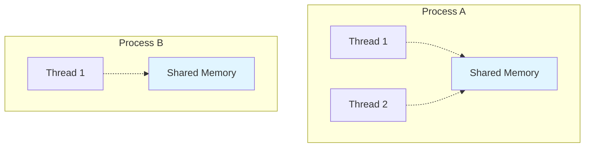

# Threads vs Processes

**Understanding the Difference and When to Use Each**

🟢 **Fundamentals** | 🟡 **Intermediate**

---

## The Core Distinction

**Process:**
- Full isolation
- Separate memory space
- Expensive to create
- Heavy context switches
- Complete independence

**Thread:**
- Shared memory space (same process)
- Lightweight to create
- Cheap context switches
- Shared resources within process
- Requires careful synchronization



---

## What is a Thread?

**A thread is a lightweight execution unit within a process.**

Think of it this way:
- **Process** = Your entire Node.js application
- **Thread** = Individual path of execution within that application

```
Process (from kernel's view):
┌──────────────────────────────────────┐
│ PID: 1234                            │
│ Memory Space (shared by all threads):│
│   ┌────────────────────────────────┐ │
│   │ Code (text segment)            │ │
│   │ Global data                    │ │
│   │ Heap (malloc allocations)      │ │
│   └────────────────────────────────┘ │
│                                      │
│ Thread 1 (TID: 1234):                │
│   ├─ Stack (local variables)         │
│   ├─ Program counter (PC)            │
│   └─ CPU registers                   │
│                                      │
│ Thread 2 (TID: 1235):                │
│   ├─ Stack (local variables)         │
│   ├─ Program counter (PC)            │
│   └─ CPU registers                   │
│                                      │
│ Thread 3 (TID: 1236):                │
│   ├─ Stack (local variables)         │
│   ├─ Program counter (PC)            │
│   └─ CPU registers                   │
└──────────────────────────────────────┘
```

**Each thread has:**
- Own stack (for function calls, local variables)
- Own program counter (where in code it's executing)
- Own CPU registers

**All threads in a process share:**
- Memory (code, globals, heap)
- File descriptors
- Process ID (each thread has a TID, but same PID)
- Signal handlers
- Working directory

---

## Why Threads Exist

### Problem: Process Creation is Heavy

```c
// Creating a new process
pid_t pid = fork();  // Expensive: copy memory, set up new process
```

**fork() overhead:**
- New process control block
- New memory mappings (even with COW)
- New file descriptor table (copy)
- Kernel bookkeeping

### Solution: Threads Share Resources

```c
// Creating a new thread
pthread_t thread;
pthread_create(&thread, NULL, function, args);  // Cheap: same memory space
```

**Thread creation overhead:**
- New stack allocation
- New thread ID
- Minimal kernel bookkeeping
- **10-100x faster than fork()**

---

## Real World Comparison

### Web Server Example

**Multi-Process Model (Apache with prefork):**

```
Client 1  →  Process 1 (PID 1000, 10 MB memory)
Client 2  →  Process 2 (PID 1001, 10 MB memory)
Client 3  →  Process 3 (PID 1002, 10 MB memory)
...
Client 100 → Process 100 (PID 1099, 10 MB memory)

Total memory: ~1000 MB (if each process is 10 MB)
```

**Multi-Threaded Model (Apache with worker MPM):**

```
All Clients → Process 1 (PID 1000)
                ├─ Thread 1
                ├─ Thread 2
                ├─ Thread 3
                ...
                └─ Thread 100

Total memory: ~50 MB (shared memory + small per-thread stacks)
```

**Why multi-threaded uses less memory:**
- Code segment shared
- Most data structures shared
- Only stacks are per-thread

---

## Linux Threads Are Special

In Linux, threads are implemented as **lightweight processes**.

```bash
$ ps -eLf | grep node
USER       PID  PPID   LWP  C NLWP STAT  TIME CMD
user      1234  1000  1234  0    5 Sl   0:00 node server.js
user      1234  1000  1235  0    5 Sl   0:00 node server.js
user      1234  1000  1236  0    5 Sl   0:00 node server.js
user      1234  1000  1237  0    5 Sl   0:00 node server.js
user      1234  1000  1238  0    5 Sl   0:00 node server.js
#         ^^^^         ^^^^     ^
#         Same PID    Different LWP (thread ID)
#                                NLWP = 5 threads total
```

**Linux doesn't distinguish between threads and processes at the kernel level.**

Both are "tasks" that:
- Can be scheduled on CPU
- Have their own stack
- Have their own execution state

The difference is:
- **Thread**: Created with `clone()` syscall, shares memory with parent
- **Process**: Created with `fork()` syscall, separate memory

This design (called NPTL: Native POSIX Thread Library) means:
- Threads are very efficient
- Can schedule threads independently (unlike user-space threading)
- Threads can run on different CPU cores simultaneously

---

## Concurrency Models in Real Languages

### Node.js: Single-Threaded Event Loop

```typescript
// Node.js is single-threaded (mostly)
import * as http from 'http';

const server = http.createServer((req, res) => {
  // This callback runs in the SAME thread
  // No thread synchronization needed
  res.end('Hello');
});

server.listen(3000);
```

**Under the hood:**
- Main thread runs JavaScript event loop
- Async I/O done by libuv thread pool (in C++)
- Callbacks always run on main thread
- **Simple mental model: no shared state races**

**Why this works:**
- Web servers are I/O-bound (waiting for DB, network)
- While waiting, event loop handles other requests
- CPU never idle

**When it doesn't work:**
- CPU-intensive tasks block the event loop
- Solution: Worker threads or child processes

```typescript
// Blocking example (bad)
app.get('/slow', (req, res) => {
  const result = calculatePrimes(10000000);  // Blocks event loop
  res.send(result);
});

// Non-blocking (good)
app.get('/fast', async (req, res) => {
  const result = await db.query('SELECT ...');  // Doesn't block
  res.send(result);
});
```

### Go: Goroutines (Not OS Threads)

```go
package main

import (
    "fmt"
    "time"
)

func main() {
    for i := 0; i < 10000; i++ {
        go func(n int) {
            time.Sleep(1 * time.Second)
            fmt.Println(n)
        }(i)
    }
    time.Sleep(2 * time.Second)
}
```

**Goroutines are NOT threads:**
- Goroutines are managed by Go runtime (not kernel)
- Many goroutines multiplexed onto fewer OS threads
- Go runtime handles scheduling
- Very cheap: start 100,000 goroutines easily

**Under the hood:**
```
10,000 Goroutines
       ↓
Go Scheduler
       ↓
8 OS Threads (if you have 8 CPU cores)
       ↓
Linux Kernel Scheduler
```

**Why this works:**
- Go runtime knows about blocking operations
- When goroutine blocks on I/O, runtime schedules another goroutine on that thread
- No wasted CPU time

### Python: Threads but Global Interpreter Lock (GIL)

```python
import threading

def worker():
    # This function runs in a separate thread
    print("Working...")

threads = []
for i in range(10):
    t = threading.Thread(target=worker)
    threads.append(t)
    t.start()

for t in threads:
    t.join()
```

**The GIL Problem:**
- Only one thread can execute Python bytecode at a time
- Multiple threads on multi-core CPU: **still only use one core**
- Threads are good for I/O, useless for CPU-bound work

**Why GIL exists:**
- Makes CPython (reference implementation) simpler
- Protects internal data structures
- Allows C extensions to not worry about thread safety

**Python's solution for CPU-bound work:**
```python
from multiprocessing import Process

def worker():
    # CPU-intensive work
    pass

processes = []
for i in range(4):
    p = Process(target=worker)  # Full process, not thread
    processes.append(p)
    p.start()
```

### TypeScript/JavaScript: Workers

```typescript
// main.ts
import { Worker } from 'worker_threads';

const worker = new Worker('./worker.js');

worker.postMessage({ data: 'heavy computation' });

worker.on('message', (result) => {
  console.log('Result:', result);
});

// worker.js
import { parentPort } from 'worker_threads';

parentPort.on('message', (msg) => {
  // CPU-intensive work in separate thread
  const result = heavyComputation(msg.data);
  parentPort.postMessage(result);
});
```

**Node.js Workers:**
- Real OS threads
- Separate JavaScript execution contexts
- Communicate via message passing (no shared memory by default)
- Avoids the race condition nightmare

---

## Race Conditions: The Shared Memory Problem

When threads share memory, you need synchronization.

### Example: Bank Account

```go
package main

import (
    "fmt"
    "sync"
)

var balance = 1000

func withdraw(amount int) {
    // RACE CONDITION: Not atomic!
    temp := balance      // Thread 1 reads 1000
                         // Context switch to Thread 2
                         // Thread 2 reads 1000
    temp -= amount       // Thread 1: temp = 900
                         // Thread 2: temp = 900
    balance = temp       // Thread 1 writes 900
                         // Thread 2 writes 900
    // Lost update! Should be 800, but it's 900
}

func main() {
    var wg sync.WaitGroup
    
    for i := 0; i < 2; i++ {
        wg.Add(1)
        go func() {
            withdraw(100)
            wg.Done()
        }()
    }
    
    wg.Wait()
    fmt.Println(balance)  // Might print 900 instead of 800!
}
```

**Fix with mutex:**

```go
var balance = 1000
var mu sync.Mutex

func withdraw(amount int) {
    mu.Lock()
    balance -= amount
    mu.Unlock()
}
```

**This is why:**
- Multi-threaded programming is hard
- Node.js avoids this with single-threaded event loop
- Go provides primitives (mutexes, channels)
- Languages like Rust prevent data races at compile time

---

## Context Switching Cost

**Context switch: Kernel switches CPU from one task to another.**

### Process Context Switch

```
Process A running → Kernel interrupt
  ↓
Save Process A state:
  - All CPU registers
  - Program counter
  - Stack pointer
  - Memory mappings (page tables)
  ↓
Load Process B state:
  - Restore CPU registers
  - Switch page tables (TLB flush!)
  - Restore stack
  ↓
Process B running
```

**Expensive because:**
- Saving/restoring many registers
- **TLB flush** (Translation Lookaside Buffer) — memory access slow until cache warms up
- Kernel enters privileged mode

### Thread Context Switch (Same Process)

```
Thread 1 running → Kernel interrupt
  ↓
Save Thread 1 state:
  - CPU registers
  - Program counter
  - Stack pointer
  ↓
Load Thread 2 state:
  - Restore registers
  - (No page table switch!)
  ↓
Thread 2 running
```

**Cheaper because:**
- No page table switch
- No TLB flush
- Same memory space

**Measured costs (approximate):**
- Process context switch: 1-10 microseconds
- Thread context switch: 0.1-1 microseconds

Not huge, but matters at scale:
- 1000 context switches/second = 10% CPU overhead (processes)
- 1000 context switches/second = 1% CPU overhead (threads)

---

## When to Use Processes vs Threads

### Use Processes When:

1. **Isolation is critical**
   - Running untrusted code
   - Fault tolerance (one process crash doesn't kill others)
   - Example: Chrome's multi-process architecture (each tab is a process)

2. **Different programs**
   - Shell spawning commands
   - Microservices architecture

3. **Language limitations**
   - Python GIL → use multiprocessing for CPU work
   - Node.js → spawn worker processes for CPU-intensive tasks

4. **Security boundaries**
   - Different user permissions
   - Sandboxing

### Use Threads When:

1. **Shared state is needed**
   - Database connection pool
   - In-memory cache shared across request handlers

2. **Lightweight concurrency**
   - Web server handling many connections
   - Background tasks in same application

3. **Performance critical**
   - Minimizing context switch overhead
   - Sharing memory instead of IPC

4. **Language supports it well**
   - Go goroutines
   - Java threads
   - C++ threads

### Modern Alternatives:

**Async/Await (Single-threaded concurrency):**
```typescript
// No threads, no processes, just clever scheduling
async function handleRequests() {
  const [user, posts, comments] = await Promise.all([
    fetchUser(),
    fetchPosts(),
    fetchComments()
  ]);
  // All three fetched concurrently, single thread
}
```

**Actor model (Erlang/Elixir):**
- Lightweight processes (not OS processes)
- Message passing, no shared state
- Excellent fault tolerance

---

## Observing Threads

### ps command

```bash
# Show threads
$ ps -eLf
USER     PID  PPID   LWP  NLWP STAT START   TIME COMMAND
user    1234  1000  1234     5 Sl   10:00   0:01 node server.js
user    1234  1000  1235     5 Sl   10:00   0:00 node server.js
user    1234  1000  1236     5 Sl   10:00   0:00 node server.js

# Show threads with CPU usage
$ ps -eLo pid,lwp,pcpu,comm
  PID   LWP %CPU COMMAND
 1234  1234  2.0 node
 1234  1235  0.1 node
 1234  1236  0.0 node
```

### top command

```bash
$ top -H  # Show threads instead of processes
# Press 'H' key to toggle threads display
```

### /proc filesystem

```bash
# List threads for a process
$ ls /proc/1234/task/
1234  1235  1236

# Each thread has its own directory
$ cat /proc/1234/task/1235/status
Name:   node
Pid:    1234
Tgid:   1234  # Thread Group ID (the process PID)
PPid:   1000
```

---

## Key Takeaways

1. **Threads share memory, processes don't**
2. **Threads are lighter (faster to create, less memory)**
3. **Thread synchronization is hard (race conditions)**
4. **Linux implements threads as lightweight processes**
5. **Node.js avoids threads with event loop; Go uses goroutines**
6. **Process context switch > Thread context switch cost**
7. **Use processes for isolation, threads for shared state and performance**

---

## What's Next

- [Process Lifecycle: Fork, Exec, Wait, Exit](03-process-lifecycle.md)
- [Zombie and Orphan Processes](04-zombies-and-orphans.md)
- [Signals and Process Control](05-signals.md)
- [Context Switching Deep Dive](06-context-switching.md)

---

**Next:** [Process Lifecycle](03-process-lifecycle.md)
