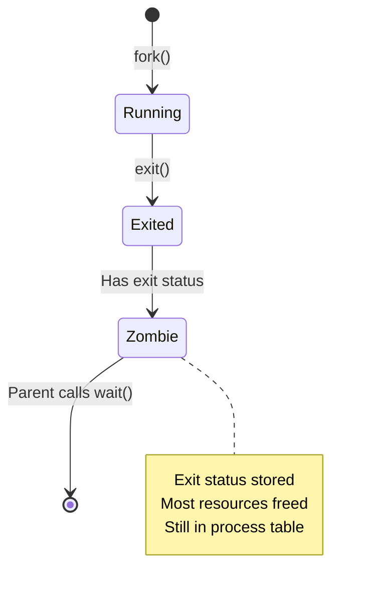

# Zombie and Orphan Processes

**When Processes Don't Die Cleanly**

🟢 **Fundamentals** | 🟡 **Intermediate**

---

## The Problem: Process Cleanup

When a process exits, it doesn't immediately disappear. It needs to communicate its exit status to its parent. This creates two edge cases:

1. **Zombie**: Process exited, but parent hasn't read exit status yet
2. **Orphan**: Parent exited before child, child has no one to report to

Both are common, and both can cause problems in production.

---

## Zombie Processes

**A zombie is a process that has finished execution but still has an entry in the process table.**

### How Zombies Are Created

```c
// Parent process
pid_t pid = fork();

if (pid == 0) {
    // Child process
    printf("Child working...\n");
    sleep(2);
    exit(42);  // Child exits with status 42
    // Child is now a zombie!
}

// Parent continues without calling wait()
printf("Parent doing other things...\n");
sleep(100);  // Parent ignores child's death
// Child remains a zombie for 100 seconds
```

### Process Lifecycle



### What a Zombie Looks Like

```bash
$ ps aux | grep defunct
user    1235  0.0  0.0      0     0 ?        Z    12:00   0:00 [worker] <defunct>
#                                            ^                     ^
#                                         Status: Z             "defunct" = zombie
```

**Characteristics:**
- State: `Z` (zombie)
- Memory: 0 (all freed)
- CPU: 0 (not running)
- Listed as `<defunct>`
- Has exit status available

### Why Zombies Exist

The zombie state exists so the parent can retrieve the child's exit status:

```c
int status;
pid_t child_pid = wait(&status);

if (WIFEXITED(status)) {
    printf("Child %d exited with status: %d\n", 
           child_pid, 
           WEXITSTATUS(status));
}
```

The kernel keeps the zombie around because:
1. Parent might want to know the exit status
2. Parent might want to know termination reason (signal vs normal exit)
3. Parent's `wait()` call is the cleanup mechanism

### Are Zombies a Problem?

**Short-lived zombies: Normal**

```bash
$ ls
# ls runs, prints output, exits
# For a brief moment (microseconds), ls is a zombie
# bash calls wait(), zombie is reaped
# You never notice
```

**Long-lived zombies: Problem**

```bash
$ ps aux | grep Z
user    1001  0.0  0.0      0     0 ?        Z    Jan01   0:00 [worker1] <defunct>
user    1002  0.0  0.0      0     0 ?        Z    Jan01   0:00 [worker2] <defunct>
user    1003  0.0  0.0      0     0 ?        Z    Jan01   0:00 [worker3] <defunct>
...
user    9999  0.0  0.0      0     0 ?        Z    Jan01   0:00 [worker9999] <defunct>
```

**Why this is bad:**
- Each zombie occupies a PID
- PIDs are limited (default: ~32,768)
- Too many zombies → can't create new processes
- Indicates a bug in parent process

### Real-World Example: Node.js Zombie Leak

```typescript
// BAD: Creates zombies
import { spawn } from 'child_process';

setInterval(() => {
  const child = spawn('curl', ['https://api.example.com']);
  
  child.stdout.on('data', (data) => {
    console.log(data.toString());
  });
  
  // BUG: Not waiting for child to finish
  // Child becomes zombie when curl exits
}, 1000);

// After an hour: thousands of zombie curl processes
```

**Fix:**

```typescript
// GOOD: Properly reap children
import { spawn } from 'child_process';

setInterval(() => {
  const child = spawn('curl', ['https://api.example.com']);
  
  child.stdout.on('data', (data) => {
    console.log(data.toString());
  });
  
  child.on('close', (code) => {
    // Node automatically calls wait() when you listen to 'close'
    console.log(`Child exited with code ${code}`);
  });
}, 1000);
```

### Debugging Zombie Accumulation

**Find zombies:**

```bash
$ ps aux | awk '$8 == "Z"'
USER       PID %CPU %MEM    VSZ   RSS TTY      STAT START   TIME COMMAND
user      1001  0.0  0.0      0     0 ?        Z    12:00   0:00 [curl] <defunct>
```

**Find the parent that's not reaping:**

```bash
$ ps -o pid,ppid,stat,cmd | grep Z
 1001  1000 Z     [curl] <defunct>
 1002  1000 Z     [curl] <defunct>
 1003  1000 Z     [curl] <defunct>
#      ^^^^
#      PPID: Parent is process 1000

$ ps -p 1000
  PID TTY      STAT   TIME COMMAND
 1000 ?        Sl     0:05 node server.js
```

**Process 1000 (node server.js) is the culprit** — it's not calling `wait()` on its children.

**How to fix:**
1. Fix the code to properly wait for children
2. Restart the parent process (zombies disappear when parent exits)

**Can't kill zombies:**

```bash
$ kill -9 1001  # Does nothing
$ kill -9 1002  # Does nothing
```

**Why:** Zombies are already dead. They're just waiting to be reaped.

**The only way to clean zombies:**
- Fix parent to call `wait()`
- Kill the parent (zombies reparented to init/systemd, which reaps them)

---

## Orphan Processes

**An orphan is a process whose parent has exited.**

### How Orphans Are Created

```c
// Parent process
pid_t pid = fork();

if (pid == 0) {
    // Child process
    sleep(100);  // Child will run for 100 seconds
    exit(0);
}

// Parent exits immediately
exit(0);  // Child is now an orphan!
```

### What Happens to Orphans

The kernel automatically **reparents orphans to PID 1** (init/systemd):

```
Before parent exits:
┌─────────────┐
│   PID 1     │
│  (systemd)  │
└──────┬──────┘
       │
       │ parent-of
       ↓
┌─────────────┐
│  PID 1000   │
│  (parent)   │
└──────┬──────┘
       │
       │ parent-of
       ↓
┌─────────────┐
│  PID 2000   │
│  (child)    │
└─────────────┘

After parent exits:
┌─────────────┐
│   PID 1     │
│  (systemd)  │
└──────┬──────┘
       │
       │ parent-of
       ↓
┌─────────────┐
│  PID 2000   │
│  (child)    │  ← Now an orphan, adopted by PID 1
└─────────────┘
```

**Check with ps:**

```bash
$ ps -o pid,ppid,cmd
  PID  PPID CMD
 2000     1 ./long_running_process
#         ^
#         PPID = 1 (reparented)
```

### Are Orphans a Problem?

**Usually no.**

Orphans are handled cleanly by the system:
- Adopted by PID 1 (systemd)
- systemd reaps them when they exit
- No zombie accumulation

### Intentional Orphans: Daemons

**Daemonization is intentionally creating an orphan:**

```c
// Become a daemon
pid_t pid = fork();

if (pid > 0) {
    exit(0);  // Parent exits immediately
}

// Child continues as daemon
setsid();  // Create new session
chdir("/");  // Change to root directory
// Close stdin, stdout, stderr
close(STDIN_FILENO);
close(STDOUT_FILENO);
close(STDERR_FILENO);

// Now running as background daemon, orphaned and adopted by init
while (1) {
    // Daemon work
}
```

**This is how background services work before systemd:**
- Fork and exit parent → orphan
- Child becomes session leader
- Detached from terminal
- systemd manages it

**Modern systemd services don't need this:**

```ini
[Service]
Type=simple
ExecStart=/usr/bin/my_service
# systemd handles daemonization
```

---

## Real Production Scenarios

### Scenario 1: Container Init Problem

**Problem:**

```dockerfile
# Bad: Using shell as PID 1
CMD node server.js
```

**What happens:**
1. Shell (bash) becomes PID 1
2. Shell spawns node as child
3. Node spawns worker processes
4. Node crashes
5. Worker processes become orphans
6. Orphans adopted by... shell (PID 1)
7. **Shell doesn't reap zombies properly** → zombie accumulation

**Fix:**

```dockerfile
# Good: Node is PID 1
CMD ["node", "server.js"]

# Or use a proper init system
CMD ["dumb-init", "node", "server.js"]
```

### Scenario 2: Zombie Leak in Python

```python
import subprocess
import time

# BAD: Creates zombie for each request
def handle_request():
    proc = subprocess.Popen(['curl', 'https://api.example.com'])
    # BUG: Not waiting for process
    # proc becomes zombie when curl exits
    return "OK"

while True:
    handle_request()
    time.sleep(1)
```

**After 24 hours: 86,400 zombie curl processes**

```bash
$ ps aux | grep -c defunct
86400

$ cat /proc/sys/kernel/pid_max
32768

$ # Can't create new processes!
$ ls
bash: fork: Resource temporarily unavailable
```

**Fix:**

```python
import subprocess

def handle_request():
    proc = subprocess.Popen(['curl', 'https://api.example.com'])
    proc.wait()  # Wait for child to finish
    return "OK"

# Or better: use subprocess.run()
def handle_request():
    subprocess.run(['curl', 'https://api.example.com'])
    return "OK"
```

### Scenario 3: Graceful Shutdown in Node.js

```typescript
import { spawn } from 'child_process';

const workers: ChildProcess[] = [];

// Spawn worker processes
for (let i = 0; i < 4; i++) {
  const worker = spawn('node', ['worker.js']);
  workers.push(worker);
}

// Handle termination signals
process.on('SIGTERM', () => {
  console.log('Received SIGTERM, shutting down...');
  
  // Kill all workers
  workers.forEach(worker => worker.kill('SIGTERM'));
  
  // BUG: Exiting before workers finish
  process.exit(0);  // Workers become zombies!
});
```

**Fix:**

```typescript
process.on('SIGTERM', async () => {
  console.log('Received SIGTERM, shutting down...');
  
  // Kill all workers
  workers.forEach(worker => worker.kill('SIGTERM'));
  
  // Wait for all workers to exit
  await Promise.all(
    workers.map(worker => new Promise(resolve => {
      worker.on('exit', resolve);
    }))
  );
  
  console.log('All workers exited cleanly');
  process.exit(0);
});
```

---

## Debugging Tools

### Find zombies and their parents

```bash
# Show all zombies
$ ps aux | awk '$8 ~ /Z/ { print $2, $11 }' | head
1001 [curl]
1002 [worker]
1003 [processor]

# Find parent process
$ ps -o pid,ppid,stat,cmd -p 1001
  PID  PPID STAT CMD
 1001  1000 Z    [curl] <defunct>

# Investigate parent
$ ps -f -p 1000
UID        PID  PPID  C STIME TTY      STAT   TIME CMD
user      1000   950  0 10:00 ?        Sl     0:05 node /app/server.js

# Check parent's code for missing wait() calls
```

### Monitor zombie accumulation

```bash
# Count zombies
$ ps aux | awk '$8 ~ /Z/' | wc -l

# Watch zombies over time
$ watch 'ps aux | awk "\\$8 ~ /Z/" | wc -l'

# Alert if zombies exceed threshold
$ while true; do
    count=$(ps aux | awk '$8 ~ /Z/' | wc -l)
    if [ $count -gt 100 ]; then
        echo "WARNING: $count zombies detected!"
    fi
    sleep 60
done
```

### Check your process's children

```bash
# Show process tree
$ pstree -p 1000
node(1000)─┬─curl(1001)
           ├─curl(1002)
           ├─curl(1003)
           └─worker(1004)───worker(1005)

# Show only PID 1000's children
$ ps --ppid 1000
  PID TTY      STAT   TIME COMMAND
 1001 ?        Z      0:00 [curl] <defunct>
 1002 ?        Z      0:00 [curl] <defunct>
 1003 ?        Z      0:00 [curl] <defunct>
 1004 ?        S      0:05 node worker.js
```

---

## Best Practices

### 1. Always Wait for Child Processes

**C:**
```c
pid_t pid = fork();
if (pid == 0) {
    // Child
    exit(0);
} else {
    // Parent
    int status;
    waitpid(pid, &status, 0);  // Must call wait!
}
```

**Node.js:**
```typescript
const child = spawn('command');
child.on('exit', (code) => {
  // Automatically reaped when you listen to 'exit'
});
```

**Python:**
```python
proc = subprocess.Popen(['command'])
proc.wait()  # Don't forget!

# Or use run() which waits automatically
subprocess.run(['command'])
```

**Go:**
```go
cmd := exec.Command("command")
cmd.Start()
cmd.Wait()  // Must call Wait!
```

### 2. Handle SIGCHLD Signal

The kernel sends `SIGCHLD` to a parent when a child exits:

```c
#include <signal.h>
#include <sys/wait.h>

void sigchld_handler(int sig) {
    // Reap all dead children
    while (waitpid(-1, NULL, WNOHANG) > 0);
}

signal(SIGCHLD, sigchld_handler);

// Now when any child exits, handler reaps it automatically
```

**Or ignore SIGCHLD to auto-reap:**

```c
signal(SIGCHLD, SIG_IGN);  // Kernel automatically reaps zombies
```

### 3. Use Process Supervisors in Containers

Don't make your application PID 1 unless it handles:
- Signal forwarding
- Zombie reaping
- Child process management

**Use init systems:**

```dockerfile
# dumb-init: minimal init for containers
FROM node:18
RUN apt-get update && apt-get install -y dumb-init
ENTRYPOINT ["dumb-init", "--"]
CMD ["node", "server.js"]
```

```dockerfile
# tini: another minimal init
FROM node:18
RUN apt-get update && apt-get install -y tini
ENTRYPOINT ["/usr/bin/tini", "--"]
CMD ["node", "server.js"]
```

---

## Key Takeaways

1. **Zombies exist to preserve exit status for parent**
2. **Zombies consume PIDs, can exhaust PID namespace**
3. **Only way to clean zombies: parent calls wait() or parent dies**
4. **Orphans are reparented to PID 1 (systemd)**
5. **Orphans are usually fine; zombies indicate bugs**
6. **Always wait() for child processes you spawn**
7. **In containers, be careful about PID 1 responsibilities**
8. **Use `SIGCHLD` handler or process supervisors**

---

## What's Next

- [Signals and Process Control](05-signals.md)
- [Context Switching](06-context-switching.md)

---

**Next:** [Signals and Process Control](05-signals.md)
