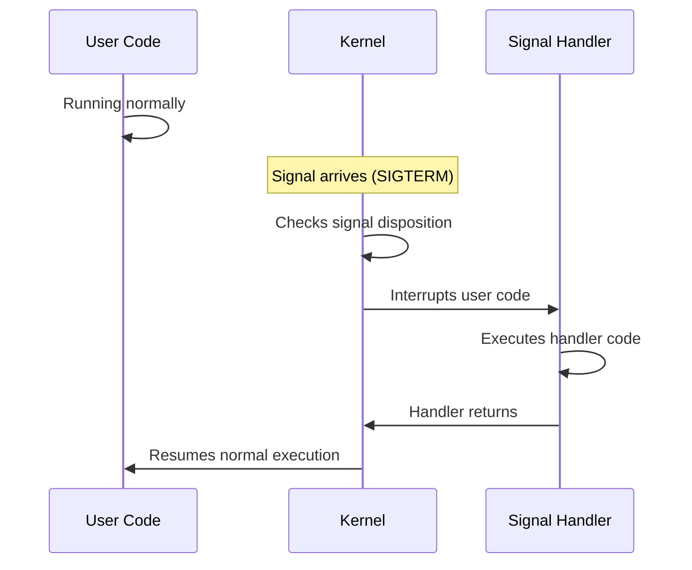

# Signals and Process Control

**How Processes Communicate and Get Interrupted**

🟢 **Fundamentals** | 🟡 **Intermediate**

---

## What Are Signals?

**Signals are software interrupts sent to processes.**

Think of signals as notifications from the kernel or other processes saying "something happened" or "I want you to do something."

```
┌──────────────┐         Signal (SIGTERM)         ┌──────────────┐
│  Process A   │ ─────────────────────────────────>│  Process B   │
│  PID: 1000   │                                   │  PID: 2000   │
└──────────────┘                                   └──────────────┘
                                                          ↓
                                                    Process B can:
                                                    • Ignore it
                                                    • Handle it (custom action)
                                                    • Default action (usually terminate)
```

Signals are:
- **Asynchronous**: Can arrive at any time
- **Limited**: Only ~64 signal types
- **Simple**: No data payload (just a number)
- **Atomic**: Signal handlers execute atomically

---

## Common Signals You Need to Know

| Signal | Number | Default Action | Meaning | Use Case |
|--------|--------|----------------|---------|----------|
| `SIGINT` | 2 | Terminate | Interrupt (Ctrl+C) | User wants to stop process |
| `SIGQUIT` | 3 | Core dump | Quit (Ctrl+\\) | User wants process to dump core and exit |
| `SIGKILL` | 9 | Terminate | Kill (cannot be caught) | Force kill process |
| `SIGSEGV` | 11 | Core dump | Segmentation fault | Process accessed invalid memory |
| `SIGTERM` | 15 | Terminate | Termination (default kill) | Polite shutdown request |
| `SIGCHLD` | 17 | Ignore | Child status changed | Child process exited |
| `SIGSTOP` | 19 | Stop | Stop process (cannot be caught) | Pause process execution |
| `SIGCONT` | 18 | Continue | Continue if stopped | Resume paused process |
| `SIGUSR1` | 10 | Terminate | User-defined | Custom application logic |
| `SIGUSR2` | 12 | Terminate | User-defined | Custom application logic |

**Two signals cannot be caught or ignored:**
- `SIGKILL` (9) — Immediate termination
- `SIGSTOP` (19) — Immediate pause

This ensures the system can always stop a misbehaving process.

---

## Sending Signals

### From Command Line

```bash
# Send SIGTERM (default)
$ kill 1234

# Send specific signal (by number)
$ kill -9 1234      # SIGKILL

# Send specific signal (by name)
$ kill -TERM 1234   # SIGTERM
$ kill -INT 1234    # SIGINT (like Ctrl+C)
$ kill -USR1 1234   # SIGUSR1

# Send to all processes in a group
$ kill -TERM -1234  # Negative PID = process group

# Keyboard shortcuts
Ctrl+C  → Sends SIGINT to foreground process
Ctrl+Z  → Sends SIGTSTP (terminal stop) to foreground process
Ctrl+\  → Sends SIGQUIT to foreground process
```

### From Code

**Node.js:**
```typescript
// Send signal to another process
process.kill(1234, 'SIGTERM');

// Send signal to self
process.kill(process.pid, 'SIGUSR1');

// Handle signals
process.on('SIGTERM', () => {
  console.log('Received SIGTERM, shutting down gracefully...');
  server.close(() => {
    process.exit(0);
  });
});

process.on('SIGINT', () => {
  console.log('Received SIGINT (Ctrl+C), exiting...');
  process.exit(0);
});
```

**Go:**
```go
package main

import (
    "fmt"
    "os"
    "os/signal"
    "syscall"
)

func main() {
    sigs := make(chan os.Signal, 1)
    
    // Register for specific signals
    signal.Notify(sigs, syscall.SIGINT, syscall.SIGTERM)
    
    go func() {
        sig := <-sigs
        fmt.Printf("Received signal: %v\n", sig)
        os.Exit(0)
    }()
    
    fmt.Println("Waiting for signal...")
    select {} // Block forever
}
```

**Python:**
```python
import signal
import sys

def sigterm_handler(signum, frame):
    print(f"Received signal {signum}")
    sys.exit(0)

# Register handler
signal.signal(signal.SIGTERM, sigterm_handler)
signal.signal(signal.SIGINT, sigterm_handler)

# Block waiting for signals
signal.pause()
```

**C:**
```c
#include <signal.h>
#include <stdio.h>
#include <unistd.h>

void sigterm_handler(int sig) {
    printf("Received SIGTERM\n");
    exit(0);
}

int main() {
    signal(SIGTERM, sigterm_handler);
    
    while (1) {
        printf("Running...\n");
        sleep(1);
    }
}
```

---

## Signal Handlers

When a signal arrives, the process can:

1. **Use default action**
   - Most signals: terminate
   - SIGCHLD: ignore
   - SIGSTOP: pause

2. **Ignore the signal**
   ```c
   signal(SIGINT, SIG_IGN);  // Ctrl+C does nothing
   ```

3. **Install custom handler**
   ```c
   signal(SIGINT, my_handler);
   ```

### How Signal Handlers Work



**Key points:**
- Handler interrupts whatever the process was doing
- Handler executes in the same process/thread
- When handler returns, normal execution resumes
- Handlers must be **async-signal-safe** (more on this below)

---

## SIGTERM vs SIGKILL vs SIGINT

### SIGTERM (15): Polite Shutdown

```bash
$ kill 1234         # Sends SIGTERM by default
$ systemctl stop myservice  # Sends SIGTERM
$ docker stop container     # Sends SIGTERM, waits, then SIGKILL
```

**Characteristics:**
- Can be caught and handled
- Process can clean up (close files, flush buffers, save state)
- Process can ignore it (bad practice)
- Default action: terminate

**Use when:**
- You want graceful shutdown
- Process needs to clean up resources
- Standard shutdown scenario

### SIGKILL (9): Force Kill

```bash
$ kill -9 1234      # Nuclear option
$ kill -KILL 1234   # Same thing
```

**Characteristics:**
- **Cannot be caught or ignored**
- Kernel immediately terminates process
- No cleanup possible
- Open files closed by kernel
- Shared memory segments orphaned
- Child processes become orphans

**Use when:**
- Process is hung and not responding
- Process is ignoring SIGTERM
- Emergency shutdown
- **Last resort only**

### SIGINT (2): Interrupt

```bash
Ctrl+C in terminal
$ kill -INT 1234
```

**Characteristics:**
- Sent by terminal when user presses Ctrl+C
- Can be caught and handled
- Default action: terminate
- Convention: interactive interruption

**Use when:**
- User wants to stop foreground process
- Interactive cancellation

---

## Graceful Shutdown Pattern

**The standard shutdown sequence:**

```
1. Receive SIGTERM
2. Stop accepting new work
3. Finish in-progress work (with timeout)
4. Close connections
5. Flush buffers
6. Exit cleanly
```

### Node.js Example

```typescript
import * as http from 'http';

const server = http.createServer((req, res) => {
  // Handle request
  res.end('Hello');
});

server.listen(3000);

// Track in-flight requests
let connections = new Set();

server.on('connection', (conn) => {
  connections.add(conn);
  conn.on('close', () => connections.delete(conn));
});

// Graceful shutdown
function shutdown() {
  console.log('Received signal, shutting down gracefully...');
  
  // Stop accepting new connections
  server.close(() => {
    console.log('HTTP server closed');
  });
  
  // Set timeout for force shutdown
  setTimeout(() => {
    console.error('Forcing shutdown after timeout');
    process.exit(1);
  }, 10000);  // 10 second timeout
  
  // Close existing connections
  for (const conn of connections) {
    conn.end();
  }
}

process.on('SIGTERM', shutdown);
process.on('SIGINT', shutdown);

console.log('Server running on port 3000');
```

### Go Example

```go
package main

import (
    "context"
    "fmt"
    "net/http"
    "os"
    "os/signal"
    "syscall"
    "time"
)

func main() {
    server := &http.Server{Addr: ":8080"}
    
    // Handle shutdown signals
    stop := make(chan os.Signal, 1)
    signal.Notify(stop, os.Interrupt, syscall.SIGTERM)
    
    go func() {
        <-stop
        fmt.Println("Shutting down gracefully...")
        
        // Give outstanding requests 5 seconds to complete
        ctx, cancel := context.WithTimeout(context.Background(), 5*time.Second)
        defer cancel()
        
        if err := server.Shutdown(ctx); err != nil {
            fmt.Printf("Error during shutdown: %v\n", err)
        }
    }()
    
    fmt.Println("Server starting on :8080")
    if err := server.ListenAndServe(); err != http.ErrServerClosed {
        fmt.Printf("Server error: %v\n", err)
    }
}
```

---

## Signal Delivery and Async-Signal-Safety

### The Problem with Signal Handlers

Signal handlers can interrupt code at **any** point:

```c
// Thread of execution
printf("Processing data...\n");  // Might be interrupted here
malloc(1024);                    // Or here
write(fd, buffer, size);         // Or here
```

If a signal arrives mid-function (e.g., during `malloc`), and your handler also calls `malloc`, you have:
- **Reentrancy problem**: `malloc` is not reentrant
- **Potential deadlock**: malloc's internal lock might already be held

### Async-Signal-Safe Functions

Only certain functions are safe to call from signal handlers:

**Safe:**
- `write()` (syscall)
- `_exit()` (not `exit()`)
- `signal()`, `sigaction()`
- Simple variable assignments (with `volatile sig_atomic_t`)

**Unsafe (common mistakes):**
- `printf()` — uses locks internally
- `malloc()`, `free()` — not reentrant
- Most library functions
- Accessing complex data structures

### Proper Signal Handler Pattern

```c
volatile sig_atomic_t shutdown_requested = 0;

void sigterm_handler(int sig) {
    // Only set a flag
    shutdown_requested = 1;
    
    // If you must output, use write(), not printf()
    const char msg[] = "Received SIGTERM\n";
    write(STDERR_FILENO, msg, sizeof(msg) - 1);
}

int main() {
    signal(SIGTERM, sigterm_handler);
    
    while (!shutdown_requested) {
        // Main loop
        do_work();
    }
    
    // Cleanup in main thread, not signal handler
    cleanup();
    return 0;
}
```

**Modern approach (signalfd on Linux):**

```c
#include <sys/signalfd.h>

int main() {
    // Block signals normally
    sigset_t mask;
    sigemptyset(&mask);
    sigaddset(&mask, SIGTERM);
    sigprocmask(SIG_BLOCK, &mask, NULL);
    
    // Create file descriptor for signals
    int sfd = signalfd(-1, &mask, 0);
    
    // Now you can use epoll/poll/select on signals!
    struct signalfd_siginfo si;
    read(sfd, &si, sizeof(si));
    printf("Received signal: %d\n", si.ssi_signo);
    
    close(sfd);
}
```

---

## Real Production Scenarios

### Scenario 1: Docker Container Won't Stop

**Problem:**

```typescript
// server.ts
import * as http from 'http';

const server = http.createServer((req, res) => {
  res.end('Hello');
});

server.listen(3000);
console.log('Server running');

// BUG: No signal handlers
```

**What happens:**

```bash
$ docker stop mycontainer
# Docker sends SIGTERM
# Node.js receives it but doesn't handle it
# Docker waits 10 seconds
# Docker sends SIGKILL
# Container forcefully killed
```

**Logs show:**
```
Server running
[10 seconds pass]
[Container killed, no graceful shutdown]
```

**Fix:**

```typescript
process.on('SIGTERM', () => {
  console.log('SIGTERM received, closing server...');
  server.close(() => {
    console.log('Server closed');
    process.exit(0);
  });
});
```

### Scenario 2: Process Hung, Won't Die

```bash
$ kill 1234
# No response

$ kill -TERM 1234
# Still running

$ kill -9 1234
# Finally dies
```

**Why this happens:**
- Process is in uninterruptible sleep (`D` state) — kernel/hardware issue
- Process is ignoring SIGTERM — bad code
- Process has a buggy signal handler that loops forever

**SIGKILL always works** (unless kernel is involved).

### Scenario 3: Reloading Configuration

```bash
# Nginx uses SIGHUP to reload config
$ sudo nginx -t  # Test config
$ sudo kill -HUP $(cat /var/run/nginx.pid)  # Reload without downtime
```

**How Nginx does it:**
```c
void sighup_handler(int sig) {
    reload_config_flag = 1;
}

while (1) {
    if (reload_config_flag) {
        reload_config();
        reload_config_flag = 0;
    }
    handle_requests();
}
```

**Custom example:**

```typescript
let config = loadConfig();

process.on('SIGUSR1', () => {
  console.log('Reloading configuration...');
  config = loadConfig();
  console.log('Configuration reloaded');
});

// Reload from command line:
// $ kill -USR1 $(pidof node)
```

---

## Debugging Signal Issues

### Check if process handles signals

```bash
# See signal handlers
$ cat /proc/1234/status | grep Sig
SigQ:   0/127436
SigPnd: 0000000000000000  # Pending signals
SigBlk: 0000000000000000  # Blocked signals
SigIgn: 0000000000001000  # Ignored signals (bitmask)
SigCgt: 0000000180004002  # Caught signals (bitmask)
```

**Decode bitmask:**
```bash
# Check if SIGTERM (15) is caught
$ python3 -c "print(bin(0x0000000180004002))"
0b110000000000000000000000100000000000010
#                           ^
#                           Bit 15 (SIGTERM)
```

### Trace signal delivery with strace

```bash
$ strace -e signal -p 1234
--- SIGTERM {si_signo=SIGTERM, si_code=SI_USER, si_pid=1000, si_uid=1000} ---
rt_sigreturn({mask=[]})
# Shows signal was delivered and handler executed
```

### Test signal handling

```bash
# Send signal and check if process responds
$ kill -TERM 1234
$ sleep 1
$ ps -p 1234
# If still running, process ignored SIGTERM

# Send SIGKILL (always works)
$ kill -9 1234
$ ps -p 1234
# Should be gone
```

---

## Key Takeaways

1. **Signals are asynchronous notifications**
2. **SIGTERM is polite, SIGKILL is force (cannot be caught)**
3. **Always handle SIGTERM and SIGINT for graceful shutdown**
4. **Signal handlers must be async-signal-safe (use write(), not printf())**
5. **In containers, ensure your app handles signals (avoid shell as PID 1)**
6. **SIGCHLD tells parent when child exits**
7. **SIGUSR1/SIGUSR2 are for custom application logic**
8. **Docker stop sends SIGTERM, waits 10s, then SIGKILL**

---

## Best Practices

1. **Always handle SIGTERM** — graceful shutdown is critical
2. **Set timeouts** — don't wait forever for shutdown
3. **Close resources cleanly** — files, sockets, databases
4. **Don't do complex work in signal handlers** — set a flag, do work in main loop
5. **Test your signal handling** — `kill -TERM` should work
6. **In containers, avoid shell as PID 1** — shells don't forward signals properly

---

## What's Next

- [Context Switching](06-context-switching.md)
- [Module 02: Memory Management](../02-memory/)

---

**Next:** [Context Switching](06-context-switching.md)
