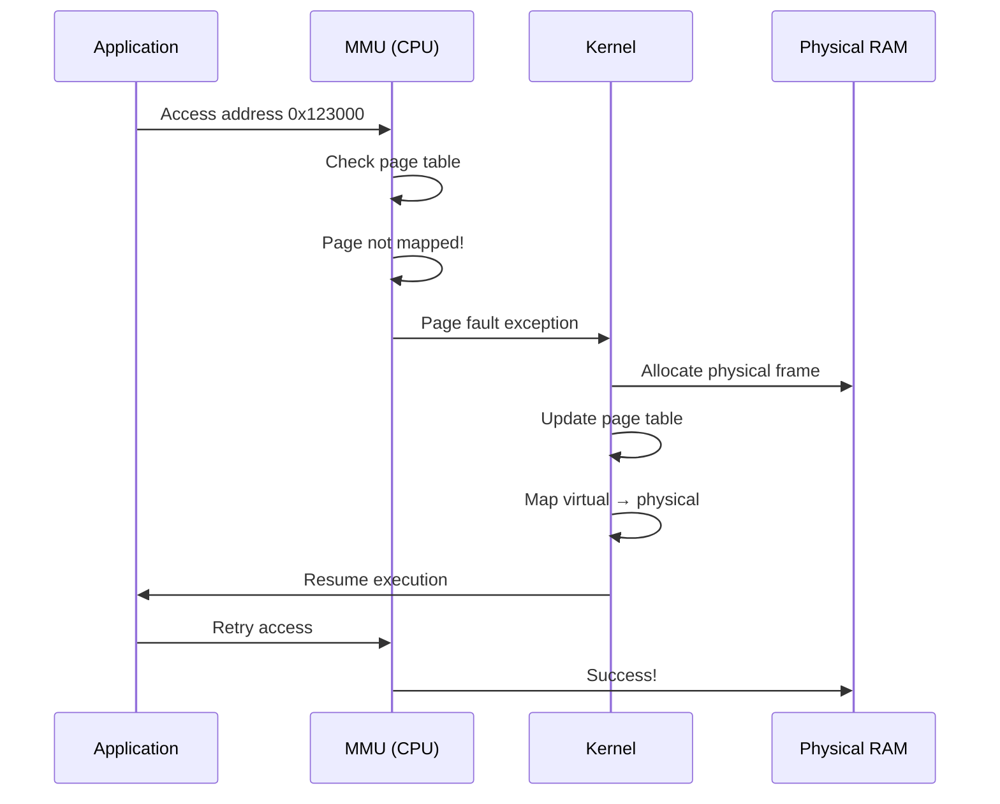

# Memory Management Fundamentals

**How Linux Creates the Illusion of Infinite Memory**

🟢 **Fundamentals** | 🟡 **Intermediate**

---

## The Memory Illusion

Your Node.js app thinks it has gigabytes of memory all to itself.  
Your Go service thinks it has gigabytes of memory all to itself.  
Your database thinks it has gigabytes of memory all to itself.

**They're all lying to themselves, and Linux is enabling that lie.**

Here's what actually happens:
- Your system has 16 GB of physical RAM
- You have 50 processes running
- Each process thinks it has access to terabytes of address space
- **This is virtual memory**

---

## Physical vs Virtual Memory

### Physical Memory (RAM)

**What exists in hardware:**
- Physical chips on your motherboard
- Finite amount (e.g., 16 GB)
- Shared by all processes
- Direct addresses (0x00000000 to 0x3FFFFFFFF for 16GB)

### Virtual Memory

**What each process sees:**
- Each process has its own "address space"
- On 64-bit Linux: 0 to 2^48 (256 TB of addressable space!)
- Not real — it's a mapping maintained by kernel

```
Process A sees:                Process B sees:
┌─────────────────────┐       ┌─────────────────────┐
│ 0x00000000          │       │ 0x00000000          │
│   [code]            │       │   [code]            │
│ 0x00400000          │       │ 0x00400000          │
│   [heap]            │       │   [heap]            │
│ 0x70000000          │       │ 0x70000000          │
│   [stack]           │       │   [stack]           │
│ 0x7FFFFFFFFFFF      │       │ 0x7FFFFFFFFFFF      │
└─────────────────────┘       └─────────────────────┘
         ↓                             ↓
         └──────────┬──────────────────┘
                    ↓
         ┌─────────────────────┐
         │  Physical RAM       │
         │  (16 GB total)      │
         │                     │
         │  Frame 0            │
         │  Frame 1            │
         │  ...                │
         │  Frame N            │
         └─────────────────────┘
```

**Key insight: Virtual addresses are translated to physical addresses by the MMU (Memory Management Unit) in the CPU.**

---

## Why Virtual Memory Exists

### 1. Isolation

**Without virtual memory:**
- Process A could read Process B's memory
- One buggy pointer could corrupt another process
- No security

**With virtual memory:**
- Each process has separate address space
- Kernel controls the mapping
- Process A cannot access Process B's memory (unless explicitly shared)

### 2. Flexibility

**Programs can be loaded anywhere in physical RAM:**
- No need to compile for specific memory addresses
- Kernel decides physical placement
- Can move memory pages around (if needed)

### 3. Overcommitment

**You can "allocate" more memory than you have:**
```c
// Allocate 10 GB on a system with 4 GB RAM
char *ptr = malloc(10L * 1024 * 1024 * 1024);
// This succeeds!
```

Linux allows this because:
- Allocation doesn't mean immediate physical memory use
- Physical memory allocated when you actually **write** to it (page fault)
- Kernel can swap unused pages to disk

---

## Address Spaces: What a Process Sees

Every process has a virtual address space layout:

```
High addresses (0x7FFFFFFFF...)
┌─────────────────────────────┐
│     Kernel Space            │ ← Not accessible from user space
│  (Only kernel can access)   │    (separate module will cover this)
├─────────────────────────────┤ ← 0x800000000000 (on x86-64)
│     Stack                   │
│     (grows downward)        │
│     ↓                       │
│                             │
│     (unused)                │
│                             │
│     Memory mappings (mmap)  │
│     (shared libs, files)    │
│                             │
│     (unused)                │
│                             │
│     ↑                       │
│     Heap                    │
│     (grows upward)          │
├─────────────────────────────┤
│     BSS (uninitialized data)│
├─────────────────────────────┤
│     Data (initialized vars) │
├─────────────────────────────┤
│     Text (program code)     │
├─────────────────────────────┤
Low addresses (0x00000000...)
```

### Segments Explained

**1. Text (Code) Segment**
- Your compiled program code
- Read-only, executable
- Shared between multiple instances of same program
- Example: If you run `node` 10 times, text segment shared

**2. Data Segment**
- Initialized global and static variables
- Read-write

```c
int global_var = 42;  // In data segment
static int count = 0; // In data segment
```

**3. BSS Segment**
- Uninitialized global and static variables
- Initialized to zero by kernel
- BSS = "Block Started by Symbol"

```c
int uninitialized_array[1000];  // In BSS
static float values[100];       // In BSS
```

**4. Heap**
- Dynamic memory allocations
- Grows upward (toward higher addresses)
- Managed by `malloc()`, `free()` in C
- Garbage-collected in Node.js, Go, Python

```typescript
// Node.js: heap allocation
const arr = new Array(1000000); // On heap
const obj = { data: 'large string' }; // On heap
```

**5. Stack**
- Function call frames
- Local variables
- Return addresses
- Grows downward (toward lower addresses)
- Fixed size (default: 8 MB on Linux)
- Stack overflow = exceeding this limit

```typescript
function recursive(n: number) {
  const localVar = n; // On stack
  if (n > 0) {
    recursive(n - 1); // Each call adds stack frame
  }
}

recursive(1000000); // Stack overflow!
```

**6. Memory Mappings (mmap)**
- Shared libraries (`.so` files)
- Files mapped into memory
- Shared memory between processes
- Anonymous mappings (alternative to heap)

---

## Pages and Page Tables

**The fundamental unit of memory management is a page.**

- Typical page size: **4 KB** (4096 bytes)
- Virtual memory divided into pages
- Physical memory divided into "frames" (same size)
- Kernel maintains page tables to map virtual pages to physical frames

```
Virtual Page 0  →  Physical Frame 5
Virtual Page 1  →  Physical Frame 12
Virtual Page 2  →  Physical Frame 3
Virtual Page 3  →  Not mapped (will fault)
Virtual Page 4  →  Physical Frame 50
```

### Page Faults

**What happens when you access unmapped memory:**

```typescript
// Node.js allocates memory
const buffer = Buffer.alloc(1024 * 1024); // 1 MB
// At this point: memory allocated but not backed by physical RAM

buffer[0] = 42; // Write to first byte
// Page fault! Kernel maps physical memory
```

**Page fault sequence:**



**Types of page faults:**

1. **Minor (soft) fault**: Page exists but not in page table
   - Example: Copy-on-write page needs copying
   - Fast (~microseconds)

2. **Major (hard) fault**: Page must be loaded from disk
   - Example: Memory swapped out, or memory-mapped file
   - Slow (~milliseconds, depends on disk)

---

## Copy-on-Write (COW)

**Memory efficiency trick used by `fork()`:**

```bash
$ node server.js &
# Process uses 100 MB of memory

$ # Process forks (e.g., cluster.fork())
# Child process created
# Both processes share the same 100 MB of physical memory!
```

**How it works:**

```
After fork():
┌──────────────┐         ┌──────────────┐
│  Parent      │         │  Child       │
│  PID: 1000   │         │  PID: 1001   │
└──────┬───────┘         └──────┬───────┘
       │                        │
       └────────┬───────────────┘
                ↓
         ┌────────────┐
         │ Physical   │
         │ Memory     │
         │ (shared)   │
         └────────────┘
         (marked read-only)

Parent writes to memory:
┌──────────────┐         ┌──────────────┐
│  Parent      │         │  Child       │
│  PID: 1000   │         │  PID: 1001   │
└──────┬───────┘         └──────┬───────┘
       │                        │
       ↓                        ↓
┌────────────┐          ┌────────────┐
│ Physical   │          │ Physical   │
│ Memory     │          │ Memory     │
│ (copy)     │          │ (original) │
└────────────┘          └────────────┘
```

**Steps:**
1. After `fork()`, both processes point to same physical pages
2. Pages marked read-only
3. When either process writes, page fault occurs
4. Kernel copies the page
5. Writer gets new private copy

**Why this matters:**
- `fork()` is fast (no immediate copying)
- Memory efficient (only copy what changes)
- This is how containers can start quickly

---

## Stack vs Heap (In Reality)

### Stack

**Fixed-size, fast, automatic:**

```typescript
function example() {
  const x = 42;           // Stack allocation
  const y = { val: x };   // y is on stack (pointer),
                          // { val: 42 } is on heap!
  return y;
}
```

**Stack characteristics:**
- Fast allocation (just move stack pointer)
- Automatic deallocation (function returns, stack frame popped)
- Fixed size per thread (default 8 MB on Linux)
- Overflowing causes segfault

**Check stack size:**
```bash
$ ulimit -s
8192  # 8 MB (in KB)

# Increase for current shell
$ ulimit -s 16384  # 16 MB
```

**Stack overflow example:**

```typescript
function recurse(n: number) {
  const buffer = new Array(1000); // Some data on stack
  recurse(n + 1); // Infinite recursion
}

recurse(0);
// Eventually: Segmentation fault (stack overflow)
```

### Heap

**Dynamic-size, slower, manual (or GC):**

```typescript
const huge = new Uint8Array(1024 * 1024 * 1024); // 1 GB on heap
```

**Heap characteristics:**
- Slow allocation (find free block, bookkeeping)
- Manual deallocation (C/C++) or GC (Node.js, Go)
- Can grow to available memory
- Fragmentation is a concern

**malloc() in C:**
```c
void* ptr = malloc(1024); // Allocate 1 KB on heap
free(ptr);                // Must free manually
```

**JavaScript (automatic GC):**
```typescript
let data = new Array(1000000); // Heap allocation
// No explicit free — GC will collect when no references
data = null; // Eligible for GC
```

---

## Memory Leaks in Different Languages

### C: Forgot to Free

```c
void leak() {
    char* ptr = malloc(1024);
    // Use ptr
    // BUG: Forgot to free(ptr)
    // Memory leaked
}

for (int i = 0; i < 1000000; i++) {
    leak(); // Leaks 1 GB
}
```

### Node.js: Reference Keeps Object Alive

```typescript
const cache = new Map();

function processUser(userId: number) {
  const userData = fetchUserData(userId); // Large object
  cache.set(userId, userData);
  // BUG: Cache grows forever
  // userData never garbage collected
}

// Fix: Use LRU cache or WeakMap
```

### Go: Goroutine Leak

```go
func leak() {
    ch := make(chan int)
    go func() {
        val := <-ch // Blocks forever
        // Channel never closed, goroutine never exits
        // Goroutine's stack memory leaked
    }()
    // BUG: Never send to ch or close it
}

// Thousands of goroutines accumulate
```

---

## Viewing Memory Usage

### Per-Process Memory

```bash
$ ps aux
USER       PID %MEM   VSZ   RSS COMMAND
user      1234  2.1 612340 87236 node server.js
#              ^^^  ^^^^^^ ^^^^^
#              %    VSZ    RSS
```

**Metrics explained:**

- **VSZ (Virtual Set Size)**: Total virtual memory allocated
  - Includes all mapped memory (even if not in RAM)
  - Often misleadingly large

- **RSS (Resident Set Size)**: Physical memory actually in RAM
  - More accurate representation of memory use
  - Includes shared libraries (counted multiple times across processes)

- **PSS (Proportional Set Size)**: Fair share of memory
  - Shared memory divided by number of processes using it
  - Most accurate

```bash
$ cat /proc/1234/status | grep -E 'Vm|Rss'
VmSize:   612340 kB  # Virtual memory (VSZ)
VmRSS:     87236 kB  # Resident memory (RSS)
RssAnon:   45000 kB  # Anonymous memory (heap, stack)
RssFile:   40000 kB  # Mapped files
RssShmem:   2236 kB  # Shared memory
```

### System-Wide Memory

```bash
$ free -h
              total        used        free      shared  buff/cache   available
Mem:           15Gi       3.2Gi       8.1Gi       256Mi       4.0Gi        11Gi
Swap:         8.0Gi          0B       8.0Gi
```

**Key insight: "free" memory being low is normal and good!**

Linux uses free memory for:
- **Page cache**: Caching disk reads
- **Buffer cache**: Caching filesystem metadata

This memory is reclaimable — kernel frees it when applications need it.

---

## Key Takeaways

1. **Virtual memory: Each process has its own address space**
2. **Pages are the unit of memory management (typically 4 KB)**
3. **Page faults occur when accessing unmapped memory**
4. **Copy-on-write makes fork() efficient**
5. **Stack is fast, fixed-size; heap is flexible, slower**
6. **RSS is more accurate than VSZ for memory usage**
7. **Low "free" memory is normal — Linux uses it for caching**

---

## What's Next

- [The Page Cache](02-page-cache.md) — Linux's secret performance weapon
- [Swapping and OOM Killer](03-swap-and-oom.md) — When memory runs out
- [Memory in Containers](04-memory-containers.md) — cgroups and memory limits

---

**Next:** [The Page Cache](02-page-cache.md)
