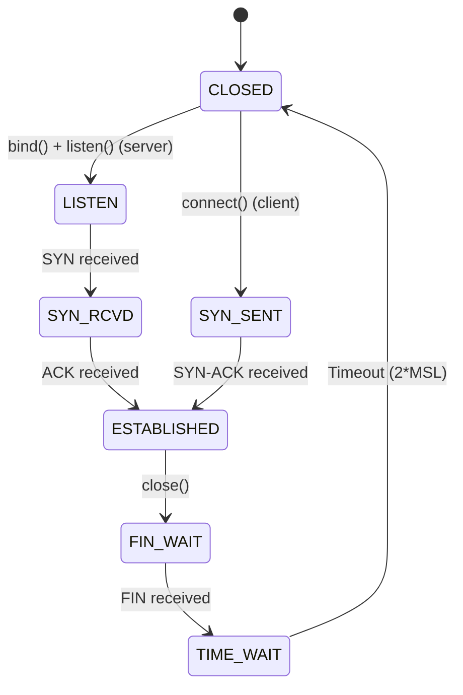
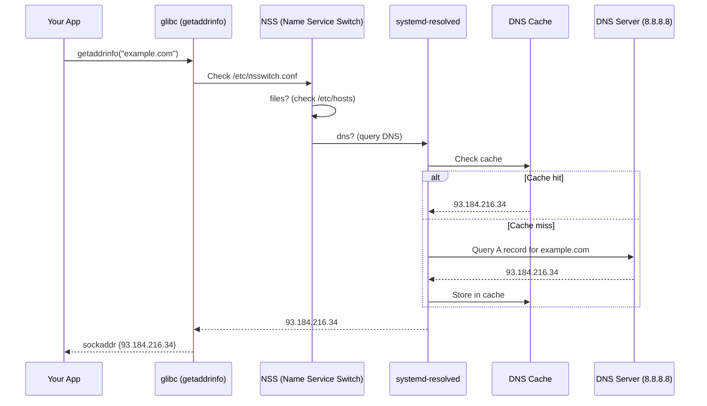

# Networking Fundamentals in Linux

**Networking as an OS Subsystem**

🟢 **Fundamentals** | 🟡 **Intermediate**

---

## Sockets Are File Descriptors

The most important thing to understand about networking in Linux:

**A network connection is just a special file descriptor.**

```typescript
import * as net from 'net';

const socket = net.connect(3000, 'localhost');
// Under the hood: socket() syscall returns a file descriptor

socket.write('GET / HTTP/1.1\r\n\r\n');
// Under the hood: write(fd, data, length)

socket.on('data', (data) => {
  // Under the hood: read(fd, buffer, length)
});

socket.end();
// Under the hood: close(fd)
```

**Same operations as files:**
- `read()` / `write()`
- `close()`
- Can use with `select()`, `poll()`, `epoll()`
- Has a file descriptor number

**This is why networking scales so well in Linux — it's just I/O.**

---

## TCP vs UDP from the Kernel's View

### TCP (Transmission Control Protocol)

**Connection-oriented, reliable, ordered:**

```typescript
import * as net from 'net';

// Create TCP server
const server = net.createServer((socket) => {
  // Each connection is a new socket (fd)
  socket.write('Hello\n');
});

server.listen(3000);
```

**What the kernel does for TCP:**

1. **Connection establishment** (3-way handshake)
   ```
   Client                    Server
     |                         |
     |-------- SYN ----------->|
     |<----- SYN-ACK ----------|
     |-------- ACK ----------->|
     |    Connection open      |
   ```

2. **Reliable delivery**
   - Kernel buffers sent data
   - Waits for acknowledgments
   - Retransmits if packet lost
   - Your code doesn't worry about packet loss

3. **Order guarantee**
   - Kernel reorders packets if they arrive out of order
   - Your code always sees bytes in correct order

4. **Flow control**
   - Kernel manages send/receive windows
   - Prevents overwhelming receiver

**TCP socket lifecycle:**



### UDP (User Datagram Protocol)

**Connectionless, unreliable, unordered:**

```typescript
import * as dgram from 'dgram';

const socket = dgram.createSocket('udp4');

// No connection, just send
socket.send('Hello', 3000, 'localhost');

socket.on('message', (msg, rinfo) => {
  console.log(`From ${rinfo.address}:${rinfo.port}: ${msg}`);
});

socket.bind(3000);
```

**What the kernel does for UDP:**

1. **No connection setup** — send immediately
2. **No reliability** — if packet lost, too bad
3. **No ordering** — packets can arrive out of order
4. **No flow control** — can overwhelm receiver

**When to use UDP:**
- DNS queries (small, single packet)
- Video streaming (losing a frame is OK)
- Gaming (old data is useless)
- Metrics/logs (occasional loss acceptable)

**When to use TCP:**
- HTTP/HTTPS
- Database connections
- File transfers
- Almost everything else

---

## Ports and Binding

**A port is a 16-bit number (0-65535) identifying an endpoint.**

### How Ports Work

```
Your machine has one IP address: 192.168.1.100

Multiple services listening:
192.168.1.100:22    → SSH server
192.168.1.100:80    → Web server
192.168.1.100:3000  → Your Node.js app
192.168.1.100:5432  → PostgreSQL
```

**Without ports, how would the kernel know which process gets which packet?**

### Binding to a Port

```typescript
import * as net from 'net';

const server = net.createServer();

server.listen(3000, '0.0.0.0', () => {
  console.log('Listening on port 3000');
});
```

**What happens:**

1. `socket(AF_INET, SOCK_STREAM, 0)` — Create TCP socket
2. `bind(fd, {address: 0.0.0.0, port: 3000})` — Reserve port 3000
3. `listen(fd, backlog)` — Mark socket as accepting connections
4. Now packets to port 3000 route to this process

### Port Ranges

| Range | Purpose | Notes |
|-------|---------|-------|
| 0-1023 | Well-known ports | Require root to bind (22=SSH, 80=HTTP, 443=HTTPS) |
| 1024-49151 | Registered ports | User applications (3000=dev servers, 5432=PostgreSQL) |
| 49152-65535 | Dynamic/ephemeral | Auto-assigned for outgoing connections |

**Why your client connections use high port numbers:**

```bash
$ netstat -tn
Proto Local Address          Foreign Address        State
tcp   192.168.1.100:54321    8.8.8.8:53            ESTABLISHED
#                     ^^^^^  
#                     Ephemeral port (auto-assigned)
```

### "Address Already in Use" Error

```typescript
const server1 = net.createServer().listen(3000);
// OK

const server2 = net.createServer().listen(3000);
// Error: EADDRINUSE: address already in use
```

**Only one process can bind to a port at a time.**

**Common causes:**
1. Previous process still running
2. Process crashed, port in TIME_WAIT state
3. Another service using that port

**Debug:**

```bash
# Find what's using port 3000
$ sudo lsof -i :3000
COMMAND   PID USER   FD   TYPE DEVICE NODE NAME
node     1234 user   10u  IPv4  12345      TCP *:3000 (LISTEN)

# Or with ss
$ ss -tlnp | grep :3000
LISTEN 0    128    *:3000    *:*    users:(("node",pid=1234,fd=10))

# Kill the process
$ kill 1234
```

---

## Loopback Interface (127.0.0.1)

**Special network interface that connects to itself:**

```
127.0.0.1 = localhost = loopback
```

**Why it exists:**
- No physical network needed
- Traffic never leaves your machine
- Much faster than real network (no hardware)
- Security (not accessible from outside)

```typescript
// Bind to localhost only
server.listen(3000, '127.0.0.1');
// Only processes on this machine can connect

// Bind to all interfaces
server.listen(3000, '0.0.0.0');
// Anyone who can reach this machine can connect
```

**Common use cases:**
- Database on same machine as app
- Development servers
- IPC between processes

**Viewing connections:**

```bash
$ ss -tn
State   Recv-Q  Send-Q  Local Address:Port  Peer Address:Port
ESTAB   0       0       127.0.0.1:3000      127.0.0.1:54321
#                       ^^^^^^^^^           ^^^^^^^^^
#                       Server socket       Client socket
```

---

## DNS Resolution in Linux

**How `fetch('https://api.example.com')` becomes an IP address:**



### Resolution Order

**Check `/etc/nsswitch.conf`:**

```bash
$ cat /etc/nsswitch.conf
hosts: files dns myhostname
#      ^^^^^  ^   ^^^^^^^^^^
#      1. /etc/hosts
#         2. DNS
#            3. Local hostname
```

### /etc/hosts

**Local overrides:**

```bash
$ cat /etc/hosts
127.0.0.1   localhost
127.0.1.1   myhostname

# Custom entries
192.168.1.100  dev-server
127.0.0.1      api.local
```

**Use case: Development**

```typescript
// Production: Hits real api.production.com
await fetch('https://api.production.com/users');

// Development: Override in /etc/hosts
// 127.0.0.1 api.production.com
// Now hits localhost:443
```

### DNS Caching

**systemd-resolved caches DNS queries:**

```bash
$ resolvectl status
Global
  DNSSEC setting: no
  DNS Servers: 8.8.8.8
               1.1.1.1

# Flush DNS cache
$ sudo resolvectl flush-caches

# Query specific domain
$ resolvectl query example.com
example.com: 93.184.216.34
```

**Why developers care:**
- DNS changes take time to propagate
- Cache can serve stale data
- Understanding TTL (Time To Live)

---

## Routing Tables

**How the kernel decides where to send packets:**

```bash
$ ip route show
default via 192.168.1.1 dev wlan0 proto dhcp metric 600
192.168.1.0/24 dev wlan0 proto kernel scope link src 192.168.1.100 metric 600
```

**Reading this:**

1. **Default route**: Anything not matching other rules → gateway 192.168.1.1
2. **Local network**: 192.168.1.0/24 → directly via wlan0 interface

**Packet flow decision:**

```
Destination 93.184.216.34:

1. Check routing table
2. Not in 192.168.1.0/24 → use default route
3. Send to gateway 192.168.1.1
4. Gateway forwards to internet
```

---

## ARP: IP to MAC Address

**Problem:** IP works at network layer, but Ethernet needs MAC addresses.

**ARP (Address Resolution Protocol) bridges this:**

```
Who has 192.168.1.50? Tell 192.168.1.100
↓
I have 192.168.1.50, my MAC is aa:bb:cc:dd:ee:ff
```

**View ARP cache:**

```bash
$ ip neigh show
192.168.1.1 dev wlan0 lladdr 00:11:22:33:44:55 REACHABLE
192.168.1.50 dev wlan0 lladdr aa:bb:cc:dd:ee:ff STALE
```

**Why you might care:**
- ARP spoofing attacks
- Network troubleshooting
- Understanding why pings work but connections don't

---

## Essential Networking Commands

### ss (Socket Statistics)

**Modern replacement for netstat:**

```bash
# All TCP listening sockets
$ ss -tln
State   Recv-Q  Send-Q  Local Address:Port
LISTEN  0       128     0.0.0.0:22
LISTEN  0       128     127.0.0.1:5432
LISTEN  0       128     *:3000

# All established TCP connections
$ ss -tn
State   Recv-Q  Send-Q  Local Address:Port   Peer Address:Port
ESTAB   0       0       192.168.1.100:54321  93.184.216.34:443

# Show processes
$ ss -tlnp
LISTEN  0  128  *:3000  *:*  users:(("node",pid=1234,fd=10))

# Filter by port
$ ss -tlnp | grep :3000
```

**Flags:**
- `-t` = TCP
- `-u` = UDP
- `-l` = Listening
- `-n` = Numeric (don't resolve names)
- `-p` = Show process

### ip (IP Configuration)

```bash
# Show interfaces
$ ip addr show
1: lo: <LOOPBACK,UP,LOWER_UP> mtu 65536
    inet 127.0.0.1/8 scope host lo
2: wlan0: <BROADCAST,MULTICAST,UP,LOWER_UP> mtu 1500
    inet 192.168.1.100/24 brd 192.168.1.255 scope global wlan0

# Show routing table
$ ip route show

# Show ARP table
$ ip neigh show
```

### ping and traceroute

**ping: Test connectivity**

```bash
$ ping -c 3 example.com
PING example.com (93.184.216.34) 56(84) bytes of data.
64 bytes from 93.184.216.34: icmp_seq=1 ttl=56 time=10.2 ms
64 bytes from 93.184.216.34: icmp_seq=2 ttl=56 time=9.8 ms
64 bytes from 93.184.216.34: icmp_seq=3 ttl=56 time=10.1 ms
```

**traceroute: Show path to destination**

```bash
$ traceroute example.com
1  192.168.1.1 (192.168.1.1)  1.234 ms
2  10.0.0.1 (10.0.0.1)  5.678 ms
3  isp-gateway (203.0.113.1)  12.345 ms
...
```

---

## Real Production Scenarios

### Scenario 1: "Connection Refused"

```typescript
const client = net.connect(3000, 'localhost');
// Error: ECONNREFUSED
```

**What this means:**
1. DNS resolution worked (found IP)
2. Routing worked (packet reached destination)
3. **No process listening on port 3000**

**Debug:**

```bash
$ ss -tln | grep :3000
# Nothing returned = no listener

# Check if server is running
$ ps aux | grep node

# Start the server, then retry
```

### Scenario 2: "Connection Timeout"

```typescript
const client = net.connect(3000, 'remote-server');
// Error: ETIMEDOUT
```

**What this means:**
- No response from remote server
- Could be:
  1. Server down
  2. Firewall blocking
  3. Network issue
  4. Wrong IP/hostname

**Debug:**

```bash
# Can we reach the host?
$ ping remote-server

# Is port open?
$ telnet remote-server 3000
# Or
$ nc -zv remote-server 3000

# Check firewall
$ sudo iptables -L
```

### Scenario 3: "Works Locally but Not Remotely"

```typescript
// Server
server.listen(3000, '127.0.0.1');  // BUG!

// Local client
fetch('http://localhost:3000');  // Works!

// Remote client
fetch('http://192.168.1.100:3000');  // Times out
```

**Problem: Bound to loopback only**

**Fix:**

```typescript
server.listen(3000, '0.0.0.0');  // Listen on all interfaces
```

---

## Key Takeaways

1. **Sockets are file descriptors — same operations as files**
2. **TCP is reliable/ordered; UDP is fast/unreliable**
3. **Ports identify endpoints; only one process per port**
4. **127.0.0.1 (localhost) is loopback — stays on machine**
5. **DNS resolution: /etc/hosts → DNS → cache**
6. **Routing table determines where packets go**
7. **ss shows socket statistics; ip shows network config**

---

## What's Next

- [Module 06: Networking Deep Dive](../06-networking-deep/) — Namespaces, bridges, NAT, iptables
- [Module 07: Namespaces & cgroups](../07-containers/) — How containers work

---

**Next:** [Module 06: Networking Deep Dive](../06-networking-deep/01-network-namespaces.md)
