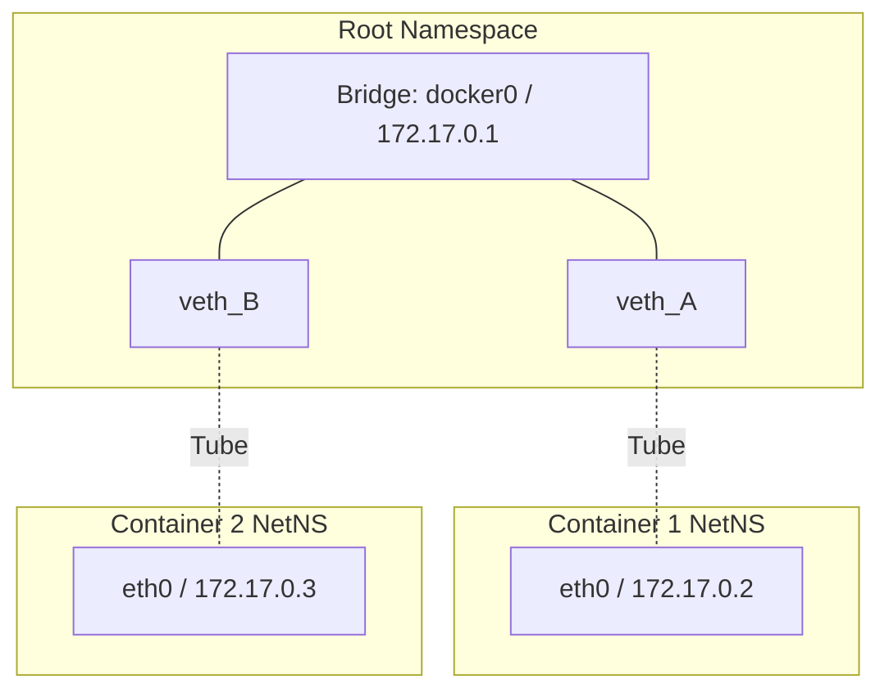

# Network Namespaces & veth pairs

**How Containers Slide Into the DMs (Network-Wise)**

🟡 **Intermediate** | 🔴 **Advanced**

---

## Introduction

So you know how containers feel like isolated little VMs? That's just namespaces pulling a fast one on you. When it comes to networking, your container is literally trapped in a **Network Namespace**. It has its own IP, its own routing table, and its own rules. 

But if it's completely isolated, how does it talk to the outside world? Enter **veth pairs** and **bridges**. They are the networking equivalent of passing notes under the table. No cap.

---

## Network Namespaces (netns)

A network namespace is like a private club for networking stack configs. Each netns gets its own:
- Network interfaces (like `eth0`, `lo`)
- Routing tables (how to get to `192.168.1.1`)
- Firewall rules (iptables/nftables)

When you boot your Linux machine, everything lives in the **root network namespace**. This is the main character. But when you start a Docker container, the kernel says, "Oops, you get your own empty room."

### Let's see it in action

```bash
# Create a new network namespace called "genz_room"
$ sudo ip netns add genz_room

# See all namespaces
$ ip netns list
genz_room

# Run a command inside that namespace (like peeking into the room)
$ sudo ip netns exec genz_room ip addr
1: lo: <LOOPBACK> mtu 65536 qdisc noop state DOWN group default qlen 1000
    link/loopback 00:00:00:00:00:00 brd 00:00:00:00:00:00
```

Notice how `lo` is `DOWN` and there's no `eth0`? The container is completely ghosted from the network right now. Deadass.

---

## The veth Pair: Networking's Besties

If your netns is an isolated room, a **veth pair (Virtual Ethernet pair)** is a tube connecting two rooms. Whatever you shout into one end comes out the other. They literally cannot exist without each other. True soulmates.

### Setting up the tube

```bash
# Create a veth pair (veth0 and veth1)
$ sudo ip link add veth0 type veth peer name veth1

# Right now, both ends are in the root namespace. 
# Let's yeet veth1 into our isolated genz_room:
$ sudo ip link set veth1 netns genz_room

# Give them IP addresses so they can text each other
$ sudo ip addr add 10.0.0.1/24 dev veth0
$ sudo ip netns exec genz_room ip addr add 10.0.0.2/24 dev veth1

# Turn the interfaces UP (wake them up)
$ sudo ip link set veth0 up
$ sudo ip netns exec genz_room ip link set veth1 up

# Let's ping from root to genz_room!
$ ping 10.0.0.2
PING 10.0.0.2 (10.0.0.2) 56(84) bytes of data.
64 bytes from 10.0.0.2: icmp_seq=1 ttl=64 time=0.042 ms
```

Bro, you just recreated Docker networking by hand. Huge W.

---

## Linux Bridges: The Group Chat

A `veth` pair is cool for 1-on-1 texts, but what if you have 10 containers? You can't just wire them all to the root namespace individually—that's a logistical nightmare. 

Enter the **Linux Bridge** (`docker0` in Docker terms). A bridge is a virtual switch. It's basically a group chat where everyone plugs in one end of their veth pair.



### Let's build a bridge

```bash
# 1. Create the bridge
$ sudo ip link add name mybridge type bridge
$ sudo ip addr add 172.18.0.1/16 dev mybridge
$ sudo ip link set mybridge up

# 2. Attach our veth0 (the root end) to the bridge
$ sudo ip link set dev veth0 master mybridge

# Now Container 1 (genz_room) can talk to the bridge network!
```

---

## "Why does my service work locally but not in the container?"

If I had a nickel for every time a dev asked this... it lives rent-free in my head.

1. **You bound to `127.0.0.1`**: In a container, `127.0.0.1` is the container's LOCALHOST. It is *not* the host machine's localhost. If your Node.js app binds to `127.0.0.1:3000` inside Docker, the outside world literally cannot see it. **Fix**: Bind to `0.0.0.0`.
2. **Missing Routes**: The container doesn't know how to reach the subnet your DB is on. 
3. **IPTables blocked you**: Docker messes with iptables heavily to do NAT (Network Address Translation). If it's configured wrong, packets drop.

---

## Key Takeaways

1. **Network namespaces** isolate the network stack. Your container is just a process running in a custom netns.
2. **veth pairs** are the tubes connecting namespaces to the root host.
3. **Bridges** let multiple veth pairs talk to each other like a virtual switch.
4. Stop binding to `127.0.0.1` in containers unless you want to be ghosted by your own API. 🤡

**Next:** [Module 06: IPTables, NAT, and Packet Filtering](02-iptables-and-nat.md)
