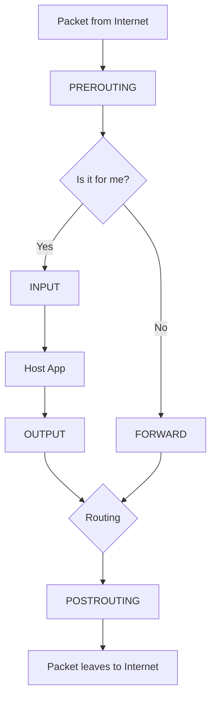

# iptables & NAT (Network Address Translation)

**How Packets get VIP Access (or get Bounced)**

🟡 **Intermediate** | 🔴 **Advanced**

---

## Introduction

If network namespaces and bridges (from the last chapter) are the rooms and hallways, **iptables** (and its newer cousin **nftables**) is the literal bouncer at the club.

When a packet tries to leave your container or hit your host, iptables checks the list. "Name? Source IP? Destination port? Oh, you're going to port 80? Step right in. Wait, you're trying to hit port 22 inside the container? Blocked. literal trash."

---

## What the heck is NAT? 

**NAT (Network Address Translation)** is the reason we haven't run out of IPv4 addresses yet. It's the ultimate catfishing scheme for networks.

Let's say your Docker container wants to google something.
1. Container IP: `172.17.0.2`
2. Destination: `8.8.8.8` (Google)

`172.17.0.2` is a private, made-up IP. If Google receives a request from `172.17.0.2`, it has no clue how to reply. That IP doesn't exist on the public internet! 

### Enter SNAT (Source NAT) / Masquerading

When the packet leaves your host machine (say, IP `203.0.113.5`), the Linux kernel *rewrites* the packet's source IP on the fly:

```
[Container] (src: 172.17.0.2) --> [Host iptables] --> REWRITTEN (src: 203.0.113.5) --> [Internet]
```

The router/Google replies to your host, and your host rewrites the destination *back* to the container's IP before delivering the response. Boom. Catfish successful.

---

## The Dark Art of Port Forwarding

When you run:
`docker run -p 8080:80 nginx`

You are telling Docker to do **DNAT (Destination NAT)**. 
Docker adds an iptables rule that says: "Hey, if any traffic comes to the host on port 8080, violently rewrite the destination to `172.17.0.2:80` (the container) and throw it over the bridge."

### Let's see the receipts

Check the NAT table on your machine right now:

```bash
$ sudo iptables -t nat -L -n

Chain PREROUTING (policy ACCEPT)
target     prot opt source               destination
DOCKER     all  --  0.0.0.0/0            0.0.0.0/0           ADDRTYPE match dst-type LOCAL

Chain DOCKER (2 references)
target     prot opt source               destination
DNAT       tcp  --  0.0.0.0/0            0.0.0.0/0           tcp dpt:8080 to:172.17.0.2:80
# ^^^ THERE IT IS! The physical proof.
```

---

## Table & Chains: The iptables Flow

To understand iptables, you need to know it has **Tables** (categories of rules) and **Chains** (when the rules apply).

### The Tables:
1. **filter**: The default table. "Do I drop or accept this packet?"
2. **nat**: "Do I rewrite the source/destination IPs?"
3. **mangle**: "Do I modify the packet headers?" (Super advanced, chaotic evil).

### The Chains (Lifecycle):
A packet's journey is basically a Mario Kart track:

1. `PREROUTING`: Packet just arrived off the wire. Good place for DNAT.
2. `INPUT`: Packet is meant for this very machine (host).
3. `FORWARD`: Packet is meant for someone else (routing between container and internet).
4. `OUTPUT`: Packet is generated by this machine, going out.
5. `POSTROUTING`: Packet is about to leave. Good place for SNAT/Masquerade.



*Note: For Docker to work, `FORWARD` must be enabled. If your networking is broken and packets seem to drop into a black hole, `iptables -P FORWARD DROP` is probably the culprit. iykyk.*

---

## The Great Migration: nftables vs eBPF vs iptables

If someone tells you "you need to learn iptables right now," they're kinda living in the past. It's legacy. 

1. **iptables**: The OG. Uses lists of rules read linearly. Slow if you have 10,000 Kubernetes rules.
2. **nftables**: The modern replacement. Built into modern kernels, faster, better syntax. Under the hood, modern iptables commands often just translate to nftables anyway (`iptables-nft`).
3. **eBPF (Cilium)**: The absolute gigachad of modern cloud-native networking. Instead of tables, eBPF runs sandboxed C programs directly in the kernel to route packets at lightspeed. Total main character energy. ⚡

## Key Takeaways

1. **NAT** is how private IPs (containers) survive the public internet.
2. Port forwarding (`-p 8080:80`) is literally just an iptables **DNAT** rule. 
3. IPTables organizes rules by **Tables** (what kind of rule) and **Chains** (when in the lifecycle).
4. Don't write raw iptables rules for containers unless you really know what you're doing. Let Docker/CNI do it, otherwise you'll brick your network.

---

**Next:** [Module 07: Namespaces & cgroups](../07-containers/01-namespaces-and-cgroups.md)
