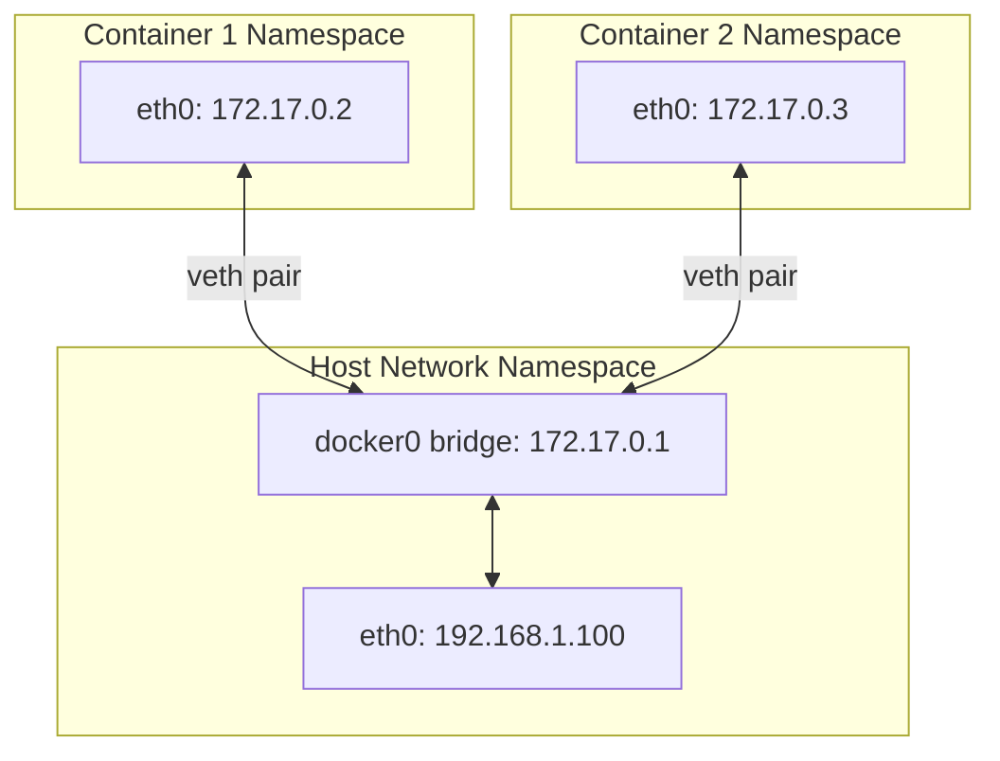

# Namespaces and cgroups: Containers Explained

**Containers Are Just Linux Processes**

🟡 **Intermediate** | 🔴 **Advanced**

---

## The Container Illusion

**A container is NOT a VM. It's just a Linux process with fancy isolation.**

```bash
$ docker run -it ubuntu bash
root@a1b2c3d4:/# ps aux
USER   PID  COMMAND
root     1  bash
root    12  ps aux

# Inside container: "I'm the only thing running!"
```

```bash
# On host
$ ps aux | grep bash
root   12345  0.0  0.0  /bin/bash
#      ^^^^^
#      Real PID on host
```

**Same process, different view. This is namespaces.**

---

## What Are Namespaces?

**Namespaces isolate what a process can SEE.**

Without namespaces:
- All processes see all other processes
- All processes see all network interfaces
- All processes see all mount points

With namespaces:
- Process only sees processes in its namespace
- Process only sees network interfaces in its namespace
- Process only sees mount points in its namespace

**Think of namespaces as** different views of the same system.

---

## Types of Namespaces

Linux has several namespace types:

| Namespace | Isolates | Example Use |
|-----------|----------|-------------|
| **PID** | Process IDs | Container sees only its processes |
| **NET** | Network stack | Container has own IP, ports, routing |
| **MNT** | Mount points | Container has own filesystem view |
| **UTS** | Hostname | Container has own hostname |
| **IPC** | Inter-process communication | Container has own shared memory |
| **USER** | User and group IDs | Map container root to non-root on host |
| **CGROUP** | cgroup root directory | Hide cgroup structure |
| **TIME** | System time | (New) Isolate time for testing |

---

## PID Namespace

**The most important namespace for containers.**

### How It Works

```
Host (PID namespace 0):
┌────────────────────────────────┐
│ PID 1: systemd                 │
│ PID 1000: dockerd              │
│ PID 12345: bash (container)    │
│ PID 12346: node (container)    │
└────────────────────────────────┘

Container (PID namespace X):
┌────────────────────────────────┐
│ PID 1: bash      ←────────┐    │
│ PID 2: node      ←───────┐│    │
└──────────────────────────││────┘
         Maps to           ││
         ↓                 ││
Host PIDs: 12345 ──────────┘│
           12346 ───────────┘
```

**Same processes, different PID numbering.**

### Creating PID Namespace

```c
// C example
#define _GNU_SOURCE
#include <sched.h>
#include <stdio.h>
#include <unistd.h>

int child_fn(void *arg) {
    printf("Child PID: %d\n", getpid());  // Prints: 1
    sleep(100);
    return 0;
}

int main() {
    printf("Parent PID: %d\n", getpid());  // Host PID
    
    char stack[4096];
    clone(child_fn, stack + 4096, CLONE_NEWPID | SIGCHLD, NULL);
    
    sleep(1);
    return 0;
}
```

**What happens:**
1. Parent creates child with `CLONE_NEWPID`
2. Child believes it's PID 1
3. Host sees child's real PID (e.g., 12345)
4. Child can only see/signal processes in its namespace

### Why PID 1 Is Special in Containers

```dockerfile
# Bad: Shell as PID 1
CMD node server.js

# Good: Node as PID 1
CMD ["node", "server.js"]
```

**PID 1 responsibilities:**
- Reap zombie processes
- Forward signals properly
- Can't be killed (even by itself without special handling)

**If your app is PID 1 and doesn't reap children:**

```typescript
// server.ts (PID 1 in container)
setInterval(() => {
  spawn('curl', ['http://api.example.com']);
  // BUG: Not waiting for child
}, 1000);

// After an hour: thousands of zombies
// Container still "works" but PIDs exhausted
```

**Solution: Use init system**

```dockerfile
FROM node:18
RUN apt-get update && apt-get install -y dumb-init
ENTRYPOINT ["dumb-init", "--"]
CMD ["node", "server.js"]
```

---

## Mount Namespace

**Isolates filesystem view — how containers have different files than host.**

### How It Works

```
Host sees:
/
├── home/
├── etc/
├── var/
└── ...

Container sees (different mount namespace):
/
├── app/
│   └── server.js
├── usr/
├── lib/
└── etc/
    └── (minimal)
```

**Same kernel, different view of filesystems.**

### Container Filesystem Layers

**Docker uses OverlayFS + mount namespace:**

```
Host:
/var/lib/docker/overlay2/
├── layer1/  (base Ubuntu image)
├── layer2/  (installed packages)
├── layer3/  (application code)
└── container-X-layer/  (writable layer)

Container mount namespace sees:
/
└── (unified view of all layers)
```

**Changes in container → written to writable layer**

```bash
# In container
$ touch /tmp/newfile
# File written to:
# /var/lib/docker/overlay2/container-X-layer/tmp/newfile

# Not visible on host filesystem directly
```

---

## Network Namespace

**Isolates network stack — how containers have own IP addresses.**

### What's Isolated

Each network namespace has:
- Own network interfaces
- Own IP addresses
- Own routing table
- Own iptables rules
- Own /proc/net/*

### How Docker Networking Works



**Components:**

1. **veth pair**: Virtual ethernet cable
   - One end in container namespace
   - Other end in host namespace

2. **Bridge** (docker0): Virtual switch
   - Connects all container veth ends
   - Routes between containers

3. **NAT**: Network Address Translation
   - Containers → outside world
   - iptables rules handle translation

**Inside container:**

```bash
$ ip addr
1: lo: <LOOPBACK,UP>
    inet 127.0.0.1/8
2: eth0: <BROADCAST,MULTICAST,UP>
    inet 172.17.0.2/16
    
$ ip route
default via 172.17.0.1 dev eth0
172.17.0.0/16 dev eth0
```

**On host:**

```bash
$ ip addr
...
4: docker0: <BROADCAST,MULTICAST,UP>
    inet 172.17.0.1/16
5: veth1a2b3c@if2: <BROADCAST,MULTICAST,UP>
#  ^^^^^^^^^^ Host end of veth pair
    
$ docker exec container-id ip addr
...
2: eth0@if5: <BROADCAST,MULTICAST,UP>
#       ^^^ Points to host's veth end (5)
    inet 172.17.0.2/16
```

---

## cgroups: Resource Limits

**If namespaces isolate what you can SEE, cgroups limit what you can USE.**

### What cgroups Control

- **CPU**: How much CPU time
- **Memory**: How much RAM
- **Block I/O**: Disk read/write bandwidth
- **Network**: (via tc + cgroups)
- **PIDs**: Maximum number of processes

```bash
# Docker container with limits
$ docker run --cpus=0.5 --memory=512m ubuntu

# Under the hood:
# - cgroup sets CPU quota to 50%
# - cgroup sets memory limit to 512 MB
# - If process exceeds memory → OOM killed
```

### cgroups v2 Hierarchy

**Modern Linux (systemd-based):**

```bash
$ cat /proc/self/cgroup
0::/user.slice/user-1000.slice/session-3.scope
```

**View cgroup limits:**

```bash
# For a container
$ docker inspect container-id | grep -A 10 HostConfig
"Memory": 536870912,     # 512 MB
"NanoCpus": 500000000,   # 0.5 CPUs

# On host filesystem
$ cat /sys/fs/cgroup/system.slice/docker-CONTAINERID.scope/memory.max
536870912

$ cat /sys/fs/cgroup/system.slice/docker-CONTAINERID.scope/cpu.max
50000 100000
#^^^^^ ^^^^^^^
#Can use 50000 microseconds per 100000 microseconds = 50%
```

### Memory Limits in Action

**Without limit:**

```typescript
// memory-hog.js
const arrays = [];
setInterval(() => {
  arrays.push(new Array(1000000).fill('x'));
}, 100);

// Consumes all available RAM
// Eventually OOM killer terminates it (host is affected)
```

**With cgroup limit:**

```bash
$ docker run --memory=100m node memory-hog.js
# Container limited to 100 MB
# Kernel OOM kills container when exceeded
# Host unaffected
```

**Monitoring:**

```bash
$ docker stats
CONTAINER  CPU %  MEM USAGE / LIMIT   MEM %
abc123     5.2%   95.1 MiB / 100 MiB  95.1%
```

### CPU Limits

**CPU shares vs CPU quota:**

```bash
# CPU shares (relative weight)
docker run --cpu-shares=512 ubuntu
# If two containers: both 512 → equal share

# CPU quota (hard limit)
docker run --cpus=0.5 ubuntu
# Absolute limit: 50% of one CPU core
```

**Testing:**

```bash
# Stress test
$ docker run --cpus=0.5 ubuntu stress --cpu 4
# Tries to max out 4 CPUs
# Limited to 50% of 1 CPU
```

---

## How Docker Uses Namespaces and cgroups

### Docker Run Breakdown

```bash
$ docker run -d --name web \
  --memory=512m \
  --cpus=0.5 \
  -p 8080:80 \
  nginx
```

**What Docker does:**

1. **Creates namespaces:**
   - PID namespace (nginx sees PID 1)
   - Network namespace (own network stack)
   - Mount namespace (own filesystem view)
   - UTS namespace (hostname = container ID)
   - IPC namespace (own shared memory)

2. **Sets up cgroups:**
   - Memory limit: 512 MB
   - CPU limit: 0.5 cores

3. **Configures networking:**
   - Creates veth pair
   - Attaches one end to docker0 bridge
   - Sets up NAT rules for port 8080→80

4. **Mounts filesystem:**
   - OverlayFS layers (image + writable layer)
   - Bind mounts (-v volumes if any)

5. **Executes process:**
   - `exec()` to start nginx
   - Becomes PID 1 in container namespace

---

## Why Containers Are NOT VMs

| Aspect | Container | VM |
|--------|-----------|-----|
| **Kernel** | Shares host kernel | Separate kernel |
| **Isolation** | Namespaces (process-level) | Hypervisor (hardware-level) |
| **Overhead** | Minimal (just process) | Heavy (full OS) |
| **Startup** | Milliseconds | Seconds to minutes |
| **Size** | MBs | GBs |
| **Security** | Process isolation | Hardware isolation |

**Seeing is believing:**

```bash
# In container
$ docker run ubuntu cat /proc/version
Linux version 5.15.0 ...

# On host
$ cat /proc/version
Linux version 5.15.0 ...
# Same kernel!
```

**Compare to VM:**

```bash
# In VM
$ cat /proc/version
Linux version 4.18.0 ...  # Different kernel

# On host
$ cat /proc/version
Linux version 5.15.0 ...  # Different!
```

---

## Security Implications

### Shared Kernel = Attack Surface

**If container escapes namespace, it's on the host kernel.**

```bash
# Privileged container (dangerous)
$ docker run --privileged ubuntu

# Can see host processes in /proc
# Can load kernel modules
# Can access host devices
# Essentially root access to host
```

### User Namespaces

**Map container root to non-root on host:**

```
Container sees:         Host sees:
UID 0 (root)    →      UID 100000
UID 1           →      UID 100001
UID 1000        →      UID 101000
```

**Enable:**

```bash
$ dockerd --userns-remap=default
```

**Now even if process is root in container, it's non-root on host.**

---

## Kubernetes and cgroups/Namespaces

**Kubernetes builds on these primitives:**

```yaml
# pod.yaml
apiVersion: v1
kind: Pod
metadata:
  name: web
spec:
  containers:
  - name: nginx
    image: nginx
    resources:
      limits:
        memory: "512Mi"  # → cgroup memory limit
        cpu: "500m"      # → cgroup CPU limit
```

**What Kubernetes does:**

1. Schedules pod to node
2. kubelet on node creates container(s) via container runtime (Docker/containerd)
3. Container runtime creates namespaces and cgroups
4. Enforces resource limits

---

## Observing Namespaces and cgroups

### View Process Namespaces

```bash
$ ls -l /proc/self/ns/
lrwxrwxrwx 1 user user 0 Feb 21 12:00 ipc -> 'ipc:[4026531839]'
lrwxrwxrwx 1 user user 0 Feb 21 12:00 mnt -> 'mnt:[4026531840]'
lrwxrwxrwx 1 user user 0 Feb 21 12:00 net -> 'net:[4026531992]'
lrwxrwxrwx 1 user user 0 Feb 21 12:00 pid -> 'pid:[4026531836]'
lrwxrwxrwx 1 user user 0 Feb 21 12:00 user -> 'user:[4026531837]'
lrwxrwxrwx 1 user user 0 Feb 21 12:00 uts -> 'uts:[4026531838]'

# Different namespace = different inode number
$ docker exec container-id ls -l /proc/self/ns/pid
lrwxrwxrwx 1 root root 0 pid -> 'pid:[4026532451]'
#                                       ^^^^^^^^^^^ Different!
```

### View cgroup Membership

```bash
$ cat /proc/self/cgroup
0::/user.slice/user-1000.slice/session-3.scope

# For Docker container
$ docker exec container-id cat /proc/self/cgroup
0::/system.slice/docker-abc123.scope
```

### View cgroup Limits

```bash
# Memory limit
$ cat /sys/fs/cgroup/system.slice/docker-abc123.scope/memory.max
536870912

# Current memory usage
$ cat /sys/fs/cgroup/system.slice/docker-abc123.scope/memory.current
45678901

# OOM events
$ cat /sys/fs/cgroup/system.slice/docker-abc123.scope/memory.events
low 0
high 0
max 0
oom 3  # ← Container OOM-killed 3 times
oom_kill 3
```

---

## Key Takeaways

1. **Containers are processes with namespaces (isolation) and cgroups (limits)**
2. **Namespaces isolate: PID, network, mounts, hostname, IPC, users**
3. **cgroups limit: CPU, memory, I/O, PIDs**
4. **Containers share host kernel (not VMs)**
5. **PID 1 in containers must reap zombies**
6. **Network namespaces + veth pairs + bridge = container networking**
7. **User namespaces map container root to non-root on host**
8. **Kubernetes uses these primitives for pod isolation and limits**

---

## What's Next

- [Module 08: systemd](../08-systemd/) — How services are managed
- [Module 11: Debugging](../11-debugging/) — Tools to inspect namespaces/cgroups
- [Module 13: Failure Stories](../13-failure-stories/) — Container OOM kills and more

---

**Next:** [Module 08: systemd](../08-systemd/01-systemd-fundamentals.md)
