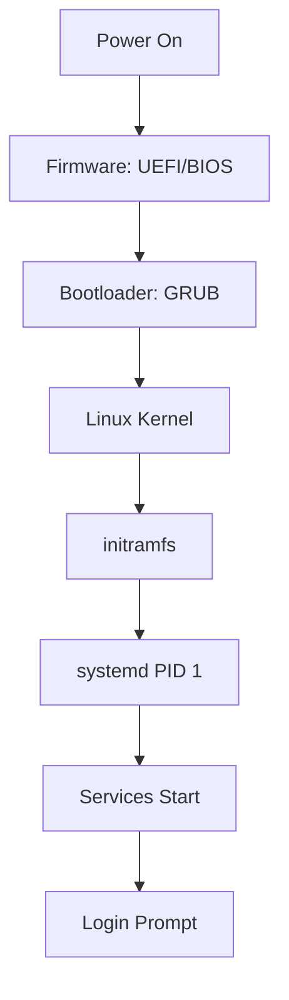
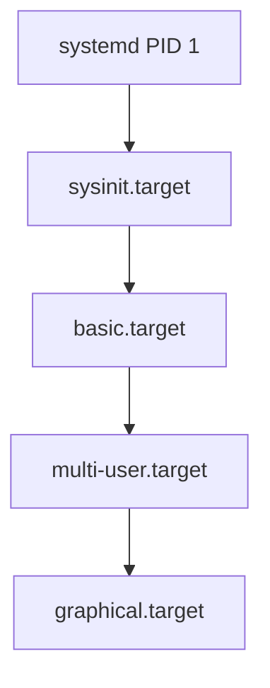

# The Linux Boot Process

**From Power Button to Login Prompt**

🟢 **Beginner-Friendly** | 🟡 **Intermediate**

---

## Introduction

Ever wondered what happens between pressing the power button and seeing the login screen?

This module explains the boot process — **the sequence of programs that run to get Linux ready**.

---

## Boot Sequence Overview



**Timeline:**

```
0s:    Power on
0-2s:  Firmware (UEFI/BIOS) runs
2-3s:  GRUB bootloader
3-5s:  Kernel loads and initializes
5-6s:  initramfs
6-15s: systemd starts services
15s:   Login prompt
```

---

## Stage 1: Firmware (UEFI/BIOS)

**What it does:**
- Power-on self-test (POST)
- Initialize hardware (CPU, RAM, disk controllers)
- Find bootloader
- Transfer control to bootloader

### UEFI vs BIOS

**BIOS (Legacy, pre-2010):**
- Reads first 512 bytes of disk (Master Boot Record)
- Executes bootloader from MBR
- Limited to 2TB disks

**UEFI (Modern, post-2010):**
- Reads EFI System Partition (ESP) — a FAT32 partition
- Runs `.efi` executable (GRUB, systemd-boot, etc.)
- Supports 9+ ZB disks
- Secure Boot support

**Check which you have:**

```bash
$ ls /sys/firmware/efi
# If exists: UEFI
# If not: BIOS
```

---

## Stage 2: Bootloader (GRUB)

**GRUB (Grand Unified Bootloader)** — most common Linux bootloader.

**What it does:**
1. Shows boot menu (if multiple OSes or kernels)
2. Loads Linux kernel into memory
3. Loads initial ramdisk (initramfs)
4. Passes kernel parameters
5. Jumps to kernel entry point

### GRUB Menu

```
GNU GRUB version 2.06

Fedora Linux (6.2.0-35.fc38.x86_64)
Fedora Linux (6.1.0-34.fc38.x86_64) (Rescue mode)

Use ↑ and ↓ keys to select, 'e' to edit, Enter to boot
```

**Location:**
- UEFI: `/boot/efi/EFI/fedora/grubx64.efi`
- BIOS: MBR of disk + `/boot/grub2/`

**Configuration:**

```bash
$ cat /etc/default/grub
GRUB_TIMEOUT=5
GRUB_DISTRIBUTOR="Fedora"
GRUB_DEFAULT=saved
GRUB_CMDLINE_LINUX="rhgb quiet"

# After editing, regenerate config:
$ sudo grub2-mkconfig -o /boot/grub2/grub.cfg
```

### Kernel Parameters

GRUB passes parameters to the kernel:

```bash
$ cat /proc/cmdline
BOOT_IMAGE=(hd0,gpt2)/vmlinuz-6.2.0-35.fc38.x86_64 \
  root=UUID=abc123... ro \
  rhgb quiet
```

**Common parameters:**

| Parameter | Purpose |
|-----------|---------|
| `root=UUID=...` | Root filesystem location |
| `ro` | Mount root as read-only initially |
| `quiet` | Don't show detailed boot messages |
| `rhgb` | Red Hat graphical boot (splash screen) |
| `single` | Boot to single-user mode (rescue) |
| `init=/bin/bash` | Override init (recovery) |

**Fix boot issues by editing parameters:**
1. At GRUB menu, press `e`
2. Find line starting with `linux` or `linuxefi`
3. Add/remove parameters
4. Press `Ctrl+X` to boot

---

## Stage 3: Linux Kernel

**What the kernel does:**
1. Initialize CPU, memory
2. Mount initial ramdisk (initramfs)
3. Run `/init` from initramfs

### Kernel Loading

```
GRUB loads kernel into memory:
  /boot/vmlinuz-6.2.0-35.fc38.x86_64

Kernel decompresses itself:
  vmlinuz = compressed kernel
  vmlinux = uncompressed (not on disk, only in memory)

Kernel starts:
  - Initialize memory management
  - Initialize scheduler
  - Mount initramfs as root (/)
  - Execute /init
```

### View Kernel Messages

```bash
# Kernel ring buffer (live)
$ dmesg

# Or from journal
$ journalctl -k

# Example output:
[    0.000000] Linux version 6.2.0-35.fc38.x86_64
[    0.000000] Command line: BOOT_IMAGE=... root=UUID=...
[    0.001234] Memory: 16GB available
[    0.002345] CPU: Intel Core i7 detected
[    0.123456] PCI: Enumerating devices
[    1.234567] SCSI: Detected sda (256GB SSD)
[    2.345678] EXT4-fs: mounted filesystem with ordered data mode
```

---

## Stage 4: initramfs (Initial RAM Filesystem)

**Why initramfs?**

**Problem:** Kernel can't mount root filesystem yet because:
- Root filesystem might be on LVM, RAID, or encrypted device
- Drivers for disk controller might be modules (not in kernel)
- Kernel needs a filesystem to load modules from

**Solution:** **initramfs** — minimal root filesystem in RAM

**What's in initramfs:**

```bash
$ lsinitrd /boot/initramfs-6.2.0-35.fc38.x86_64.img | head -20
/
/bin
/bin/sh -> /usr/bin/bash
/dev
/etc
/sbin
/usr/bin/systemd
/usr/lib/modules/6.2.0-35.fc38.x86_64/  # Kernel modules
/usr/bin/lvm                            # LVM tools
/usr/bin/cryptsetup                     # LUKS encryption
```

**What initramfs does:**
1. Load necessary drivers (disk, filesystem, network)
2. Assemble RAID/LVM if needed
3. Decrypt root filesystem if encrypted
4. Mount real root filesystem
5. Switch to real root (`switch_root`)
6. Execute `/sbin/init` (systemd) on real root

### Creating initramfs

```bash
# Regenerate initramfs (if kernel modules change)
$ sudo dracut --force

# Create for specific kernel
$ sudo dracut --force /boot/initramfs-6.2.0-35.fc38.x86_64.img 6.2.0-35.fc38.x86_64
```

---

## Stage 5: systemd (PID 1)

Once the real root filesystem is mounted, systemd takes over.

**systemd's boot stages:**



**Targets explained:**

**`sysinit.target`** — System initialization
- Mount filesystems from `/etc/fstab`
- Load kernel modules
- Set up `swap`
- Populate `/dev`, `/proc`, `/sys`

**`basic.target`** — Basic system
- Start `udev` (device manager)
- Start sockets, timers
- Set up hostname, time zone

**`multi-user.target`** — Multi-user mode (text login)
- Network services
- SSH server
- Database servers
- Your custom services

**`graphical.target`** — GUI
- Display manager (GDM, SDDM, LightDM)
- Desktop environment (GNOME, KDE)

**Check boot timeline:**

```bash
$ systemd-analyze
Startup finished in 2.345s (firmware) + 1.234s (loader) + 3.456s (kernel) + 8.765s (userspace) = 15.800s
graphical.target reached after 15.234s in userspace
```

**What took longest:**

```bash
$ systemd-analyze blame
  5.234s postgresql.service
  2.123s NetworkManager-wait-online.service
  1.456s plymouth-quit-wait.service
  0.987s systemd-udev-settle.service
```

**Critical path (bottleneck):**

```bash
$ systemd-analyze critical-chain
graphical.target @15.234s
└─multi-user.target @15.200s
  └─postgresql.service @10.000s +5.234s
    └─network.target @9.500s
      └─NetworkManager.service @8.000s +1.500s
```

---

## Visualizing the Boot Process

```bash
# Generate SVG timeline
$ systemd-analyze plot > boot.svg
$ firefox boot.svg
```

This shows:
- When each service started
- How long it took
- Dependencies

---

## Boot Targets (Runlevels)

**Change default target:**

```bash
# Boot to text mode (no GUI)
$ sudo systemctl set-default multi-user.target

# Boot to GUI
$ sudo systemctl set-default graphical.target
```

**Boot to different target once:**

```bash
# From GRUB, add to kernel parameters:
systemd.unit=multi-user.target

# Or after boot:
$ sudo systemctl isolate multi-user.target
```

---

## Emergency and Rescue Modes

**Rescue mode** — Single-user, minimal services

```bash
# At GRUB, add:
systemd.unit=rescue.target

# Or after boot:
$ sudo systemctl isolate rescue.target
```

**Emergency mode** — Even more minimal (no services)

```bash
# At GRUB, add:
systemd.unit=emergency.target
```

**Root shell without password (recovery):**

```bash
# At GRUB, replace:
ro quiet

# With:
rw init=/bin/bash

# Boots directly to root shell (no systemd!)
# Fix system, then reboot:
$ exec /sbin/init  # Start systemd manually
```

---

## Shutdown Process

Shutdown is **boot in reverse**:

```bash
$ sudo systemctl poweroff
```

**What happens:**

```
1. systemd sends SIGTERM to all processes
2. Waits 90 seconds for graceful shutdown
3. Sends SIGKILL to remaining processes
4. Unmounts filesystems
5. Syncs disks (flush caches)
6. Tells firmware to power off
```

**Reboot:**

```bash
$ sudo systemctl reboot
```

**Check shutdown logs:**

```bash
$ journalctl -b -1  # Previous boot
# Look for shutdown messages
```

---

## Common Boot Issues

### Issue 1: Kernel Panic

**Symptom:**
```
Kernel panic - not syncing: VFS: Unable to mount root fs on unknown-block(0,0)
```

**Causes:**
- Wrong `root=` parameter in GRUB
- Missing drivers in initramfs
- Corrupted filesystem

**Fix:**
1. Boot from live USB
2. Mount real root: `mount /dev/sda2 /mnt`
3. Chroot: `arch-chroot /mnt` or `chroot /mnt`
4. Rebuild initramfs: `dracut --force`
5. Update GRUB: `grub2-mkconfig -o /boot/grub2/grub.cfg`

### Issue 2: Service Fails to Start

**Check:**

```bash
$ journalctl -b  # This boot's logs
$ systemctl --failed  # Failed units
$ systemctl status <service>
```

**Boot without that service:**

```bash
# At GRUB, add:
systemd.mask=<service>.service
```

### Issue 3: Slow Boot

**Diagnose:**

```bash
$ systemd-analyze blame
$ systemd-analyze critical-chain
```

**Common causes:**
- `NetworkManager-wait-online.service` waiting for network
- `systemd-udev-settle.service` waiting for devices
- Slow database startup

**Fix:**

```bash
# Disable NetworkManager wait (if not needed)
$ sudo systemctl disable NetworkManager-wait-online.service

# Mask udev settle (often not needed)
$ sudo systemctl mask systemd-udev-settle.service
```

---

## Real-World Boot Configuration

### Example: Web Server Boot

**Requirements:**
- Wait for network
- Start PostgreSQL before web app
- Mount NFS share

**Dependencies in service files:**

```ini
# /etc/systemd/system/webapp.service
[Unit]
Description=Web Application
After=network-online.target postgresql.service mnt-data.mount
Wants=network-online.target
Requires=postgresql.service mnt-data.mount

[Service]
Type=simple
ExecStart=/usr/bin/webapp
Restart=on-failure

[Install]
WantedBy=multi-user.target
```

**`/etc/fstab` for NFS:**

```
nfs-server:/export/data  /mnt/data  nfs  defaults,_netdev  0 0
#                                            ^^^^^^^
#                                            Wait for network
```

**Result:**
1. Network comes online
2. NFS mount (`mnt-data.mount`)
3. PostgreSQL starts
4. Web app starts (dependencies satisfied)

---

## systemd Boot Analysis in Production

**Monitor boot performance:**

```bash
# Create alert if boot > 60 seconds
$ systemd-analyze | grep "Startup finished"

# Check after updates
$ systemd-analyze blame | head -10
```

**Optimize:**

1. **Disable unused services:**
   ```bash
   $ sudo systemctl disable bluetooth.service
   ```

2. **Parallel startup:**
   - systemd starts services in parallel by default
   - Use `After=` only when needed

3. **Socket activation:**
   - Services start on-demand (when first accessed)
   - Faster boot, less memory

---

## Key Takeaways

1. **Boot sequence: Firmware → Bootloader → Kernel → initramfs → systemd**
2. **GRUB loads kernel and initramfs into memory**
3. **initramfs provides drivers and tools to mount real root**
4. **systemd (PID 1) starts all services based on targets**
5. **Use `systemd-analyze` to debug slow boot**
6. **Emergency mode: boot with `init=/bin/bash` for recovery**

---

## What's Next

- [Module 08: systemd](../08-systemd/) — Deep dive into service management
- [Module 10: Users, Permissions & Security](../10-security/) — User management, sudo, capabilities

---

**Next:** [Module 10: Users, Permissions & Security](../10-security/01-users-and-permissions.md)
