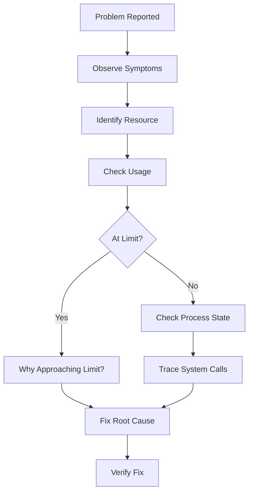
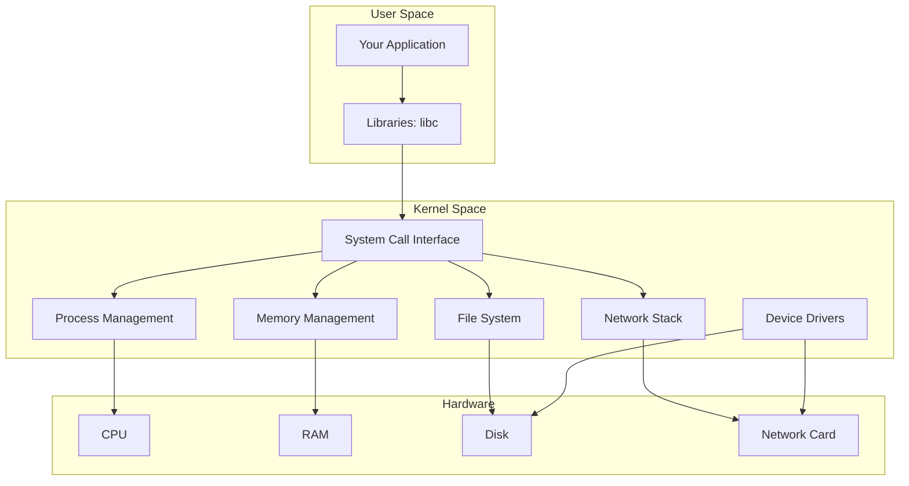

# Capstone: Think Like the Kernel

**A Framework for Reasoning About Any Linux Issue**

🟡 **Intermediate** | 🔴 **Advanced**

---

## Introduction

You've learned the foundational concepts. Now let's synthesize them into a **mental model** for understanding and debugging **any** Linux issue.

---

## The Core Mental Model

### Everything is a File

```
Network socket?     → File descriptor
Process?            → /proc/<pid>/ directory
Device?             → /dev/sda1
Configuration?      → /etc/, /sys/, /proc/
Logs?               → /var/log/ (or journald)
```

**When debugging:** Ask "What file is involved?"

### Everything is a Process

```
Web server?         → Process (with PID)
Container?          → Process (in namespace)
systemd service?    → Process (managed by PID 1)
Your shell?         → Process (usually bash)
```

**When debugging:** Ask "What process owns this?"

### Everything Has a Limit

```
Open files?         → ulimit -n
Memory?             → cgroup memory.max, RAM
Connections?        → somaxconn, port range
CPU?                → Number of cores, cgroup cpu.max
Disk?               → Filesystem size, IOPS
```

**When debugging:** Ask "What limit are we hitting?"

---

## The Debugging Framework

When faced with **any** issue, follow this process:



### Step 1: Observe Symptoms

**Gather facts before hypothesizing.**

```bash
# What are users/logs saying?
- "App is slow"
- "Connection refused"
- "Out of memory"
- "Disk full"
- "Process crashed"

# Don't jump to conclusions yet
# ❌ "Must be a code bug"
# ❌ "Need more RAM"
# ✅ "Let me investigate"
```

### Step 2: Identify the Resource

**What's the bottleneck?**

| Symptom | Likely Resource |
|---------|-----------------|
| High latency | CPU, Disk I/O, Network |
| Crash, OOMKilled | Memory |
| "Connection refused" | Network, File descriptors |
| "No space left on device" | Disk space |
| "Too many open files" | File descriptors |
| "Address already in use" | Network port |
| Process stuck in D state | Disk I/O |

**The 4 fundamental resources:**
1. **CPU** — Computation
2. **Memory** — Storage of data
3. **Disk** — Persistent storage, I/O
4. **Network** — Communication

### Step 3: Check Usage

**Measure, don't guess.**

```bash
# CPU
$ top
$ ps aux --sort=-%cpu | head

# Memory
$ free -h
$ ps aux --sort=-%mem | head

# Disk
$ df -h
$ du -sh /*
$ iostat -x 1

# Network
$ ss -s
$ ss -tlnp
$ netstat -s

# Process state
$ ps -p <pid> -o stat

# File descriptors
$ ls /proc/<pid>/fd | wc -l
$ lsof -p <pid>

# Limits
$ cat /proc/<pid>/limits
$ ulimit -a
```

### Step 4: Is It at a Limit?

**Compare usage to limits.**

```bash
# File descriptors
Current: 1020
Limit:   1024
→ 99.6% utilization!

# Memory
Used:      7.8G
Available: 8.0G
→ Near limit!

# Disk
Used: 95%
→ At limit!
```

**If at or near limit (>80%):**
- Why is usage so high?
- Memory leak?
- File descriptor leak?
- Unexpected traffic spike?
- Normal usage that exceeds capacity?

### Step 5: Understand Process State

**If not at limit, what is the process doing?**

```bash
# Process state
$ ps aux | grep myapp
USER  PID  %CPU %MEM VSZ   RSS  TTY  STAT START TIME COMMAND
user  1234 99.0 2.0  500M  250M ?    R    10:00 5:00 myapp
#                              ^
#                              R = Running (using CPU)

# Or:
STAT = D  → Waiting on disk I/O
STAT = S  → Sleeping (waiting for network/event)
STAT = Z  → Zombie (parent didn't wait())
```

**Trace system calls:**

```bash
$ sudo strace -p 1234
# What syscalls is it making?

futex(...)                    → Waiting on lock
read(3, <unfinished>          → Blocked on read
epoll_wait(...)               → Waiting for network events
write(1, "...", 1000)         → Writing to stdout
```

---

## Decision Tree

```
Issue reported
│
├─ High CPU usage?
│  ├─ Check: top, ps aux --sort=-%cpu
│  ├─ Profile: perf record, flamegraph
│  └─ Fix: Optimize code, add workers, scale horizontally
│
├─ High memory usage?
│  ├─ Check: free -h, ps aux --sort=-%mem
│  ├─ Analyze: pmap, /proc/<pid>/status
│  ├─ Is it a leak? → Profile heap (Node.js, Go, Python tools)
│  └─ Fix: Fix leak, increase limit, add swap, scale
│
├─ Connection refused?
│  ├─ Is service listening? → ss -tlnp
│  ├─ Is firewall blocking? → iptables -L, firewall-cmd --list-all
│  ├─ Is backlog full? → netstat -s | grep -i overflowed
│  └─ Fix: Start service, fix firewall, increase somaxconn
│
├─ "Too many open files"?
│  ├─ Check: cat /proc/<pid>/limits
│  ├─ Check usage: ls /proc/<pid>/fd | wc -l
│  ├─ Are files being closed? → lsof -p <pid>
│  └─ Fix: Close files, increase ulimit
│
├─ Slow disk I/O?
│  ├─ Check: iostat -x 1
│  ├─ What's writing? → iotop -o
│  ├─ Processes in D state? → ps aux | grep ' D '
│  └─ Fix: Reduce writes, add SSD, tune filesystem
│
├─ OOMKilled?
│  ├─ Check: journalctl -k | grep -i oom
│  ├─ Check cgroup: cat /sys/fs/cgroup/.../memory.max
│  └─ Fix: Fix leak, increase limit
│
├─ Process crashed?
│  ├─ Check logs: journalctl -u service
│  ├─ Exit code: systemctl status service
│  ├─ Core dump? → coredumpctl list
│  └─ Fix: Debug code, handle errors
│
└─ DNS not working?
   ├─ Host: ping example.com
   ├─ Container: cat /etc/resolv.conf
   ├─ Can reach DNS server? → ping 8.8.8.8
   └─ Fix: Configure DNS, fix routing
```

---

## Example Walkthrough: Mystery Crash

**Reported:** "API service keeps crashing in Kubernetes"

### 1. Observe Symptoms

```bash
$ kubectl get pods
NAME            READY   STATUS      RESTARTS
api-server      0/1     OOMKilled   5

# Symptom: OOMKilled
```

### 2. Resource: Memory

```bash
$ kubectl describe pod api-server
...
Last State:     Terminated
  Reason:       OOMKilled
  Exit Code:    137
Limits:
  memory:  512Mi
```

### 3. Check Usage

```bash
# Before crash (from monitoring):
Memory usage: 510 MB → approaching 512 MB limit

# Check if limit is too low or usage is too high
# Is 512 MB reasonable for this app?
```

### 4. Why High Memory?

```bash
# Get logs before crash
$ kubectl logs api-server --previous

# Or if still running:
$ kubectl exec api-server -- node -e "console.log(process.memoryUsage())"
{
  rss: 520093696,        # 496 MB
  heapTotal: 500000000,  # 476 MB
  heapUsed: 480000000,   # 457 MB
  external: 10000000     # 9.5 MB
}

# Heap is very high → possible leak
```

### 5. Investigate Code

```typescript
// Found in code:
const cache = new Map();

app.get('/user/:id', async (req, res) => {
  const user = await db.findUser(req.params.id);
  cache.set(req.params.id, user);  // ← Never removes old entries!
  res.json(user);
});

// Cache grows forever → memory leak
```

### 6. Fix

```typescript
// Option 1: Add TTL
import LRU from 'lru-cache';

const cache = new LRU({
  max: 1000,      // Max entries
  maxAge: 1000 * 60 * 10  // 10 min TTL
});
```

### 7. Verify

```bash
# Redeploy
$ kubectl rollout restart deployment/api-server

# Monitor
$ kubectl top pod api-server
NAME         CPU(cores)   MEMORY(bytes)
api-server   50m          234Mi  # Stable!

# No more crashes
$ kubectl get pods
NAME            READY   STATUS    RESTARTS
api-server      1/1     Running   0
```

---

## Common Patterns

### Pattern: Slow Under Load

```
Symptom:    Fast with 10 req/s, slow at 1000 req/s
Resource:   CPU or I/O
Check:      top, iostat
Likely:     - CPU-bound code (blocking event loop)
            - N+1 database queries
            - Synchronous I/O
Fix:        - Offload CPU work to workers
            - Batch queries
            - Use async I/O
```

### Pattern: Works on Host, Fails in Container

```
Symptom:    Works: $ node server.js
            Fails:  $ docker run myimage
Resource:   Depends (often file, network, or permissions)
Check:      - docker logs
            - docker exec -it container bash
            - Compare environment
Likely:     - Different paths
            - Missing dependencies
            - DNS configuration
            - User permissions
Fix:        - Fix Dockerfile
            - Mount volumes
            - Configure DNS
```

### Pattern: Memory Grows Slowly

```
Symptom:    Memory usage increases over days
Resource:   Memory
Check:      - ps aux --sort=-%mem (track over time)
            - Heap snapshots
Likely:     Memory leak
Common:     - Event listeners not removed
            - Closures holding references
            - Cache without eviction
            - Global variables accumulating data
Fix:        - Profile heap
            - Find leaking objects
            - Fix code
```

### Pattern: Intermittent Failures

```
Symptom:    Works sometimes, fails other times
Resource:   Usually network or timing-related
Check:      - Logs during failure
            - Network connectivity
            - Timing/race conditions
Likely:     - Timeouts
            - Connection pool exhaustion
            - Race conditions
            - External service failures
Fix:        - Add retries
            - Increase timeouts
            - Fix race conditions
            - Handle errors gracefully
```

---

## Mental Checklist for Any Issue

```
☐ Read the error message carefully (don't skip!)
☐ Check logs (application + system)
☐ Identify which process is involved
☐ Check process state (ps, systemctl status)
☐ Check resource usage (CPU, memory, disk, network)
☐ Check resource limits (ulimit, cgroups)
☐ Compare to baseline (is this normal?)
☐ Reproduce if possible (understand triggers)
☐ Form hypothesis based on evidence
☐ Test hypothesis
☐ Fix root cause (not symptoms)
☐ Verify fix
☐ Document for future
```

---

## Building Intuition

**Over time, you'll develop intuition:**

```
"Connection refused"
→ Immediately think: Is service listening? Firewall? Port in use?

"Process using 100% CPU"
→ Immediately think: Infinite loop? Event loop blocked? Profile it.

"OOMKilled"
→ Immediately think: Memory limit? Leak? Check cgroup limits.

"Slow under load"
→ Immediately think: Which resource saturated? CPU? Disk? Network?

"Works on dev, fails in prod"
→ Immediately think: Environment difference? Limit? Configuration?
```

**This comes from:**
1. Understanding fundamentals (this curriculum!)
2. Practice debugging real issues
3. Reading post-mortems
4. Asking "why?" until you understand the root cause

---

## Tying Everything Together

**The OS is a machine with well-defined behavior.**

- **Processes** are the unit of execution
- **File descriptors** are the interface to resources
- **Memory** is managed with paging and virtual addresses
- **Networking** is sockets and TCP/IP
- **Containers** are namespaces and cgroups
- **systemd** manages services and logs
- **Everything has limits** (memory, FDs, connections, CPU)

**When you see an issue:**
1. Map it to OS concepts
2. Use tools to observe
3. Understand the root cause
4. Fix it

**You now have the foundation to:**
- Debug production issues confidently
- Understand Docker and Kubernetes internals
- Optimize performance
- Read system metrics
- Write efficient code that works with (not against) the OS

---

## Next Steps

**Keep learning:**

1. **Practice** — Set up a local VM, break things, fix them
2. **Read** — Brendan Gregg's books, Julia Evans's blog, man pages
3. **Follow** — Production post-mortems from companies
4. **Experiment** — Try different workloads, measure, optimize
5. **Contribute** — Share what you learn

**Recommended books:**

- **"Systems Performance" by Brendan Gregg** — Deep dive into performance analysis
- **"The Linux Programming Interface" by Michael Kerrisk** — Comprehensive reference
- **"Understanding the Linux Kernel" by Bovet & Cesati** — Kernel internals

**Online resources:**

- [Julia Evans's blog](https://jvns.ca/) — Fantastic explanations of Linux concepts
- [Brendan Gregg's blog](http://www.brendangregg.com/) — Performance tools and flame graphs
- Man pages — `man 7 signal`, `man 2 fork`, etc.
- [The Linux Documentation Project](https://tldp.org/)

---

## Final Thoughts

**You've completed the curriculum!**

You now understand:
- ✅ How Linux actually works (processes, memory, files)
- ✅ What system calls are and why they matter
- ✅ How networking and containers work
- ✅ How to debug production issues
- ✅ How to tune systems for performance

**The key insight:**

> **Linux is not magic. It's a machine with well-defined behavior. By understanding how it works, you can reason about and fix any issue.**

**Now go build amazing things.** 🚀

---

## Quick Reference Card

**"Something is wrong" → Run these commands:**

```bash
# 1. What's the symptom?
$ systemctl status <service>
$ journalctl -u <service> -n 50
$ docker logs <container>

# 2. Resource usage?
$ top
$ free -h
$ df -h
$ iostat -x 1

# 3. Process state?
$ ps aux | grep <name>
$ ps -p <pid> -o stat

# 4. Network?
$ ss -tlnp
$ ss -s
$ ping <host>

# 5. File descriptors?
$ lsof -p <pid> | wc -l
$ cat /proc/<pid>/limits

# 6. What's it doing?
$ strace -p <pid>
$ lsof -p <pid>

# 7. Kernel messages?
$ dmesg | tail
$ journalctl -k -n 50
```

---

**Congratulations on completing the Linux Operating Systems Curriculum!** 🎉

---

## Appendix: Mermaid Diagram — The Complete Picture



**This is Linux. You understand it now.**
