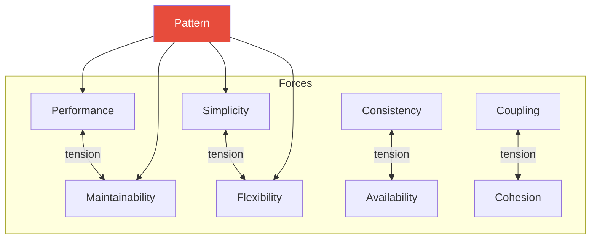

# Module 00 — Orientation

## What Are Patterns?

A pattern is a **named, recurring solution** to a problem that appears in a specific context with specific forces pulling in different directions.

Patterns are not:
- Copy-paste templates
- "Best practices" divorced from context
- Decorative architecture astronautics

Patterns ARE:
- Compression of collective experience
- Vocabulary for communicating design decisions
- Maps of tradeoff spaces

## The Forces Model

Every pattern exists because of **forces** — competing constraints that pull a design in different directions:

A pattern doesn't eliminate forces. It **resolves** them in favor of specific priorities.

## How to Evaluate a Pattern

Before using any pattern, ask three questions:

1. **What problem does this solve?** — If you can't articulate the problem, you don't need the pattern.
2. **What does this cost?** — Every pattern has operational overhead, complexity cost, and cognitive load.
3. **What happens when this fails?** — Every pattern has failure modes. Know them before you deploy.

## Five Levels of Pattern Understanding

| Level | Description |
|---|---|
| 1. Recognition | You've heard the name |
| 2. Definition | You can explain what it does |
| 3. Application | You've used it in a real system |
| 4. Trade-offs | You know when NOT to use it |
| 5. Composition | You combine patterns to solve novel problems |

This curriculum targets **Level 4-5**.

## How to Use This Curriculum

Each pattern document follows a strict 10-section structure. Start with the problem, not the solution. The pattern name doesn't appear until section 4. This is intentional — you need to feel the pain before the relief makes sense.
