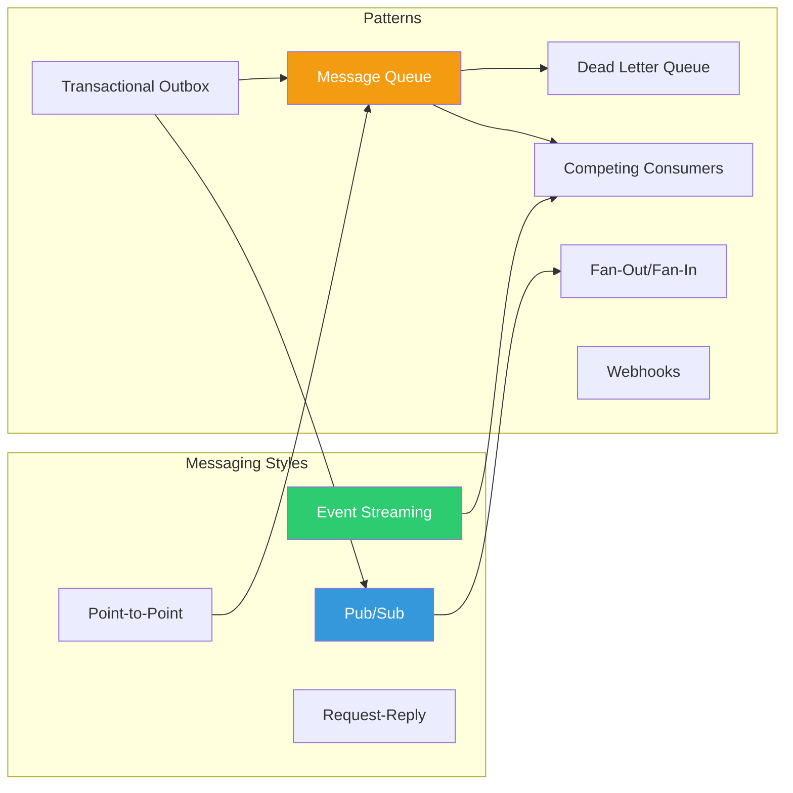

# Module 01 — Communication & Messaging Patterns

## Overview

Every distributed system is fundamentally a communication problem. This module covers every major way components and services talk to each other — from synchronous request-reply to asynchronous event streaming.

## Patterns in This Module

| # | Pattern | One-Line |
|---|---|---|
| 1 | [Publish-Subscribe](publish-subscribe.md) | Decouple senders from receivers through topics |
| 2 | [Point-to-Point Messaging](point-to-point.md) | One message, one consumer |
| 3 | [Request-Reply](request-reply.md) | Synchronous call over async infrastructure |
| 4 | [Message Queue](message-queue.md) | Buffer work between producers and consumers |
| 5 | [Event Streaming](event-streaming.md) | Ordered, replayable event log |
| 6 | [Fan-Out / Fan-In](fan-out-fan-in.md) | Distribute work, collect results |
| 7 | [Dead Letter Queue](dead-letter-queue.md) | Quarantine unprocessable messages |
| 8 | [Competing Consumers](competing-consumers.md) | Parallel message processing for throughput |
| 9 | [Transactional Outbox](transactional-outbox.md) | Reliable event publishing with DB transactions |
| 10 | [Webhooks](webhooks.md) | HTTP callbacks for event notification |

