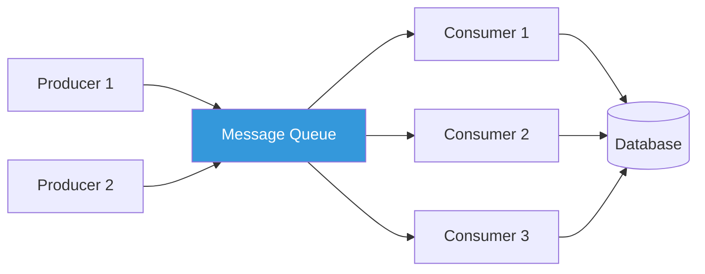
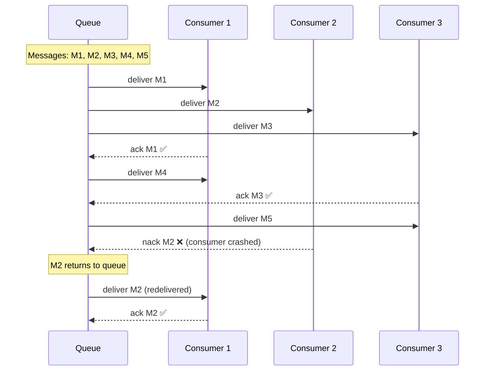

# Competing Consumers

## 1. The Problem

Your food delivery platform processes order notifications. During lunch rush (11:30 AM - 1:30 PM), the queue receives 5,000 messages per minute. A single worker processes 200 messages per minute. The queue depth grows by 4,800 messages per minute.

```
11:30 — Queue depth: 0
11:31 — Queue depth: 4,800
11:32 — Queue depth: 9,600
11:35 — Queue depth: 24,000 (orders 20+ minutes old)
12:00 — Queue depth: 144,000 (customers canceling orders)
```

One worker cannot keep up. You need to process messages faster. The obvious answer is "add more workers." But how do you add more workers without duplicate processing?

```typescript
// Two workers running the same code
const worker1 = consume("order-queue", processOrder);
const worker2 = consume("order-queue", processOrder);

// ❓ What happens when order-789 arrives?
// Worker 1 picks it up AND Worker 2 picks it up?
// Customer gets charged twice? Two drivers dispatched?
```

---

## 2. Naïve Solutions (and Why They Fail)

### Attempt 1: Topic/Pub-Sub (Wrong Pattern)

```typescript
// Both workers subscribe to the same topic
subscriber1.on("order", processOrder);
subscriber2.on("order", processOrder);
```

**Why it breaks:**
- This is pub/sub. BOTH workers receive EVERY message.
- Order-789 is processed TWICE. Customer charged twice. Two drivers arrive.
- More subscribers = more duplication, not more throughput.

### Attempt 2: Manual Partitioning

```typescript
// Worker 1 processes orders A-M
// Worker 2 processes orders N-Z
if (order.customerId[0] < "N") {
  worker1.process(order);
} else {
  worker2.process(order);
}
```

**Why it breaks:**
- Static partitioning. If customers A-M order 10x more than N-Z, worker 1 is overloaded.
- Adding a third worker requires changing the partition logic.
- If worker 1 crashes, orders A-M stop processing entirely.

### Attempt 3: Database Lock

```typescript
// Each worker polls the DB and uses SELECT FOR UPDATE
const order = await db.query("SELECT * FROM orders WHERE status='pending' FOR UPDATE LIMIT 1");
await processOrder(order);
await db.query("UPDATE orders SET status='processing' WHERE id=?", [order.id]);
```

**Why it breaks:**
- Database as a queue is an anti-pattern (see "When to use a real queue").
- Lock contention increases with more workers.
- Polling interval creates latency.
- Database crashes = total system failure.

---

## 3. The Insight

Use a message broker that guarantees **each message is delivered to exactly one consumer**. Multiple consumers connect to the same queue, and the broker distributes messages across them. Each message is processed once. If a consumer crashes, its unacknowledged messages return to the queue for another consumer. Adding consumers increases throughput linearly.

---

## 4. The Pattern

### Competing Consumers

**Definition:** Multiple consumers read from the same queue, and the message broker ensures each message is delivered to **exactly one** consumer. Consumers "compete" for messages — whoever is available first, gets the next message.

**Core guarantees (from the broker):**
- Each message goes to one consumer only
- Consumers can be added/removed dynamically
- Unacknowledged messages are redelivered
- Throughput scales roughly linearly with consumer count

**What it does NOT guarantee:**
- Processing order (messages may be processed out of order across consumers)
- Exactly-once processing (at-least-once is typical; idempotency is your responsibility)
- Equal distribution (depends on prefetch settings and consumer speed)

---

## 5. Mental Model

Think of a **bank with multiple tellers**. One line of customers, multiple teller windows. When a teller becomes free, the next customer in line goes to that window. No customer goes to two tellers simultaneously. If a teller goes on break, the remaining tellers serve from the same line. During lunch rush, you open more windows. During quiet hours, you close some.

What stays stable: the queue, the message format, the processing logic.
What moves: the number of consumers (scale up/down based on load).

---

## 6. Structure





---

## 7. Code Example

### TypeScript (with BullMQ)

```typescript
import { Queue, Worker } from "bullmq";
import IORedis from "ioredis";

const connection = new IORedis();
const orderQueue = new Queue("food-orders", { connection });

// --- Producer ---
async function enqueueOrders() {
  for (let i = 1; i <= 100; i++) {
    await orderQueue.add("process-order", {
      orderId: `order-${i}`,
      customerId: `customer-${(i % 20) + 1}`,
      items: ["burger", "fries"],
    });
  }
  console.log("Enqueued 100 orders");
}

// --- Consumer Factory ---
function createConsumer(id: string): Worker {
  return new Worker(
    "food-orders",
    async (job) => {
      const { orderId, customerId } = job.data;
      console.log(`[Consumer ${id}] Processing ${orderId} for ${customerId}`);

      // Simulate work: each order takes 100-500ms
      await new Promise((resolve) =>
        setTimeout(resolve, 100 + Math.random() * 400)
      );

      // Idempotency check (critical for exactly-once semantics)
      const alreadyProcessed = await checkIfProcessed(orderId);
      if (alreadyProcessed) {
        console.log(`[Consumer ${id}] ${orderId} already processed — skipping`);
        return;
      }

      await markAsProcessed(orderId);
      console.log(`[Consumer ${id}] ✅ ${orderId} done`);
    },
    {
      connection,
      concurrency: 5, // Each consumer handles 5 jobs concurrently
    }
  );
}

// Launch 3 competing consumers
const consumer1 = createConsumer("A");
const consumer2 = createConsumer("B");
const consumer3 = createConsumer("C");

// Simulated idempotency store
const processed = new Set<string>();
async function checkIfProcessed(orderId: string) {
  return processed.has(orderId);
}
async function markAsProcessed(orderId: string) {
  processed.add(orderId);
}
```

### Go

```go
package main

import (
	"fmt"
	"math/rand"
	"sync"
	"time"
)

type Order struct {
	ID         string
	CustomerID string
}

func main() {
	orderQueue := make(chan Order, 100)
	var wg sync.WaitGroup

	// Idempotency store (thread-safe)
	var mu sync.Mutex
	processed := make(map[string]bool)

	// Producer: enqueue 50 orders
	go func() {
		for i := 1; i <= 50; i++ {
			orderQueue <- Order{
				ID:         fmt.Sprintf("order-%d", i),
				CustomerID: fmt.Sprintf("customer-%d", (i%10)+1),
			}
		}
		close(orderQueue)
	}()

	// Launch 5 competing consumers
	numConsumers := 5
	for c := 0; c < numConsumers; c++ {
		wg.Add(1)
		go func(consumerID int) {
			defer wg.Done()
			for order := range orderQueue {
				// Range over shared channel = competing consumers
				// Go guarantees each value is received by exactly one goroutine

				// Simulate processing time
				time.Sleep(time.Duration(50+rand.Intn(200)) * time.Millisecond)

				// Idempotency check
				mu.Lock()
				if processed[order.ID] {
					mu.Unlock()
					fmt.Printf("[Consumer %d] %s already processed — skip\n", consumerID, order.ID)
					continue
				}
				processed[order.ID] = true
				mu.Unlock()

				fmt.Printf("[Consumer %d] ✅ Processed %s for %s\n",
					consumerID, order.ID, order.CustomerID)
			}
		}(c)
	}

	wg.Wait()
	fmt.Printf("All orders processed. Total: %d\n", len(processed))
}
```

---

## 8. Gotchas & Beginner Mistakes

| Mistake | Why It Hurts |
|---|---|
| **No idempotency** | Broker guarantees at-least-once, not exactly-once. A redelivered message will be processed twice unless you check. |
| **Assuming ordered processing** | 3 consumers process messages in parallel. M1 may finish after M3. If order matters, use a single consumer or message groups. |
| **Too high prefetch** | If each consumer prefetches 1,000 messages and then crashes, 1,000 messages are redelivered. Keep prefetch reasonable (10-50). |
| **Not acknowledging messages** | Forgetting to `ack()` causes messages to sit in "unacked" state forever. The broker will eventually redeliver or queue up. |
| **All consumers on one machine** | If that machine dies, all consumers die. Spread consumers across multiple hosts/pods. |
| **Slow consumer with no backpressure** | One slow consumer holds onto messages. Others have nothing to do. Use small prefetch to balance work. |

---

## 9. Related & Confusable Patterns

| Pattern | How It Differs |
|---|---|
| **Pub/Sub** | Every subscriber gets every message. Competing consumers: each message goes to ONE consumer. |
| **Work Queue** | Same thing — competing consumers IS the implementation of a work queue. |
| **Consumer Groups (Kafka)** | Kafka's version: consumers in the same group compete for partitions. Same concept, partition-based distribution. |
| **Load Balancer** | Similar concept at the HTTP layer. Load balancer distributes requests; competing consumers distribute messages. |
| **Fan-Out** | Fan-out sends to ALL workers. Competing consumers sends to ONE worker. |

**Key distinction:** Pub/Sub = message goes to ALL subscribers. Competing Consumers = message goes to ONE consumer.

---

## 10. When This Pattern Is the WRONG Choice

- **All consumers need every message** — That's pub/sub, not competing consumers.
- **Strict message ordering required** — Competing consumers process out of order by design. Use a single consumer or message groups/partitions.
- **Very low volume** — 10 messages/minute doesn't need 5 consumers. One is fine.
- **Stateful processing** — If processing requires state from previous messages (e.g., "running total"), multiple consumers can't coordinate.
- **Request-reply** — If the producer needs a response per message, use request-reply pattern, not fire-and-forget work queue.

**Symptoms you chose it too early:**
- Queue depth is always 0. One consumer keeps up fine. The others are idle.
- You're debugging message ordering issues. Competing consumers don't preserve order.
- You added idempotency checks but they never trigger. Exactly-once isn't actually a problem for your use case.

**How to back out:** Reduce to a single consumer. If throughput is fine, you don't need competition.
