# Dead Letter Queue

## 1. The Problem

Your e-commerce platform processes thousands of orders per minute through a message queue. The payment processing worker picks up each message, calls the payment gateway, and confirms the order. But some messages are toxic:

- A customer's card was canceled
- The order contains a product that was discontinued mid-flight
- The message body is malformed JSON from a buggy producer

The worker fails. The message goes back to the queue. The worker picks it up again. Fails again. Back to the queue. Pick up, fail, back, pick up, fail...

```
[Queue: order-123] → Worker → ❌ Error → [Queue: order-123] → Worker → ❌ Error → [Queue: order-123] → ...
```

This message is now a **poison pill**. It will never succeed, but it blocks the queue. Other valid orders pile up behind it. Your processing throughput drops to zero because the worker spends all its time retrying this one hopeless message.

You try setting `maxRetries: 100`. The message still fails. Now it retried 100 times, wasted compute, and you still lost the order.

---

## 2. Naïve Solutions (and Why They Fail)

### Attempt 1: Infinite Retry

```typescript
while (true) {
  try {
    await processPayment(message);
    break;
  } catch (err) {
    console.error("Retrying...", err);
    await sleep(1000);
  }
}
```

**Why it breaks:**
- If the error is permanent (invalid card, bad data), no amount of retrying will fix it.
- Blocks the worker from processing other messages.
- Accumulates error logs — GBs of repeated failure messages.

### Attempt 2: Silently Discard

```typescript
try {
  await processPayment(message);
} catch (err) {
  console.error("Discarding message", err);
  message.ack(); // just drop it
}
```

**Why it breaks:**
- You lose the message forever. That's a customer's order.
- No audit trail. "Where did order-456 go?" Nobody knows.
- Compliance/legal issues in financial systems.

### Attempt 3: Log and Skip

```typescript
try {
  await processPayment(message);
} catch (err) {
  await logToDatabase(message, err);
  message.ack();
}
```

**Why it breaks:**
- The logged messages sit in a table nobody checks.
- No alerting. No retry path. No tooling to reprocess.
- The log table grows forever. Eventually someone truncates it.

---

## 3. The Insight

Not all failures are retryable. When a message has been retried a reasonable number of times, move it to a **separate queue** — a morgue for failed messages. This queue is monitored. Operators can inspect, fix, and replay messages from it. The main queue stays clear. Processing continues.

---

## 4. The Pattern

### Dead Letter Queue (DLQ)

**Definition:** A secondary queue that receives messages which have exhausted their retry attempts or cannot be processed by the main consumer. Dead-lettered messages are stored for inspection, analysis, and manual or automated reprocessing.

**Core components:**
- **Main queue** — the primary processing queue
- **Retry policy** — max retry count, backoff interval
- **DLQ** — a dedicated queue for failed messages
- **Routing rule** — move message to DLQ after N failures
- **DLQ consumer** — monitor, alert, and optionally reprocess

**What it guarantees:**
- Failed messages don't block healthy processing
- No data loss — every failed message is preserved
- Visibility into failure patterns

**What it does NOT guarantee:**
- That messages in the DLQ will be automatically fixed
- Ordering preservation (messages leave the main queue out of order)
- Idempotency on replay (you must handle that separately)

---

## 5. Mental Model

Think of a **postal system**. If a letter can't be delivered (wrong address, nobody home after 3 attempts), it goes to the **Dead Letter Office** — a special department that holds undeliverable mail. Staff there open the letter, figure out what went wrong, and either fix the address and re-send or notify the sender. The regular mail carriers are free to keep delivering everything else.

What stays stable: the flow (main queue → retries → DLQ → human review).
What varies: how many retries, what triggers dead-lettering, what happens to DLQ messages.

---

## 6. Structure

```mermaid
sequenceDiagram
    participant P as Producer
    participant Q as Main Queue
    participant W as Worker
    participant DLQ as Dead Letter Queue
    participant Ops as Operator

    P->>Q: message (order-456)
    Q->>W: deliver
    W-->>Q: ❌ fail (attempt 1)
    Q->>W: deliver (retry)
    W-->>Q: ❌ fail (attempt 2)
    Q->>W: deliver (retry)
    W-->>Q: ❌ fail (attempt 3 = max)
    Q->>DLQ: move to DLQ
    DLQ->>Ops: alert: order-456 dead-lettered
    Ops->>DLQ: inspect, fix data
    Ops->>Q: replay fixed message
    Q->>W: deliver
    W-->>Q: ✅ success
```




---

## 7. Code Example

### TypeScript (with BullMQ)

```typescript
import { Queue, Worker } from "bullmq";
import IORedis from "ioredis";

const connection = new IORedis();

const mainQueue = new Queue("orders", { connection });
const deadLetterQueue = new Queue("orders-dlq", { connection });

const MAX_RETRIES = 3;

const worker = new Worker(
  "orders",
  async (job) => {
    const retryCount = job.attemptsMade;
    console.log(`Processing order ${job.data.orderId} (attempt ${retryCount + 1})`);

    try {
      await processPayment(job.data);
    } catch (err: any) {
      if (retryCount >= MAX_RETRIES - 1) {
        // Move to DLQ — don't retry anymore
        await deadLetterQueue.add("dead-letter", {
          originalJob: job.data,
          error: err.message,
          failedAt: new Date().toISOString(),
          attempts: retryCount + 1,
        });
        console.error(`Order ${job.data.orderId} moved to DLQ after ${retryCount + 1} attempts`);
        return; // ack the job so it leaves the main queue
      }
      throw err; // let BullMQ retry
    }
  },
  {
    connection,
    attempts: MAX_RETRIES,
    backoff: { type: "exponential", delay: 1000 },
  }
);

// DLQ Monitor
const dlqWorker = new Worker(
  "orders-dlq",
  async (job) => {
    console.warn(`[DLQ] Dead-lettered order: ${JSON.stringify(job.data)}`);
    await sendAlertToSlack(job.data);
    // Don't auto-retry — wait for human inspection
  },
  { connection }
);

async function processPayment(data: { orderId: string }) {
  // Simulate: some orders always fail
  if (data.orderId === "ORDER-POISON") {
    throw new Error("Card declined permanently");
  }
  console.log(`Payment processed for ${data.orderId}`);
}

async function sendAlertToSlack(data: unknown) {
  console.log(`[Slack Alert] DLQ message:`, data);
}
```

### Go

```go
package main

import (
	"context"
	"errors"
	"fmt"
	"sync"
	"time"
)

type Message struct {
	ID       string
	Payload  string
	Attempts int
}

type DLQEntry struct {
	Original  Message
	Error     string
	FailedAt  time.Time
}

const maxRetries = 3

func main() {
	mainQueue := make(chan Message, 100)
	dlq := make(chan DLQEntry, 100)
	var wg sync.WaitGroup

	// Producer
	go func() {
		mainQueue <- Message{ID: "order-1", Payload: "valid"}
		mainQueue <- Message{ID: "order-poison", Payload: "invalid"}
		mainQueue <- Message{ID: "order-2", Payload: "valid"}
		close(mainQueue)
	}()

	// Worker
	wg.Add(1)
	go func() {
		defer wg.Done()
		retryBuffer := make([]Message, 0)

		processAll := func(msg Message) {
			for msg.Attempts < maxRetries {
				err := processPayment(msg)
				if err == nil {
					fmt.Printf("[OK] Processed %s\n", msg.ID)
					return
				}
				msg.Attempts++
				fmt.Printf("[RETRY] %s attempt %d: %v\n", msg.ID, msg.Attempts, err)
				time.Sleep(time.Duration(msg.Attempts*100) * time.Millisecond)
			}
			// Exhausted retries — send to DLQ
			dlq <- DLQEntry{
				Original: msg,
				Error:    "max retries exceeded",
				FailedAt: time.Now(),
			}
			fmt.Printf("[DLQ] %s moved to dead letter queue\n", msg.ID)
		}

		for msg := range mainQueue {
			processAll(msg)
		}
		_ = retryBuffer
		close(dlq)
	}()

	// DLQ Monitor
	wg.Add(1)
	go func() {
		defer wg.Done()
		for entry := range dlq {
			fmt.Printf("[ALERT] Dead-lettered: %s, error: %s, at: %s\n",
				entry.Original.ID, entry.Error, entry.FailedAt.Format(time.RFC3339))
		}
	}()

	wg.Wait()
}

func processPayment(msg Message) error {
	if msg.Payload == "invalid" {
		return errors.New("card declined permanently")
	}
	return nil
}
```

---

## 8. Gotchas & Beginner Mistakes

| Mistake | Why It Hurts |
|---|---|
| **Not monitoring the DLQ** | DLQ fills up silently. Failed orders accumulate for weeks with no alerting. |
| **Auto-replaying from DLQ without fixing** | The message failed because it's bad data. Replaying it just fails again. |
| **No metadata on dead-lettered messages** | You need: original error, retry count, timestamp, correlation ID. Without them, debugging is impossible. |
| **DLQ with no TTL** | Dead-lettered messages stay forever. Storage grows. Set retention limits. |
| **Too few retries before DLQ** | Transient errors (network blip) should be retried. Setting `maxRetries: 1` sends too many messages to DLQ. |
| **Too many retries before DLQ** | Setting `maxRetries: 100` delays dead-lettering. The message still won't succeed, but it wasted 100 attempts. |
| **Treating DLQ as permanent storage** | DLQ is a staging area. Messages should be inspected, fixed, replayed, or archived — not left indefinitely. |

---

## 9. Related & Confusable Patterns

| Pattern | How It Differs |
|---|---|
| **Retry** | Retry is what happens BEFORE dead-lettering. DLQ is what happens AFTER retries are exhausted. |
| **Circuit Breaker** | Stops calling a failing service. DLQ handles individual message failures. They complement each other. |
| **Poison Message Handling** | The broader concept. DLQ is the standard mechanism for implementing it. |
| **Error Queue** | Often synonymous with DLQ. Some systems distinguish by purpose (audit vs. retry). |
| **Compensating Transaction** | What you do after discovering the DLQ message. DLQ detects; compensation resolves. |

**When to prefer DLQ over retry alone:** When some failures are permanent and you need to preserve the message for analysis.
**When to prefer circuit breaker:** When the entire downstream service is down (not just one message).

---

## 10. When This Pattern Is the WRONG Choice

- **All errors are transient** — If failures are always temporary (network timeout), aggressive retry with backoff is sufficient. No DLQ needed.
- **Messages can be safely discarded** — If losing a message has zero business impact (e.g., analytics events that can be regenerated), just discard and log.
- **Synchronous request/response** — DLQ is a messaging pattern. For HTTP APIs, use error responses + client retry.
- **Very small system** — If you process 10 messages/day and can manually check failures, a DLQ adds unnecessary infrastructure.

**Symptoms you chose it too early:**
- Your DLQ is always empty. Your retry policy handles everything.
- You never check the DLQ. It's queue-shaped `/dev/null`.
- Messages in the DLQ have no path back to re-processing.

**How to back out:** Remove the DLQ routing. Add unlimited retries with exponential backoff, or discard failures with a log entry.
