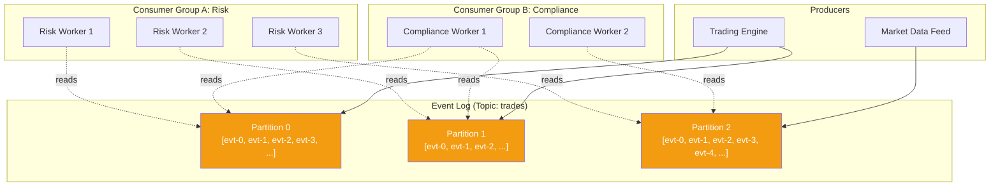
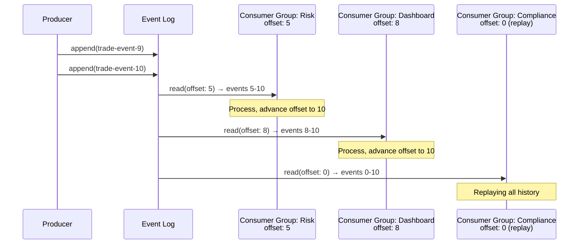

# Event Streaming

## 1. The Problem

You're building a financial trading platform. Every trade must be recorded in order, replayed for audit, and consumed by multiple independent systems: risk calculation, portfolio updates, tax reporting, compliance monitoring, and a real-time dashboard.

You tried RabbitMQ. But:
- Once a message is consumed, it's gone. The compliance team joins 6 months later and needs all historical trades replay. They can't — the messages are deleted.
- Three consumers need the same trade event, but with a point-to-point queue, only one gets it. You create a topic per consumer — now you're tripling the broker load.
- Trade ordering matters. With competing consumers on a queue, trades arrive out of order. A "sell" is processed before its "buy."

You need something that keeps messages around, maintains order, and lets multiple consumers read independently.

---

## 2. Naïve Solutions (and Why They Fail)

### Attempt 1: Traditional Message Queue per Consumer

```
Queue: trades-risk → Risk Service
Queue: trades-portfolio → Portfolio Service
Queue: trades-compliance → Compliance Service
```

**Why it breaks:**
- The producer publishes the same message 3 times (or the broker copies it 3 times). Tripled load.
- Adding a 4th consumer requires reconfiguring the broker and producer.
- No replay — once consumed, messages are gone.
- No ordering guarantees across consumers.

### Attempt 2: Database as Event Log

```sql
INSERT INTO trade_events (id, symbol, type, price, quantity, timestamp) VALUES (...);
-- Each consumer tracks their own read position
SELECT * FROM trade_events WHERE id > last_read_id ORDER BY id LIMIT 100;
```

**Why it breaks at scale:**
- Polling is wasteful and adds latency.
- Database becomes a bottleneck with millions of rows and multiple polling consumers.
- No pub/sub semantics — consumers must manage their own cursors.
- Database isn't optimized for sequential log reads.
- Works for 100 events/second. Fails at 100,000.

### Attempt 3: Pub/Sub with Persistence

```
Publish to topic "trades" with persistence enabled.
Subscribers each get a copy.
```

**Why it breaks:**
- Traditional pub/sub (RabbitMQ topics) doesn't retain messages after delivery.
- "Persistent" means written to disk, not "retained forever." Once all subscribers ack, it's gone.
- New subscribers can only see messages published AFTER they subscribe. No replay.

---

## 3. The Insight

What if messages were never deleted? What if the "queue" was actually an **append-only log** — like a database's write-ahead log? Every event is appended to the end. Each consumer maintains its own **offset** (read position). Consumers read from the log at their own pace. They can rewind to replay history. Multiple consumers read from the same log without interfering with each other.

The key shift: **the log is the source of truth, not the consumer's mailbox.**

---

## 4. The Pattern

### Event Streaming

**Definition:** An append-only, ordered, durable **log** where events are written sequentially and retained for a configurable period (hours, days, or forever). Consumers read from the log at their own pace by maintaining an **offset** (position pointer). Multiple **consumer groups** can read the same log independently.

**Core guarantees:**
- Events are ordered within a partition
- Events are retained (not deleted on consumption)
- Multiple consumers read independently from the same stream
- Consumer groups enable parallel consumption with load balancing

**What it does NOT guarantee:**
- Global ordering across partitions (only within a partition)
- Exactly-once processing without consumer-side dedup
- Low latency (optimized for throughput, not sub-ms delivery)
- Automatic dead-letter handling (consumers manage their own errors)

---

## 5. Mental Model

Think of a **newspaper archive**. Every day's paper is stored in order. Different readers (consumers) can visit the archive and read from wherever they left off. One reader might be on last week's papers. Another might be reading today's. A new reader can start from the beginning or from "now." The archive doesn't delete papers when someone reads them.

What stays stable: the log (topic + partitions), the event schema.
What moves: each consumer's offset, the number of consumers.

---

## 6. Structure





---

## 7. Code Example

### TypeScript (Kafka-like interface using kafkajs)

```typescript
import { Kafka, Partitioners } from "kafkajs";

const kafka = new Kafka({ brokers: ["localhost:9092"] });

// --- Producer ---
async function publishTrade(trade: {
  symbol: string;
  type: "buy" | "sell";
  price: number;
  quantity: number;
}) {
  const producer = kafka.producer({
    createPartitioner: Partitioners.DefaultPartitioner,
  });
  await producer.connect();

  await producer.send({
    topic: "trades",
    messages: [{
      key: trade.symbol,           // same symbol → same partition → ordered
      value: JSON.stringify({
        ...trade,
        timestamp: Date.now(),
        tradeId: crypto.randomUUID(),
      }),
    }],
  });

  await producer.disconnect();
}

// --- Consumer (one of many in a consumer group) ---
async function startRiskConsumer() {
  const consumer = kafka.consumer({ groupId: "risk-engine" });
  await consumer.connect();
  await consumer.subscribe({ topic: "trades", fromBeginning: false });

  await consumer.run({
    eachMessage: async ({ topic, partition, message }) => {
      const trade = JSON.parse(message.value!.toString());
      console.log(`[Risk] Partition ${partition}, Offset ${message.offset}: ` +
        `${trade.type} ${trade.quantity} ${trade.symbol} @ ${trade.price}`);
      
      // Calculate risk exposure
      await updateRiskExposure(trade);
    },
  });
}

// --- Separate consumer group for compliance (independent offset) ---
async function startComplianceReplay() {
  const consumer = kafka.consumer({ groupId: "compliance-audit" });
  await consumer.connect();
  // fromBeginning: true → replay entire history
  await consumer.subscribe({ topic: "trades", fromBeginning: true });

  await consumer.run({
    eachMessage: async ({ message }) => {
      const trade = JSON.parse(message.value!.toString());
      await auditTrade(trade);
    },
  });
}
```

### Go (simplified event log)

```go
package main

import (
	"encoding/json"
	"fmt"
	"sync"
)

type TradeEvent struct {
	TradeID  string  `json:"tradeId"`
	Symbol   string  `json:"symbol"`
	Type     string  `json:"type"`
	Price    float64 `json:"price"`
	Quantity int     `json:"quantity"`
}

// EventLog is an append-only, replayable log
type EventLog struct {
	mu     sync.RWMutex
	events [][]byte
	notify chan struct{}
}

func NewEventLog() *EventLog {
	return &EventLog{notify: make(chan struct{}, 1)}
}

func (l *EventLog) Append(event TradeEvent) int {
	l.mu.Lock()
	defer l.mu.Unlock()
	data, _ := json.Marshal(event)
	l.events = append(l.events, data)
	offset := len(l.events) - 1
	select {
	case l.notify <- struct{}{}: // wake up consumers
	default:
	}
	return offset
}

func (l *EventLog) ReadFrom(offset int) ([]TradeEvent, int) {
	l.mu.RLock()
	defer l.mu.RUnlock()
	if offset >= len(l.events) {
		return nil, offset
	}
	var events []TradeEvent
	for _, raw := range l.events[offset:] {
		var evt TradeEvent
		json.Unmarshal(raw, &evt)
		events = append(events, evt)
	}
	return events, len(l.events)
}

func consumer(name string, log *EventLog, startOffset int, wg *sync.WaitGroup) {
	defer wg.Done()
	offset := startOffset
	for i := 0; i < 3; i++ { // process 3 batches then stop (demo)
		<-log.notify
		events, newOffset := log.ReadFrom(offset)
		for _, evt := range events {
			fmt.Printf("[%s] offset=%d: %s %d %s @ %.2f\n",
				name, offset, evt.Type, evt.Quantity, evt.Symbol, evt.Price)
			offset++
		}
		offset = newOffset
	}
}

func main() {
	log := NewEventLog()
	var wg sync.WaitGroup

	// Two independent consumer groups
	wg.Add(2)
	go consumer("Risk", log, 0, &wg)
	go consumer("Dashboard", log, 0, &wg)

	// Produce events
	trades := []TradeEvent{
		{TradeID: "T1", Symbol: "AAPL", Type: "buy", Price: 150.0, Quantity: 100},
		{TradeID: "T2", Symbol: "GOOG", Type: "sell", Price: 2800.0, Quantity: 10},
		{TradeID: "T3", Symbol: "AAPL", Type: "sell", Price: 151.0, Quantity: 50},
	}
	for _, t := range trades {
		log.Append(t)
	}

	wg.Wait()
}
```

---

## 8. Gotchas & Beginner Mistakes

| Mistake | Why It Hurts |
|---|---|
| **Wrong partition key** | Random partitioning loses ordering. Use a meaningful key (e.g., userId, symbol) for ordering within an entity. |
| **Too few partitions** | One partition = one consumer max per group. You can't parallelize beyond the partition count. |
| **Too many partitions** | Each partition has overhead (file handles, memory, leader election). Start with # of consumers and grow. |
| **Not committing offsets** | Consumer restarts from the beginning every time. Commit offsets after processing. |
| **Committing before processing** | Offset committed, but processing crashes. Event is "consumed" but never processed. Commit AFTER processing. |
| **Using Kafka as a database** | Querying Kafka by key or ad-hoc queries. Kafka is a log, not a database. Build materialized views for queries. |
| **Infinite retention without compaction** | Storage grows unbounded. Use log compaction (keep latest per key) or time-based retention. |
| **Ignoring consumer lag** | Consumers fall behind. By the time they process an event, it's 3 hours stale. Monitor lag. |

---

## 9. Related & Confusable Patterns

| Pattern | How It Differs |
|---|---|
| **Message Queue** | Messages deleted after consumption. Event stream retains them. Queue = work distribution. Stream = event log. |
| **Pub/Sub** | Messages not retained. No consumer offsets. No replay. Same "fan-out" but ephemeral. |
| **Event Sourcing** | Application-level pattern where events are the source of truth. Event streaming is the infrastructure. Event sourcing uses event streaming. |
| **Change Data Capture** | CDC captures database changes as events in a stream. It produces events; streaming infrastructure carries them. |
| **Write-Ahead Log** | Database-internal concept. Event streaming is WAL externalized as a service. |

**When to prefer event streaming over queues:** Replay, ordering, multiple consumer groups.
**When to prefer queues:** Simple work distribution, one consumer per message, no replay needed.

---

## 10. When This Pattern Is the WRONG Choice

- **Simple task queues** — Processing background jobs doesn't need Kafka. Use Redis + BullMQ or SQS.
- **Request-response** — Streaming is for events, not queries with responses.
- **Low volume** — 100 events/day doesn't justify Kafka's operational complexity.
- **Global ordering required** — Kafka orders within partitions, not across them. If you need total order, you're limited to one partition (no parallelism).
- **Real-time, low-latency** — Kafka optimizes for throughput (batching, page cache). Sub-ms delivery needs a different tool.

**Symptoms you chose it too early:**
- You have 1 topic, 1 partition, 1 consumer group. This is a queue with extra steps.
- Nobody has ever replayed events. The replay capability is unused.
- Your Kafka cluster costs more to operate than your application servers.

**How to back out:** Export necessary events to a database. Replace Kafka consumers with database queries or simple queue consumers. Migrate producers to publish to a queue (SQS, RabbitMQ).
