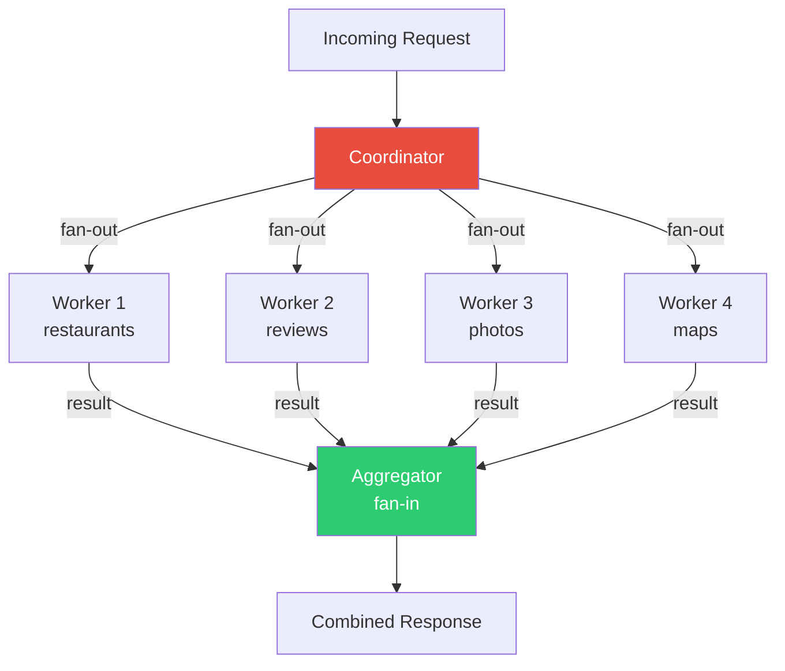
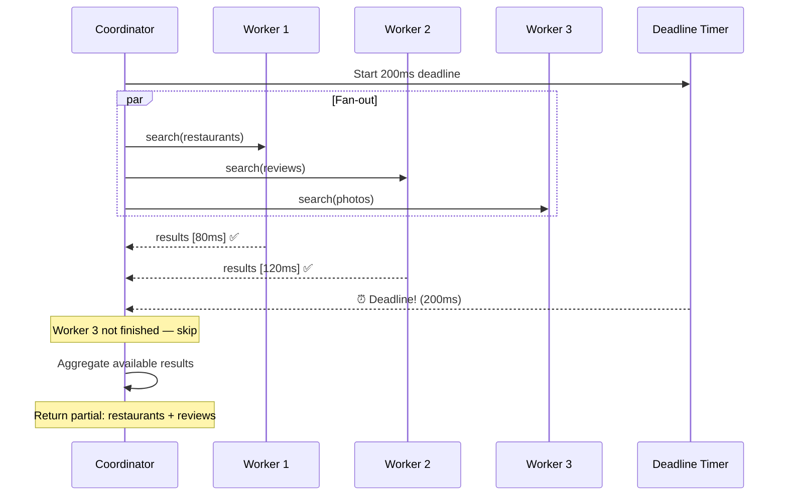

# Fan-Out / Fan-In

## 1. The Problem

Your search engine receives a query: "best coffee shops near me." To answer, you need to search across 8 independent indexes: restaurants, reviews, photos, opening hours, user ratings, promotions, delivery options, and maps. Each index takes 50-200ms to query. If you query them sequentially, the worst case is 1.6 seconds.

```typescript
const restaurants = await searchRestaurants(query);   // 150ms
const reviews = await searchReviews(query);           // 120ms
const photos = await searchPhotos(query);             // 200ms
const hours = await searchHours(query);               // 80ms
const ratings = await searchRatings(query);           // 50ms
const promotions = await searchPromotions(query);     // 100ms
const delivery = await searchDelivery(query);         // 90ms
const maps = await searchMaps(query);                 // 180ms
// Total: ~970ms sequential
```

You need all results to render the page, but there's no dependency between these calls. They could all run at the same time — the total time would be the SLOWEST call (200ms), not the SUM.

---

## 2. Naïve Solutions (and Why They Fail)

### Attempt 1: Promise.all (in-process only)

```typescript
const [restaurants, reviews, photos, ...rest] = await Promise.all([
  searchRestaurants(query),
  searchReviews(query),
  searchPhotos(query),
  // ...
]);
```

**Why it breaks (at scale):**
- This works fine for HTTP calls within a single process. But when "search indexes" are distributed services or large data partitions, a single process can't handle the load.
- No partial results — if one of the 8 calls fails, `Promise.all` rejects the entire batch.
- No way to distribute the fan-out work across multiple machines.
- CPU-bound work (e.g., scoring) can't parallelize on a single-threaded runtime (Node.js).

### Attempt 2: Fire and Forget + Poll

```typescript
for (const index of indexes) {
  await sendSearchRequest(index, query);
}
// Poll a shared store for results...
while (!allResultsReady()) {
  await sleep(50);
}
```

**Why it breaks:**
- Polling adds latency (at least one interval).
- No timeout — if one index never responds, you wait forever.
- Shared storage coordination is complex and error-prone.

### Attempt 3: One Big Service Does Everything

```typescript
// The monolithic search service queries all indexes internally
function search(query: string) {
  // One massive function that queries 8 data stores
}
```

**Why it breaks:**
- Scaling: this service must run on a massive machine. Can't scale each index independently.
- Failure isolation: one bad index kills the whole search.
- Deployment coupling: updating the reviews index requires redeploying the entire search service.

---

## 3. The Insight

Split the work into independent sub-tasks. **Fan-out**: distribute sub-tasks to independent workers in parallel. **Fan-in**: collect and combine results. The total time is bounded by the slowest sub-task, not the sum. Handle partial failures gracefully — return what you have within a deadline.

---

## 4. The Pattern

### Fan-Out / Fan-In

**Definition:** A concurrency pattern where a single request is **split** (fan-out) into multiple independent sub-tasks executed in parallel, and the results are **aggregated** (fan-in) into a single response.

**Core guarantees:**
- Sub-tasks run independently and concurrently
- Total latency ≈ slowest sub-task (not sum of all)
- Results are collected at a synchronization point

**What it does NOT guarantee:**
- All sub-tasks succeed (partial failure is the norm)
- Ordering of results (they arrive as they complete)
- Memory/resource bounds (parallelism has costs)

---

## 5. Mental Model

Think of a **team of researchers**. The lead (coordinator) gets a complex question and breaks it into 8 independent sub-questions. Each researcher works independently on their part. As researchers finish, they hand their findings to the lead. The lead combines everything into the final answer. If one researcher is slow, the lead can set a deadline: "Give me what you have in 200ms."

What stays stable: the fan-out shape (how many sub-tasks, what each does).
What moves: the number of workers, the deadline, the partial-failure tolerance.

---

## 6. Structure





---

## 7. Code Example

### TypeScript

```typescript
interface SearchResult {
  source: string;
  items: unknown[];
  error?: string;
}

async function fanOutSearch(query: string, deadlineMs: number): Promise<SearchResult[]> {
  const sources = [
    { name: "restaurants", fn: () => searchRestaurants(query) },
    { name: "reviews",     fn: () => searchReviews(query) },
    { name: "photos",      fn: () => searchPhotos(query) },
    { name: "maps",        fn: () => searchMaps(query) },
    { name: "ratings",     fn: () => searchRatings(query) },
  ];

  // Fan-out: launch all in parallel with individual timeout wrapping
  const promises = sources.map(async (source) => {
    try {
      const items = await Promise.race([
        source.fn(),
        new Promise<never>((_, reject) =>
          setTimeout(() => reject(new Error("timeout")), deadlineMs)
        ),
      ]);
      return { source: source.name, items } as SearchResult;
    } catch (err: any) {
      return { source: source.name, items: [], error: err.message } as SearchResult;
    }
  });

  // Fan-in: collect all results (including partial failures)
  const results = await Promise.allSettled(promises);

  return results
    .filter((r): r is PromiseFulfilledResult<SearchResult> => r.status === "fulfilled")
    .map((r) => r.value);
}

// Usage
const results = await fanOutSearch("coffee near me", 200);
console.log(`Got results from ${results.filter(r => !r.error).length} / ${results.length} sources`);
```

### Go

```go
package main

import (
	"context"
	"fmt"
	"math/rand"
	"sync"
	"time"
)

type SearchResult struct {
	Source string
	Items  []string
	Err    error
}

func fanOutSearch(ctx context.Context, query string) []SearchResult {
	sources := []struct {
		name string
		fn   func(context.Context, string) ([]string, error)
	}{
		{"restaurants", searchRestaurants},
		{"reviews", searchReviews},
		{"photos", searchPhotos},
		{"maps", searchMaps},
	}

	resultCh := make(chan SearchResult, len(sources))
	var wg sync.WaitGroup

	// Fan-out: launch all searches concurrently
	for _, src := range sources {
		wg.Add(1)
		go func(name string, fn func(context.Context, string) ([]string, error)) {
			defer wg.Done()
			items, err := fn(ctx, query)
			resultCh <- SearchResult{Source: name, Items: items, Err: err}
		}(src.name, src.fn)
	}

	// Close channel when all goroutines complete
	go func() {
		wg.Wait()
		close(resultCh)
	}()

	// Fan-in: collect results
	var results []SearchResult
	for r := range resultCh {
		results = append(results, r)
	}
	return results
}

func searchRestaurants(ctx context.Context, q string) ([]string, error) {
	time.Sleep(time.Duration(50+rand.Intn(100)) * time.Millisecond)
	return []string{"Cafe A", "Cafe B"}, nil
}

func searchReviews(ctx context.Context, q string) ([]string, error) {
	time.Sleep(time.Duration(50+rand.Intn(150)) * time.Millisecond)
	return []string{"Review 1"}, nil
}

func searchPhotos(ctx context.Context, q string) ([]string, error) {
	time.Sleep(time.Duration(50+rand.Intn(200)) * time.Millisecond)
	return []string{"photo1.jpg"}, nil
}

func searchMaps(ctx context.Context, q string) ([]string, error) {
	time.Sleep(time.Duration(50+rand.Intn(100)) * time.Millisecond)
	return []string{"Map tile"}, nil
}

func main() {
	ctx, cancel := context.WithTimeout(context.Background(), 200*time.Millisecond)
	defer cancel()

	results := fanOutSearch(ctx, "coffee near me")

	succeeded := 0
	for _, r := range results {
		if r.Err != nil {
			fmt.Printf("[%s] failed: %v\n", r.Source, r.Err)
		} else {
			fmt.Printf("[%s] returned %d items\n", r.Source, len(r.Items))
			succeeded++
		}
	}
	fmt.Printf("Got results from %d / %d sources\n", succeeded, len(results))
}
```

---

## 8. Gotchas & Beginner Mistakes

| Mistake | Why It Hurts |
|---|---|
| **No deadline** | One slow worker holds up the entire response. Always set a maximum wait time. |
| **Unbounded parallelism** | Fan-out to 10,000 workers simultaneously. You'll exhaust connections, memory, or file descriptors. Cap concurrency. |
| **All-or-nothing** | Using `Promise.all` rejects if ANY sub-task fails. Use `Promise.allSettled` or equivalent for partial results. |
| **No error isolation** | One panicking goroutine crashes the whole process. Catch errors per sub-task. |
| **Ignoring partial results** | Returning an error if only 1 of 8 sources failed. Return what you have. |
| **Fan-out without fan-in** | Distributing work but never collecting results. Resources leak, results are lost. |
| **Sequential "fan-out"** | Launching tasks one at a time and waiting for each. That's sequential, not parallel. |

---

## 9. Related & Confusable Patterns

| Pattern | How It Differs |
|---|---|
| **Scatter-Gather** | Messaging-layer name for the same concept. Fan-out/fan-in is the concurrency pattern. |
| **Map-Reduce** | Fan-out/fan-in applied to data processing. Map = fan-out. Reduce = fan-in. |
| **Fork-Join** | CPU-level parallel work splitting. Same structure, different scope. |
| **Aggregator** | The fan-in component. Often used at the API gateway level. |
| **Pub/Sub** | Fan-out of messages to subscribers. But pub/sub doesn't wait for or collect responses. |

**When to prefer fan-out/fan-in over sequential:** When sub-tasks are independent and latency matters.
**When to prefer MapReduce:** When processing large datasets across a cluster, not handling a single request.

---

## 10. When This Pattern Is the WRONG Choice

- **Sub-tasks have dependencies** — If task B depends on task A's output, you can't parallelize them. Use a pipeline instead.
- **Single fast operation** — If the work takes 5ms sequentially, parallelizing adds overhead without benefit.
- **Limited resources** — If you can only run 1 concurrent connection (e.g., SQLite), fan-out is impossible.
- **Strict ordering required** — Fan-in collects results in arbitrary order. If order matters, use sequential processing.
- **Simple data transformation** — If you just need to map over an array, a for loop is simpler than a fan-out coordinator.

**Symptoms you chose it too early:**
- All workers finish in < 5ms. The overhead of coordination exceeds the work.
- You have 2 sub-tasks. `Promise.all([a, b])` suffices; you don't need a framework.
- You're fanning out to a single service. That's not fan-out, that's a batch request.

**How to back out:** Sequential loop over sub-tasks. Replace fan-out with a simple `for` loop or pipeline.
