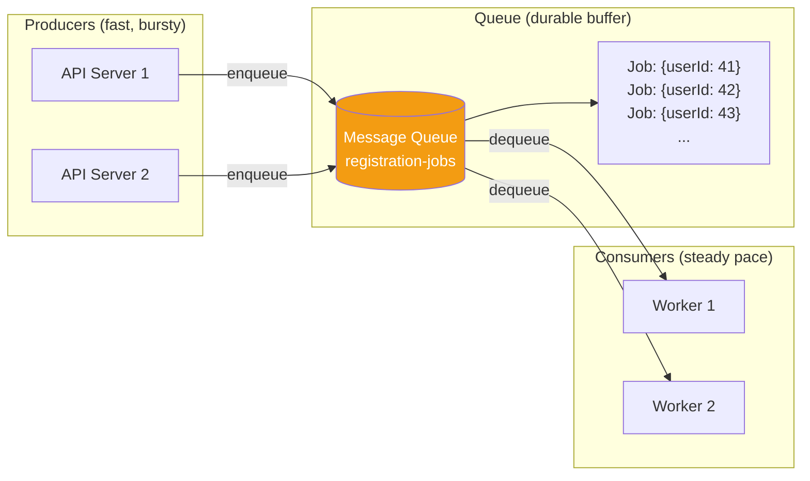
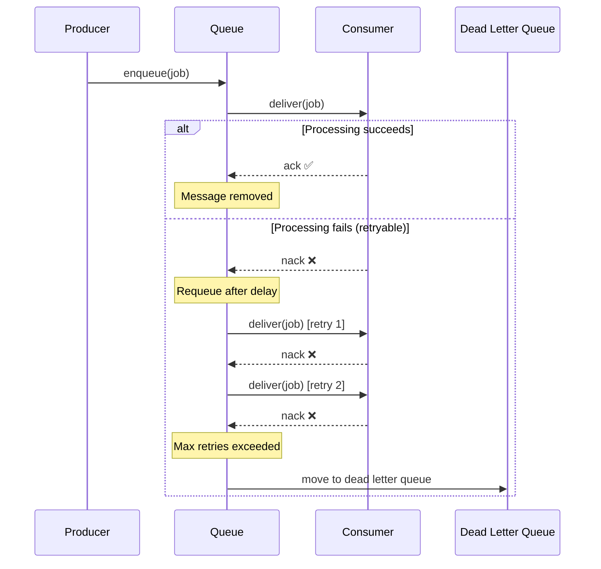

# Message Queue

## 1. The Problem

Your API server processes user registrations. For each registration, it needs to: send a welcome email, provision a trial account on a third-party billing system, and generate an onboarding checklist. The third-party billing API is unreliable — it times out 10% of the time.

During a marketing campaign, you get 500 sign-ups per minute instead of the usual 20. Your API server can't handle the burst. Users see 504 Gateway Timeout errors. The billing API collapses under load. Registrations are lost because you have no way to retry the billing call that timed out somewhere mid-stream.

You need a buffer between "I received this work" and "I processed this work."

---

## 2. Naïve Solutions (and Why They Fail)

### Attempt 1: Process Inline

```typescript
app.post("/register", async (req, res) => {
  const user = await createUser(req.body);
  await sendWelcomeEmail(user);       // 200ms
  await provisionBilling(user);        // 2-30s (unreliable!)
  await generateChecklist(user);       // 500ms
  res.json({ userId: user.id });       // total: 3-31 seconds
});
```

**Why it breaks:**
- Response time is the SUM of all downstream calls.
- One slow/failing dependency (billing) blocks everything.
- During traffic spikes, all connections are occupied waiting on billing.
- No retry — if billing fails, the user gets an error. Re-registering creates duplicates.

### Attempt 2: In-Memory Array as Buffer

```typescript
const workBuffer: Job[] = [];

app.post("/register", async (req, res) => {
  const user = await createUser(req.body);
  workBuffer.push({ type: "provision", userId: user.id });
  res.json({ userId: user.id }); // fast response
});

// Background loop
setInterval(() => {
  const job = workBuffer.shift();
  if (job) processJob(job);
}, 100);
```

**Why it breaks:**
- **Data loss** — Server restart = all buffered jobs gone.
- **No backpressure** — Buffer grows unbounded during spikes. OOM kills the process.
- **Single consumer** — Can't scale processing independently.
- **No retry** — Failed jobs are silently dropped.

### Attempt 3: Database Table as Queue

```sql
INSERT INTO job_queue (type, payload, status) VALUES ('provision', '{"userId": 42}', 'pending');
```

**Why it breaks:**
- Polling for pending jobs is wasteful and creates lock contention.
- `SELECT ... FOR UPDATE SKIP LOCKED` helps but doesn't scale.
- No built-in TTL, retry logic, or visibility timeout.
- Schema needs manual management (status, retries, error tracking).
- It works at small scale, but you've built a bad version of something that already exists.

---

## 3. The Insight

You need to **decouple the pace of producing work from the pace of processing it**. A buffer that:
- Persists jobs to survive crashes
- Delivers each job to exactly one worker
- Retries failed jobs automatically
- Handles backpressure (producers slow down when the buffer is full)

This is exactly what a **durable message queue** is.

---

## 4. The Pattern

### Message Queue

**Definition:** A durable, ordered buffer between producers and consumers. Producers **enqueue** work items. Consumers **dequeue** and process them. The queue persists messages to disk, retries failures, and enables producers and consumers to operate at different speeds.

**Core guarantees:**
- Messages survive broker restarts (durability)
- Each message is delivered to one consumer (point-to-point semantics)
- Failed messages are retried or sent to a dead-letter queue
- Producers and consumers are decoupled in time and space

**What it does NOT guarantee:**
- Strict ordering with multiple consumers (see Competing Consumers)
- Exactly-once delivery (at-least-once with dedup required)
- Bounded latency (queue depth affects wait time)

---

## 5. Mental Model

Think of a **postal mailbox**. You (producer) drop letters in the box. The postal worker (consumer) picks them up on their schedule. If you drop 100 letters during lunch, they'll still get picked up — just not immediately. If the postal worker is sick, letters wait safely in the box. The box is the queue: it decouples your writing schedule from the delivery schedule.

What stays stable: the message format and queue name.
What moves: the rate and number of producers and consumers.

---

## 6. Structure





---

## 7. Code Example

### TypeScript (using BullMQ)

```typescript
import { Queue, Worker, QueueEvents } from "bullmq";
import IORedis from "ioredis";

const connection = new IORedis();

// --- Producer side (API server) ---
const registrationQueue = new Queue("user-registration", { connection });

async function registerUser(email: string, name: string) {
  // Save user to DB immediately
  const userId = await db.users.create({ email, name });
  
  // Enqueue async work — respond to user immediately
  await registrationQueue.add("process-registration", 
    { userId, email, name },
    {
      attempts: 5,
      backoff: { type: "exponential", delay: 3000 },
      priority: 1,
    }
  );

  return { userId, status: "accepted" }; // instant response
}

// --- Consumer side (separate service/process) ---
const worker = new Worker("user-registration", async (job) => {
  const { userId, email, name } = job.data;

  // Step 1: Send welcome email
  await sendWelcomeEmail(email, name);
  await job.updateProgress(33);

  // Step 2: Provision billing (the unreliable one)
  await provisionBillingAccount(userId);
  await job.updateProgress(66);

  // Step 3: Generate onboarding checklist
  await generateChecklist(userId);
  await job.updateProgress(100);

  return { processed: true };
}, {
  connection,
  concurrency: 10, // process 10 jobs in parallel
  limiter: {
    max: 50,        // max 50 jobs per...
    duration: 60000, // ...per minute (rate limiting)
  },
});

worker.on("completed", (job) => {
  console.log(`Registration ${job.id} completed`);
});

worker.on("failed", (job, err) => {
  console.error(`Registration ${job?.id} failed: ${err.message}`);
});
```

### Go

```go
package main

import (
	"context"
	"fmt"
	"math/rand"
	"sync"
	"time"
)

type RegistrationJob struct {
	UserID string
	Email  string
	Name   string
}

type MessageQueue struct {
	ch  chan RegistrationJob
	dlq chan RegistrationJob
}

func NewMessageQueue(bufferSize int) *MessageQueue {
	return &MessageQueue{
		ch:  make(chan RegistrationJob, bufferSize),
		dlq: make(chan RegistrationJob, bufferSize),
	}
}

func (mq *MessageQueue) Enqueue(job RegistrationJob) {
	mq.ch <- job
}

func (mq *MessageQueue) StartWorker(ctx context.Context, id int, wg *sync.WaitGroup) {
	defer wg.Done()
	for {
		select {
		case <-ctx.Done():
			return
		case job, ok := <-mq.ch:
			if !ok {
				return
			}
			if err := processWithRetry(id, job, 3); err != nil {
				fmt.Printf("[Worker %d] Moving %s to DLQ: %v\n", id, job.UserID, err)
				mq.dlq <- job
			}
		}
	}
}

func processWithRetry(workerID int, job RegistrationJob, maxRetries int) error {
	for attempt := 1; attempt <= maxRetries; attempt++ {
		err := processRegistration(workerID, job)
		if err == nil {
			return nil
		}
		fmt.Printf("[Worker %d] Attempt %d failed for %s: %v\n",
			workerID, attempt, job.UserID, err)
		time.Sleep(time.Duration(attempt) * time.Second) // linear backoff
	}
	return fmt.Errorf("max retries exceeded")
}

func processRegistration(workerID int, job RegistrationJob) error {
	// Simulate unreliable work
	if rand.Float64() < 0.3 {
		return fmt.Errorf("billing API timeout")
	}
	fmt.Printf("[Worker %d] Processed registration for %s (%s)\n",
		workerID, job.Name, job.UserID)
	return nil
}

func main() {
	rand.Seed(time.Now().UnixNano())
	mq := NewMessageQueue(100)

	ctx, cancel := context.WithTimeout(context.Background(), 30*time.Second)
	defer cancel()

	var wg sync.WaitGroup
	for i := 1; i <= 3; i++ {
		wg.Add(1)
		go mq.StartWorker(ctx, i, &wg)
	}

	// Simulate burst of registrations
	for i := 1; i <= 10; i++ {
		mq.Enqueue(RegistrationJob{
			UserID: fmt.Sprintf("user-%d", i),
			Email:  fmt.Sprintf("user%d@example.com", i),
			Name:   fmt.Sprintf("User %d", i),
		})
	}
	close(mq.ch)
	wg.Wait()
}
```

---

## 8. Gotchas & Beginner Mistakes

| Mistake | Why It Hurts |
|---|---|
| **Queue as a database** | Storing messages for weeks. Queues are transient work buffers, not storage. Use a database for long-term data. |
| **Not monitoring queue depth** | Queue depth growing = consumers can't keep up. Alert when depth exceeds a threshold. |
| **Ack before processing** | Worker acks immediately, then crashes mid-processing. Message is lost forever. Ack AFTER. |
| **No dead-letter queue** | Poison messages loop endlessly, consuming worker capacity. Always configure a DLQ. |
| **Ignoring backpressure** | Producers enqueue faster than consumers process. Queue fills up. Add rate limiting or bounded buffers. |
| **FIFO assumptions** | With multiple consumers, messages are processed out of order. If ordering matters, use a single consumer or partitioned queues. |
| **Massive messages** | Putting 10MB payloads in queue messages. Store the data elsewhere; put a reference (S3 URL, DB ID) in the message. |

---

## 9. Related & Confusable Patterns

| Pattern | How It Differs |
|---|---|
| **Pub/Sub** | Multiple consumers each get a copy. Queue = one consumer per message. |
| **Event Streaming (Kafka)** | Log is retained for replay. Queue deletes after consumption. |
| **Task Queue** | Same thing, application-level name. Celery, Sidekiq, BullMQ = task queues built on message queues. |
| **Buffer** | In-memory, non-durable. Queue is persistent. |
| **Batch Processing** | Processes accumulated work on a schedule. Queue processes continuously. |

**When to prefer a queue over direct calls:** When the producer and consumer run at different speeds, or when you need retry/durability.
**When to prefer Kafka over a queue:** When you need message replay, consumer groups, or event sourcing.

---

## 10. When This Pattern Is the WRONG Choice

- **Sub-millisecond latency required** — Queue hops add latency. Use direct function calls or gRPC.
- **You need broadcast** — Queues deliver to one consumer. Use pub/sub for fan-out.
- **Messages must be replayed** — Queues delete after consumption. Use event streaming (Kafka).
- **Work is trivial** — Processing takes 1ms and never fails. A queue adds overhead for no benefit.
- **You need real-time responses** — The user is waiting for the result. A queue decouples in time, which means the user waits longer.

**Symptoms you chose it too early:**
- Queue depth is always 0. Producer and consumer operate at the same speed.
- You deployed RabbitMQ/Redis for 3 background jobs.
- The queue's operational complexity exceeds the complexity of the work itself.

**How to back out:** Move worker logic into the API handler. Process work synchronously. Add retry logic directly to the calling code.
