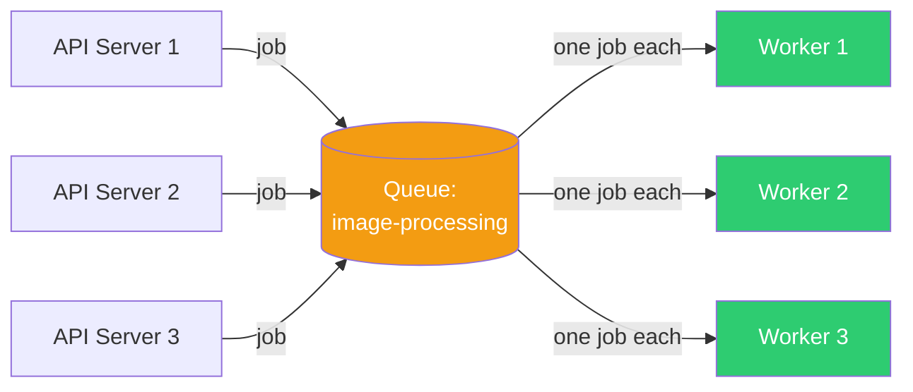
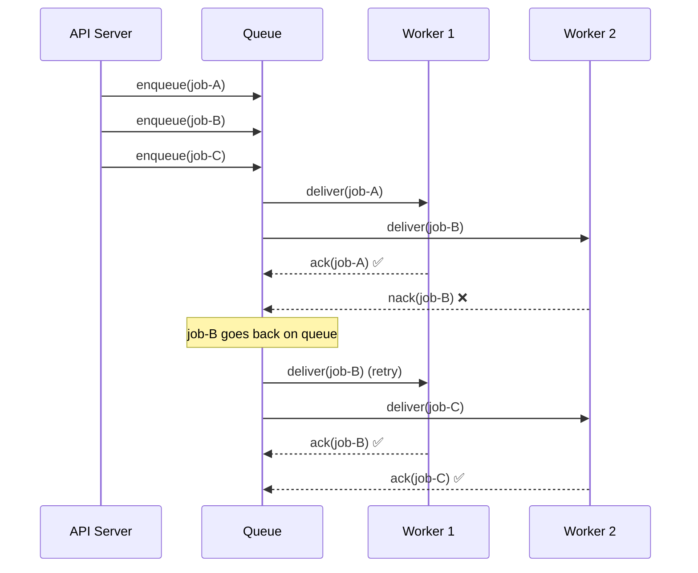

# Point-to-Point Messaging

## 1. The Problem

You have a web application that accepts image uploads. When a user uploads a photo, your API server needs to: resize it to 5 different dimensions, strip EXIF metadata, run it through a content moderation model, and store the results.

This processing takes 8-15 seconds. Your API handler is doing it inline:

```typescript
app.post("/upload", async (req, res) => {
  const image = req.file;
  const resized = await resizeImage(image, [100, 300, 600, 1200, 2400]);
  const cleaned = await stripExif(resized);
  const moderation = await runModeration(cleaned);
  await storeResults(cleaned, moderation);
  res.json({ status: "done" }); // 12 seconds later...
});
```

Users are staring at a spinner for 12 seconds. Your API servers are pinned at 100% CPU doing image processing. During peak hours, the upload endpoint times out. You need to move this work somewhere else.

---

## 2. Naïve Solutions (and Why They Fail)

### Attempt 1: Background Thread / goroutine

```typescript
app.post("/upload", async (req, res) => {
  const image = req.file;
  res.json({ status: "accepted" }); // respond immediately
  // Fire and forget
  processImage(image).catch(console.error);
});
```

**Why it breaks:**
- If the server restarts, in-flight work is lost. The image is never processed.
- You can't scale workers independently — more uploads means more API servers, even though the bottleneck is image processing.
- No retry mechanism. If `processImage` fails, it's gone.
- No way to handle backpressure. 1000 uploads = 1000 goroutines = OOM.

### Attempt 2: Pub/Sub Topic

```typescript
broker.publish("image.uploaded", { imageId, path });
```

**Why it breaks (for this use case):**
- Every subscriber gets the message. If you have 3 worker instances, all 3 process the same image. Triple the compute, triple the storage.
- Pub/Sub is for **broadcast**. You want exactly **one** worker to process each image.

### Attempt 3: Shared Database Table as Job Queue

```sql
INSERT INTO jobs (type, payload, status) VALUES ('process_image', '{}', 'pending');
-- Workers poll: SELECT * FROM jobs WHERE status = 'pending' LIMIT 1 FOR UPDATE
```

**Why it breaks:**
- Polling at high frequency hammers the database.
- `FOR UPDATE` creates lock contention between workers.
- No built-in retry, timeout, or dead-letter handling.
- You just reinvented a bad message queue. Again.

---

## 3. The Insight

You don't need broadcast — you need a **work queue**. Each job (image processing task) should be picked up by exactly **one** worker. The job should survive server restarts. If a worker dies mid-processing, the job should be retried by another worker.

The key idea: **messages are work items, and each work item has exactly one owner at a time.**

---

## 4. The Pattern

### Point-to-Point Messaging

**Definition:** A messaging pattern where a message is sent to a **queue** and consumed by **exactly one** consumer. If multiple consumers listen on the same queue, the broker distributes messages across them (load balancing), but each message is delivered to only one consumer.

**Core guarantees:**
- Each message is processed by exactly one consumer
- Messages survive broker restarts (durable queues)
- Unacknowledged messages are redelivered (at-least-once)
- Messages are processed roughly in order (FIFO within a single queue)

**What it does NOT guarantee:**
- Strict ordering when multiple consumers compete (see Competing Consumers)
- Exactly-once processing (consumer must be idempotent)
- Immediate delivery — messages wait until a consumer is available

---

## 5. Mental Model

Think of a **ticket counter** at a deli. Customers (producers) take a number and drop their order on the counter. Workers (consumers) pick up the next order. Each order goes to one worker. If a worker drops a sandwich, the order goes back on the counter for someone else. When the counter is full, new customers wait.

What stays stable: the queue contract (message format, queue name).
What moves: number of producers and consumers, independently.

---

## 6. Structure





---

## 7. Code Example

### TypeScript (using BullMQ / Redis-backed queue)

```typescript
import { Queue, Worker } from "bullmq";
import { Redis } from "ioredis";

const connection = new Redis({ host: "localhost", port: 6379 });

// --- Producer (API server) ---
const imageQueue = new Queue("image-processing", { connection });

async function handleUpload(imageId: string, imagePath: string) {
  // Enqueue job — returns immediately
  await imageQueue.add("process", { imageId, imagePath }, {
    attempts: 3,                // retry up to 3 times
    backoff: { type: "exponential", delay: 2000 },
    removeOnComplete: 1000,     // keep last 1000 completed jobs
    removeOnFail: 5000,         // keep last 5000 failed for debugging
  });
  
  return { status: "accepted", imageId };
}

// --- Consumer (separate process, scales independently) ---
const worker = new Worker("image-processing", async (job) => {
  const { imageId, imagePath } = job.data;

  console.log(`[Worker ${process.pid}] Processing image ${imageId}`);
  
  // Actual work
  const resized = await resizeImage(imagePath, [100, 300, 600, 1200, 2400]);
  const cleaned = await stripExif(resized);
  const moderation = await runModeration(cleaned);
  await storeResults(imageId, cleaned, moderation);
  
  console.log(`[Worker ${process.pid}] Done with ${imageId}`);
}, { connection, concurrency: 5 });

worker.on("failed", (job, err) => {
  console.error(`Job ${job?.id} failed after ${job?.attemptsMade} attempts:`, err.message);
});
```

### Go (using a channel-based work queue)

```go
package main

import (
	"fmt"
	"sync"
	"time"
)

type ImageJob struct {
	ImageID   string
	ImagePath string
}

func producer(queue chan<- ImageJob, jobs []ImageJob) {
	for _, job := range jobs {
		fmt.Printf("[Producer] Enqueuing %s\n", job.ImageID)
		queue <- job
	}
}

func worker(id int, queue <-chan ImageJob, wg *sync.WaitGroup) {
	defer wg.Done()
	for job := range queue {
		fmt.Printf("[Worker %d] Processing %s\n", id, job.ImageID)
		time.Sleep(500 * time.Millisecond) // simulate work
		fmt.Printf("[Worker %d] Done with %s\n", id, job.ImageID)
	}
}

func main() {
	queue := make(chan ImageJob, 100) // buffered queue

	// Start 3 workers (consumers)
	var wg sync.WaitGroup
	for i := 1; i <= 3; i++ {
		wg.Add(1)
		go worker(i, queue, &wg)
	}

	// Produce jobs
	jobs := []ImageJob{
		{ImageID: "img-001", ImagePath: "/uploads/001.jpg"},
		{ImageID: "img-002", ImagePath: "/uploads/002.jpg"},
		{ImageID: "img-003", ImagePath: "/uploads/003.jpg"},
		{ImageID: "img-004", ImagePath: "/uploads/004.jpg"},
		{ImageID: "img-005", ImagePath: "/uploads/005.jpg"},
	}
	producer(queue, jobs)
	close(queue) // signal no more jobs

	wg.Wait()
	fmt.Println("All jobs complete")
}
```

---

## 8. Gotchas & Beginner Mistakes

| Mistake | Why It Hurts |
|---|---|
| **Not acknowledging messages** | Unacked messages sit invisible, then reappear after timeout. Your queue looks empty but isn't. |
| **Acking before processing completes** | If the worker crashes mid-processing, the message is gone forever. Ack AFTER successful processing. |
| **No retry limit** | A poison message (one that always fails) loops forever, consuming worker capacity. |
| **No dead-letter queue** | After max retries, messages vanish. You need a DLQ to inspect and fix failures. |
| **Queue as database** | Storing messages for weeks. Queues are for transient work, not long-term storage. |
| **Unbounded in-memory queues** | Using an unbounded Go channel or JS array as a queue. Memory grows until OOM. |
| **Single consumer when you need throughput** | One worker processing sequentially. Add competing consumers to parallelize. |

---

## 9. Related & Confusable Patterns

| Pattern | How It Differs |
|---|---|
| **Pub/Sub** | Message goes to ALL subscribers. Point-to-point goes to ONE consumer. |
| **Event Streaming** | Stream retains messages for replay. Queue deletes after consumption. |
| **Competing Consumers** | Multiple consumers on the SAME point-to-point queue. It's an extension of this pattern. |
| **Task Queue** | Same thing, different name. BullMQ, Celery, Sidekiq are all point-to-point queue implementations. |
| **Request-Reply** | Point-to-point is fire-and-forget. Request-reply expects a response. |

**When to prefer point-to-point over pub/sub:** When each task should be processed by exactly one worker.
**When to prefer event streaming:** When you need message replay or ordering guarantees.

---

## 10. When This Pattern Is the WRONG Choice

- **Multiple consumers need the same message** — That's pub/sub, not point-to-point.
- **You need a response** — Queues decouple request from processing. If the caller needs an immediate answer, use synchronous calls or request-reply.
- **Messages must be processed in strict order** — Multiple competing consumers will process out of order. Use a single consumer or partitioned queues.
- **Your system has 5 messages per hour** — A message queue is overkill. Call the function directly.
- **You're using the queue to avoid fixing a slow service** — The queue masks latency; it doesn't fix the root cause.

**Symptoms you chose it too early:**
- Queue depth is always 0 or 1. You don't need a queue.
- You have one producer and one consumer. A function call would suffice.
- You added a queue "for future scalability" that never materialized.

**How to back out:** Inline the worker logic into the producer. Replace async job with a synchronous function call.
